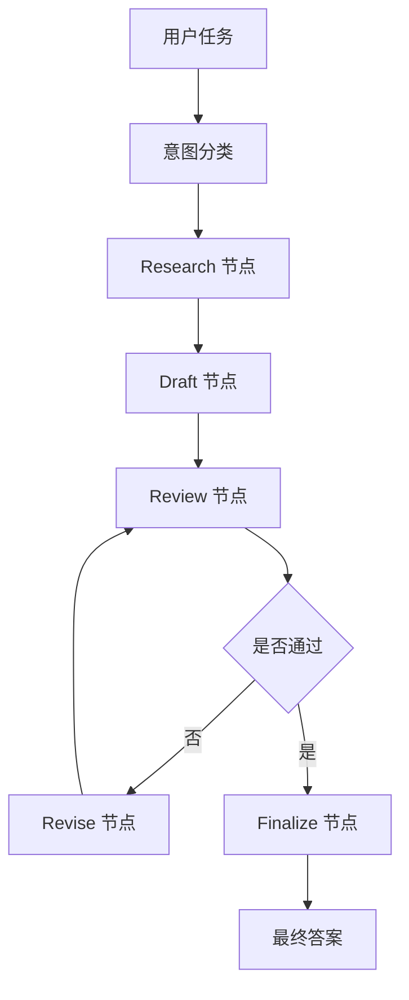

# langgraph_workflow_demo

LangGraph 风格最小状态图示例。

重点练习：

1. `StateGraph`
2. `State`
3. `Node`
4. `conditional edges`
5. `loop / revision`

## 业务场景说明

- 谁会用：需要让任务根据中间结果选择不同步骤的开发人员，例如内容审查、客服分流、报告修改和审批流程。
- 现实中的问题：一份自动生成的报告可能质量合格，也可能缺少重点。合格时应直接结束，不合格时要退回修改；普通的单向链路不容易表达这种分支和循环。
- 这个例子怎么解决：把处理过程画成状态图。`classify_intent()` 判断任务类型，后续节点负责调研、起草和审阅，`route_after_review()` 决定直接完成还是进入 `revise()` 修改。
- 现实例子：系统生成一份故障报告后，审阅步骤发现没有写影响范围，于是流程自动进入修订节点；补充完成后再次审阅，符合要求才输出最终报告。
- 初学者重点：LangGraph 的核心不是“多调用一次模型”，而是用 `State` 保存中间数据，用 `Node` 处理数据，用 `Edge` 决定下一步走向。

## 安装

```bash
/usr/bin/python3 -m pip install -r /home/victorkure/workspace/vscode_study/ai-lab/ai-learn/agent-advanced/projects/requirements.txt
```

依赖说明见 [项目依赖总表](../DEPENDENCIES.md)。

## 运行

```bash
/usr/bin/python3 /home/victorkure/workspace/vscode_study/ai-lab/ai-learn/agent-advanced/projects/langgraph_workflow_demo/main.py "LangGraph 适合什么场景"
```

默认只打印简洁结果。如果你想看完整 Mermaid 图，加上 `--show-graph`：

```bash
/usr/bin/python3 /home/victorkure/workspace/vscode_study/ai-lab/ai-learn/agent-advanced/projects/langgraph_workflow_demo/main.py "LangGraph 适合什么场景" --show-graph
```

## 常见报错

- `ModuleNotFoundError: No module named 'langgraph'`：先安装统一依赖，并确认当前终端和 VS Code 解释器一致；如果 `python3` 被别的虚拟环境劫持，直接改用 `/usr/bin/python3`。
- 如果运行时还是红线，通常是解释器选错了，不是代码本身坏了。

## 学习点

- `classify_intent()` 看输入如何影响路由
- `research()` 看节点如何补充状态
- `review()` 和 `revise()` 看循环如何形成
- `finalize()` 看最终答案如何落地

## 业务场景（完整说明）

- **使用者**：需要多阶段、可审校、可重试任务流程的 Agent 开发者。
- **要解决的问题**：让研究、起草、审校和修改按明确状态流转，而不是把全部逻辑塞进一次模型调用。
- **输入与输出**：输入任务问题；输出意图、研究信息、草稿、审校状态和最终答案。
- **生产环境差距**：需要真实模型节点、checkpoint、失败重试、人工介入和节点级观测。

## 整体流程图


