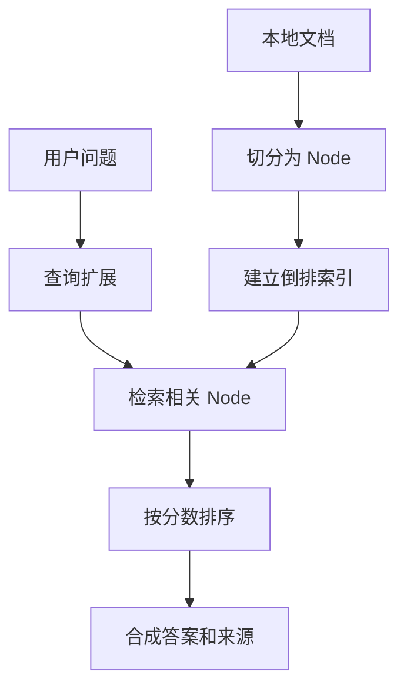

# llamaindex_index_demo

这是一个 LlamaIndex 风格的概念 demo。

说明一下：这里没有依赖真实 `llama_index` 包，而是用纯 Python 先把 LlamaIndex 的核心概念跑通：

- Document
- Node
- Index
- QueryEngine
- ResponseSynthesizer

## 业务场景说明

- 谁会用：想理解 LlamaIndex 如何组织文档、片段、索引和查询过程的初学者，以及准备制作文档知识库的开发人员。
- 现实中的问题：公司有多份产品说明书，用户问“批量导入功能有什么限制”。如果每次都从头扫描全部文档，代码难维护，也无法清楚说明命中了哪个片段。
- 这个例子怎么解决：先把文档切成 `Node`，再用 `build_inverted_index()` 建立“词语到节点”的索引；查询时先通过索引找候选节点，再由 `synthesize_answer()` 整理答案。
- 现实例子：将产品安装说明、权限说明和导入手册建立索引后，客服询问“谁可以执行批量导入”，程序会定位包含权限说明的节点，并根据检索结果回答。
- 初学者重点：这里用纯 Python 模拟 LlamaIndex 的核心概念，没有调用真实 `llama_index` 包；先理解 `Document -> Node -> Index -> Query -> Answer` 再学习框架 API。

## 安装

这个 demo 只用 Python 标准库，不需要额外安装第三方包。

如需统一查看环境要求，可参考 [项目依赖总表](../DEPENDENCIES.md)。

## 运行

```bash
/usr/bin/python3 /home/victorkure/workspace/vscode_study/ai-lab/ai-learn/agent-advanced/projects/llamaindex_index_demo/main.py "LlamaIndex 和 LangChain 有什么区别？"
```

## 常见报错

- 如果文档目录里没有 `.md` 文件，先确认 `assets/` 下的示例文档是否还在。
- 如果输出为空，通常是查询词没命中文档内容，可以换一个更接近示例主题的问题。

## 学习点

1. `split_into_nodes()` 看文档怎么拆成节点
2. `build_inverted_index()` 看索引怎么建
3. `retrieve()` 看查询怎么召回
4. `synthesize_answer()` 看答案怎么组织

## 业务场景（完整说明）

- **使用者**：文档索引与知识问答开发者。
- **要解决的问题**：把文档转换成 Node，建立可查询索引，召回相关节点并合成答案。
- **输入与输出**：输入问题和本地文档；输出 Node 命中分数、来源和最终答案。
- **生产环境差距**：需要真实 LlamaIndex 组件、持久化向量索引、metadata filter、增量更新和评估。

## 整体流程图


