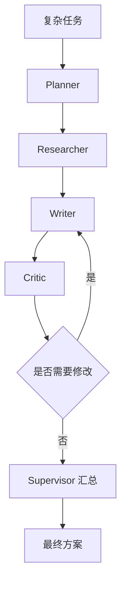

# multi_agent_team_demo

多 Agent 协作 demo。

这个 demo 模拟了几个典型角色：

- Supervisor
- Planner
- Researcher
- Writer
- Critic

## 业务场景说明

- 谁会用：需要把规划、资料整理、写作和检查分开处理的开发人员，例如调研报告、方案书和内容生产流程。
- 现实中的问题：让一个 Agent 同时负责理解主题、列计划、找资料、写文章和检查质量，容易顾此失彼；结果出问题时，也很难判断是哪一阶段造成的。
- 这个例子怎么解决：`planner_agent()` 拆任务，`researcher_agent()` 准备资料，`writer_agent()` 生成初稿，`critic_agent()` 检查问题，`supervisor()` 负责按顺序调度并在需要时组织修订。
- 现实例子：团队要编写“公司如何导入 RAG”的内部提案，规划角色先列章节，调研角色整理技术要点，写作角色形成草稿，审校角色检查是否缺少成本和风险说明。
- 初学者重点：这里的 Agent 是用不同 Python 函数模拟的角色分工，目的是先学清楚协作结构，并不代表必须为每个角色连接一个独立大模型。

## 安装

这个 demo 只用 Python 标准库，不需要额外安装第三方包。

如果你想统一查看各 demo 的依赖说明，可以看 [项目依赖总表](../DEPENDENCIES.md)。

## 运行

```bash
/usr/bin/python3 /home/victorkure/workspace/vscode_study/ai-lab/ai-learn/agent-advanced/projects/multi_agent_team_demo/main.py "如何学习 LangGraph 和高级 RAG"
```

## 常见报错

- 如果输出太短，通常是主题太窄，可以换一个更具体但更完整的问题。
- 如果没有看到二轮修订，说明 `critic_agent()` 没有发现明显问题，属于正常情况。

## 学习点

1. `planner_agent()` 看任务怎么拆
2. `researcher_agent()` 看知识怎么补
3. `writer_agent()` 看结果怎么组织
4. `critic_agent()` 看反馈怎么做
5. `supervisor()` 看总调度怎么收口

## 业务场景（完整说明）

- **使用者**：需要角色分工完成复杂知识任务的 Agent 开发者。
- **要解决的问题**：让 Planner、Researcher、Writer、Critic 分别产出结果，再由 Supervisor 汇总收口。
- **输入与输出**：输入复杂任务；输出计划、研究材料、草稿、批评意见和最终方案。
- **生产环境差距**：需要真实模型、共享上下文控制、预算、并行执行、角色权限和失败恢复。

## 整体流程图


