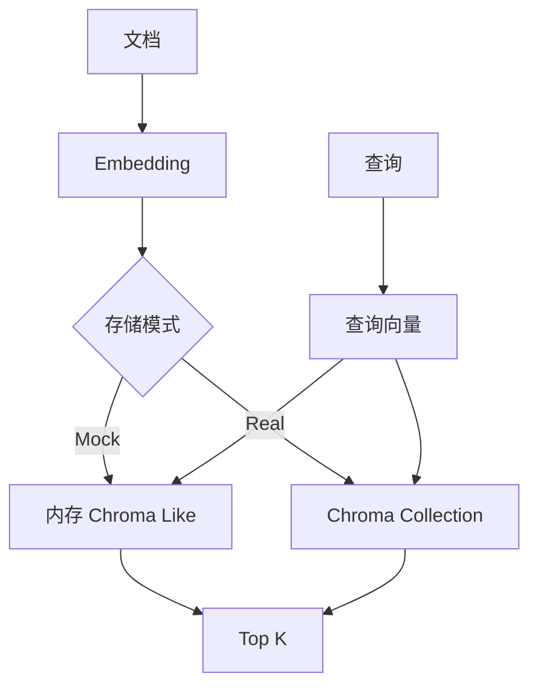

# vector_db_chroma_demo

这是一个“真实 Chroma 版骨架” demo。

它和 Qdrant 版的区别是：这里更偏本地持久化和快速原型，适合先把 embedding + collection + query 这条链路跑通。

## 图片式模板解释

输入：运行 `python3 main.py "远程办公怎么申请" --mode mock`；处理前数据是文档、metadata、embedding 和 Chroma collection。

```text
文档 -> embedding
│
▼
模式选择
├── Mock -> 内存 Chroma-like collection
└── Real -> Chroma PersistentClient -> collection.upsert()
用户问题 -> 查询 embedding -> collection.query() -> Top-K
│
▼
返回 documents + metadatas + distances
```

节点对应：PersistentClient 管本地持久化，Collection 隔离数据，Upsert 写入，Query 召回。最小输出是相关文档及距离；Mock 不代表真实 Chroma 效果。

## 业务场景说明

- 谁会用：希望在自己的电脑上快速制作向量检索原型，又暂时不想部署独立数据库服务的开发人员。
- 现实中的问题：开发人员想验证一个部门 FAQ 搜索功能，如果每次运行都重新准备数据很麻烦；为一个早期实验立即部署服务器版数据库也会增加环境工作。
- 这个例子怎么解决：使用 Chroma 的本地持久化目录保存 collection、向量、文档和 metadata，程序重启后仍可使用同一目录继续查询；没有 Chroma 依赖时可先用 Mock 模式。
- 现实例子：人事部门先在一台开发电脑上把报销、休假和远程办公 FAQ 存入 Chroma，输入“在家办公需要提前几天申请”，检查是否能找到远程办公规定。
- 初学者重点：Chroma 适合本地原型和小规模实验；重点观察 `collection`、`upsert`、`query` 和持久化目录，不要把 Mock 结果误认为真实 Chroma 查询。

## 这个 demo 会演示什么

- 真实 Chroma Client 的接入方式
- collection 的创建
- 文档 embedding 写入
- 元数据 metadata 的保存
- query 检索和 top-k 召回

## 前置条件

- 本机能安装 `chromadb`
- 如果你想要真实向量效果，建议安装 `sentence-transformers`
- 如果你暂时只想看流程，也可以先跑 mock 模式

## 安装

```bash
/usr/bin/python3 -m pip install -r /home/victorkure/workspace/vscode_study/ai-lab/ai-learn/agent-advanced/projects/vector_db_chroma_demo/requirements.txt
```

## 运行方式

### 先看 mock

```bash
/usr/bin/python3 /home/victorkure/workspace/vscode_study/ai-lab/ai-learn/agent-advanced/projects/vector_db_chroma_demo/main.py "怎么申请出差报销？" --mode mock
```

### 真实 Chroma

```bash
/usr/bin/python3 /home/victorkure/workspace/vscode_study/ai-lab/ai-learn/agent-advanced/projects/vector_db_chroma_demo/main.py "远程办公怎么申请？" --mode real --persist-dir ./chroma_data
```

如果你想换 embedding 方案，也可以加：

```bash
/usr/bin/python3 /home/victorkure/workspace/vscode_study/ai-lab/ai-learn/agent-advanced/projects/vector_db_chroma_demo/main.py "发布前要检查什么？" --mode real --embedding sentence-transformers
```

## 目录结构

```text
vector_db_chroma_demo/
├── assets/
│   ├── deployment_faq.md
│   ├── expense_policy.md
│   └── remote_work.md
├── main.py
├── README.md
└── requirements.txt
```

## 你会学到什么

1. Chroma 的 collection 怎么创建
2. metadata 和 document 为什么要一起存
3. query 返回结果是怎么组织的
4. 本地持久化和远端向量库的差别

## 常见报错

- `ModuleNotFoundError: chromadb`：先安装 `requirements.txt`
- `SQLite / persistence` 相关报错：通常是目录权限问题，换一个你有写权限的 `--persist-dir`
- `embedding size mismatch`：说明旧 collection 和新 embedding 维度不一致，建议先删掉持久化目录重来
- 如果结果不准，先换更短、更明确的 query

## 学习顺序

1. 先看 `build_embedder()`，理解文本如何转向量
2. 再看 `run_mock()`，理解入库和查询流程
3. 再看 `run_real()`，理解真实 Chroma 的接口
4. 最后对比 `vector_db_demo/` 和 `vector_db_qdrant_demo/`

## 业务场景（完整说明）

- **使用者**：需要本地持久化向量检索原型的 RAG 开发者。
- **要解决的问题**：在 Mock 与真实 Chroma 间切换，理解 collection、document、metadata 和 query。
- **输入与输出**：输入文档、查询及模式；输出 Chroma Top K 命中、分数和来源。
- **生产环境差距**：需要 embedding 版本管理、持久目录治理、并发写入、备份和服务化部署。

## 整体流程图


