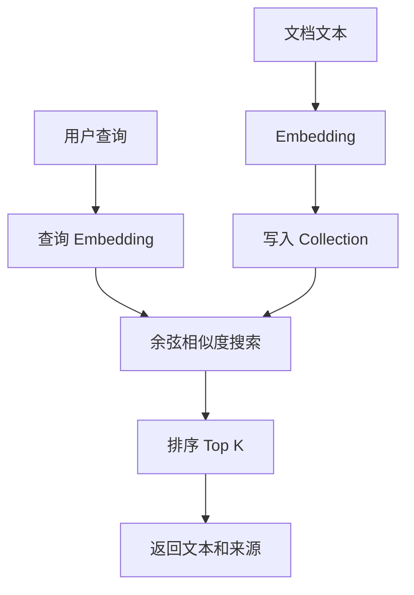

# vector_db_demo

这是一个“向量数据库最小教学版” demo。

它不是在真实 Qdrant / Chroma 服务上跑，而是用纯 Python 先把向量数据库最核心的流程讲清楚：

- 文本切分
- 文本向量化
- 写入 collection
- 相似度检索
- 返回 top-k 结果

## 项目目标

把“文本如何变成向量、如何写入 collection、如何做相似度检索”这条主线讲清楚。
这个 demo 适合先理解原理，再去看真实 Qdrant / Chroma 版骨架。

## 图片式模板解释

输入：运行 `python3 main.py "出差花的钱如何申请"`；处理前数据是文档文本、metadata 和 collection 名称。

```text
文档 -> embed_text() -> 文档向量 -> upsert collection
用户问题 -> embed_text() -> 查询向量
│
▼
cosine_similarity()：与所有文档向量比较
│
▼
按分数排序 -> Top-K -> 返回文本、metadata 和分数
```

节点对应：Embedding 把文本变成数字，Collection 管理记录，相似度衡量接近程度，Top-K 控制返回数量。最小输出是按分数排序的相关文档。

## 业务场景说明

- 谁会用：第一次学习向量、collection、metadata 和相似度搜索的开发人员。
- 现实中的问题：制度文档里写的是“差旅费用精算”，员工搜索的是“出差怎么报销”。只做完全相同的字符串匹配时，表达方式不同就可能找不到相关资料。
- 这个例子怎么解决：把样本文档转换成教学用向量，写入内存中的 collection，再把用户问题也转换成向量，通过余弦相似度返回最接近的 Top-K 文档。
- 现实例子：系统中保存了报销规定、远程办公制度和发布手册。员工询问“出差花的钱如何申请”，搜索结果应该优先返回报销规定，而不是只查找完全相同的文字。
- 初学者重点：这个项目用纯 Python 模拟 Qdrant、Chroma 和内存数据库的使用方式，方便观察原理；它没有连接真实数据库，向量算法也只是教学实现。

## 这个 demo 会演示什么

- `Qdrant` 风格：按 collection 存文档向量和 payload，再做相似度搜索
- `Chroma` 风格：按 collection 名称管理文档、向量和元数据，再做相似度搜索
- `Memory` 风格：不依赖数据库，只在内存里模拟向量检索

## 安装

这个 demo 只用 Python 标准库，不需要额外安装第三方包。

如果你想看整个工作区的统一依赖说明，可以参考：

- [项目依赖总表](../DEPENDENCIES.md)

## 运行方式

```bash
/usr/bin/python3 /home/victorkure/workspace/vscode_study/ai-lab/ai-learn/agent-advanced/projects/vector_db_demo/main.py "怎么申请出差报销？"
```

可选参数：

- `--backend qdrant`
- `--backend chroma`
- `--backend memory`
- `--top-k 3`

例如：

```bash
/usr/bin/python3 /home/victorkure/workspace/vscode_study/ai-lab/ai-learn/agent-advanced/projects/vector_db_demo/main.py "远程办公怎么申请？" --backend chroma --top-k 2
```

## Mock Mode运行

这个 demo 的默认用法就是 Mock / 教学模式。
你可以直接用 `memory` 后端看完整流程，不依赖外部服务：

```bash
/usr/bin/python3 /home/victorkure/workspace/vscode_study/ai-lab/ai-learn/agent-advanced/projects/vector_db_demo/main.py "怎么申请出差报销？" --backend memory --top-k 3
```

## Real Mode运行

这个 demo 本身不连接真实 Qdrant / Chroma 服务，所以这里没有独立的真实模式。
如果你要看真实接入，请参考：

- [真实 Qdrant 版骨架](../vector_db_qdrant_demo/README.md)
- [真实 Chroma 版骨架](../vector_db_chroma_demo/README.md)

## 测试清单

### 本地测试

运行一个最小 smoke test，确认样本文档可以被加载、向量化并返回 Top-K 结果：

```bash
/usr/bin/python3 /home/victorkure/workspace/vscode_study/ai-lab/ai-learn/agent-advanced/projects/vector_db_demo/main.py "怎么申请出差报销？" --backend memory --top-k 3
```

### Qdrant 风格测试

```bash
/usr/bin/python3 /home/victorkure/workspace/vscode_study/ai-lab/ai-learn/agent-advanced/projects/vector_db_demo/main.py "怎么申请出差报销？" --backend qdrant --top-k 3
```

### Chroma 风格测试

```bash
/usr/bin/python3 /home/victorkure/workspace/vscode_study/ai-lab/ai-learn/agent-advanced/projects/vector_db_demo/main.py "远程办公怎么申请？" --backend chroma --top-k 2
```

## 项目结构

```text
vector_db_demo/
├── assets/
│   ├── deployment_faq.md
│   ├── expense_policy.md
│   └── remote_work.md
├── main.py
└── README.md
```

## 学习重点

1. 向量数据库为什么比关键词检索更适合语义搜索
2. collection / 文档 / 向量 / metadata 的关系
3. 相似度搜索是怎么工作的
4. Qdrant 风格和 Chroma 风格的数据组织差别

## 常见问题

- 如果结果很乱，通常是样本太少，换一个更接近内容的 query。
- 如果输出为空，先确认你是在 demo 目录下运行，且 `assets/` 没被删。
- 如果你想改成真实 Qdrant / Chroma，下一步可以直接参考：
  - [真实 Qdrant 版骨架](../vector_db_qdrant_demo/README.md)
  - [真实 Chroma 版骨架](../vector_db_chroma_demo/README.md)

## 学习点

1. `load_documents()` 看样本文档怎么加载
2. `embed_text()` 看文本如何转成向量
3. `upsert()` 看文档如何写入 collection
4. `search()` 看相似度检索如何返回 top-k

## 业务场景（完整说明）

- **使用者**：刚开始学习向量检索和 RAG 的开发者。
- **要解决的问题**：理解文本如何变成向量、写入集合，并通过余弦相似度返回 Top K。
- **输入与输出**：输入资料和查询；输出相似度分数、来源和命中文本。
- **生产环境差距**：内存后端不适合生产，需要真实 embedding、持久化数据库、索引参数和权限过滤。

## 整体流程图


