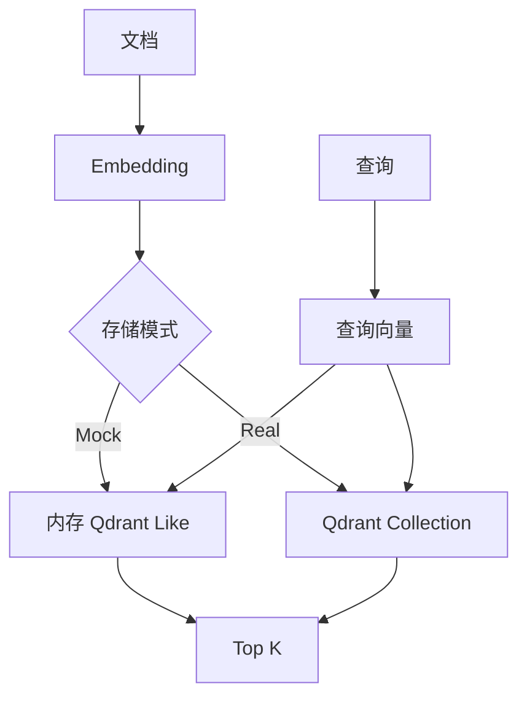

# vector_db_qdrant_demo

这是一个“真实 Qdrant 版骨架” demo。

它保留了教学版的核心步骤，但把存储层换成了真实 Qdrant Client，方便你后面直接接：

- 本机 Docker Qdrant
- 远端 Qdrant 服务
- 企业知识库检索
- FAQ / 工单 / 制度文档检索

## 业务场景说明

- 谁会用：已经看懂向量检索原理，准备连接真实 Qdrant 服务并保存、查询文档向量的开发人员。
- 现实中的问题：内存版程序一停止，数据就会消失，也不方便让多个后端实例共同查询同一批向量数据。正式知识库通常需要独立运行的向量数据库。
- 这个例子怎么解决：程序连接 Qdrant，创建 collection，把向量和文档信息作为 point 与 payload 写入，再使用查询向量执行 Top-K 搜索；没有 Qdrant 时也可用 Mock 模式练习流程。
- 现实例子：把公司的报销制度、远程办公规定和发布 FAQ 写入 Qdrant。问答服务收到“出差需要准备什么凭证”后，可以查询 Qdrant 并取得最相关的制度条目。
- 初学者重点：重点对应 `collection`、`point`、`vector`、`payload`、`upsert` 和 `search` 的关系；示例默认使用教学向量，真实项目通常会换成正式 Embedding 模型。

## 这个 demo 会演示什么

- 真实 Qdrant Client 的接入方式
- collection 的创建与重建
- 文档向量写入
- 相似度检索和 top-k 召回
- `mock` / `real` 两种运行模式

## 前置条件

- 本机已经能访问 Qdrant
- 如果你要跑真实模式，需要安装依赖
- 如果你暂时没有服务，可以先用 `--mode mock` 看骨架和流程

## 安装

```bash
/usr/bin/python3 -m pip install -r /home/victorkure/workspace/vscode_study/ai-lab/ai-learn/agent-advanced/projects/vector_db_qdrant_demo/requirements.txt
```

## 运行方式

### 先看 mock

```bash
/usr/bin/python3 /home/victorkure/workspace/vscode_study/ai-lab/ai-learn/agent-advanced/projects/vector_db_qdrant_demo/main.py "怎么申请出差报销？" --mode mock
```

### 真实 Qdrant

```bash
QDRANT_URL=http://localhost:6333 \
/usr/bin/python3 /home/victorkure/workspace/vscode_study/ai-lab/ai-learn/agent-advanced/projects/vector_db_qdrant_demo/main.py "怎么申请出差报销？" --mode real --recreate
```

如果你的 Qdrant 需要 API key，也可以再加：

```bash
QDRANT_URL=http://localhost:6333 QDRANT_API_KEY=xxx \
/usr/bin/python3 /home/victorkure/workspace/vscode_study/ai-lab/ai-learn/agent-advanced/projects/vector_db_qdrant_demo/main.py "远程办公怎么申请？" --mode real
```

## 目录结构

```text
vector_db_qdrant_demo/
├── assets/
│   ├── deployment_faq.md
│   ├── expense_policy.md
│   └── remote_work.md
├── main.py
├── README.md
└── requirements.txt
```

## 你会学到什么

1. 真实向量库里 collection 是怎么建的
2. payload 为什么要和向量一起存
3. upsert 和 search 的真实写法
4. Qdrant 的接入点和教学版的差别

## 常见报错

- `Connection refused`：通常是 Qdrant 没起或者 `QDRANT_URL` 写错。
- `Collection already exists`：先加 `--recreate`，或者删掉旧 collection 再跑。
- `ModuleNotFoundError: qdrant_client`：先安装 `requirements.txt`。
- `embedding size mismatch`：说明你换了 embedding 维度，但旧 collection 还是老维度，建议 `--recreate`。

## 学习顺序

1. 先看 `build_embedder()`，理解文本怎么变成向量
2. 再看 `run_mock()`，理解入库和检索流程
3. 再看 `run_real()`，理解真实 Qdrant Client 的接口
4. 最后对比 `vector_db_demo/`，看教学版和真实版的差别

## 业务场景（完整说明）

- **使用者**：准备把 RAG 向量存储部署到独立服务的开发者。
- **要解决的问题**：在相同检索流程下切换 Mock 和真实 Qdrant，理解 collection、point、payload 和 search。
- **输入与输出**：输入文档、查询及模式；输出 Qdrant Top K 命中、分数和 metadata。
- **生产环境差距**：需要认证、TLS、collection 迁移、批量写入、备份、监控和多租户隔离。

## 整体流程图


