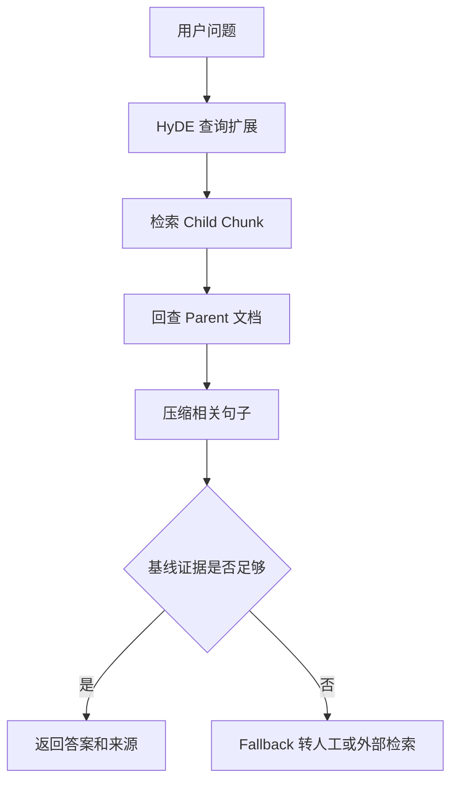

# 高级 RAG 标准模式

一个离线脚本覆盖四条标准链路：小块召回后返回完整父文档（Parent Document）、按问题压缩上下文（Contextual Compression）、生成假设答案扩展检索（HyDE）、低相关时回退（Corrective RAG）。

```bash
python3 main.py "新干线超过三万日元怎么审批"
python3 main.py "数据库密码是什么"
python3 main.py "远程办公规定" --baseline
```

验收：制度问题返回父文档来源；无关问题走 `fallback`；`--baseline` 可与 HyDE 路径对比。这里的词法检索用于稳定离线演示，生产环境应替换为向量召回和 cross-encoder reranker。

## 业务场景（完整说明）

- **使用者**：企业知识问答开发者和 RAG 效果优化人员。
- **要解决的问题**：短 chunk 便于召回但上下文不足，通过 Parent Retrieval、HyDE、压缩和 CRAG 路由提高答案可靠性。
- **输入与输出**：输入自然语言问题；输出压缩后的父文档答案、来源、召回分数或 fallback。
- **生产环境差距**：需要真实 embedding、重排模型、查询改写模型、证据阈值标定和线上评估。

## 整体流程图


