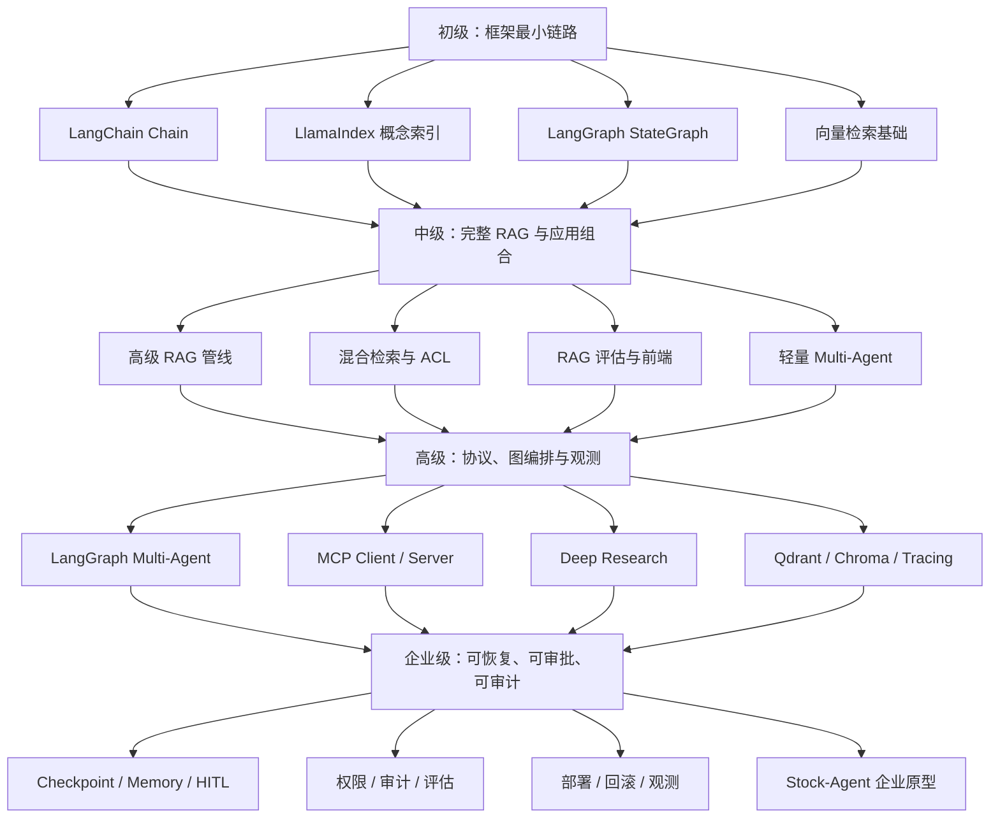

# 我的 Agent Advanced 学习路线图

这份路线图基于当前 `agent-advanced/` 已有文档和可运行项目制定。目标不是快速看完所有内容，而是按“读懂 → 跑通 → 验证 → 迁移到 AI-Learn → 映射到 Stock-Agent”的顺序逐级前进。

> 学习边界：未来 Stock-Agent 只做公开信息整理、研究辅助和 Markdown 报告，不登录证券账户、不自动交易、不输出确定性买卖指令。

## 一、路线总览

| 阶段 | 核心目标 | 预计时间 | 阶段成果 |
| --- | --- | --- | --- |
| 初级 | 看懂 Chain、Index、StateGraph 和向量检索最小链路 | 3 周，约 18–24 小时 | 能独立运行并解释 4 个基础 demo |
| 中级 | 组合完整 RAG、混合检索、评估、轻量 Multi-Agent 和前端展示 | 4 周，约 28–36 小时 | 做出带来源、可评估的研究报告原型 |
| 高级 | 掌握真实 Multi-Agent 图、MCP、Deep Research、真实向量后端与可观测性 | 5 周，约 35–50 小时 | 做出有工具边界、失败降级和追踪的 Agent |
| 企业级 | 加入 Checkpoint、HITL、权限、审计、部署、回滚和完整业务闭环 | 6 周，约 45–60 小时 | 形成可演示、可面试讲解的 Stock-Agent 架构方案 |

建议总周期：18 周。每周学习 4 天，每天 60–90 分钟；第五天只做复盘、补测试和整理笔记。

## 二、Mermaid 学习路线图



纯文本路线：

```text
初级：Chain + Index + StateGraph + Vector Search
│
▼
中级：完整 RAG + Hybrid Search + Evaluation + UI + 轻量多角色
│
▼
高级：真实 Multi-Agent 图 + MCP + Deep Research + 向量后端 + Tracing
│
▼
企业级：Checkpoint + HITL + ACL + Audit + Deployment + Stock-Agent
```

## 三、阶段升级规则

每个阶段都执行同一个闭环：

```text
阅读文档
│
▼
运行最小项目
│
▼
修改一个输入并观察输出
│
▼
解释调用链和失败路径
│
▼
完成验收清单
│
▼
进入下一阶段
```

不要以“看完 README”为完成标准。必须能运行、能解释、能验证，并能说明这项能力如何进入 AI-Learn 和未来 Stock-Agent。

---

## 四、初级阶段：建立框架与检索基础

### 1. 学什么

- LangChain：Prompt、Model、Parser、Runnable 和 mock 模型降级。
- LlamaIndex：Document、Node、Index、QueryEngine 的概念链路。
- LangGraph：State、Node、Edge、条件路由、循环与终止条件。
- 向量检索：文本向量化、collection、相似度、top-k 和 metadata。
- 基础工程习惯：从 README 启动、记录命令、观察输入输出、区分概念版与真实 SDK。

本阶段不追求 Agent 自主性，也不接入真实交易数据。先把数据如何流动讲清楚。

### 2. 阅读哪些文档

按顺序阅读：

1. [Agent Advanced 总索引](./INDEX.md)
2. [Frameworks 总入口](./frameworks/README.md)
3. [LangChain README](./frameworks/langchain/README.md)
4. [LangChain 学习笔记](./frameworks/langchain/LangChain学习笔记.md)
5. [LlamaIndex README](./frameworks/llamaindex/README.md)
6. [LangGraph README](./frameworks/langgraph/README.md)
7. [Projects 总入口](./projects/README.md)

辅助导航：

- [LangChain 相关项目](./frameworks/langchain/相关项目链接.md)
- [LlamaIndex 相关项目](./frameworks/llamaindex/相关项目链接.md)
- [LangGraph 相关项目](./frameworks/langgraph/相关项目链接.md)

### 3. 运行哪些项目

1. [langchain_chain_demo](./projects/langchain_chain_demo/README.md)

   ```bash
   python3 projects/langchain_chain_demo/main.py "解释日本股票的 PER" --mock
   ```

2. [llamaindex_index_demo](./projects/llamaindex_index_demo/README.md)

   ```bash
   python3 projects/llamaindex_index_demo/main.py "LlamaIndex 和 LangChain 有什么区别？"
   ```

3. [langgraph_workflow_demo](./projects/langgraph_workflow_demo/README.md)

   ```bash
   python3 projects/langgraph_workflow_demo/main.py "LangGraph 适合什么场景"
   ```

4. [vector_db_demo](./projects/vector_db_demo/README.md)

   ```bash
   python3 projects/vector_db_demo/main.py "怎么申请出差报销？"
   ```

所有命令从 `agent-advanced/` 根目录执行。若项目 README 的命令不同，以项目 README 为准。

### 4. 预计时间

- 第 1 周：LangChain，6–8 小时。
- 第 2 周：LlamaIndex + 向量检索，6–8 小时。
- 第 3 周：LangGraph 基础，6–8 小时。
- 合计：18–24 小时。

### 5. 验收标准

- [ ] 能解释 Prompt → Model → Parser 的输入和输出。
- [ ] 能解释 Document → Node → Index → QueryEngine。
- [ ] 能画出 State、Node、Edge 和条件路由。
- [ ] 能解释 top-k、相似度和 metadata 的作用。
- [ ] 四个 demo 都能运行，且至少修改过一次输入。
- [ ] 能指出 LlamaIndex demo 是概念教学版，不是完整真实 SDK 接入。
- [ ] 能用五分钟说明 Chain、Graph、Index 各自适合什么问题。

### 6. 与 AI-Learn 主项目的关系

这一阶段建立 AI-Learn 的共同语言：

- `langchain_chain_demo` 对应模型调用和组件组合基础。
- `llamaindex_index_demo` 对应知识库的数据组织方式。
- `langgraph_workflow_demo` 对应 Agent 工作流和状态管理基础。
- `vector_db_demo` 对应 RAG 的 Retriever 基础。

完成后，阅读 `ai-lab/ai-learn` 中其它 Agent 或 RAG 项目时，不会只看到文件名，而能识别入口、状态、检索和输出层。

### 7. 与未来 Stock-Agent 的关系

初级 Stock-Agent 只做最小信息整理：

```text
输入股票代码
→ mock 公司资料
→ 模板化分析步骤
→ Markdown 报告
```

对应能力：

- LangChain：组织“输入 → 分析提示 → 输出解析”。
- LlamaIndex：理解未来如何索引公司资料和公告。
- LangGraph：把“校验代码 → 获取资料 → 生成报告”拆成节点。
- 向量检索：为新闻、财报和公司资料检索做准备。

阶段成果建议：手画 Stock-Agent 的三个节点和一个 mock 报告，不接证券账户、不做交易。

---

## 五、中级阶段：构建可评估的 RAG 应用

### 1. 学什么

- 完整 RAG：文档切分、索引、检索、top-k、rerank、Context、回答和引用。
- Hybrid Search：词法检索与语义检索组合。
- ACL 与 metadata filter：不同角色只能看到允许的数据。
- 高级模式：Parent Document、Contextual Compression、HyDE、Corrective RAG。
- 评估：recall@k、MRR、引用覆盖、groundedness、faithfulness 和任务准确率。
- 轻量 Multi-Agent：Planner、Researcher、Writer、Critic、Supervisor 的职责区别。
- UI：回答、来源、loading、error 与 completed 状态展示。

### 2. 阅读哪些文档

1. [RAG 专题入口](./rag/README.md)
2. [高级 RAG 标准模式](./rag/advanced-patterns/README.md)
3. [Advanced RAG Pipeline README](./projects/advanced_rag_pipeline_demo/README.md)
4. [Internal Hybrid RAG README](./projects/internal_hybrid_rag_demo/README.md)
5. [Multi-Agent 专题](./multi-agent/README.md)
6. [RAG 评估专题](./eval/README.md)
7. [RAG 评估 demo](./eval/rag_eval_demo/README.md)
8. [Frontend 专题](./frontend/README.md)
9. [Chat UI Demo](./frontend/chat_ui_demo/README.md)

### 3. 运行哪些项目

1. [advanced_rag_pipeline_demo](./projects/advanced_rag_pipeline_demo/README.md)

   ```bash
   python3 projects/advanced_rag_pipeline_demo/main.py "LangGraph 适合什么场景？"
   ```

2. [internal_hybrid_rag_demo](./projects/internal_hybrid_rag_demo/README.md)

   ```bash
   python3 projects/internal_hybrid_rag_demo/main.py "远程办公和发布流程有什么要求？" --role employee
   ```

3. [advanced-patterns](./rag/advanced-patterns/README.md)

   ```bash
   python3 rag/advanced-patterns/main.py "新干线超过三万日元怎么审批"
   python3 rag/advanced-patterns/main.py "远程办公规定" --baseline
   ```

4. [multi_agent_team_demo](./projects/multi_agent_team_demo/README.md)

   ```bash
   python3 projects/multi_agent_team_demo/main.py "如何分析一家日本上市公司"
   ```

5. [rag_eval_demo](./eval/rag_eval_demo/README.md)：按 README 运行本地评估脚本。

6. [chat_ui_demo](./frontend/chat_ui_demo/README.md)：按 README 启动 React UI，重点观察来源和错误状态。

### 4. 预计时间

- 第 1 周：完整 RAG 管线，7–9 小时。
- 第 2 周：Hybrid Search、ACL、引用，7–9 小时。
- 第 3 周：高级 RAG + 基线对比，7–9 小时。
- 第 4 周：评估、轻量 Multi-Agent、UI，7–9 小时。
- 合计：28–36 小时。

### 5. 验收标准

- [ ] 能画出 Document → Chunk → Retrieve → Rerank → Context → Answer → Citation。
- [ ] 能说明 Hybrid Search 为什么比单一向量检索更适合代码、股票代码和专有名词。
- [ ] 能解释 Parent Document、Compression、HyDE、Corrective RAG 分别解决什么失败模式。
- [ ] 同一个问题能运行 baseline 和高级路径，并记录差异。
- [ ] 能说明 ACL、metadata filter 和引用为什么是企业知识库必需能力。
- [ ] 至少有一份本地评估结果，而不是只凭感觉判断答案。
- [ ] UI 能显示回答、来源和错误状态。

### 6. 与 AI-Learn 主项目的关系

中级阶段把 AI-Learn 从“框架 demo”升级为“可评估应用”：

- RAG 不再只是向量搜索，而是可测量的摄取、检索、重排和回答系统。
- `internal_hybrid_rag_demo` 提供企业知识库的 ACL 与多来源参考。
- `rag_eval_demo` 建立离线评估基线，未来任何优化都要与基线比较。
- `chat_ui_demo` 提供 AI-Learn 项目的前端结果展示方式。

这一阶段的成果可以复用到内部知识库、审批 Agent、零售分析 Agent 和 Stock-Agent。

### 7. 与未来 Stock-Agent 的关系

中级 Stock-Agent 开始处理公开研究资料：

```text
股票代码
→ 公司资料 / 财报摘要 / 公开新闻
→ Hybrid Search
→ Rerank
→ Context
→ 风险与事实报告
→ 来源引用
```

对应能力：

- 股票代码、公司名和财务术语需要词法精确匹配。
- 相似主题和语义新闻需要向量召回。
- 财报长文适合 Parent Document 和 Contextual Compression。
- 无可靠证据时使用 Corrective RAG 的 fallback，不编造数字。
- 评估集可包含“公司名称、PER、PBR、股息率、新闻来源是否正确”。

阶段成果建议：用 mock 或公开样例资料生成一份带来源的股票研究报告，并保存评估结果。

---

## 六、高级阶段：建立可控 Agent、MCP 与可观测性

### 1. 学什么

- 真实 LangGraph Multi-Agent：共享 State、Supervisor、Worker、预算和终止条件。
- MCP：Host、Client、Server、transport、能力发现、Tool Schema、参数校验和生命周期。
- MCP primitive 边界：Tool、Resource、Prompt 分别适合什么内容。
- Deep Research：规划、检索、反思、修正和报告生成。
- 真实向量后端：Qdrant 或 Chroma 的 collection、payload、metadata、持久化和查询。
- Observability：trace、request_id、duration、token/cost、错误分类和审计事件。
- 失败处理：超时、重试、fallback、幂等、预算耗尽和人工升级。

### 2. 阅读哪些文档

1. [LangGraph 相关项目](./frameworks/langgraph/相关项目链接.md)
2. [Multi-Agent 专题](./multi-agent/README.md)
3. [Graph Team Demo](./multi-agent/graph_team_demo/README.md)
4. [MCP 专题](./mcp/README.md)
5. [Deep Research](./deep-research/README.md)
6. [Deep Research 需求与评估标准](./deep-research/需求与评估标准.md)
7. [Observability](./observability/README.md)
8. [Qdrant Demo](./projects/vector_db_qdrant_demo/README.md)
9. [Chroma Demo](./projects/vector_db_chroma_demo/README.md)

### 3. 运行哪些项目

1. [graph_team_demo](./multi-agent/graph_team_demo/README.md)

   ```bash
   python3 multi-agent/graph_team_demo/main.py "设计日本股票研究流程"
   python3 multi-agent/graph_team_demo/main.py "预算终止演示" --budget 2
   ```

2. MCP stdio 与 Multi-MCP：

   ```bash
   cd mcp
   python3 client.py "审批"
   python3 multi_router.py "PR 合并"
   cd ..
   ```

3. MCP Remote：按 [MCP README](./mcp/README.md) 分两个终端运行 server 与 remote client。

4. [Deep Research](./deep-research/README.md)：按 README 运行 `deep_research_demo/main.py`。

5. [Qdrant](./projects/vector_db_qdrant_demo/README.md) 或 [Chroma](./projects/vector_db_chroma_demo/README.md)：先选一个真实后端，不必同时学习。

6. [Tracing Demo](./observability/README.md)：运行 `observability/tracing_demo/main.py`，检查 trace 和耗时字段。

### 4. 预计时间

- 第 1 周：真实 Multi-Agent 图，7–10 小时。
- 第 2 周：MCP Client/Server/Tool，7–10 小时。
- 第 3 周：Remote/Multi-MCP 与权限边界，7–10 小时。
- 第 4 周：Deep Research，7–10 小时。
- 第 5 周：真实向量后端 + Observability，7–10 小时。
- 合计：35–50 小时。

### 5. 验收标准

- [ ] 能解释共享 State 中每个字段由哪个节点负责更新。
- [ ] Multi-Agent 在正常预算下完成，在低预算下安全终止。
- [ ] 能解释何时值得拆多个 Agent，何时单一工作流更简单。
- [ ] MCP Client 能发现工具、校验参数并获得结构化结果。
- [ ] 能区分 Tool、Resource、Prompt，并说明 MCP 不替代业务 API。
- [ ] Remote MCP 方案明确 TLS、认证、allowlist、超时和审计要求。
- [ ] Deep Research 有计划、证据、反思和停止条件。
- [ ] 至少选择一个真实向量后端完成本地查询。
- [ ] 每次任务可以通过 trace_id 或 request_id 找到执行步骤和耗时。

### 6. 与 AI-Learn 主项目的关系

高级阶段提供 AI-Learn 的平台能力：

- LangGraph 负责显式状态、路由、循环和失败边界。
- MCP 负责面向模型的工具发现与调用，不把业务逻辑直接写进 Agent。
- Deep Research 提供多轮研究与证据整理模式。
- Qdrant/Chroma 提供真实持久化检索后端。
- Observability 让效果、耗时、错误和成本可以追踪。

这些能力可成为 `agent-advanced`、业务 Agent 和未来综合项目的公共参考架构。

### 7. 与未来 Stock-Agent 的关系

高级 Stock-Agent 可以按职责拆分，但只有职责、权限或上下文确实不同才拆 Agent：

```text
Supervisor
├── Market Data Tool：只读取公开行情
├── Filing Researcher：检索财报和公告
├── News Researcher：整理公开新闻
├── Risk Reviewer：检查来源、缺失值和风险
└── Report Writer：生成 Markdown 报告
```

建议边界：

- MCP Server 封装公开数据源、新闻检索和报告存储工具。
- 工具只读，不提供下单、账户登录和资金操作。
- Supervisor 使用预算和递归限制防止无限循环。
- Risk Reviewer 没有证据时必须返回“不足”，而不是补写数字。
- Tracing 记录工具名、耗时、状态和错误，不记录密钥与完整敏感 Prompt。

阶段成果建议：完成 Stock-Agent 的 Tool Schema、State 字段表、节点关系图和一次 mock 运行 trace。

---

## 七、企业级阶段：完成可恢复、可审批、可部署的业务闭环

### 1. 学什么

- LangGraph 企业能力：Checkpoint、thread_id、短期状态、长期 Store、Interrupt、Command resume、Subgraph 和 Streaming。
- 人工审批：高风险动作暂停、审批身份、超时、拒绝和恢复。
- 持久化与幂等：SQLite/PostgreSQL checkpointer、幂等键、重复事件和断点恢复。
- 企业 RAG：Query Rewrite、Hybrid Search、Rerank、ACL、引用、索引刷新和离线评估。
- 安全：认证、授权、租户隔离、Prompt Injection 防护、数据分类、密钥管理和供应链控制。
- 观测：结构化日志、trace、metrics、token/cost、在线质量信号和事故处理。
- 部署：FastAPI、流式接口、健康检查、容器、环境分离、CI/CD、回滚和灾难恢复。
- 性能：先测量延迟和质量，再决定缓存、模型路由、并行安全工具、连接池和背压。

### 2. 阅读哪些文档

1. [LangGraph 企业能力](./langgraph-enterprise/README.md)
2. [日本小売经营分析 Agent](./projects/japan_retail_analysis_agent/README.md)
3. [日本小売 Agent 架构](./projects/japan_retail_analysis_agent/docs/ARCHITECTURE.md)
4. [生产差距](./projects/japan_retail_analysis_agent/docs/PRODUCTION_GAPS.md)
5. [完整项目测试](./projects/japan_retail_analysis_agent/TESTING.md)
6. [Business Agents](./business-agents/README.md)
7. [Deployment](./deployment/README.md)
8. [Container Demo](./deployment/container_demo/README.md)
9. [Observability](./observability/README.md)
10. [交付前检查清单](./交付前检查清单.md)
11. [开发测试部署流程](./开发测试部署流程.md)

### 3. 运行哪些项目

1. LangGraph 企业能力：

   ```bash
   cd langgraph-enterprise
   python3 demos/enterprise_graph.py "发送三万日元以上报价" --decision yes
   python3 demos/enterprise_graph.py "删除客户记录" --decision no --thread reject-1
   cd ..
   ```

2. [日本小売经营分析 Agent](./projects/japan_retail_analysis_agent/README.md)：按 README 启动后端、前端和测试，重点观察 checkpoint、SSE/WebSocket、报告与审计边界。

3. [Business Agents](./business-agents/README.md)：至少选择两个不同业务 Agent，比较它们的角色、权限、工具和人工审批点。

4. [Container Demo](./deployment/container_demo/README.md)：完成本地容器启动、健康检查和停止流程。

5. 重跑中级 RAG 评估集，记录企业级改造前后的质量、延迟和成本差异。

### 4. 预计时间

- 第 1 周：Checkpoint、Memory、HITL，8–10 小时。
- 第 2 周：日本小売完整项目调用链，8–10 小时。
- 第 3 周：权限、安全、审计、评估，8–10 小时。
- 第 4 周：FastAPI、Streaming、容器与健康检查，7–10 小时。
- 第 5 周：性能、成本、失败恢复与回滚，7–10 小时。
- 第 6 周：Stock-Agent 企业方案和演示复盘，7–10 小时。
- 合计：45–60 小时。

### 5. 验收标准

- [ ] 能解释 Checkpoint、线程状态和长期 Store 的区别。
- [ ] 高风险节点能 interrupt，批准或拒绝后从同一 thread 恢复。
- [ ] 重复请求有幂等策略，不重复产生高影响结果。
- [ ] RAG 有 ACL、引用、刷新机制和离线评估基线。
- [ ] MCP 工具有认证、授权、参数校验、超时、allowlist 和审计。
- [ ] 日志不输出 Key、Secret、完整敏感 Prompt 或内部全文。
- [ ] FastAPI 有 typed schema、统一错误、健康检查和流式事件约定。
- [ ] 能通过 Docker 启动并执行健康检查。
- [ ] 有质量、延迟、错误率和 token/cost 指标。
- [ ] 能描述部署、回滚、数据备份和事故处理步骤。
- [ ] 能用 10–15 分钟完成日本现场面试式架构讲解。

### 6. 与 AI-Learn 主项目的关系

企业级阶段把 AI-Learn 的教学 demo 连接成完整工程方法：

```text
契约与评估基线
→ 最小工作流
→ RAG / MCP 工具集成
→ 状态持久化
→ 安全与人工审批
→ 可观测性
→ 负载与性能验证
→ 容器部署和回滚
```

这条顺序可以复用于 `internal-knowledge-approval-agent`、零售分析项目、客户服务 Agent 和未来 Stock-Agent。不要为每个 Agent 单独创建微服务；只有权限、部署、扩缩容或故障域确实不同才拆服务。

### 7. 与未来 Stock-Agent 的关系

企业级 Stock-Agent 推荐定位为“公开信息研究与报告系统”：

```text
CLI / Web 用户
│
▼
FastAPI：校验股票代码、创建研究任务
│
▼
LangGraph：规划 → 数据工具 → 检索 → 分析 → 风险审查
│
├── MCP Market Data Server（只读）
├── MCP Filing / News Server（只读）
├── RAG：Hybrid Search + Rerank + Citation
└── Checkpoint / Store
│
▼
HITL：确认报告发布，不是确认交易
│
▼
Markdown 报告 + 来源 + 风险 + 审计记录
```

必须保留的安全边界：

- 不连接证券账户，不保存证券账号密码。
- 不提供下单 Tool，不自动交易。
- 不把模型总结当作事实；数字必须有来源和时间。
- 数据不足、来源冲突或价格过期时停止并标记风险。
- 报告发布前可以人工确认，但人工确认不等于投资建议。
- 不同用户或租户的数据、任务和 checkpoint 必须隔离。

企业阶段成果建议：

1. 一份 Stock-Agent 架构说明。
2. 一份 State、Node、Edge、Tool Schema 和权限表。
3. 一份 RAG 评估数据集与基线报告。
4. 一份本地运行、部署、回滚和事故处理 Runbook。
5. 一个完全 mock、无 API Key 也能演示的端到端流程。

---

## 八、每周学习记录模板

每周结束时填写：

| 项目 | 内容 |
| --- | --- |
| 本周阶段 | 初级 / 中级 / 高级 / 企业级 |
| 阅读文档 | 实际阅读的相对路径 |
| 运行项目 | 项目名与命令 |
| 验证结果 | 成功、失败、关键输出 |
| 最大问题 | 一个最影响理解的问题 |
| AI-Learn 复用点 | 可以迁移到哪个现有项目 |
| Stock-Agent 复用点 | 可以进入哪个节点、工具或评估项 |
| 下周唯一目标 | 只写一个 |

## 九、最终毕业标准

完成整条路线后，应能做到：

- 从 `INDEX.md` 快速找到框架文档、demo、专题和企业项目。
- 独立解释 LangChain、LlamaIndex、LangGraph、RAG、MCP 与 Multi-Agent 的边界。
- 运行并调试基础、中级、高级和企业级代表项目。
- 用评估数据而不是主观感受判断 RAG 和 Agent 是否变好。
- 为工具调用定义权限、超时、重试、幂等和审计。
- 为 LangGraph 工作流设计 checkpoint、HITL、失败恢复和终止条件。
- 为 FastAPI、前端、容器和观测建立完整调用链。
- 设计一个只读、可追溯、不可交易的 Stock-Agent 企业原型。
- 清楚说明当前教学实现与生产组件之间的替换关系。

达到这些标准后，再决定是否创建真实 `stock-agent` 项目；不要在学习路线未通过验收前急着堆功能。
