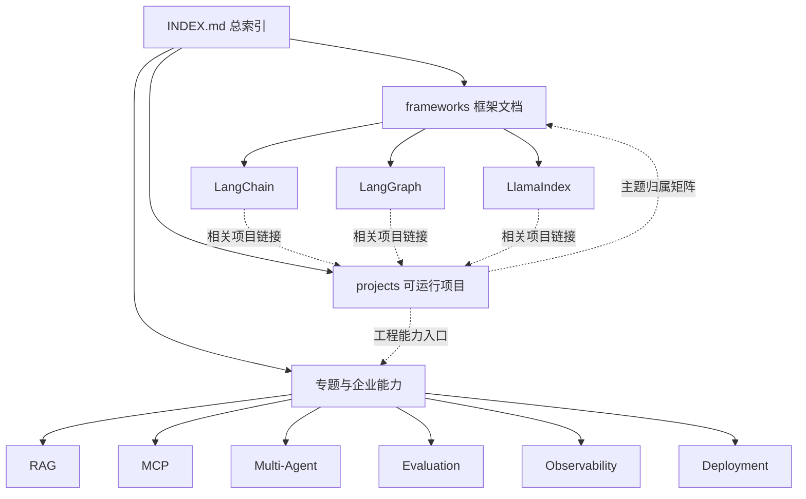

# Agent Advanced 目录整理方案

## 1. 整理决策

本方案采用“物理分层保持不变，逻辑导航统一”的策略：

- `frameworks/` 继续保存框架学习文档。
- `projects/` 继续保存可运行 demo 和完整项目。
- `rag/`、`mcp/`、`multi-agent/` 等继续保存横切专题。
- 使用 `INDEX.md`、README 和 `相关项目链接.md` 建立双向关系。
- 本轮不移动、不删除、不重命名、不覆盖任何现有文件。

原因：代码示例通常带有 requirements、资源文件、运行命令、Python 路径、Docker 配置或测试。只为让文档和代码“看起来在一起”而移动，风险高于收益。

## 2. 问题处理表

| 问题 | 当前路径 | 建议目标路径 | 处理方式 | 是否移动 | 风险 |
| --- | --- | --- | --- | --- | --- |
| LangChain 文档与代码分离 | `frameworks/langchain/`、`projects/langchain_chain_demo/` | 保持原路径 | 创建 `frameworks/langchain/相关项目链接.md`，补双向导航 | 否 | 低 |
| LangGraph 示例分散 | `frameworks/langgraph/`、`projects/langgraph_workflow_demo/`、`langgraph-enterprise/`、`multi-agent/`、`deep-research/` | 保持分层 | 按基础/进阶/企业级建立关联表 | 否 | 中 |
| LlamaIndex 文档与代码分离 | `frameworks/llamaindex/`、`projects/llamaindex_index_demo/` | 保持原路径 | 创建关联页并标注“概念教学版” | 否 | 低 |
| frameworks 总入口信息不统一 | `frameworks/README.md` | 原路径 | 补目录作用、子目录、顺序、项目、注意事项 | 否 | 低 |
| 三个框架 README 信息不完整 | `frameworks/*/README.md` | 原路径 | 保留原文并追加统一导航章节 | 否 | 低 |
| projects 缺主题归属总表 | `projects/README.md` | 原路径 | 追加项目归属矩阵和专题反向链接 | 否 | 低 |
| RAG 分散 | `rag/`、`projects/*rag*`、`projects/vector_db_*`、`eval/` | 保持分层 | 由 `INDEX.md` 建立主题入口 | 否 | 中 |
| MCP 分散 | `mcp/`、`business-agents/mcp_office_agent/` | 保持分层 | 总索引串联协议示例与业务示例 | 否 | 中 |
| Multi-Agent 概念混淆 | `projects/multi_agent_team_demo/`、`multi-agent/graph_team_demo/`、`business-agents/` | 保持分层 | 标注概念版、图编排版、作品集的差异 | 否 | 中 |
| 四个代码目录无 README | `business-agents/shared/` 等 | 原目录新增 README | 第二轮逐个补最小入口文档 | 否 | 中 |
| 命名不统一 | kebab-case 与 snake_case 混用 | 不改现有路径 | 记录新目录命名约定 | 否 | 中 |
| 生成物与 runtime 混入 | cache、node_modules、dist、SQLite | 保持原位 | 索引排除；另行评估 ignore/archive | 否 | 高 |
| 大型项目可能需要归档旧材料 | `projects/japan_retail_analysis_agent/` | 候选 `archive/` 仅放明确废弃文档 | 只有用户确认且有替代入口时才评估 | 暂不 | 高 |

## 3. 推荐的信息架构

### 3.1 纯文本关系图

```text
INDEX.md（总入口）
│
├── frameworks/（学框架概念）
│   ├── langchain/README.md
│   │   └── 相关项目链接.md ──> projects/langchain_chain_demo 等
│   ├── langgraph/README.md
│   │   └── 相关项目链接.md ──> 基础、Multi-Agent、企业级、Deep Research
│   └── llamaindex/README.md
│       └── 相关项目链接.md ──> projects/llamaindex_index_demo 等
│
├── projects/README.md（跑完整 demo）
│   └── 项目归属矩阵 ──> frameworks / rag / multi-agent / eval
│
└── 专题目录（补工程能力）
    ├── rag/
    ├── mcp/
    ├── multi-agent/
    ├── eval/
    ├── observability/
    ├── deployment/
    ├── frontend/
    └── business-agents/
```

### 3.2 Mermaid 关系图



## 4. 推荐目标结构

第一轮推荐结构不创建空的 `学习文档/` 或 `实战示例/`，而是利用现有文件和链接：

```text
agent-advanced/
├── INDEX.md
├── 目录结构检测报告.md
├── 目录整理方案.md
├── frameworks/
│   ├── README.md
│   ├── langchain/
│   │   ├── README.md
│   │   ├── LangChain学习笔记.md
│   │   └── 相关项目链接.md
│   ├── langgraph/
│   │   ├── README.md
│   │   └── 相关项目链接.md
│   └── llamaindex/
│       ├── README.md
│       └── 相关项目链接.md
├── projects/
│   ├── README.md
│   ├── langchain_chain_demo/
│   ├── langgraph_workflow_demo/
│   ├── llamaindex_index_demo/
│   └── ...
├── rag/
├── mcp/
├── multi-agent/
├── langgraph-enterprise/
├── deep-research/
├── business-agents/
├── frontend/
├── eval/
├── observability/
└── deployment/
```

如果某个框架以后积累到三份以上独立学习文档，再考虑创建 `学习文档/`；如果框架目录以后出现自包含的小代码片段，可创建 `实战示例/`。完整项目仍留在 `projects/`。

## 5. 目录职责与所有权

| 层 | 负责内容 | 不负责内容 |
| --- | --- | --- |
| 根 `INDEX.md` | 全局入口、阶段路线、项目类型分类 | 复制所有项目说明 |
| `frameworks/` | 框架心智模型、API 抽象、对比和学习顺序 | 大型可运行项目 |
| `projects/` | 自包含 demo、完整项目、运行命令 | 重复维护框架理论 |
| 专题目录 | RAG、MCP、观测、部署等横切能力 | 取代项目自己的 README |
| `business-agents/` | 业务闭环作品集 | 被误认为一个多 Agent 系统 |
| 关联页 | 路径、层级、学习目的、前置条件 | 复制代码或维护第二份教程 |

## 6. 新命名约定

不重命名已有目录；只约束未来新增：

- 一级专题目录：沿用小写 kebab-case，例如 `prompt-engineering`。
- Python demo：snake_case + `_demo`，例如 `tool_routing_demo`。
- 完整 Agent 项目：snake_case + `_agent` 或明确业务名。
- 聚合目录：复数或领域名保持现状，如 `projects`、`frameworks`。
- 文档标题：使用官方大小写，如 LangChain、LangGraph、LlamaIndex、MCP。
- 不新增只有 `demo`、`project` 这类无法识别主题的目录名。

## 7. 分阶段执行方案

### 第一轮：本次执行

1. 创建检测报告和整理方案。
2. 创建 `INDEX.md`。
3. 补充五个重点 README。
4. 创建三个框架关联页。
5. 运行相对链接和文件范围检查。
6. 不移动任何文件。

### 第二轮：用户确认后逐项执行

1. 为四个缺 README 的代码目录补入口说明。
2. 按项目逐个补充“相关学习文档”反向链接。
3. 为 RAG、MCP、Multi-Agent 创建专题级 `相关项目链接.md`。
4. 判断是否需要把零散框架文档放入 `学习文档/`。

### 第三轮：只有链接方案不足时

1. 生成逐文件移动表。
2. 检查目标冲突、导入、命令、Docker、测试和外部链接。
3. 先移动一个低风险文档并验证。
4. 旧内容只有明确废弃且用户确认后才进入 `archive/`。
5. 仍然禁止删除。

## 8. 运行与部署影响

本轮只改 Markdown，不改代码、依赖或部署配置：

- Python 入口不变。
- npm、Docker、MCP 和数据库路径不变。
- 无需重新部署。
- 不需要安装新依赖。

后续如果移动项目目录，必须分别验证 Python 导入、静态资源、requirements、Docker build context、测试路径和文档命令。

## 9. 可靠性与维护策略

- `INDEX.md` 是总入口，但不复制项目 README 的详细内容。
- 关联页只记录路径和用途，降低重复维护成本。
- 新增 demo 时，同时更新 `projects/README.md` 和对应主题关联页。
- 路径链接使用相对路径，便于工作区移动。
- 生成物、依赖目录和 runtime 数据不进入学习索引。
- 每次结构调整后运行 Markdown 相对链接检查。

## 10. 风险与替代方案

| 决策 | 选择 | 替代方案 | 取舍 |
| --- | --- | --- | --- |
| 文档代码关系 | 链接合并 | 物理合并 | 链接安全但路径层级仍存在；物理合并直观但破坏风险高 |
| 总入口 | 单一 `INDEX.md` | 每个目录独立寻找 | 索引便于学习，但需随新增项目维护 |
| 项目反向链接 | 先在 `projects/README.md` 总表 | 批量改所有项目 README | 总表改动小；逐项目入口更近但维护量大 |
| 命名统一 | 只约束未来 | 立即重命名 | 保持兼容；旧名字风格暂时共存 |
| 生成物处理 | 排除索引、保持原位 | 清理或归档 | 安全，无删除风险；磁盘与视觉噪音仍需后续治理 |

## 11. 验收标准

- [ ] 新增报告、方案和总索引。
- [ ] 五个重点 README 包含目录作用、学习内容、子目录说明、学习顺序、实战项目和注意事项。
- [ ] 三个框架都有相关项目链接页。
- [ ] `INDEX.md` 按技术主题、学习阶段和项目类型提供实际链接。
- [ ] 所有新增相对链接可解析。
- [ ] 没有移动、删除、重命名或覆盖现有文件。
- [ ] 没有修改代码、依赖、部署配置和 runtime 数据。
- [ ] 没有 commit 或 push。

## 12. 等待第二轮确认

本轮完成后只展示变化和风险。是否补更多 README、建立专题关联页、移动文档或创建 `archive/`，必须由用户再次确认。
