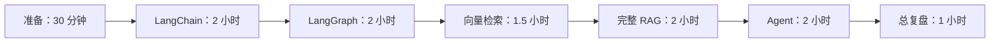

# 第 1 阶段学习任务清单

本清单只覆盖初级阶段，目标是用最短时间跑通：

```text
LangChain
↓
LangGraph
↓
RAG
↓
Agent
```

预计总时间：10–12 小时，建议分 6 个学习日完成。这里是“最短通关版”，不替代 [我的完整学习路线图](./我的学习路线图.md) 中 18–24 小时的完整初级学习。

> 第一阶段边界：只使用本地样例和 mock 模式，不配置真实 API Key，不学习 MCP Remote、真实向量数据库、Checkpoint 或企业部署。

## 一、最短路线图



纯文本路线：

```text
Prompt → Model → Parser
↓
State → Node → Edge → 条件路由
↓
Document → Embedding → Search → Top-K
↓
Chunk → Rewrite → Retrieve → Rerank → Answer + Citation
↓
Planner → Researcher → Writer → Critic → Supervisor
```

## 二、任务总表

| 顺序 | 学习主题 | 运行项目 | 预计时间 | 完成后衔接 |
| ---: | --- | --- | ---: | --- |
| 0 | 熟悉入口和依赖 | 不运行项目 | 30 分钟 | LangChain |
| 1 | LangChain 最小链 | `langchain_chain_demo` | 2 小时 | LangGraph |
| 2 | LangGraph 状态图 | `langgraph_workflow_demo` | 2 小时 | 向量检索 |
| 3 | RAG 检索基础 | `vector_db_demo` | 1.5 小时 | 完整 RAG |
| 4 | 完整 RAG 管线 | `advanced_rag_pipeline_demo` | 2 小时 | Agent |
| 5 | Agent 角色协作 | `multi_agent_team_demo` | 2 小时 | 总复盘 |
| 6 | 基础链路总复盘 | 重跑五个代表输入 | 1–2 小时 | 中级项目 |

---

## 三、任务 0：准备学习入口

### 1. 先学什么

- 知道 `frameworks/` 放概念文档。
- 知道 `projects/` 放可运行 demo。
- 知道 `rag/` 和 `multi-agent/` 是专题入口。
- 本阶段暂不运行 `mcp/`；MCP 留到高级阶段。

### 2. 先运行什么项目

本任务不运行项目，只确认 Python 环境和工作目录：

```bash
cd /home/victorkure/workspace/vscode_study/ai-lab/ai-learn/agent-advanced
python3 --version
```

### 3. 每个项目预计时间

- 阅读入口：20 分钟。
- 确认环境：10 分钟。
- 合计：30 分钟。

### 4. 验收标准

- [ ] 能说出 `frameworks/` 与 `projects/` 的分工。
- [ ] 能从 [INDEX.md](./INDEX.md) 找到 LangChain、LangGraph、RAG 和 Multi-Agent 入口。
- [ ] 当前终端位于 `agent-advanced/` 根目录。

### 5. 完成后更新哪个文档

- 在本清单勾选任务 0。
- 不修改 `INDEX.md` 或任何项目 README，因为目录结构没有变化。

### 6. 如何记录学习笔记

在文末“学习记录”中填写日期、Python 版本和当前工作目录。

### 7. 下一步衔接项目

- [langchain_chain_demo](./projects/langchain_chain_demo/README.md)

---

## 四、任务 1：LangChain 最小链

### 1. 先学什么

只学四个概念：

1. Prompt：如何整理输入。
2. Model / Mock：如何产生结果。
3. Parser：如何把文本变成结构化字典。
4. Runnable 与 `|`：如何连接步骤。

暂不学习 Memory、Tool Calling 和 AgentExecutor。

阅读：

- [LangChain README](./frameworks/langchain/README.md)
- [LangChain 学习笔记](./frameworks/langchain/LangChain学习笔记.md)中与 Prompt、Runnable、Parser 相关的部分
- [langchain_chain_demo README](./projects/langchain_chain_demo/README.md)

### 2. 先运行什么项目

运行 mock 模式，避免被模型配置阻塞：

```bash
python3 projects/langchain_chain_demo/main.py "解释日本股票的 PER" --mock --show-raw
```

然后换一个输入：

```bash
python3 projects/langchain_chain_demo/main.py "整理一家公司的公开资料" --mock
```

### 3. 每个项目预计时间

- 阅读：35 分钟。
- 第一次运行：25 分钟。
- 阅读 `build_prompt()`、`mock_llm()`、`parse_response()`、`build_chain()`：35 分钟。
- 更换输入与复盘：25 分钟。
- 合计：约 2 小时。

### 4. 验收标准

- [ ] 能画出 Prompt → Model → Parser。
- [ ] 能解释原始模型消息与解析后字典的区别。
- [ ] 能找到四个核心函数并说明职责。
- [ ] 能在无 API Key 情况下运行 mock 模式。
- [ ] 输出包含固定结构，而不是无法处理的自由文本。

### 5. 完成后更新哪个文档

- 勾选本清单中的 LangChain 验收项。
- 在 [我的学习路线图](./我的学习路线图.md) 的个人进度记录中标记“LangChain 最小链完成”。实际学习前不需要修改它。

### 6. 如何记录学习笔记

只记录四行：

```text
输入：
调用链：Prompt → Model/Mock → Parser
输出字段：
我最容易混淆的概念：
```

### 7. 下一步衔接项目

- [langgraph_workflow_demo](./projects/langgraph_workflow_demo/README.md)

---

## 五、任务 2：LangGraph 状态图

### 1. 先学什么

只学五个概念：

1. State：共享的类型化数据。
2. Node：读取 State 并返回状态更新的 Python 函数。
3. Edge：决定节点顺序。
4. Conditional Edge：根据状态选择分支。
5. Loop：不通过时修订，并设置明确终止条件。

阅读：

- [LangGraph README](./frameworks/langgraph/README.md)
- [langgraph_workflow_demo README](./projects/langgraph_workflow_demo/README.md)

### 2. 先运行什么项目

```bash
python3 projects/langgraph_workflow_demo/main.py "生成一份日本股票研究报告" --show-graph
```

第二次运行时换一个任务，观察 State 与路由是否变化：

```bash
python3 projects/langgraph_workflow_demo/main.py "生成一份故障复盘报告"
```

### 3. 每个项目预计时间

- 阅读：35 分钟。
- 运行与查看 Mermaid：25 分钟。
- 阅读 classify、research、draft、review、revise、finalize：40 分钟。
- 手画状态图与复盘：20 分钟。
- 合计：约 2 小时。

### 4. 验收标准

- [ ] 能定义 State、Node、Edge。
- [ ] 能说明每个节点读取什么、更新什么。
- [ ] 能解释 `route_after_review()` 如何选择 pass 或 revise。
- [ ] 能指出循环的终止条件，避免无限循环。
- [ ] Mermaid 图与实际调用顺序一致。

### 5. 完成后更新哪个文档

- 勾选本清单中的 LangGraph 验收项。
- 在 [我的学习路线图](./我的学习路线图.md) 标记“StateGraph 基础完成”。

### 6. 如何记录学习笔记

使用节点表：

| Node | 输入 State | 输出更新 | 为什么需要 |
| --- | --- | --- | --- |
| classify |  |  |  |
| research |  |  |  |
| draft |  |  |  |
| review |  |  |  |
| revise |  |  |  |
| finalize |  |  |  |

### 7. 下一步衔接项目

- [vector_db_demo](./projects/vector_db_demo/README.md)

---

## 六、任务 3：RAG 检索基础

### 1. 先学什么

先理解 Retriever 的最小链路：

```text
Document
→ Embedding
→ Collection
→ Query Embedding
→ Similarity Search
→ Top-K
```

只学 collection、metadata、相似度和 top-k；暂不接真实 Qdrant、Chroma 或云服务。

阅读：

- [RAG 专题入口](./rag/README.md)
- [vector_db_demo README](./projects/vector_db_demo/README.md)

### 2. 先运行什么项目

```bash
python3 projects/vector_db_demo/main.py "怎么申请出差报销？" --backend memory --top-k 3
```

再比较不同 top-k：

```bash
python3 projects/vector_db_demo/main.py "远程办公怎么申请？" --backend memory --top-k 1
python3 projects/vector_db_demo/main.py "远程办公怎么申请？" --backend memory --top-k 3
```

### 3. 每个项目预计时间

- 阅读：25 分钟。
- 运行三次查询：25 分钟。
- 阅读 load、embed、upsert、search：25 分钟。
- 比较 top-k 与记录结果：15 分钟。
- 合计：约 1.5 小时。

### 4. 验收标准

- [ ] 能解释文档向量与查询向量的关系。
- [ ] 能解释 collection 和 metadata。
- [ ] 能说明余弦相似度的用途，不要求推导公式。
- [ ] 能解释 top-k 太小和太大的风险。
- [ ] 知道当前是教学向量实现，不是真实向量数据库。

### 5. 完成后更新哪个文档

- 勾选本清单中的 RAG 检索基础验收项。
- 暂不更新 `rag/README.md`，因为没有新增方法或项目。

### 6. 如何记录学习笔记

记录两次查询的对比：

| Query | Top-K | 第一名来源 | 分数 | 是否合理 |
| --- | ---: | --- | ---: | --- |
|  | 1 |  |  |  |
|  | 3 |  |  |  |

### 7. 下一步衔接项目

- [advanced_rag_pipeline_demo](./projects/advanced_rag_pipeline_demo/README.md)

---

## 七、任务 4：完整 RAG 管线

### 1. 先学什么

把检索基础扩展为完整 RAG：

```text
Document
→ Chunk
→ Query Rewrite
→ Retrieve
→ Deduplicate
→ Rerank
→ Top-K Context
→ Answer + Citation
```

初级阶段只理解每一步职责。Hybrid Search、专业 reranker、ACL 和离线评估放到中级阶段。

阅读：

- [advanced_rag_pipeline_demo README](./projects/advanced_rag_pipeline_demo/README.md)
- [RAG 专题入口](./rag/README.md)中的流程清单

### 2. 先运行什么项目

```bash
python3 projects/advanced_rag_pipeline_demo/main.py "LangGraph 适合什么场景，RAG 怎么做引用和重排？" --show-stats --show-excerpt
```

再用一个部署问题验证查询改写：

```bash
python3 projects/advanced_rag_pipeline_demo/main.py "上线后服务起不来怎么办" --show-stats
```

### 3. 每个项目预计时间

- 阅读：30 分钟。
- 两次运行：30 分钟。
- 阅读 load、chunk、rewrite、retrieve、rerank、synthesize：40 分钟。
- 画流程图和核对引用：20 分钟。
- 合计：约 2 小时。

### 4. 验收标准

- [ ] 能完整说出 RAG 的七个主要步骤。
- [ ] 能解释 Query Rewrite 如何改善召回。
- [ ] 能解释 Retrieve 与 Rerank 的区别。
- [ ] 输出包含来源，不把无来源内容当作事实。
- [ ] 能指出当前实现与生产向量库、embedding、reranker 的差距。

### 5. 完成后更新哪个文档

- 勾选本清单中的完整 RAG 验收项。
- 在 [我的学习路线图](./我的学习路线图.md) 标记“RAG 基础链路完成”。

### 6. 如何记录学习笔记

按步骤记录：

| 步骤 | 输入 | 输出 | 失败时会怎样 |
| --- | --- | --- | --- |
| Chunk |  |  |  |
| Rewrite |  |  |  |
| Retrieve |  |  |  |
| Rerank |  |  |  |
| Synthesize |  |  |  |

### 7. 下一步衔接项目

- [multi_agent_team_demo](./projects/multi_agent_team_demo/README.md)

---

## 八、任务 5：Agent 角色协作

### 1. 先学什么

理解 Agent 不是“多调用几次模型”，而是角色、状态、工具和停止条件的组合。

本阶段只学：

- Planner：拆任务。
- Researcher：准备证据。
- Writer：根据证据输出。
- Critic：检查缺项。
- Supervisor：控制顺序并收口。

阅读：

- [Multi-Agent 专题](./multi-agent/README.md)
- [multi_agent_team_demo README](./projects/multi_agent_team_demo/README.md)

### 2. 先运行什么项目

```bash
python3 projects/multi_agent_team_demo/main.py "为一家日本上市公司生成公开信息研究计划"
```

再用一个较简单的任务，判断是否真的需要多个角色：

```bash
python3 projects/multi_agent_team_demo/main.py "解释 PER"
```

### 3. 每个项目预计时间

- 阅读：30 分钟。
- 两次运行：25 分钟。
- 阅读五个角色函数：35 分钟。
- 判断单 Agent 与多 Agent 边界：20 分钟。
- 记录总结：10 分钟。
- 合计：约 2 小时。

### 4. 验收标准

- [ ] 能说出五个角色各自负责什么。
- [ ] 能解释角色之间传递了哪些结果。
- [ ] 能指出 Critic 何时触发修改。
- [ ] 能解释为什么简单问题不值得拆成多 Agent。
- [ ] 知道当前是 Python 函数模拟角色，不代表每个角色都连接独立模型。
- [ ] 能说出生产环境还缺预算、权限、失败恢复和观测。

### 5. 完成后更新哪个文档

- 勾选本清单中的 Agent 验收项。
- 在 [我的学习路线图](./我的学习路线图.md) 标记“初级 Agent 角色协作完成”。

### 6. 如何记录学习笔记

使用角色表：

| 角色 | 输入 | 输出 | 是否必须独立 Agent |
| --- | --- | --- | --- |
| Planner |  |  |  |
| Researcher |  |  |  |
| Writer |  |  |  |
| Critic |  |  |  |
| Supervisor |  |  |  |

### 7. 下一步衔接项目

- 首选：[internal_hybrid_rag_demo](./projects/internal_hybrid_rag_demo/README.md)，进入中级 RAG、ACL 与引用。
- 之后：[graph_team_demo](./multi-agent/graph_team_demo/README.md)，进入真实 LangGraph Multi-Agent。
- MCP 后续入口：[mcp/README.md](./mcp/README.md)，不在第一阶段提前展开。

---

## 九、任务 6：基础链路总复盘

### 1. 先学什么

不再增加新概念，只把五个项目连成一条解释链：

```text
LangChain：组织一次结构化模型调用
→ LangGraph：组织有状态、可分支的流程
→ RAG：为流程提供可引用的外部知识
→ Agent：按角色和步骤完成复杂任务
```

### 2. 先运行什么项目

不重新研究代码，只各运行一个代表输入：

1. `langchain_chain_demo`
2. `langgraph_workflow_demo`
3. `vector_db_demo`
4. `advanced_rag_pipeline_demo`
5. `multi_agent_team_demo`

### 3. 每个项目预计时间

- 每个项目快速运行和确认输出：10 分钟，共 50 分钟。
- 画总流程图：20 分钟。
- 完成验收与笔记：20–40 分钟。
- 合计：1–2 小时。

### 4. 验收标准

- [ ] 五个项目都运行成功。
- [ ] 能在 10 分钟内讲清 LangChain → LangGraph → RAG → Agent。
- [ ] 能指出每个项目的输入、输出和核心函数。
- [ ] 能说出至少一个失败路径或当前实现边界。
- [ ] 能画出未来 Stock-Agent 的最小链路。
- [ ] 没有为了通关提前接入真实 API Key、MCP Remote 或证券账户。

### 5. 完成后更新哪个文档

学习完成后，由你手工更新：

1. 本文件：勾选所有验收项，填写完成日期。
2. [我的学习路线图](./我的学习路线图.md)：标记初级最短链路完成。

不更新 `INDEX.md`、框架 README 或项目 README，因为本阶段没有改变公共知识和目录结构。

### 6. 如何记录学习笔记

在本文件末尾填写五张学习记录卡。每张卡只保留：

- 实际命令。
- 一个关键输入和输出。
- 一条调用链。
- 一个失败点。
- 一个 Stock-Agent 复用点。

### 7. 下一步衔接项目

完成第一阶段后按顺序进入：

1. [internal_hybrid_rag_demo](./projects/internal_hybrid_rag_demo/README.md)：企业混合检索、ACL、引用。
2. [rag_eval_demo](./eval/rag_eval_demo/README.md)：建立评估基线。
3. [graph_team_demo](./multi-agent/graph_team_demo/README.md)：真实 LangGraph Multi-Agent。
4. [MCP](./mcp/README.md)：工具发现、Schema、调用与安全边界。

---

## 十、学习笔记记录方法

### 记录原则

- 每个项目最多一页。
- 不复制整段 README。
- 只记录自己运行过的命令和观察到的结果。
- 报错也要记录，尤其是解释器、依赖、路径和参数问题。
- 不记录真实 API Key、Token、密码或证券账户信息。

### 单项目学习记录卡

复制下面模板五次，在实际学习时填写：

```md
## 项目：

- 日期：
- 实际用时：
- 运行命令：
- 测试输入：
- 关键输出：
- 核心调用链：
- 遇到的错误：
- 如何解决：
- 当前实现边界：
- AI-Learn 复用点：
- Stock-Agent 复用点：
- 下一步：
```

### 第一阶段总记录

| 项目 | 计划时间 | 实际时间 | 是否通过 | 最大收获 |
| --- | ---: | ---: | --- | --- |
| langchain_chain_demo | 2 小时 |  | [ ] |  |
| langgraph_workflow_demo | 2 小时 |  | [ ] |  |
| vector_db_demo | 1.5 小时 |  | [ ] |  |
| advanced_rag_pipeline_demo | 2 小时 |  | [ ] |  |
| multi_agent_team_demo | 2 小时 |  | [ ] |  |

## 十一、第一阶段完成定义

只有同时满足下面条件，才算完成：

- [ ] LangChain、LangGraph、RAG、Agent 四段都能独立解释。
- [ ] 五个项目都实际运行，不是只阅读文档。
- [ ] 每个项目至少保留一张学习记录卡。
- [ ] 能画出完整基础链路。
- [ ] 能说明这条链路如何进入 AI-Learn。
- [ ] 能说明 Stock-Agent 只读、可追溯、不交易的边界。
- [ ] 已选择 `internal_hybrid_rag_demo` 作为下一阶段首个项目。
