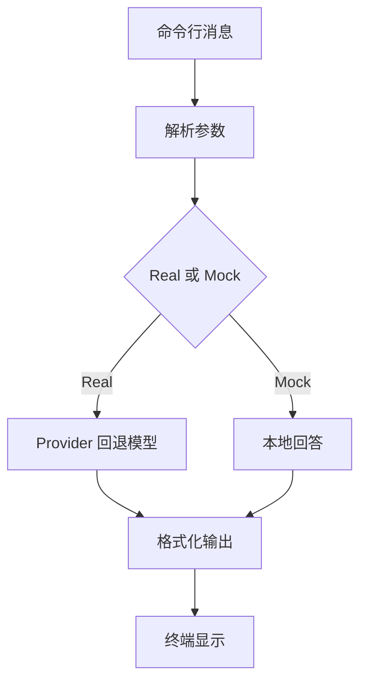

Chat CLI — 学习说明与快速上手

目的
- 一个最小的 OpenAI Responses API 命令行示例，支持一次性提问与交互式对话。

业务场景说明
- 谁会用：第一次练习模型调用的学习者，以及需要快速验证模型连接的开发人员。
- 现实中的问题：正式聊天页面还没做好，但我们想先知道 API Key、模型名称和提示词是否可用。
- 这个例子怎么解决：直接在终端输入问题，程序负责选择 Mock 或真实模型，并把回答打印出来。
- 现实例子：在制作会议纪要助手前，先输入“把下面内容整理成待办事项”，确认模型能返回结果，再继续开发网页。
- 初学者重点：这个项目不是完整聊天产品，它只练习最基础的一问一答和连续对话。

快速运行
1. Mock 模式（无需 API Key）:
   ```bash
   RAG_API_MOCK=1 python3 main.py "你好"
   ```
2. 实际调用（需设置 `OPENAI_API_KEY`）:
   ```bash
   OPENAI_API_KEY=sk... python3 main.py --real "请总结文档"
   ```

关键函数
- `parse_args()`：解析 CLI 参数（--mock/--real/--max-chars）。
- `resolve_mode()`：决定 mock 或 real 模式。
- `ask_once()`：一次性提问并格式化输出。
- `run_interactive()`：交互式对话循环。

学习建议
- 阅读 `format_output()` 的实现，理解如何做输出截断与格式化。
- 在无网络环境中用 `--mock` 验证行为，再在真实环境测试 `--real`。

练习题
- 为 `--max-chars` 添加单元测试，验证截断逻辑。

## 业务场景补充

Chat CLI 适合开发阶段快速验证模型连接和提示词，不承担正式客服或生产聊天产品职责。输入是命令行消息，输出是模型或 Mock 回答；正式产品还需会话存储、鉴权和安全控制。

## 整体流程图


