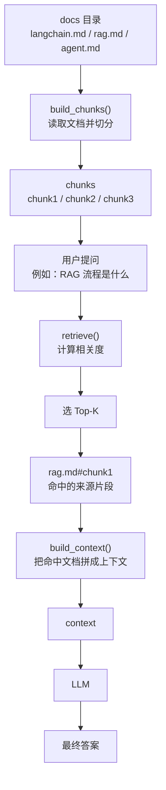
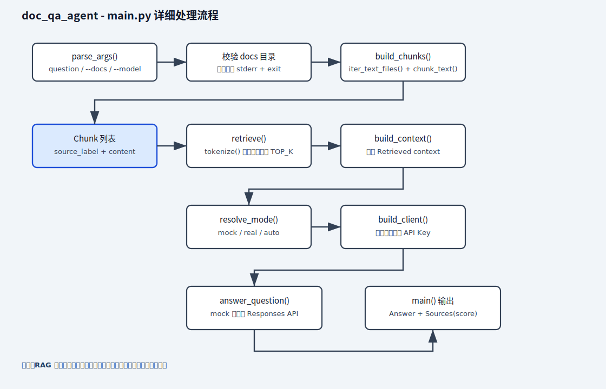
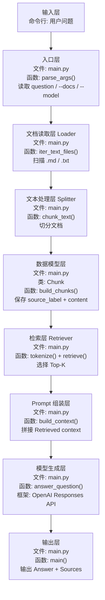
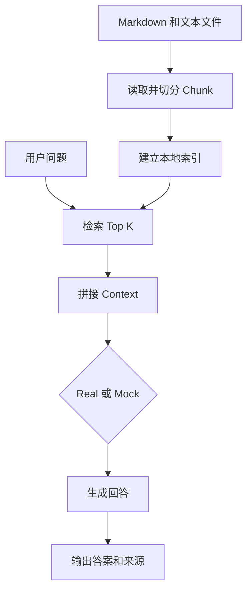

# doc_qa_agent

最小可运行的本地文档问答 `RAG` 示例。

这个 demo 是什么：

```text
一个先检索本地文档，再让模型基于检索结果回答问题的最小 RAG 示例。
```

日语现场可以说成：

```text
ローカル文書を検索し、その検索結果に基づいて回答を生成する最小構成の RAG デモです。
```

这个样例解决的问题是：

- 扫描本地文档目录
- 对文档做简单切分
- 按用户问题做关键词检索
- 把检索结果交给模型生成回答
- 在回答里附带引用来源

它是这条学习线里很关键的一个样例，因为按日本 IT 现场和派遣案件来看，`RAG / 社内検索` 往往比复杂 Agent 更优先落地。

## 图片式模板解释

最小输入与资料：

```text
test_docs/
├── 项目简介.md      # 项目使用 FastAPI
└── 测试观点.md      # 回答必须显示来源
```

`python3 main.py "这个项目使用什么框架？" --docs test_docs`

```text
test_docs 文档目录
│
▼
iter_text_files()：发现 .md / .txt 文件
│
▼
build_chunks() -> chunk_text()：读取并切分为 Chunk
│
▼
用户问题 -> tokenize() -> retrieve()：计算相关度
├── 无命中 -> 返回没有足够资料
└── 有命中 -> 选择 Top-K，并保留 source_label
    │
    ▼
build_context()：拼接命中片段
│
▼
answer_question()：让 LLM 仅根据 context 回答
│
▼
输出 Answer + Sources
```

| 节点 | 文件/函数 | 输入 -> 输出 | 作用 |
| --- | --- | --- | --- |
| 文档加载 | `iter_text_files()` | 目录 -> 文件列表 | 找到可检索资料 |
| 文档切分 | `build_chunks()` | 文件 -> `list[Chunk]` | 形成可比较片段 |
| 检索排序 | `retrieve()` | 问题和 chunks -> Top-K | 只取相关证据 |
| 上下文组装 | `build_context()` | Top-K -> context | 给模型可控依据 |
| 回答生成 | `answer_question()` | 问题和 context -> 答案 | 组织回答和来源 |

最小输出：回答“项目使用 FastAPI”，并列出命中的文件和 chunk 来源。

## 业务场景说明

- 谁会用：需要查询公司制度、项目资料、操作手册或 FAQ 的员工，例如人事、客服、运维和新入职成员。
- 现实中的问题：公司有几十份文档，员工想知道“出差住宿费最多报销多少”，手工逐个打开文件很慢；直接问通用模型，它又不知道公司最新制度。
- 这个例子怎么解决：程序先读取本地 `.md` 和 `.txt` 文件，把长文档切成小段，再找出与问题最相关的几段，最后让模型只根据这些资料回答并显示来源。
- 现实例子：把公司的《出差报销规定》放进文档目录后，员工询问住宿费上限。程序检索到包含金额规定的片段，生成回答，并标出答案来自哪个文件。
- 初学者重点：RAG 的关键不是先调用模型，而是“先从资料中找到依据，再把依据交给模型组织答案”。

## 业务流程图（展开版）

这张图对应你给出的那种“先有 docs 目录，再切 chunk，再检索，再拼 context，最后交给 LLM”的展开方式。它适合放在所有 `RAG` / 文档问答示例里，帮助读者把数据流看成一条完整链路。



这张图里的节点，可以直接对应到代码和数据结构：

| 图中节点 | 代码 / 概念 | 说明 |
| --- | --- | --- |
| `docs 目录` | `--docs` + `iter_text_files()` | 指定要扫描的文档目录 |
| `build_chunks()` | `chunk_text()` + `build_chunks()` | 读取文件并切成可检索片段 |
| `chunks` | `list[Chunk]` | 切分后的片段集合 |
| `用户提问` | CLI 输入 `question` | 用户实际提出的问题 |
| `retrieve()` | `tokenize()` + `retrieve()` | 计算问题与片段的相关度 |
| `选 Top-K` | `TOP_K` | 只保留最相关的几个片段 |
| `rag.md#chunk1` | `source_label` | 命中的来源标签 |
| `build_context()` | `build_context()` | 把命中的片段拼成上下文 |
| `context` | prompt 上下文 | 交给模型的资料内容 |
| `LLM` | `answer_question()` | 基于上下文生成回答 |
| `最终答案` | stdout 输出 | 最终返回给用户的结果 |

示例里的相关度分数只是说明检索方向，像 `chunk1 score=0`、`chunk2 score=2`、`chunk3 score=0` 这种写法，重点是帮助读者理解“为什么最后选中了某个 chunk”，不是要求每次都固定成同一个数。

## 1. 前置条件

- Python 3.10+
- 已安装依赖
- 已配置 `OPENAI_API_KEY`

## 2. 安装依赖

```bash
pip install -r ai-learn/agent-lab/projects/doc_qa_agent/requirements.txt
```

## 3. 配置环境变量

Windows PowerShell:

```powershell
$env:OPENAI_API_KEY="your_api_key"
```

Windows CMD:

```cmd
set OPENAI_API_KEY=your_api_key
```

macOS / Linux:

```bash
export OPENAI_API_KEY="your_api_key"
```

## 4. 运行方式

以下命令都在 `ai-lab/` 根目录执行。
`--docs` 需要传入 `doc_qa_agent` 项目的目录，而不是 `ai-lab/` 根目录。
`--real` 会按 `OpenRouter -> NVIDIA -> Ollama(qwen2.5-coder:1.5b) -> mock` 的顺序回退，`--mock` 只是在你想强制离线时直接走本地 mock。

### 4.1 Mock 执行

```bash
python3 ai-learn/agent-lab/projects/doc_qa_agent/main.py --mock --docs ai-learn/agent-lab/projects/doc_qa_agent "这个目录里数据库相关内容主要讲了什么？"
```

### 4.2 真实模型执行

```bash
python3 ai-learn/agent-lab/projects/doc_qa_agent/main.py --real --docs ai-learn/agent-lab/projects/doc_qa_agent "总结数据库移行的重点"
```

真实模式默认会先尝试 OpenRouter，然后 NVIDIA，再尝试本地 Ollama。若三者都不可用，才会退到最终 mock。

## 5. 这个 demo 的实现范围

这是一个“最小 RAG”：

- 文档类型：`md`、`txt`
- 检索方式：本地关键词检索
- 切分方式：按固定字符长度切分文本，默认 `CHUNK_SIZE = 1200`，重叠 `CHUNK_OVERLAP = 200`
- 结果生成：把 Top-K 片段交给模型总结

它还不是完整企业版 `RAG`，但足够先把这条主线跑通。

### 5.1 chunk 是什么，chunk 前后分别是什么

当前代码里的 `chunk` 不是独立参数名，而是“文档切分后的片段”。

- chunk 前：文件原文，来自 `iter_text_files()` 读取的 UTF-8 文本
- 预处理：`chunk_text()` 会先把换行统一成 `\n`，再 `strip()`
- chunk 方式：按字符切片，`start=0`，`end=start+CHUNK_SIZE`
- chunk 重叠：下一段从 `end-CHUNK_OVERLAP` 开始，也就是默认重叠 `200` 个字符
- chunk 后：`chunk_text()` 返回 `list[str]`，`build_chunks()` 再把它包装成 `Chunk(source_label, content, score)` 对象

`source_label` 的格式是：

```text
相对路径#chunkN
```

例如：

```text
docs/guide.md#chunk1
docs/guide.md#chunk2
```

这意味着你在 `Sources` 里看到的不是“原文件名”，而是“文件名 + 第几个切片”。

如果你把它画成流程图，最稳妥的展开顺序就是：

`docs 目录 -> build_chunks() -> chunks -> 用户提问 -> retrieve() -> Top-K -> 命中来源 -> build_context() -> context -> LLM -> 最终答案`

## 6. 输出内容

程序会输出：

1. 最终回答
2. 命中的引用片段列表

## 7. 代码说明

- 不依赖向量库
- 不依赖外部检索服务
- 先用最简单的本地检索跑通链路
- 方便后面再升级成向量检索、数据库检索或 API 检索

## 8. 代码分层导读

| 文件 / 类 / 函数 | 层次 | 作用 | 学习重点 |
| --- | --- | --- | --- |
| `Chunk` | 数据模型层 | 表示一个可检索的文档片段 | 片段内容、来源、分数 |
| `iter_text_files()` | 文档读取层 | 找到目录下的 `.md` / `.txt` 文件 | 资料入口在哪里 |
| `chunk_text()` | 文本处理层 | 把长文档切成带重叠的小块 | `CHUNK_SIZE`、`CHUNK_OVERLAP`、切分前后 |
| `build_chunks()` | 数据准备层 | 给每个片段附加来源标签 | 来源追踪、`#chunkN` 命名 |
| `tokenize()` | 检索准备层 | 把问题和片段转成可比较的词 | 最小关键词检索 |
| `retrieve()` | 检索层 | 计算重合度并选出 Top-K | 检索质量决定回答质量 |
| `build_context()` | Prompt 组装层 | 把命中的片段拼成上下文 | 模型只能看到你送进去的资料 |
| `answer_question()` | 生成层 | 调模型生成最终回答 | 约束模型只基于上下文回答 |

## Python 处理流程（main.py 详细）

下面是 `main.py` 的详细处理流程图（静态 SVG，兼容 GitHub），展示从参数解析、文档读取、切分、检索，到上下文拼接、模型回答和来源输出的完整顺序：



说明：此图比数据流更详细地展示 `parse_args()`、`build_chunks()`、`retrieve()`、`build_context()`、`resolve_mode()`、`build_client()`、`answer_question()` 与输出处理逻辑。

## 9. 数据流



把这个 demo 放到框架分层里，可以这样理解：

| 顺序 | 框架层 | 文件 / 类 / 函数 | 作用 |
| --- | --- | --- | --- |
| 1 | Controller / 输入层 | `main.py` -> `parse_args()` | 接收问题和文档目录 |
| 2 | Document Loader 层 | `main.py` -> `iter_text_files()` | 扫描可读取文件 |
| 3 | Text Splitter 层 | `main.py` -> `chunk_text()` | 把文档按固定长度和重叠切成片段 |
| 4 | Data Model 层 | `Chunk` + `build_chunks()` | 保存片段内容、来源和分数 |
| 5 | Retrieval 层 | `tokenize()` + `retrieve()` | 检索相关片段 |
| 6 | Prompt / Context 层 | `build_context()` | 组织模型输入上下文 |
| 7 | LLM Service 层 | `answer_question()` | 调用模型生成回答 |
| 8 | View / 输出层 | `main()` | 打印答案和来源 |

## 10. 关键名词理解

| 名词 | 日语 | 是什么 | 核心作用 |
| --- | --- | --- | --- |
| RAG | 検索拡張生成 / RAG | 先检索再生成的问答技术 | 避免模型只靠记忆回答 |
| Chunk | チャンク / 分割片 | 文档切分后的小片段 | 作为检索和引用的基本单位 |
| Top-K | 上位 K 件 | 检索排名前 K 个结果 | 控制给模型多少资料 |
| Context | コンテキスト | 拼给模型的资料上下文 | 直接影响最终回答 |
| Source | 出典 / 参照元 | 答案依据的来源标签 | 让答案可以追溯到文件和片段 |
| Score | スコア | 简单相关度分数 | 用关键词重合度表示相关性 |

## 10.1 中文 / 日语现场对照

| 中文 | 日语 | 日本项目现场常见表达 |
| --- | --- | --- |
| 本地文档问答 | ローカル文書 QA | ローカル文書を対象に質問応答を行います |
| 社内搜索 | 社内検索 | 社内文書を検索対象にします |
| 引用来源 | 出典表示 | 回答に参照元を付けます |
| 检索结果 | 検索結果 | 検索結果をコンテキストとしてモデルに渡します |
| 资料不足 | 情報不足 | 情報が不足している場合は回答できないと返します |

## 11. 建议你怎么读这个项目

1. 先看输出里的 `Sources`，不要只看最终回答。
2. 再修改 `TOP_K`，观察给模型的资料变多或变少后有什么变化。
3. 再修改 `CHUNK_SIZE` 和 `CHUNK_OVERLAP`，观察片段太大、太小或重叠不足时的影响。
4. 最后再考虑把关键词检索换成向量检索。

## 12. 下一步建议

这个样例跑通后，下一步最适合继续做：

1. 增加 `FastAPI` 包装
2. 增加向量检索
3. 增加 PDF 解析
4. 增加检索评估

## 13. Python 处理流程（速查）

1. **parse_args**：处理命令行输入（问题、--docs、--model、--mock/--real）。
2. **resolve_mode**：判断运行模式（自动 / mock / real）。
3. **build_client**：准备外部服务（真实模式创建 OpenAI 客户端）。
4. **build_mock_answer**：生成 mock 数据（无 API Key 也可演练）。
5. **核心业务**：`build_chunks()` 读文件并切分，`retrieve()` 检索，`build_context()` 拼上下文，`answer_question()` 调用模型。
6. **main**：总流程入口，校验目录 -> 索引 -> 检索 -> 回答 -> 输出来源。

## 业务场景（完整说明）

- **使用者**：需要查询本地制度、项目文档或学习笔记的用户。
- **要解决的问题**：只把最相关文档片段交给模型，并在答案后列出来源。
- **输入与输出**：输入文档目录和问题；输出回答、来源标签及检索分数。
- **生产环境差距**：需要向量检索、增量索引、ACL、引用定位、PDF 解析质量和答案评估。

## 整体流程图


