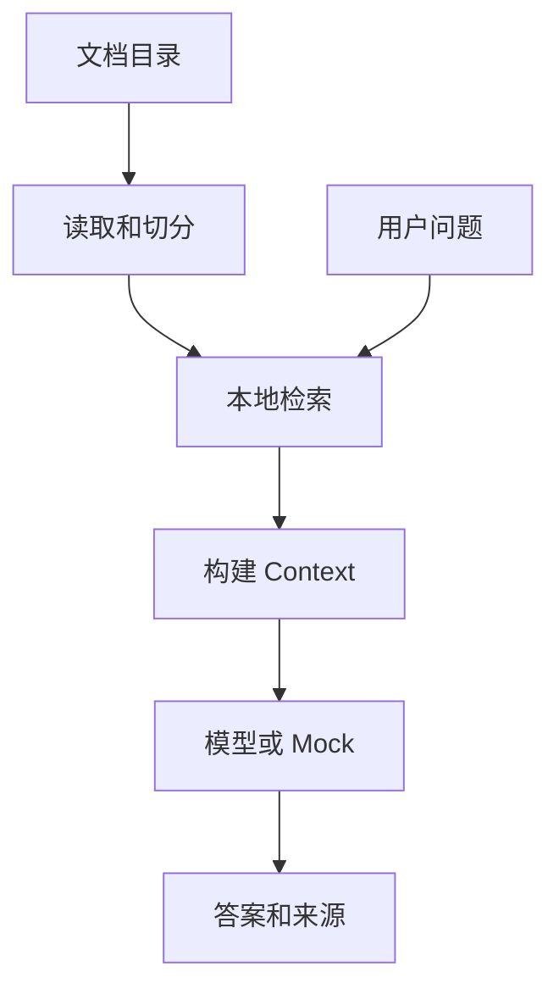

Doc QA Agent — 学习说明与快速上手

目的
- 本地文档问答（RAG PoC）：从本地目录读取文档、切分 chunk、基于关键词检索并构造上下文回答。

业务场景说明
- 谁会用：想做公司内部知识问答或项目文档搜索的学习者和开发人员。
- 现实中的问题：资料就在本地文件里，但用户不知道答案在哪一份文件、哪一段文字中。
- 这个例子怎么解决：先扫描文件并切分内容，再用问题检索相关片段，把片段作为上下文交给模型。
- 现实例子：把请假制度和远程办公规定放入目录，询问“连续远程办公需要谁批准”，程序根据命中的制度片段回答并列出来源。
- 初学者重点：按 `build_chunks()`、`retrieve()`、`build_context()`、`answer_question()` 的顺序阅读，就能看懂最小 RAG。

快速运行
1. Mock 模式（无需 API Key）:
   ```bash
   RAG_API_MOCK=1 python3 main.py --question "项目简介是什么"
   ```
2. Real 模式（需 `OPENAI_API_KEY`）:
   ```bash
   OPENAI_API_KEY=sk... python3 main.py --question "如何部署"
   ```

关键函数
- `build_chunks()`：从文件构建带来源的 chunk 列表。
- `retrieve()`：基于关键词重合度检索 top-k。
- `answer_question()`：将检索上下文发送给模型并返回答案（或 mock）。

学习建议
- 用小数据集尝试不同 `CHUNK_SIZE`，观察检索效果变化。
- 将关键词检索替换为 embeddings + 向量检索作为扩展练习。

## 业务场景补充

该示例对应企业制度、项目文档和个人知识库问答。输入是文档目录与问题，输出必须同时包含答案和来源；生产环境还要补 ACL、增量索引与答案评估。

## 整体流程图


