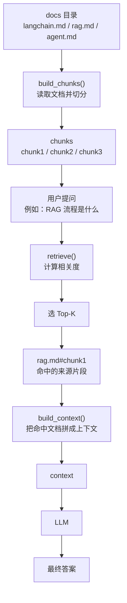

# doc_qa_agent 基本设计

## 1. 系统概要

`doc_qa_agent` 是一个本地命令行形式的最小 `RAG` 程序。

其处理目标是：

- 读取本地文档
- 切分文本
- 检索相关片段
- 基于片段生成回答

## 1.1 业务流程图（展开版）

下面这张图把“文档目录、chunk、检索、上下文、LLM”串成一条完整链路，和 README 里的展开版是一一对应的。

对应关系如下：

| 图中节点 | 设计层含义 | 说明 |
| --- | --- | --- |
| `docs 目录` | 输入资料源 | 用户提供的文档目录 |
| `build_chunks()` | 文档预处理 | 读取并切成 chunk |
| `chunks` | 片段集合 | 后续检索的基本单位 |
| `用户提问` | 查询输入 | 触发检索的自然语言问题 |
| `retrieve()` | 检索步骤 | 计算相关度并排序 |
| `选 Top-K` | 检索截断 | 只保留最相关片段 |
| `rag.md#chunk1` | 来源标识 | 表示命中的具体片段 |
| `build_context()` | 上下文构建 | 把命中文档拼给模型 |
| `context` | 模型输入 | 供 LLM 使用的上下文 |
| `LLM` | 生成步骤 | 基于上下文生成答案 |
| `最终答案` | 输出结果 | 控制台返回内容 |

## 2. 系统构成

| 模块 | 作用 |
|---|---|
| 引数解析 | 接收 `question`、`--docs`、`--model` |
| 文档扫描 | 递归读取指定目录内的 `md` / `txt` |
| 文本切分 | 将文档分割为固定大小片段 |
| 检索模块 | 根据问题做关键词匹配排序 |
| 上下文构建 | 组装 Top-K 片段作为提示上下文 |
| 模型调用 | 调用 OpenAI Responses API 生成回答 |
| 结果输出 | 输出回答与来源列表 |

## 3. 输入输出设计

### 3.1 输入

- `question`
  用户问题
- `--docs`
  文档目录
- `--model`
  使用的模型名称

### 3.2 输出

- 最终回答
- 命中的来源片段列表

## 4. 处理流程

1. 解析命令行参数
2. 检查文档目录是否存在
3. 扫描 `md` / `txt` 文件
4. 读取文件内容
5. 进行文本切分
6. 根据问题进行关键词检索
7. 取 Top-K 片段构建上下文
8. 调用模型生成回答
9. 输出回答和来源

这 9 步可以直接压缩成一条主链路：

`docs 目录 -> build_chunks() -> chunks -> 用户提问 -> retrieve() -> Top-K -> build_context() -> LLM -> 最终答案`

## 5. 文档读取设计

- 扫描方式：递归扫描
- 支持扩展名：`.md`、`.txt`
- 编码：`UTF-8`
- 非文本或解码失败文件：跳过

## 6. 检索设计

本样例采用最简单的本地关键词检索方式：

- 对问题做分词级别的 token 抽取
- 对文本片段做同样处理
- 根据 token 重叠数计算分数
- 按分数降序取前 `TOP_K`

这是学习用最小实现，后续可以替换为：

- 向量检索
- 混合检索
- 外部搜索服务

## 7. 模型调用设计

- API：OpenAI Responses API
- 输入内容：
  - 用户问题
  - 检索上下文
- 系统约束：
  - 只基于检索结果回答
  - 不足时明确说明

## 8. 错误处理

| 场景 | 处理方式 |
|---|---|
| 文档目录不存在 | 输出错误并结束 |
| 没有可读文件 | 输出错误并结束 |
| API Key 未配置 | 输出错误并结束 |
| 模型调用失败 | 输出错误并结束 |
| 没有命中片段 | 输出“依据不足”类回答 |

## 9. 限制事项

- 只支持命令行
- 只支持 `md` / `txt`
- 不支持 PDF
- 不支持向量检索
- 不支持多轮对话

## 10. 后续扩展方向

- 增加 PDF 支持
- 增加 API 化
- 增加向量检索
- 增加检索评估
- 增加日志记录
