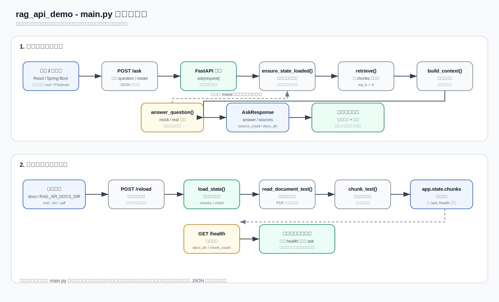
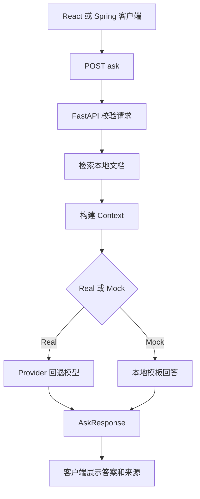

# RAG API Demo - 学习教程

这个目录里的 `rag_api_demo` 是一个最小版 `FastAPI + RAG` 后端示例。它的目标不是做成完整产品，而是帮助你看懂一件事:

`本地文档` 怎么变成 `HTTP 接口`，再被 `客户端` 调用，最后返回带来源的答案。

如果你之前不明白“是谁给谁提供服务、谁是客户端、流程怎么走、怎么部署和访问”，这份文档就是按这个顺序写的。

## 业务场景说明

- 谁会用：需要把文档问答功能提供给网页、手机应用、Java 系统或其他服务的后端开发人员。
- 现实中的问题：`doc_qa_agent` 只能在运行 Python 脚本的电脑上使用。公司员工希望在浏览器里提问，现有业务系统也希望调用同一套问答能力，因此需要一个统一的网络入口。
- 这个例子怎么解决：FastAPI 把文档加载、检索和模型回答包装成 HTTP 接口。客户端只要发送 JSON 请求，就能得到答案和来源，不需要知道后端内部怎样切分和检索文档。
- 现实例子：人事部门把报销制度放入文档目录，员工在公司门户输入“出租车费用什么情况下可以报销”。前端调用 `/ask`，后端检索制度、生成答案，并把来源一起返回页面。
- 初学者重点：先分清角色：浏览器或其他程序是客户端，FastAPI 是服务端，本地文档是数据来源，模型负责根据检索结果组织回答。

## 1. 先看角色

这套例子里有 4 个核心角色:

| 角色 | 是谁 | 做什么 |
|---|---|---|
| 客户端 | 你、浏览器、`curl`、前端页面、其他系统 | 发送 HTTP 请求，拿结果 |
| 程序入口 | `main.py` | 启动应用、定义路由、组织业务流程 |
| 服务端 | `main.py` 启动出来的 `FastAPI` 应用 | 接收请求、读取文档、检索、调用模型、返回 JSON |
| 数据源 | 当前目录或 `RAG_API_DOCS_DIR` 指向的文档 | 提供 `.md`、`.txt`、`.pdf` 内容 |
| 模型服务 | Mock 模式下不调用外部模型，Real 模式下调用 OpenAI | 根据检索上下文生成答案 |

你可以先把这个例子理解成:

`客户端 -> FastAPI 服务 -> 本地文档 -> 模型 -> JSON 响应 -> 客户端`

更准确地说:

- `main.py` 既是程序入口，也是服务端应用代码
- 它对外提供的是 HTTP 接口，不是给人直接点开的 GUI 程序
- 当你在 `ai-lab/` 根目录进入项目目录后运行 `uvicorn main:app` 时，`main.py` 里的 `app` 就变成了可访问的服务

## 2. 再看整体流程

服务处理一次请求时，通常会经历下面这条链路:

1. 客户端访问 `GET /`、`GET /health`、`POST /ask` 或 `POST /reload`
2. `FastAPI` 接到请求
3. 服务检查自己是否已经加载过文档状态
4. 如果还没有加载，就读取本地目录里的文档
5. 文档会被切分成多个 `chunk`
6. 根据用户问题做本地检索，选出最相关的几个 `chunk`
7. 把检索结果拼成上下文
8. Mock 模式直接返回模拟答案，Real 模式调用 OpenAI
9. 返回 JSON 给客户端

这份代码现在是“按需加载”:

- 启动服务时不会提前预热文档索引
- 第一次访问 `/health`、`/ask` 或 `/reload` 时才会真正加载
- 这样 VS Code 打开工作区时不会因为启动脚本而提前占用资源

## 2.1 前后端完整链路

如果把这个 demo 当成一个完整的小应用，它的前后端链路可以这样看：

### 前端链路

1. 用户在 React 页面输入问题，或者在 Spring Boot 客户端里提交请求
2. 客户端把问题包装成 HTTP JSON
3. 客户端调用后端的 `/ask`
4. 页面收到 `answer`、`sources`、`source_count` 后再渲染结果

### 后端链路

1. `FastAPI` 收到 `/ask` 请求
2. 先通过 `ensure_state_loaded()` 确认索引已经准备好
3. 调用 `retrieve()` 找出最相关的文档片段
4. 调用 `build_context()` 把片段拼成上下文
5. 调用 `answer_question()` 生成回答
6. 返回 `AskResponse` 给前端或其他调用方

### 文档整理链路

1. 把要喂给 RAG 的资料放到 `docs` 目录，或者放到 `RAG_API_DOCS_DIR` 指向的目录
2. 文档发生修改后，调用 `/reload` 重新扫描和切块
3. 再用 `/health` 查看 `chunk_count` 是否变化
4. 最后用 `/ask` 验证前端展示和后端回答是否同步更新

你也可以直接看这张图：



如果你更想单独打开文件，也可以点这个链接：

- [main.py 详细处理流程图](./assets/main_py_flow.svg)

## 3. 这个项目提供了什么接口

### `GET /`

这是一个“启动提示页”。

作用:

- 快速确认服务已经跑起来
- 浏览器打开后不用看 404
- 方便区分“服务没启动”还是“路径写错了”

### `GET /health`

这是健康检查接口。

作用:

- 确认服务是否正常
- 返回当前文档目录
- 返回已切分的 `chunk` 数量

你可以把它理解成“服务状态查询”。

### `POST /ask`

这是最重要的问答接口。

作用:

- 接收问题
- 先做本地检索
- 再把检索结果交给模型
- 返回答案和来源

这就是“RAG API”的核心。

### `POST /reload`

这是文档重载接口。

作用:

- 重新扫描文档目录
- 重新切分文档
- 更新内存里的检索缓存

适合在你新增、修改文档之后手动刷新。

## 为什么选 FastAPI

截图里的对比可以直接这样理解:

| 框架 | 特点 | 适合什么场景 |
|---|---|---|
| Flask | 老牌、轻量 | 想自己掌控每一层，项目比较小，自己组装能力强 |
| Django | 很重、全家桶 | 需要后台管理、ORM、认证、模板等一整套能力 |
| FastAPI | 现代、快、AI 项目最流行 | 做 API、做 AI 服务、做高频接口、想要类型提示和自动文档 |

这个例子选择 FastAPI 的原因很简单:

- 重点是做 API，不是做网页模板
- 想把“问答服务”暴露成 HTTP 接口
- 适合和 AI、Python、Pydantic、OpenAPI 这类组件配合
- 对学习者来说，代码结构清晰，入口和接口边界都很明显

### 最常见的客户端是什么

如果问“现在做 agent 一般通过什么来访问”，更接近真实项目的答案是:

- 最常见的最终用户客户端: React / Next.js 这类 Web 前端
- 最常见的服务间调用客户端: Python 或 Java 的后端服务
- 最常见的脚本/测试客户端: Python 脚本、`curl`、Postman、自动化测试

所以从“流行度”上看，通常是:

1. Web 前端最常见，因为要给人直接用
2. Python 后端最常见，因为 AI 生态最顺
3. Java 后端也很常见，特别是企业内部系统集成

这个 demo 里我已经给你补了两个最常见的客户端示例：

- React Web 客户端放在 [`react-client/`](./react-client)
- Spring Boot 客户端放在 [`spring-client/`](./spring-client)

React 客户端默认运行在 `http://127.0.0.1:5173`，后端也已经默认放行了这个本地来源，所以前后端可以直接互调。Spring Boot 客户端默认运行在 `http://127.0.0.1:8088`。

## 4. 谁在给谁服务

这里最容易混淆，我单独展开说。

`FastAPI` 服务不是给自己用的，而是给“客户端”用的。

客户端可以是:

- 你在终端里敲的 `curl`
- 浏览器
- 另一个前端页面
- 别的后端系统
- 自动化测试脚本

这个示例里最常见的客户端其实就是你自己。

例如:

```bash
curl http://127.0.0.1:8000/health
```

这条命令里:

- `curl` 是客户端
- `FastAPI` 是服务端
- `127.0.0.1:8000` 是服务地址
- 返回的 JSON 是服务端给客户端的响应

## Python 里为什么没有 `main()`

如果你更熟 Java，看到 `main.py` 时通常会想找 `main()` 方法。但在这个项目里，Python 的入口方式和 Java 不一样。

`main.py` 只是模块文件名，不要求一定定义 `main()`。

这个 demo 真正的启动命令是：

```bash
cd ai-learn/agent-lab/projects/rag_api_demo && uvicorn main:app
```

这里的含义是：

- `main`：导入 `main.py` 这个模块
- `app`：取出模块里的 `FastAPI` 对象
- `uvicorn`：把这个对象启动成 Web 服务

所以流程其实是：

1. `uvicorn` 导入 `main.py`
2. Python 执行文件里的顶层代码
3. 文件中定义的 `app = FastAPI(...)` 被创建
4. `uvicorn` 读取这个 `app`，并把它暴露成 HTTP 服务

这就是为什么你在 `main.py` 里看不到传统 Java 风格的 `main()`：

- 程序不是靠你手动调用 `main()` 启动的
- 而是靠框架导入模块后，拿到 `app` 对象来启动
- 路由函数 `root()`、`health()`、`ask()`、`reload_docs()` 也都是由 FastAPI 自动注册

如果用一句话记：

`Python 模块 + 顶层 app 对象 + uvicorn` 就是这个项目的入口方式。

如果你想更系统地理解 Python 为什么这样启动，可以看这份补充文档：

- [Python 入门补充](/home/victorkure/workspace/vscode_study/ai-lab/ai-learn/agent-lab/projects/rag_api_demo/Python入门补充.md)

## 5. 内部做了什么

### 5.1 文档加载

服务会读取下面这些文件:

- `.md`
- `.txt`
- `.pdf`

这些文档来自:

- 默认当前目录 `.`，或者
- 环境变量 `RAG_API_DOCS_DIR` 指定的目录

### 5.2 文档切分

服务不会把整份文档一次性交给模型，而是先切成小块 `chunk`。

这样做的原因:

- 方便检索
- 方便控制上下文长度
- 方便找到更相关的内容

### 5.3 本地检索

这个项目不是向量检索，而是一个教学用的简化版本。

它会:

- 拆分问题和文档片段
- 对比 token 重叠
- 挑出分数最高的前几个片段

这一步的目的不是追求最强效果，而是让你先看懂“检索”在流程里扮演什么角色。

### 5.4 生成回答

回答分两种模式:

- Mock 模式: 不依赖 OpenAI，适合本地学习和离线验证
- Real 模式: 调用 OpenAI，适合接真实模型

如果 `RAG_API_MOCK=1`，就强制走 Mock。
如果没有设置 Mock，则会看 `OPENAI_API_KEY` 是否存在。

## 6. 怎么部署

这个示例支持三种最常见的部署方式。

### 6.1 本地直接跑

这是最适合学习的方式。

```bash
cd ai-learn/agent-lab/projects/rag_api_demo
./run-dev.sh
```

这个脚本会自动:

1. 创建虚拟环境
2. 安装依赖
3. 设置 `RAG_API_MOCK=1`
4. 启动 `cd ai-learn/agent-lab/projects/rag_api_demo && uvicorn main:app --reload --port 8000 --host 127.0.0.1`

如果机器不能创建虚拟环境，它会复用当前 Python 环境。

### 6.2 手动启动

如果你想自己控制启动过程，可以直接执行:

```bash
cd ai-learn/agent-lab/projects/rag_api_demo && RAG_API_MOCK=1 uvicorn main:app --reload --port 8000 --host 127.0.0.1
```

如果要连真实模型:

```bash
cd ai-learn/agent-lab/projects/rag_api_demo
export OPENAI_API_KEY="your_api_key"
export RAG_API_DOCS_DIR="./docs"
uvicorn main:app --reload --port 8000 --host 127.0.0.1
```

### 6.3 Docker

如果你更喜欢容器化部署，也可以用 Docker:

```bash
cd ai-learn/agent-lab/projects/rag_api_demo
docker build -t rag_api_demo:dev .
docker run -p 8000:8000 rag_api_demo:dev
```

Docker 方式通常适合:

- 环境里不想装 Python 依赖
- 想和同事保持一致的运行环境
- 想把 demo 当成独立服务看待

## 6.4 三种学习路线

你可以用同一个后端，分别配三种客户端来学：

### 路线 A: 只用后端 + `curl`

适合先理解接口本身。

```bash
cd ai-learn/agent-lab/projects/rag_api_demo
./run-dev.sh
```

然后直接调用：

```bash
curl http://127.0.0.1:8000/health
curl -X POST http://127.0.0.1:8000/ask -H "Content-Type: application/json" -d '{"question":"请总结文档重点"}'
```

### 路线 B: 后端 + React 客户端

适合学习“最常见的 Web 客户端”。

```bash
cd ai-learn/agent-lab/projects/rag_api_demo
./run-dev.sh
```

然后启动：

```bash
cd ai-learn/agent-lab/projects/rag_api_demo/react-client
npm install
npm run dev
```

### 路线 C: 后端 + Spring Boot 客户端

适合学习“Java 服务怎么调用另一个 agent 服务”。

```bash
cd ai-learn/agent-lab/projects/rag_api_demo
./run-dev.sh
```

然后启动：

```bash
cd ai-learn/agent-lab/projects/rag_api_demo/spring-client
mvn spring-boot:run
```

## 7. 怎么访问

服务起来后，默认监听:

`http://127.0.0.1:8000`

你可以按下面顺序访问。

### 7.1 先看根路径

```bash
curl http://127.0.0.1:8000/
```

你应该看到类似:

```json
{
  "service": "rag_api_demo",
  "status": "ok",
  "message": "Service is running. Use /health, /ask, and /reload.",
  "endpoints": ["/health", "/ask", "/reload"]
}
```

### 7.2 再看健康状态

```bash
curl http://127.0.0.1:8000/health
```

它会返回:

- `status`
- `docs_dir`
- `chunk_count`

### 7.3 再发问答请求

```bash
curl -X POST http://127.0.0.1:8000/ask \
  -H "Content-Type: application/json" \
  -d '{"question":"请总结文档重点"}'
```

响应里通常会包含:

- `answer`
- `model`
- `docs_dir`
- `source_count`
- `sources`

### 7.4 需要刷新时调用 reload

```bash
curl -X POST http://127.0.0.1:8000/reload
```

这适合在你改了文档以后重新加载。

## 8. 一次请求的真实路径

如果你还想再直观一点，可以把 `/ask` 的流程理解成下面这样:

```text
你/浏览器/curl
  -> HTTP POST /ask
  -> FastAPI 路由处理
  -> ensure_state_loaded()
  -> load_state() 只有第一次或 reload 后才会真正执行
  -> build_chunks()
  -> retrieve()
  -> build_context()
  -> answer_question()
  -> 返回 JSON
```

在 Mock 模式下:

- `answer_question()` 不会真正打 OpenAI
- 它会返回可预测的模拟结果

在 Real 模式下:

- `answer_question()` 会创建或使用 OpenAI 客户端
- 把上下文和问题发给模型
- 再把结果返回给客户端

## 9. 代码里每个模块的职责

### `main.py`

这是服务入口，负责:

- 定义 API
- 加载文档
- 检索
- 组织上下文
- 调用模型
- 返回响应

### `run-dev.sh`

这是本地开发启动脚本，负责:

- 建虚拟环境
- 装依赖
- 启动 Mock 模式服务

### `smoke_local.sh`

这是本地冒烟测试脚本，负责:

- 启动服务
- 等待 `/health`
- 调用 `/ask`
- 检查返回是否符合预期

### `mock_test.py`

这是一个不依赖服务的最小 mock 脚本，适合先看返回格式。

## 10. 最小学习路径

如果你是第一次看这个项目，建议按这个顺序学:

1. 先跑 `python3 mock_test.py`
2. 再跑 `./run-dev.sh`
3. 打开 `http://127.0.0.1:8000/`
4. 调 `GET /health`
5. 调 `POST /ask`
6. 再看 `main.py` 里的 `load_state()`、`retrieve()`、`answer_question()`

这样你会先建立“请求是怎么进来、结果是怎么出去”的直觉，再看代码就不会乱。

## 11. 常见误区

- `VS Code` 打开工作区不代表服务会自动运行，真正启动是在你执行脚本或 `uvicorn` 时。
- `root`、`health`、`ask`、`reload` 是四个不同用途的接口。
- `health` 不是在检查网络，而是在检查服务状态。
- `reload` 不是重启进程，而是重新加载文档。
- `Mock` 模式不是坏掉了，而是为了学习和离线环境准备的简化模式。

## 12. 下一步建议

如果你已经看懂这个最小版，下一步可以继续做:

1. 把关键词检索升级为向量检索
2. 给接口加认证
3. 给 `/ask` 增加更多参数
4. 增加日志、监控和评估数据

## 业务场景（完整说明）

- **使用者**：Web/Java 客户端、内部知识用户和后端集成开发者。
- **要解决的问题**：把本地文档问答封装成稳定 HTTP API，支持健康检查、提问和重载索引。
- **输入与输出**：输入 HTTP JSON 问题和模型名；输出回答、来源、文档目录及来源数量。
- **生产环境差距**：需要鉴权、异步索引、向量库、并发控制、请求追踪、配额和评估闭环。

## 整体流程图


