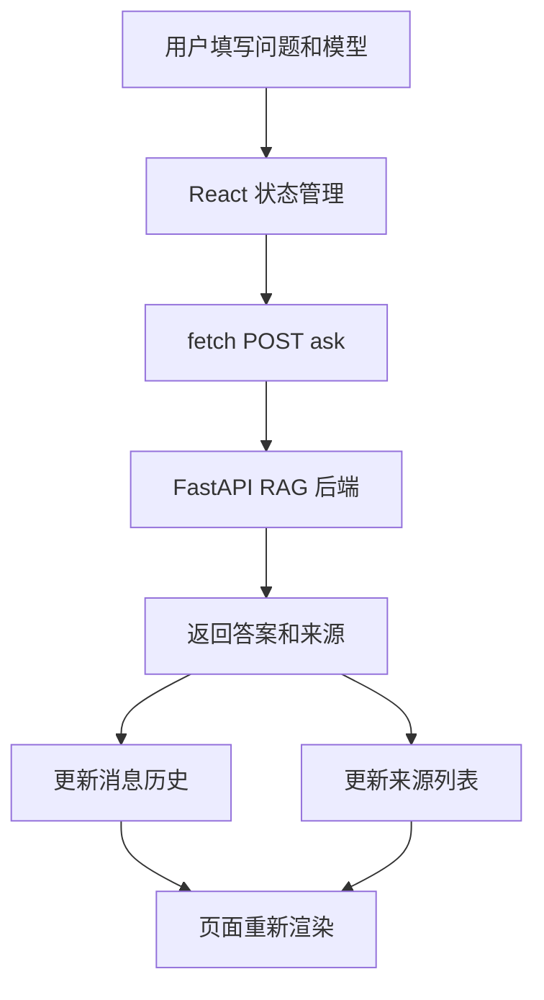

# rag_api_demo React 客户端

这是一个最小但可用的 React Web 客户端，用来调用 `rag_api_demo` 的 FastAPI 接口。

它适合当作这个 demo 的“最流行客户端形态”:

- 浏览器访问
- React 界面
- 通过 `fetch` 调用后端
- 保留对话历史和操作记录

## 图片式模板解释

输入：用户在 React 页面填写问题和模型后提交；处理前数据是表单 State、消息历史和 RAG API 地址。

```text
表单输入 -> submit handler：校验并追加用户消息
│
▼
fetch POST /ask -> FastAPI RAG 后端
├── 成功 -> AskResponse -> 更新答案和 sources
└── 失败 -> 更新 error 状态
    │
    ▼
React 重新渲染消息历史和来源列表
```

节点对应：State 保存界面数据，Fetch 调 API，响应字段驱动答案和来源两个区域。最小输出是页面显示后端答案及引用来源。

## 业务场景说明

- 谁会用：不熟悉命令行的普通员工、业务负责人和测试人员。
- 现实中的问题：FastAPI 接口返回的是 JSON，开发人员能用 `curl` 调试，但普通用户更习惯在网页输入问题、点击按钮并查看答案。
- 这个例子怎么解决：React 页面提供问题输入框和结果区域，调用后端 `/ask` 接口，再把回答、来源和操作记录显示在浏览器中。
- 现实例子：员工打开内部知识问答网页，输入“育儿休假需要提交哪些材料”，页面显示答案，并列出引用的人事制度文件。
- 初学者重点：React 不负责检索文档或调用模型，它只负责收集用户输入、请求后端和展示后端返回的数据。

## 1. 它会调哪些接口

- `GET /`
- `GET /health`
- `POST /ask`
- `POST /reload`

## 2. 本地运行

先确保后端在运行:

```bash
cd ai-learn/agent-lab/projects/rag_api_demo
./run-dev.sh
```

然后启动前端:

```bash
cd ai-learn/agent-lab/projects/rag_api_demo/react-client
npm install
npm run dev
```

默认会访问:

```text
http://127.0.0.1:8000
```

如果你的后端不在这个地址，可以在页面里修改 Base URL，或者创建 `.env` 文件并设置 `VITE_RAG_API_BASE_URL`。

## 3. 常见环境变量

- `VITE_RAG_API_BASE_URL`：如果你想在构建时指定默认后端地址，可以自行扩展到 `App.jsx`
- `react-client/.env.example`：可以复制成 `.env` 后修改默认后端地址
- `RAG_API_CORS_ORIGINS`：后端允许的浏览器来源，默认已经包含 `localhost:5173`

## 4. 这个客户端的定位

它不是生产级产品，而是一个最小的“人类用户客户端”示例，用来说明：

- 客户端如何调用 agent
- React 如何当作 API 客户端
- 前后端如何分离

## 业务场景（完整说明）

- **使用者**：通过浏览器访问企业知识问答的员工和前端开发者。
- **要解决的问题**：为 RAG API 提供可操作界面，展示服务状态、问答历史、来源和索引重载结果。
- **输入与输出**：输入后端地址、模型名和问题；输出 API 回答、来源、健康状态和活动记录。
- **生产环境差距**：需要登录、路由、流式回答、错误重试、会话持久化和前端监控。

## 整体流程图


