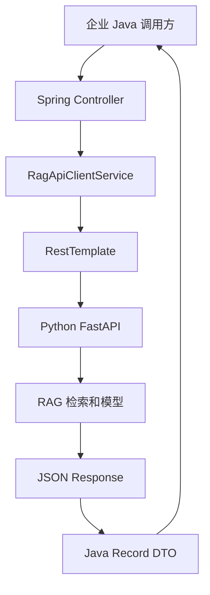

# rag_api_demo Spring Boot 客户端

这是一个最小的 Spring Boot 客户端应用，用来调用 `rag_api_demo` 的 FastAPI 接口。

它的定位是“Java 服务如何作为客户端去调用另一个 agent / RAG 服务”。

## 业务场景说明

- 谁会用：公司现有系统主要使用 Java 或 Spring Boot，而 AI 和 RAG 部分使用 Python 的开发团队。
- 现实中的问题：订单、员工门户或客服系统已经写在 Java 中，不适合为了增加问答功能就把整个系统改成 Python。
- 这个例子怎么解决：Spring Boot 继续负责原有业务，只通过 HTTP 调用 Python FastAPI 的 `/health`、`/reload` 和 `/ask` 接口，再把结果返回给自己的前端或其他模块。
- 现实例子：Java 编写的员工门户收到“出差申请需要谁批准”的问题后，调用 Python RAG 服务取得答案和来源，再在原有门户页面显示。
- 初学者重点：Java 服务和 Python 服务是两个独立程序，它们通过 HTTP 和 JSON 交换数据。

## 1. 它会调用哪些接口

- `GET /`
- `GET /health`
- `POST /ask`
- `POST /reload`

## 2. 本地运行

先启动后端服务:

```bash
cd ai-learn/agent-lab/projects/rag_api_demo
./run-dev.sh
```

再启动 Spring Boot 客户端:

```bash
cd ai-learn/agent-lab/projects/rag_api_demo/spring-client
mvn spring-boot:run
```

第一次运行如果本地还没有对应的 Maven 缓存，可能会先下载依赖，这属于正常情况。

如果你的后端不在 `http://127.0.0.1:8000`，可以这样改:

```bash
cd ai-learn/agent-lab/projects/rag_api_demo/spring-client
RAG_API_BASE_URL=http://127.0.0.1:8000 mvn spring-boot:run
```

## 3. 访问方式

客户端默认监听:

```text
http://127.0.0.1:8088
```

可用接口:

- `GET /client`
- `GET /client/root`
- `GET /client/health`
- `POST /client/ask`
- `POST /client/reload`

## 4. 示例请求

```bash
curl http://127.0.0.1:8088/client/health
```

```bash
curl -X POST http://127.0.0.1:8088/client/ask \
  -H "Content-Type: application/json" \
  -d '{"question":"请总结文档重点","model":"gpt-5"}'
```

```bash
curl -X POST http://127.0.0.1:8088/client/reload
```

## 5. 这个客户端的定位

- 它是一个 Java / Spring Boot 版的 API 客户端
- 它不是替代后端，而是作为上游调用者
- 适合学习企业里常见的“Java 服务调 AI 服务”的方式

## 业务场景（完整说明）

- **使用者**：已有 Spring Boot 系统的 Java 团队和企业集成开发者。
- **要解决的问题**：由 Java 服务作为中间客户端调用 Python RAG API，并向现有业务系统暴露统一接口。
- **输入与输出**：输入 Java DTO 请求；输出映射后的健康信息、回答、来源和重载结果。
- **生产环境差距**：需要认证头、连接池、超时重试、熔断、DTO 校验、日志追踪和服务发现。

## 整体流程图


