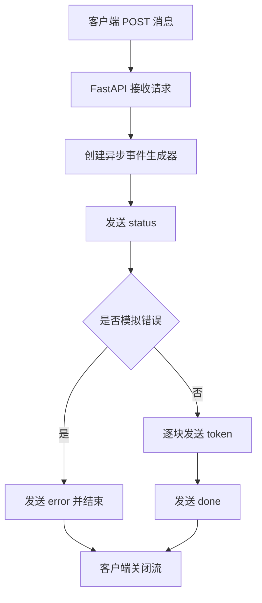

# Streaming Agent API

FastAPI SSE 最小模板，定义 `status`、`token`、`error`、`done` 四种事件，并通过异步生成器保留客户端断开时的取消点。

```bash
uvicorn main:app --port 8000
curl -N -X POST http://127.0.0.1:8000/runs/stream -H 'Content-Type: application/json' -d '{"message":"解释 Tool Calling"}'
curl -N -X POST http://127.0.0.1:8000/runs/stream -H 'Content-Type: application/json' -d '{"message":"error"}'
```

验收：正常路径以 `done` 结束；异常路径发送结构化 `error` 且不再发送 `done`；反向代理禁用缓冲。依赖：`fastapi`、`uvicorn`。

## 图片式模板解释

最小输入：启动服务后用 `curl -N` 向 `/runs/stream` 发送 `{"message":"解释 Tool Calling"}`。

处理前的数据：FastAPI 把 JSON 转成请求对象，服务端用 SSE 事件逐条返回状态和文本。

```text
客户端 POST /runs/stream
│
▼
FastAPI：校验 JSON 请求
│
▼
异步事件生成器
├── 发送 status
├── 正常 -> 多个 token -> done -> 关闭流
└── 异常 -> error -> 关闭流，不再发送 done
    │
    ▼
客户端按事件类型更新界面
```

| 节点 | 代码/协议 | 输入 -> 输出 | 作用 |
| --- | --- | --- | --- |
| 请求入口 | FastAPI route | JSON -> message | 建立流式任务 |
| 事件生成 | async generator | message -> 多个事件 | 边生成边发送 |
| 事件协议 | SSE | 四类事件 -> 文本流 | 客户端区分状态 |
| 终止控制 | `done` / `error` | 活动流 -> 关闭 | 避免悬挂连接 |

最小输出：`status -> token... -> done`；错误输入走 `status -> error`。

## 业务场景（完整说明）

- **使用者**：聊天 UI、长任务控制台和 Agent API 开发者。
- **要解决的问题**：模型或工具执行时间较长时，持续向客户端发送阶段、文本、错误和结束事件，避免页面长时间无响应。
- **输入与输出**：输入 HTTP JSON 消息；输出 SSE 的 status、token、error、done 事件流。
- **生产环境差距**：需要真实模型流、断线重连、Last-Event-ID、任务取消、心跳、鉴权和代理超时配置。

## 整体流程图


