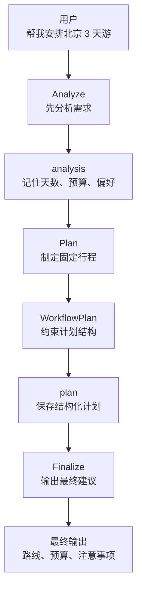
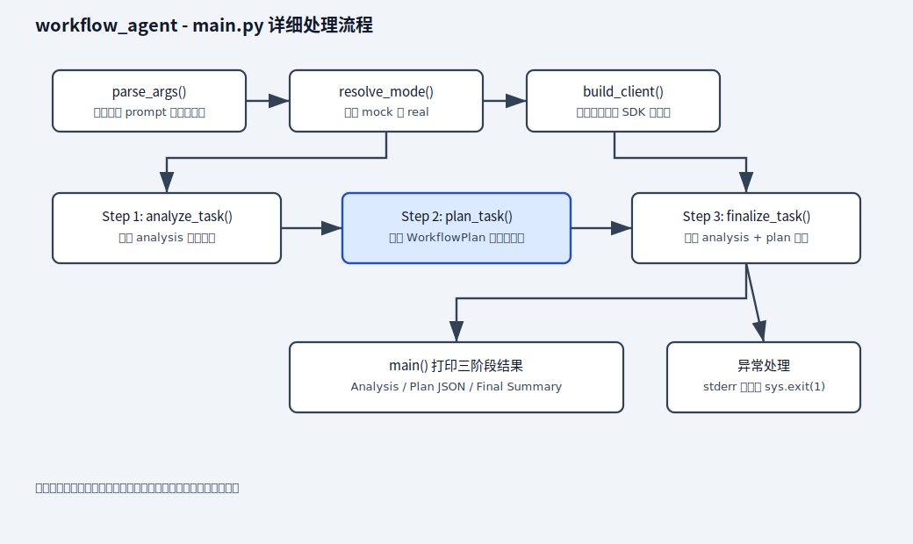
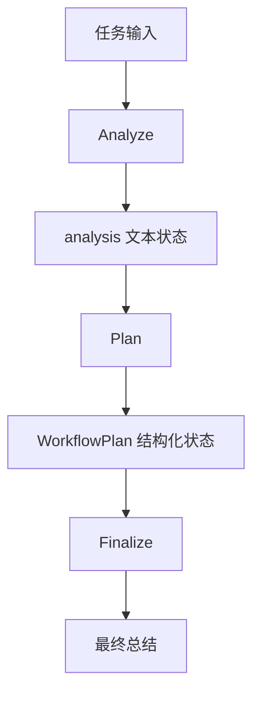

# workflow_agent

最小可运行的工作流 Agent 示例。

## 1. 这个 demo 是什么

```text
一个把 Agent 任务拆成“分析 -> 计划 -> 总结”三个固定阶段的工作流示例。
```

日语现场可以说成：

```text
Agent の処理を「分析 -> 計画 -> 最終出力」の固定ワークフローに分けるデモです。
```

这个样例不是多 Agent，也不是复杂自治系统，而是把任务拆成固定的几个阶段：

1. 分析任务
2. 生成执行计划
3. 输出最终结果

它适合作为 `tool_agent_demo` 之后的下一步，因为这一阶段要重点学习的是：

- 工作流状态如何设计
- 多阶段模型调用如何串起来
- 为什么很多现场 Agent 实际上先是“固定工作流”

## 图片式模板解释

最小输入：`python3 main.py "为文档问答系统制定一周开发计划" --mock`

处理前的数据：一条任务文本会依次产生 `analysis`、`WorkflowPlan` 和最终总结。

```text
用户任务
│
▼
parse_args()：读取任务、模型和运行模式
│
▼
analyze_task()：提取目标、限制和交付物
│
▼
analysis -> plan_task()
│
▼
responses.parse + WorkflowPlan：生成并校验计划
│
▼
analysis + plan -> finalize_task()
│
▼
输出分析、计划和最终建议
```

| 节点 | 文件/函数 | 输入 -> 输出 | 作用 |
| --- | --- | --- | --- |
| 分析 | `analyze_task()` | 任务 -> analysis | 统一理解任务 |
| 计划 | `plan_task()` | analysis -> `WorkflowPlan` | 形成稳定步骤 |
| 总结 | `finalize_task()` | analysis + plan -> 建议 | 生成交付内容 |
| 编排 | `main()` | 三阶段 -> 顺序执行 | 便于测试和追踪 |

最小输出：依次打印任务分析、结构化执行计划和最终建议。

## 2. 业务场景说明

- 谁会用：需要按固定步骤处理复杂任务的开发人员，例如需求整理、项目计划、上线准备和报告编写。
- 现实中的问题：项目经理提出“为公司做一个文档问答系统”，如果直接要求模型一次给出最终方案，模型可能还没弄清目标和限制就开始写计划，容易漏掉预算、时间和交付物。
- 这个例子怎么解决：把任务固定拆成三个阶段。第一步分析目标和限制，第二步根据分析结果生成计划，第三步整理成最终建议；前一步的结果会传给后一步。
- 现实例子：公司准备做一个四周的 RAG PoC，程序先分析需要哪些资料和人员，再生成每周任务、风险和交付物，最后输出给项目负责人阅读的总结。
- 初学者重点：工作流不是让多个模型随意讨论，而是让程序按照预先规定的顺序执行每一步。

## 3. 业务例子：去北京旅游时怎么理解工作流

如果把这个 demo 放到“去北京旅游”的场景里，可以这样理解：

```text
目标：去北京玩 3 天，希望安排得清楚、可执行、不过度折腾
```

对应关系如下：

| 工作流阶段 | 旅游场景里的作用 | 例子 |
| --- | --- | --- |
| `Analyze` | 先分析需求 | 确认天数、预算、想去的景点、交通限制 |
| `analysis` 状态 | 记住分析结果 | 记住“3 天、预算 3000、偏好故宫和博物馆” |
| `Plan` | 制定固定行程 | 安排第 1 天住哪，第 2 天去哪，第 3 天怎么返回 |
| `WorkflowPlan` | 约束计划结构 | 规定必须有日期、地点、优先级、风险 |
| `plan` 状态 | 保存结构化计划 | 把路线、预算、注意事项存下来 |
| `Finalize` | 汇总成可执行方案 | 输出一份游客能直接照着做的行程单 |
| `main()` | 串起整个流程 | 按顺序执行分析、计划、总结 |

可以把这条流程记成一句话：

```text
先确认要去哪里 -> 再安排怎么去 -> 最后整理成能执行的行程
```

### 北京旅游版流程图



这个图想表达的是：

- 先把需求问清楚
- 再把计划固定下来
- 中间状态要保留
- 最后把结果整理成可以直接执行的方案

## 4. 前置条件

- Python 3.10+
- 已安装依赖
- 已配置 `OPENROUTER_API_KEY` 或 `OPENAI_API_KEY`

## 5. 安装依赖

```bash
pip install -r requirements.txt
```

## 6. 运行方式

```bash
python main.py "做一个社内文档问答 PoC"
```

指定模型：

```bash
python main.py --model gpt-5 "帮我规划一个带 RAG 的知识库助手"
```

### 6.1 快速运行

```bash
python3 main.py --mock "请给出一个三步工作流计划"
```

```bash
OPENAI_API_KEY=your_api_key python3 main.py --real "请给出一个三步工作流计划"
```

如果没有可用 API Key，默认会走 `mock` 模式。

## 7. 推荐测试清单

下面命令都假设你在仓库根目录执行，也就是包含 `ai-lab/` 目录的那一层。

### Mock 命令

| 场景 | 命令 | 预期 |
| --- | --- | --- |
| 自动模式一次性提问 | `python3 ai-learn/agent-lab/projects/workflow_agent/main.py "帮我制定一个三步执行计划"` | 没有 Key 时自动降级为 `mock` |
| 强制 Mock 一次性提问 | `python3 ai-learn/agent-lab/projects/workflow_agent/main.py --mock "帮我制定一个三步执行计划"` | 始终使用本地 `mock` |
| 指定模型的 Mock 测试 | `python3 ai-learn/agent-lab/projects/workflow_agent/main.py --mock --model gpt-5 "帮我制定一个三步执行计划"` | 模型参数生效 |
| 输出三阶段结果 | `python3 ai-learn/agent-lab/projects/workflow_agent/main.py --mock "帮我制定一个三步执行计划"` | 输出 `Analysis`、`Plan`、`Final Summary` 三段 |
| 复杂任务输入 | `python3 ai-learn/agent-lab/projects/workflow_agent/main.py --mock "请规划一个四周的 RAG PoC"` | 计划内容仍保持结构化 |

### Real 命令

| 场景 | 命令 | 预期 |
| --- | --- | --- |
| 强制真实 API 一次性提问 | `OPENAI_API_KEY=... python3 ai-learn/agent-lab/projects/workflow_agent/main.py --real "帮我制定一个三步执行计划"` | 真实调用成功 |
| 真实模式缺少 Key | `python3 ai-learn/agent-lab/projects/workflow_agent/main.py --real "帮我制定一个三步执行计划"` | 报错并退出 |
| 指定模型的 Real 测试 | `OPENAI_API_KEY=... python3 ai-learn/agent-lab/projects/workflow_agent/main.py --real --model gpt-5 "帮我制定一个三步执行计划"` | 真实模型参数生效 |

## 8. 工作流步骤

### Step 1. Analyze

- 分析用户任务
- 提取目标、约束和输出物

### Step 2. Plan

- 生成结构化执行计划
- 输出步骤、风险和优先级

### Step 3. Finalize

- 基于前两步结果输出简洁结论

## 9. 代码说明

- 使用官方 `Responses API`
- 用固定阶段代替复杂自治
- 用状态对象保存中间结果
- 用结构化 schema 保证计划阶段结果稳定

## 10. 代码分层导读

| 文件 / 类 / 函数 | 层次 | 作用 | 学习重点 |
| --- | --- | --- | --- |
| `WorkflowPlan` | 数据合同层 | 定义计划阶段输出结构 | 用 schema 约束中间结果 |
| `analyze_task()` | 分析层 | 提取目标、限制、交付物 | 先理解任务，再计划 |
| `plan_task()` | 计划层 | 生成结构化步骤、风险、交付物 | `responses.parse` 的工作流用法 |
| `finalize_task()` | 总结层 | 汇总分析和计划，给最终建议 | 使用中间状态继续生成 |
| `main()` | 编排层 | 按固定顺序执行三个阶段 | 工作流如何串起来 |

## Python 处理流程（main.py 详细）

下面是 `main.py` 的详细处理流程图（静态 SVG，兼容 GitHub），展示从参数解析、模式决策、客户端构建，到 Analyze / Plan / Finalize 三阶段输出的完整顺序：



说明：此图比数据流更详细地展示 `parse_args()`、`resolve_mode()`、`build_client()`、`analyze_task()`、`plan_task()`、`finalize_task()` 与异常处理逻辑。

## 11. 流程总览



这个 demo 的重点是：

- 每一步只做一类事情。
- 中间结果要保留下来。
- 结构化阶段用 schema 稳定输出。

## 12. 建议测试顺序

1. 先跑 `python3 main.py --mock "..."`，确认三阶段输出格式。
2. 再跑 `python3 main.py --mock --model gpt-5 "..."`，确认模型参数透传。
3. 再跑 `python3 main.py "..."`，确认无 Key 时能自动降级。
4. 最后切到 `--real`，验证真实调用链路。

## 13. 关键名词理解

| 名词 | 日语 | 是什么 | 核心作用 |
| --- | --- | --- | --- |
| Workflow | ワークフロー | 固定步骤组成的处理流程 | 按 Analyze -> Plan -> Finalize 执行 |
| State | 状態 / 中間状態 | 步骤之间传递的数据 | `analysis` 和 `plan` 会传给下一步 |
| Planner | プランナー / 計画担当 | 负责生成执行计划的角色 | 把分析结果变成步骤和交付物 |
| Finalizer | 最終出力生成 | 负责生成最终输出的角色 | 基于前面状态给最终建议 |
| Termination | 終了条件 | 判断流程何时结束的规则 | 三个阶段执行完就结束 |

### 13.1 中文 / 日语现场对照

| 中文 | 日语 | 日本项目现场常见表达 |
| --- | --- | --- |
| 工作流 Agent | ワークフロー型 Agent | 固定ワークフローで Agent 処理を制御します |
| 任务分析 | タスク分析 | ユーザー依頼の目的と制約を整理します |
| 计划生成 | 計画生成 | 実行計画を構造化して生成します |
| 中间状态 | 中間状態 | 前ステップの結果を次ステップに渡します |
| 最终输出 | 最終出力 | 分析結果と計画に基づいて最終回答を生成します |

## 14. 日本现场里的意义

这个样例更接近现实中的“固定工作流型 Agent”，而不是一开始就做完全自治系统。

很多日本现场 PoC 的第一步其实更像：

- 流程固定
- 步骤可控
- 输出可解释

## 15. 下一步建议

这个样例跑通后，下一步最适合继续做：

1. 增加工具调用步骤
2. 增加失败重试
3. 增加步骤日志
4. 再考虑多 Agent

## 16. Python 处理流程（速查）

1. **parse_args**：处理命令行输入（任务、--model、--mock、--real）。
2. **resolve_mode**：判断运行模式（自动 / mock / real）。
3. **build_client**：准备外部服务（真实模式创建 OpenAI 客户端）。
4. **build_mock_analysis / build_mock_plan / build_mock_final**：生成 mock 数据（三阶段离线输出）。
5. **核心业务**：`analyze_task()` -> `plan_task()` -> `finalize_task()` 串起三阶段流程。
6. **main**：总流程入口，按阶段执行并输出结果。

## 17. 业务场景（完整说明）

- **使用者**：需要稳定执行分析、计划和总结三阶段任务的开发者。
- **要解决的问题**：把一次复杂提示拆成可观察、可测试的固定工作流，并让中间结果成为下一阶段输入。
- **输入与输出**：输入任务描述；输出分析文本、结构化计划和最终总结。
- **生产环境差距**：需要 checkpoint、阶段重试、人工审批、并行节点、成本预算和状态持久化。
