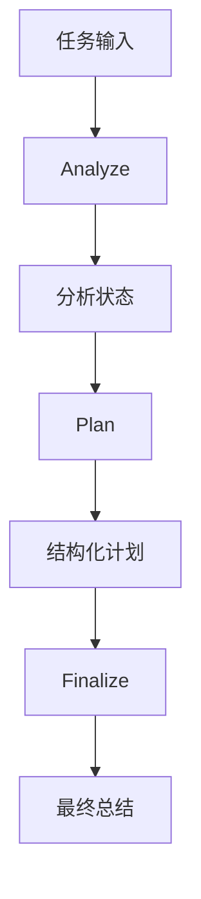

Workflow Agent Demo — 学习说明与快速上手

目的
- 演示一个三阶段（分析→计划→最终化）的简易工作流 agent，使用 Pydantic 验证计划结构并展示阶段化设计。

业务场景说明
- 谁会用：需要把一个大任务拆成几个固定步骤执行的开发人员或项目负责人。
- 现实中的问题：一次让模型同时理解需求、制定计划和写总结，哪一步出错很难判断，也不方便单独修改。
- 这个例子怎么解决：程序依次调用 `analyze_task()`、`plan_task()` 和 `finalize_task()`，并把每一步结果保存下来交给下一步。
- 现实例子：处理“规划四周的 AI 学习计划”时，先分析学习目标和可用时间，再安排每周任务，最后整理成容易执行的学习建议。
- 初学者重点：重点观察同一份任务如何在三个函数之间传递，而不是只看最后答案。

北京旅游例子
- 你说“帮我安排北京 3 天游”。
- `analyze_task()` 先确认天数、预算、偏好和限制。
- `plan_task()` 根据分析结果生成固定行程。
- `finalize_task()` 把计划整理成可以直接执行的建议。

流程图理解
- 用户先提出旅游目标。
- 分析阶段先记住关键信息。
- 计划阶段生成固定路线和约束。
- 总结阶段输出最终行程单。

快速运行
1. Mock 模式：
   ```bash
   RAG_API_MOCK=1 python3 main.py --input "请制定发布计划"
   ```

关键点
- `analyze()`、`plan()`、`finalize()`：分阶段拆解任务，便于测试与维护。
- `WorkflowPlan`：Pydantic 模型，定义计划输出结构并进行验证。

学习建议
- 将阶段拆分为更细的子任务并为每个阶段增加回滚或错误处理逻辑。

## 业务场景补充

固定 Workflow 适合步骤明确、需要中间结果和审计的任务，例如需求分析、方案规划和交付总结。它与自由循环 Agent 的区别是阶段和顺序预先确定。

## 整体流程图


