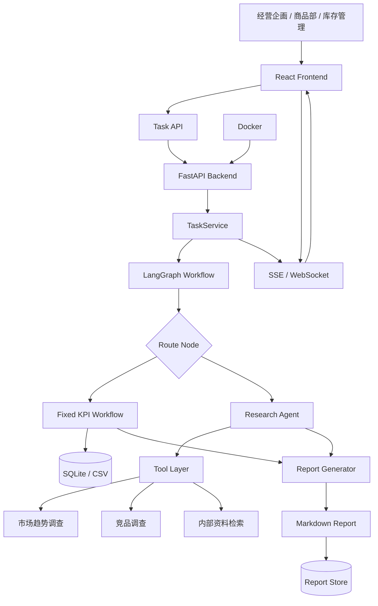
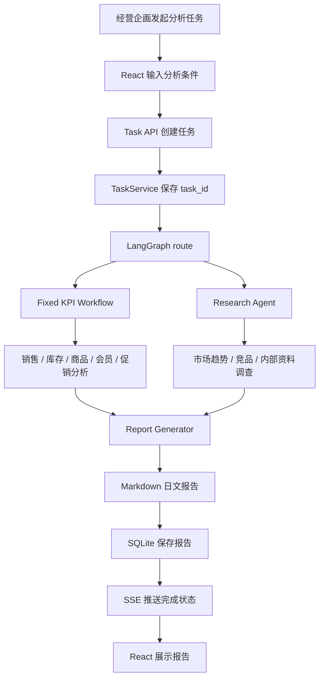

# 01_日本AI项目实战

## 第一章 项目概述

Retail Insight AI 是面向日本小売業客户的 AI 经营分析平台。客户的经营企画、商品部、库存管理、会员运营和门店负责人，需要在经营会议前确认销售、库存、商品、会员和促销情况，并把市场调查和竞品调查整合成日文管理层报告。

项目名称：Retail Insight AI  
日文名称：小売業向け AI 経営分析システム  
系统定位：日本零售行业 AI 经营分析平台  
核心目标：把经营分析任务从“人工整理 Excel / CSV / 调查资料”改造成可追踪、可 Review、可保守改修的系统流程。

我的担当范围：

- Backend
- FastAPI
- API Design
- TaskService
- LangGraph Workflow
- Fixed KPI Workflow
- Research Agent
- Streaming / SSE
- Report Generation
- Prompt
- Docker
- Architecture Design
- Review

【为什么这样设计】

日本小売業客户的经营分析不是一次性问答。销售、库存、商品、会员、促销、市场调查和管理层报告之间存在明确的业务顺序。系统必须先承接任务，再异步执行分析，再实时通知进度，最后生成报告并保存结果。因此项目采用 Task API + TaskService + LangGraph Workflow + Streaming + Report Store 的结构。

【调用顺序】

```text
React
↓
Task API
↓
TaskService
↓
LangGraph Workflow
↓
Fixed KPI Workflow / Research Agent
↓
Report Generator
↓
SQLite
↓
SSE
↓
React
```

【源码映射】

```text
app/frontend/
app/api/
app/service/
app/workflow/
app/kpi/
app/research/
app/report/
app/streaming/
app/db/
app/config/
app/tests/
```

【TL Review】

- 项目边界是否能对应日本小売業客户的经营会议流程。
- Backend、Workflow、Research、Report 是否职责单一。
- 任务失败、报告失败、Research 超时是否有处理路径。
- 日志是否包含 task_id、request_id、workflow_node、user_id。
- 架构是否能扩展到 Redis、PostgreSQL、OpenSearch、VectorDB、OpenTelemetry。

【后续扩展】

- Redis：任务状态缓存和事件缓存。
- PostgreSQL：销售、库存、商品、会员和报告数据持久化。
- RabbitMQ：异步任务队列。
- OpenTelemetry：API、Workflow、Research、Report 的可観測性。
- Kubernetes：多环境部署和滚动发布。

## 第二章 行业背景

日本零售行业的经营管理重视月次报告、门店表现、商品结构、库存周转、会员行为和促销效果。经营会议前，经营企画需要把 POS、库存、商品、会员、销售、CSV、Excel、日报和月报统一整理，形成可以给管理层判断的日文报告。

多店舗业务带来地域差异。POS 数据反映实际销售。商品数据决定分类、价格、成本和毛利。库存数据决定欠品、过剩和周转风险。会员数据帮助判断复购和购买偏好。促销数据影响销售峰值和毛利波动。CSV / Excel 是日本现场常见的数据交换形式，系统必须能承接这些现实输入。

【为什么这样设计】

系统不从技术名词出发，而从日本小売業现场的月次经营流程出发。固定 KPI 分析服务于经营会议，Research Agent 服务于市场和竞品判断，Report Generator 服务于管理层阅读。

【调用顺序】

```text
POS / CSV / Excel
↓
数据清洗与业务字段映射
↓
Fixed KPI Workflow
↓
Research Agent 补充外部与内部信息
↓
日文经营报告
```

【源码映射】

```text
app/db/importer.py
app/db/schemas.py
app/kpi/sales.py
app/kpi/inventory.py
app/kpi/product.py
app/kpi/member.py
app/report/monthly.py
```

【TL Review】

- 字段命名是否体现 POS、库存、商品、会员、促销的业务含义。
- CSV / Excel 导入失败时是否记录原因和行号。
- 经营指标是否有统一口径。
- 月次报告是否能追溯数据来源。

【后续扩展】

- PostgreSQL 管理业务主数据。
- OpenSearch 支持商品名、门店名、促销名搜索。
- 数据导入增加 schema validation 和影响調査。

## 第三章 客户课题

日本小売業客户的经营企画需要每月整理销售数据、库存数据、商品数据、会员数据和促销结果。数据分散在 POS、CSV、Excel、内部 API 和日报月报中。人工整理需要耗费时间，且报告口径容易随担当者变化。

商品部关注商品别销售、粗利、滞销和促销效果。库存管理部门关注欠品、过剩库存和补货风险。会员运营关注复购、客单价和促销响应。门店负责人关注本店与区域平均的差异。经营层需要快速判断异常、原因和行动方向。

【为什么这样设计】

客户课题不是“需要一个 AI 回答问题”，而是需要经营分析任务系统化。同步 API 会受到 HTTP Timeout 和用户等待时间影响；直接让 LLM 处理全部任务会导致 KPI 口径不稳定。因此采用异步 Task API、固定 KPI Workflow 和 Research Agent 组合。

【调用顺序】

```text
经营企画提出分析任务
↓
系统创建 task_id
↓
TaskService 接管生命周期
↓
KPI 与 Research 分开处理
↓
报告统一生成
```

【源码映射】

```text
app/api/tasks.py
app/service/task_service.py
app/workflow/router.py
app/kpi/
app/research/
app/report/
```

【TL Review】

- 是否把客户课题拆成可实现的系统需求。
- 是否区分 KPI 稳定计算和 Research 弹性调查。
- 是否避免把长时间任务塞进同步 API。
- 是否有課題管理和影响調査记录。

【后续扩展】

- RabbitMQ 承接长任务。
- Redis 保存任务状态。
- Audit Log 保存任务发起人、参数和报告版本。

## 第四章 系统需求

系统需要支持销售分析、库存分析、商品分析、会员分析、促销分析、市场调查、竞品调查、Research Agent、日文经营报告生成、SSE 实时进度显示和报告结果保存。

客户要求经营分析任务可能持续几十秒甚至几分钟。系统不能让浏览器一直等待同步 HTTP 响应。因此 API 创建任务后立即返回 task_id，后台 TaskService 管理生命周期，前端通过 SSE 获取进度。

【为什么这样设计】

Task API 降低 HTTP Timeout 风险。TaskService 保证任务生命周期集中管理。LangGraph Workflow 让任务节点可 Review。Streaming 改善用户体验。Report Store 让经营会议前可以复查报告。

【调用顺序】

```text
POST /api/tasks
↓
返回 task_id
↓
TaskService 标记 running
↓
LangGraph 执行 Workflow
↓
SSE 推送 status
↓
报告保存
↓
前端读取报告
```

【源码映射】

```text
app/api/tasks.py
app/api/streams.py
app/service/task_service.py
app/workflow/graph.py
app/db/task_repository.py
app/report/store.py
```

【TL Review】

- Task API 是否幂等。
- 重复提交是否会生成重复任务。
- Task 失败后状态是否明确。
- SSE 断线后能否重新读取状态。
- Report 生成失败是否有错误记录。

【后续扩展】

- Redis 保存 task status。
- RabbitMQ 执行后台任务。
- PostgreSQL 保存任务和报告。
- OpenTelemetry 追踪任务全链路。

## 第五章 系统整体架构



架构按照客户业务执行顺序组织，而不是按技术堆叠组织。React 接收经营分析任务。FastAPI 提供服务边界。TaskService 管理生命周期。LangGraph 负责编排。Fixed KPI Workflow 保证经营指标稳定。Research Agent 处理市场和竞品信息。Report Generator 输出日文报告。SSE 把进度返回前端。

【为什么这样设计】

同步 API 无法承接长任务。全部交给 Agent 会降低 KPI 稳定性。只有固定 Workflow 又无法处理市场调查和竞品调查。因此采用固定 Workflow + Research Agent 的组合。

【调用顺序】

```text
React -> Task API -> TaskService -> LangGraph -> KPI / Research -> Report -> Store -> SSE -> React
```

【源码映射】

```text
app/frontend/
app/api/tasks.py
app/api/streams.py
app/service/task_service.py
app/workflow/graph.py
app/kpi/workflow.py
app/research/agent.py
app/research/tools.py
app/report/generator.py
app/db/
```

【TL Review】

- API 层是否只处理 HTTP，不直接写业务逻辑。
- TaskService 是否承担 use case。
- LangGraph node 是否职责清晰。
- KPI 与 Research 是否边界明确。
- Report 是否保留来源和风险。

【后续扩展】

- Redis / RabbitMQ 分离状态和队列。
- PostgreSQL 替换 SQLite。
- OpenSearch / VectorDB 承接资料检索。
- Kubernetes 管理部署。

## 第六章 核心模块设计

React Frontend 不只是页面。它负责经营分析任务输入、任务状态展示、SSE 进度订阅、报告阅读和错误提示。业务人员需要知道系统在做销售分析、库存分析、Research 还是报告生成。

FastAPI API 不只是接口层。客户任务可能持续较长时间，因此 API 不能等待完整报告生成后再响应。Task API 创建任务并返回 task_id，后续状态由 SSE 和查询 API 承接。

TaskService 是系统中最关键的 use case 层。它负责创建任务、更新状态、调用 LangGraph、保存报告、发布事件、记录错误。

LangGraph Workflow 负责 route、KPI workflow、research agent、report generation。每个 node 读取 state 并返回状态更新，便于 Review 和障害対応。

Fixed KPI Workflow 负责销售、库存、商品、会员、促销等指标。它避免 KPI 逻辑漂移，保证经营数字可追溯。

Research Agent 负责市场趋势调查、竞品调查和内部资料检索。它通过 Tool Layer 调用具体工具，并把来源交给报告生成。

Streaming 负责进度显示。Report Generator 负责日文经营报告。Docker 负责环境一致性和部署基础。

【为什么这样设计】

每个模块对应一个日本小売業客户的明确需求：前端承接使用者，API 承接任务，Service 承接生命周期，Workflow 承接业务顺序，KPI 承接经营数字，Research 承接调查，Report 承接经营会议，Docker 承接部署。

【调用顺序】

```text
React
↓
FastAPI API
↓
TaskService
↓
LangGraph Workflow
↓
Fixed KPI Workflow
↓
Research Agent
↓
Report Generator
↓
Streaming
```

【源码映射】

```text
app/frontend/src/
app/api/
app/service/
app/workflow/
app/kpi/
app/research/
app/report/
app/streaming/
app/docker/
```

【TL Review】

- 模块是否职责单一。
- 是否存在 API 层直接调用 SQL 的设计。
- 是否有统一异常和日志。
- Research Agent 超时是否影响 KPI 报告。
- Report Generator 是否可测试。

【后续扩展】

- app/service 增加 retry policy。
- app/research 增加 tool timeout。
- app/report 增加 template version。
- app/streaming 增加 reconnect 支持。

## 第七章 技术选型与设计决策

FastAPI 的选择来自 API 边界需求。Retail Insight AI 需要创建任务、查询状态、订阅 SSE、读取报告和 health check。FastAPI 与 Python、Pydantic、Streaming、LangGraph 结合自然，适合 Backend API。

LangGraph 的选择来自 Workflow 需求。系统有 route、KPI workflow、research agent、report generation，不是一个函数能清晰承载的流程。LangGraph 的 State、Node、Edge、checkpoint 让流程可 Review。

Fixed KPI Workflow 的选择来自经营数字治理。销售、库存、商品、会员和促销 KPI 需要稳定口径，不能全部交给 Agent 自由推理。

Research Agent 的选择来自市场调查和竞品调查的不确定性。调查任务的来源和路径会随问题变化，需要 Tool Layer 和来源保留。

SSE 的选择来自用户体验和 HTTP Timeout 风险。经营分析任务不适合同步等待，SSE 能把 status、token、error、done 推送给前端。

Docker 的选择来自环境一致性。日本现场 Review、結合試験、部署准备都需要可重复运行方式。

SQLite / CSV 用于承接当前 POS、库存、商品、会员、销售数据结构。企业版通过 PostgreSQL、Redis、VectorDB 扩展。

【为什么这样设计】

设计的核心 trade-off 是稳定性与灵活性。KPI 使用固定 Workflow 保证稳定，Research 使用 Agent 保证灵活，Task API 和 Streaming 保证用户体验，Docker 保证运行一致。

【调用顺序】

```text
Task API
↓
固定 Workflow 判断业务主线
↓
Agent 补充不确定信息
↓
Report 合成统一输出
```

【源码映射】

```text
app/api/
app/workflow/
app/kpi/
app/research/
app/report/
```

【TL Review】

- 为什么不用同步 API。
- 为什么不用直接 LLM。
- 为什么不用全部 Agent。
- 为什么不用普通函数代替 LangGraph。
- 为什么当前数据层可以从 SQLite / CSV 开始，并如何升级。

【后续扩展】

- PostgreSQL 管理主数据。
- Redis 管理任务状态。
- VectorDB 管理内部资料语义检索。
- OpenTelemetry 管理可観測性。

## 第八章 我的担当范围

日语面试表达：

```text
Retail Insight AI、小売業向け AI 経営分析システムの開発を担当しました。
担当範囲は Backend API、FastAPI、API Design、LangGraph Workflow、Research Agent、Streaming、Report Generation、Prompt、Docker、Architecture Design、Review です。

特に、経営分析タスクが長時間になることを前提に、Task API で task_id を返し、TaskService がライフサイクルを管理し、SSE で進捗を返す構成を設計しました。
KPI は Fixed KPI Workflow で安定して処理し、市場調査と競合調査は Research Agent が担当する設計にしています。
```

中文项目表达：

我负责 Backend API、FastAPI、API Design、LangGraph Workflow、Research Agent、Streaming、Report Generation、Prompt、Docker、Architecture Design 和 Review。重点是把长时间经营分析任务拆成可运维的任务生命周期，把 KPI 和 Research 分离，把日文报告生成纳入统一 Workflow。

【为什么这样设计】

日本现场面试中，TL 关心的不是“接触过哪些技术”，而是担当范围是否能落到系统职责、源码目录、异常处理、日志、测试和保守改修。

【调用顺序】

```text
我的担当
↓
API Design
↓
TaskService
↓
Workflow
↓
Research / KPI
↓
Report
↓
Review
```

【源码映射】

```text
app/api/
app/service/
app/workflow/
app/research/
app/report/
app/tests/
docs/design/
```

【TL Review】

- 担当范围是否具体。
- 是否能说明代码放在哪个目录。
- 是否能说明异常和日志如何设计。
- 是否能说明保守改修时影响范围。

【后续扩展】

- 增加 API 契约文档。
- 增加結合試験结果记录。
- 增加 Review 指摘管理表。

## 第九章 业务流程



业务流程强调不可跳过 TaskService。没有 TaskService，API 层会承担太多生命周期逻辑；没有 LangGraph，任务节点和状态流转难以 Review；没有固定 KPI Workflow，经营数字难以保证口径；没有 Research Agent，市场和竞品信息无法纳入报告；没有 SSE，用户无法确认任务进度。

【为什么这样设计】

客户的经营分析任务是跨部门、跨数据源、跨步骤的业务流程。系统必须把流程显式化，才能支持保守改修、障害対応和性能改善。

【源码映射】

```text
app/service/task_service.py
app/workflow/graph.py
app/workflow/state.py
app/kpi/
app/research/
app/report/generator.py
app/streaming/sse.py
```

【TL Review】

- route 条件是否可读。
- Workflow 是否存在循环失控。
- state 是否过大。
- 每个节点失败是否能标记 task failed。
- SSE 是否能反映真实状态。

【后续扩展】

- RabbitMQ 执行异步任务。
- checkpoint 支持中断恢复。
- OpenTelemetry 记录 node latency。

## 第十章 数据流

POS、CSV、Excel、商品、库存、会员、促销数据进入系统后，先进行字段映射和业务校验，再进入 Fixed KPI Workflow。Research Agent 读取市场、竞品和内部资料。Report Generator 把结构化 KPI 和 Research 结果统一成日文经营报告。

数据流不是单纯读取文件。日本小売業客户需要知道每个报告数字来自哪个数据来源，哪个部门提供，哪个字段参与计算，哪个版本进入报告。

【为什么这样设计】

经营报告需要可追溯。没有数据来源和字段映射，Review 时无法回答“这个数字从哪里来”。因此数据流必须保留 source、version、import_time、task_id。

【调用顺序】

```text
POS / CSV / Excel / API
↓
字段映射
↓
数据校验
↓
KPI 计算
↓
Research 补充
↓
Report 生成
```

【源码映射】

```text
app/db/importer.py
app/db/validators.py
app/db/repositories.py
app/kpi/calculators.py
app/research/retriever.py
app/report/context_builder.py
```

【TL Review】

- CSV 格式变化时是否能检测。
- Excel 导入失败是否有错误明细。
- 数据来源是否进入报告 metadata。
- 权限字段是否能扩展。

【后续扩展】

- PostgreSQL 保存业务数据。
- S3 保存原始文件。
- Audit Log 保存导入记录。
- OpenSearch 支持数据和报告检索。

## 第十一章 API 设计

客户要求经营分析任务可能持续几十秒甚至几分钟，因此不采用同步等待完整报告的 API。Task API 创建任务后立即返回 task_id，前端通过 SSE 订阅状态，通过报告 API 获取结果。

主要 API：

```text
POST /api/tasks
GET /api/tasks/{task_id}
GET /api/tasks/{task_id}/events
GET /api/tasks/{task_id}/report
GET /api/health
```

【为什么这样设计】

同步 API 会增加 HTTP Timeout 风险，也会让用户无法知道当前进度。Task API + SSE 可以让系统把长任务拆成可观察的状态流。

【调用顺序】

```text
POST /api/tasks -> task_id
GET /api/tasks/{task_id}/events -> progress
GET /api/tasks/{task_id}/report -> report
```

【源码映射】

```text
app/api/tasks.py
app/api/streams.py
app/api/reports.py
app/api/health.py
app/schemas/task.py
app/schemas/report.py
```

【TL Review】

- API 是否幂等。
- 错误码是否统一。
- request_id 是否进入日志。
- task_id 是否可追踪。
- health check 是否能区分 API、DB、Queue 状态。

【后续扩展】

- API Gateway。
- SSO token 验证。
- Rate limit。
- OpenAPI 文档自动生成。

## 第十二章 LangGraph Workflow 设计

LangGraph Workflow 由 route、KPI workflow、research agent、report generation 组成。state 保存 question、task_id、mode、KPI 结果、Research 结果、source、error 和 report。

route 判断任务需要 KPI、Research 或组合流程。KPI workflow 计算稳定经营指标。research agent 补充市场和竞品信息。report generation 生成日文报告。checkpoint 支持状态追踪和障害調査。

【为什么这样设计】

普通函数可以执行简单流程，但 Retail Insight AI 需要状态、节点、条件路由、checkpoint 和 Review。LangGraph 让 Workflow 结构显式化。

【调用顺序】

```text
route
↓
KPI workflow
↓
research agent
↓
report generation
↓
checkpoint
```

【源码映射】

```text
app/workflow/state.py
app/workflow/graph.py
app/workflow/nodes/route.py
app/workflow/nodes/kpi.py
app/workflow/nodes/research.py
app/workflow/nodes/report.py
app/workflow/checkpoint.py
```

【TL Review】

- State 是否定义清晰。
- Node 输入输出是否可测试。
- 条件路由是否有 fallback。
- checkpoint 是否记录 task_id。
- 节点异常是否被 TaskService 捕获。

【后续扩展】

- interrupt / resume。
- Human approval。
- node retry。
- checkpoint 存储迁移到 PostgreSQL。

## 第十三章 Research Agent 设计

Research Agent 面向市场趋势、竞品调查和内部资料检索。它不负责 KPI 计算，而是通过 Tool Layer 获取补充信息，并把来源、摘要、风险点交给 Report Generator。

市场趋势调查用于解释销售变化背后的外部环境。竞品调查用于确认价格、促销和商品策略。内部资料检索用于确认促销规则、商品政策、库存处理规则和会议资料。

【为什么这样设计】

全部使用固定 Workflow 会缺少外部解释能力。全部交给 Agent 又会影响 KPI 稳定性。Research Agent 与 Fixed KPI Workflow 分离，是稳定性和灵活性的折中。

【调用顺序】

```text
Research request
↓
Tool selection
↓
market / competitor / internal search
↓
source retention
↓
report context
```

【源码映射】

```text
app/research/agent.py
app/research/tools.py
app/research/sources.py
app/research/prompts.py
app/research/timeouts.py
```

【TL Review】

- Tool 调用是否有 timeout。
- Research 失败是否影响整体报告。
- 来源是否保留。
- Prompt 是否限制输出格式。
- 内部资料是否有权限过滤。

【后续扩展】

- OpenSearch。
- VectorDB。
- Tool allowlist。
- Prompt injection guard。
- Research result cache。

## 第十四章 Streaming 设计

Streaming 负责把任务状态实时返回给 React。事件包括 started、status、kpi_started、kpi_done、research_started、research_done、report_started、token、error、done。

前端根据事件构建时间线。用户可以看到经营分析任务正在执行哪个步骤，避免长时间等待时无法判断系统状态。

【为什么这样设计】

经营分析报告生成不是瞬时动作。SSE 比同步响应更适合单向进度通知。WebSocket 保留给取消任务、追加问题、审批操作等双向交互。

【调用顺序】

```text
TaskService event
↓
EventBus
↓
SSE
↓
React timeline
```

【源码映射】

```text
app/streaming/events.py
app/streaming/sse.py
app/service/event_bus.py
app/frontend/components/TaskTimeline.tsx
```

【TL Review】

- SSE 断线后是否能恢复当前状态。
- error 后是否停止 loading。
- done 是否只在成功完成时发送。
- token 是否会造成前端渲染压力。
- proxy buffering 是否考虑。

【后续扩展】

- reconnect。
- heartbeat。
- backpressure。
- Redis pub/sub。
- WebSocket command channel。

## 第十五章 Docker 与部署方案

Docker 用于统一开发、結合試験、Review 和部署准备中的运行环境。React、FastAPI、SQLite / CSV 和环境变量需要稳定组合，避免“个人电脑能跑，Review 环境不能跑”的问题。

Docker Compose 管理前后端组合启动。企业部署可以扩展到 ECS、EKS 或 Kubernetes。FastAPI 作为后端容器运行，React 作为静态资源或前端容器部署，PostgreSQL、Redis、OpenSearch、VectorDB 和 OpenTelemetry 作为运用扩展组件。

【为什么这样设计】

日本现场需要可重复的构建、测试和部署流程。Docker 是部署标准化的基础，不只是开发便利工具。

【调用顺序】

```text
Docker build
↓
Docker Compose
↓
結合試験
↓
CI/CD
↓
ECS / EKS / Kubernetes
```

【源码映射】

```text
Dockerfile
docker-compose.yml
.env.example
deployment/
app/config/
```

【TL Review】

- 环境变量是否外部化。
- secret 是否进入镜像。
- health check 是否配置。
- log 是否输出到 stdout。
- image 是否可扫描。

【后续扩展】

- CI/CD pipeline。
- image scan。
- Kubernetes manifest。
- Helm chart。
- blue/green deploy。

## 第十六章 Production Gap 与企业升级

| 项目 | 当前状态 | 为什么需要 | 企业版怎么做 | 优先级 |
| --- | --- | --- | --- | --- |
| SSO | API 可接收身份上下文 | 日本小売業客户使用统一登录 | OIDC / SAML / IdP 接入 | 高 |
| RBAC | 模块保留权限边界 | 商品部、库存管理、经营层权限不同 | role、permission、department scope | 高 |
| Audit Log | 任务和报告事件可记录 | 报告需要追踪操作者和来源 | user_id、task_id、tool call、report id | 高 |
| Redis | 状态缓存可扩展 | 高频状态查询和 SSE 事件缓存 | task status、event cache、hot report cache | 中 |
| PostgreSQL | SQLite / CSV 承接数据模型 | 结构化业务数据长期管理 | sales、inventory、product、member、task、report tables | 高 |
| RabbitMQ | TaskService 承接任务生命周期 | 并行任务和重试需要队列 | worker、retry、dead letter、priority queue | 中 |
| VectorDB | RAG 扩展点 | 内部资料和月报语义检索 | Chunk、Embedding、metadata、ACL filter | 中 |
| OpenSearch | 搜索扩展点 | 商品、门店、促销和文档全文检索 | index、analyzer、hybrid search | 中 |
| OpenTelemetry | 日志和 metrics 可扩展 | 障害対応需要 trace | trace_id、span、metrics、log correlation | 高 |
| CI/CD | Docker 提供基础 | 团队开发需要质量门禁 | test、lint、build、image scan、deploy | 中 |
| Kubernetes | 容器化基础 | 多环境和滚动发布 | ECS / EKS / Kubernetes | 中 |
| Secrets Manager | 配置外部化 | DB password、API key 需要保护 | Secrets Manager / Vault | 高 |
| Load Test | 性能测试入口 | 长任务和 SSE 需要容量评估 | k6 / Locust | 中 |
| Backup | 数据持久化扩展 | 报告和业务数据需要恢复 | DB backup、object version、restore test | 高 |
| Rollback | 部署可版本化 | 发布异常需要恢复 | versioned deploy、migration rollback | 高 |

【TL Review】

- Production Gap 是否按优先级排序。
- 每个扩展项是否有业务理由。
- 权限、审计、日志、监控是否优先。
- 性能改善是否基于指标。

【后续扩展】

- 把 Gap 转成 Jira 課題管理。
- 按 P0 / P1 / P2 划分改修计划。
- 与基本設計、詳細設計、非機能要件关联。

## 第十七章 日本现场开发流程

需求整理阶段确认经营会议场景、使用者、数据来源、KPI、报告格式和权限边界。基本設計整理系统范围、架构、API、Workflow、数据、权限和非機能要件。詳細設計整理类、函数、状态、错误、日志和测试点。

开发阶段按 API、TaskService、Workflow、KPI、Research、Report、Streaming、Docker 分工。测试阶段覆盖単体試験、結合試験、异常系、权限系、Streaming 断线和报告内容。Review 阶段关注职责、命名、异常、日志、性能和保守改修。部署阶段关注环境变量、health check、日志、监控、回滚。保守阶段处理 KPI 追加、数据源追加、报告格式调整和障害対応。

【为什么这样设计】

日本现场重视設計、レビュー、課題管理、影響調査、保守改修。Retail Insight AI 的文档必须能映射到这些交付活动。

【源码映射】

```text
docs/basic_design.md
docs/detail_design.md
docs/api_design.md
docs/test_design.md
docs/review_log.md
docs/operation.md
```

【TL Review】

- 基本設計是否能解释业务范围。
- 詳細設計是否能指导实现。
- Review 指摘是否有状态。
- 障害対応是否能定位 task_id。

【后续扩展】

- 设计 Review 票。
- 障害票模板。
- 保守改修影响調査模板。

## 第十八章 面试中如何介绍该项目

30 秒版本：

```text
Retail Insight AI、小売業向け AI 経営分析システムの開発を担当しました。
日本の小売業を想定し、POS、在庫、商品、会員、売上データを統合し、KPI 分析、Research Agent、Streaming、日文レポート生成を行うシステムです。
担当範囲は Backend、FastAPI、API Design、LangGraph Workflow、Research Agent、Streaming、Report Generation、Docker、Architecture Review です。
```

1 分钟版本：

```text
Retail Insight AI は、日本の小売業向け AI 経営分析システムです。
売上、在庫、商品、会員、店舗、CSV、Excel、API データを統合し、経営会議向けの日本語レポートを生成します。
私は Backend、FastAPI、API Design、LangGraph Workflow、Research Agent、Streaming、Report Generation、Docker、Architecture Review を担当しました。
KPI は固定 Workflow で安定して分析し、市場調査や競合調査は Research Agent が担当します。
```

3 分钟版本：

```text
Retail Insight AI、小売業向け AI 経営分析システムの開発を担当しました。
日本の小売業では、POS、在庫、商品、会員、売上、CSV、Excel、日報、月報などの情報を経営会議前に整理する必要があります。
このシステムは、それらのデータを統合し、売上分析、在庫分析、商品分析、会員分析、促進分析、市場調査、競合調査を行い、日本語の経営分析レポートを生成します。
技術構成は React、FastAPI、TaskService、LangGraph Workflow、Fixed KPI Workflow、Research Agent、SSE、SQLite、Docker です。
```

5 分钟版本：

```text
Retail Insight AI は、日本の小売業向け AI 経営分析システムです。
対象業務は、売上分析、在庫分析、商品分析、会員分析、促進分析、市場調査、競合調査、経営会議向けレポート生成です。
私は Backend、FastAPI、API Design、LangGraph Workflow、Research Agent、Streaming、Report Generation、Prompt、Docker、Architecture Design、Review を担当しました。
設計上のポイントは、固定 KPI Workflow と Research Agent を分けたことです。
売上、在庫、商品、会員などの KPI は正確性と再現性が重要なため固定 Workflow で処理します。
一方、市場調査や競合調査は状況によって必要な情報が変わるため Research Agent が担当します。
Production Gap として、SSO、RBAC、Audit Log、Redis、PostgreSQL、VectorDB、OpenSearch、OpenTelemetry、CI/CD、Kubernetes、Secrets Manager、Load Test、Backup、Rollback を整理しています。
```

【TL Review】

- 面试表达是否先业务后技术。
- 担当范围是否具体。
- Production Gap 是否自然连接。
- 是否能回答源码目录和调用顺序。

【后续扩展】

- 结合 `02_日本AI现场面试.md` 增加深掘り回答。
- 增加日语口语化表达。

## 第十九章 面试追问与回答

### 1. プロジェクト概要を説明してください。

```text
Retail Insight AI は、日本の小売業向け AI 経営分析システムです。POS、在庫、商品、会員、売上データを統合し、KPI 分析、Research Agent、Workflow、Streaming、日文レポート生成を通じて経営判断を支援します。
```

### 2. 担当範囲を教えてください。

```text
担当範囲は Backend、FastAPI、API Design、LangGraph Workflow、Research Agent、Streaming、Report Generation、Prompt、Docker、Architecture Design、Review です。
```

### 3. なぜ FastAPI を使いましたか。

```text
分析タスク API、状態確認 API、SSE、レポート取得 API が必要だったためです。FastAPI は Python、Pydantic、非同期処理、Streaming と相性が良く、Backend API の境界を整理しやすいです。
```

### 4. なぜ LangGraph を使いましたか。

```text
処理が route、KPI workflow、Research Agent、report generation に分かれるためです。State、Node、Edge、checkpoint を明確にでき、Review と障害調査がしやすくなります。
```

### 5. なぜ固定 KPI Workflow が必要ですか。

```text
売上、在庫、商品、会員などの KPI は経営判断に使われるため、計算口径を安定させる必要があります。固定 Workflow にすることで再現性、テスト、Review がしやすくなります。
```

### 6. なぜ全部 Agent にしないのですか。

```text
KPI は正確性と再現性が重要なので固定 Workflow にします。市場調査や競合調査は情報源が変わるため Research Agent に任せます。安定性と柔軟性を分ける設計です。
```

### 7. Research Agent は何を担当しますか。

```text
市場トレンド、競合調査、内部資料検索を担当します。Tool Layer を通じて情報を取得し、来源を保留した上で Report Generator に渡します。
```

### 8. Streaming はなぜ必要ですか。

```text
経営分析タスクは複数ステップで実行されるため、ユーザーが進捗を確認できる必要があります。SSE で status、token、error、done を返し、前端で進捗を表示します。
```

### 9. SSE と WebSocket の使い分けは何ですか。

```text
SSE はサーバーからクライアントへの進捗通知に向いています。WebSocket はタスクキャンセルや追加操作など双方向通信が必要な場合に使います。
```

### 10. TaskService はなぜ必要ですか。

```text
API 層にタスク状態、Workflow 実行、イベント発行、レポート保存を直接書くと責務が大きくなります。TaskService がライフサイクルを管理することで、保守改修しやすくなります。
```

### 11. 同期 API にしない理由は何ですか。

```text
経営分析タスクは時間がかかるため、同期 API では HTTP Timeout とユーザー待ち時間が問題になります。Task API で task_id を返し、SSE で進捗を返す設計にしています。
```

### 12. Docker は何のために使いますか。

```text
実行環境を統一し、Backend、Frontend、依存関係を安定して起動するためです。ECS、EKS、Kubernetes への拡張にもつながります。
```

### 13. SQLite / CSV を使う理由は何ですか。

```text
POS、在庫、商品、会員、売上データの構造を扱いやすく、KPI 分析とレポート生成の流れを整理しやすいためです。運用版では PostgreSQL、Redis、VectorDB へ拡張します。
```

### 14. PostgreSQL へどう拡張しますか。

```text
販売、在庫、商品、会員、店舗、タスク、レポートを PostgreSQL で管理します。repository 層を通じてアクセスし、権限、監査、backup、migration を設計します。
```

### 15. Redis はどこに使いますか。

```text
タスク状態、SSE イベント、キャッシュ、キュー補助に使います。高頻度な状態取得や並列タスク処理で効果があります。
```

### 16. VectorDB はどこに使いますか。

```text
内部資料、商品説明、月報、会議資料、Research 用文書の検索に使います。Chunk、Embedding、metadata、权限过滤を組み合わせます。
```

### 17. Audit Log はなぜ必要ですか。

```text
誰がどのデータを使い、どのレポートを生成したかを追跡するためです。経営分析レポートは判断材料になるため、user_id、task_id、tool call、report id を記録します。
```

### 18. 障害が発生した場合どう調査しますか。

```text
task_id、API log、SSE event、LangGraph state、KPI workflow、Research Agent tool、report generation の順に確認します。OpenTelemetry を導入する場合は trace_id で一連の処理を追跡します。
```

### 19. 日本现场开发では何を意識しますか。

```text
需求整理、基本設計、詳細設計、API 設計、開発、テスト、Review、部署、保守改修の流れを意識します。特に設計理由、責務分離、ログ、権限、テスト観点を明確にします。
```

### 20. 今後の拡張ポイントは何ですか。

```text
SSO、RBAC、Audit Log、PostgreSQL、Redis、RabbitMQ、VectorDB、OpenSearch、OpenTelemetry、CI/CD、Kubernetes、Secrets Manager、Load Test、Backup、Rollback です。
```

## 第二十章 总结

Retail Insight AI 体现了业务理解、系统设计、Backend 能力、AI Agent 能力、日本现场沟通能力和企业扩展思维。

业务理解体现在 POS、库存、商品、会员、促销、经营会议和月次报告。系统设计体现在 React、FastAPI、TaskService、LangGraph Workflow、Fixed KPI Workflow、Research Agent、Streaming、Report Generator 和 Docker 的组合。Backend 能力体现在 API Design、任务管理、状态查询、SSE、报告保存、health check 和分层设计。AI Agent 能力体现在 Research Agent 的工具调用、来源保留和报告合成。日本现场沟通能力体现在基本設計、詳細設計、Review、結合試験、障害対応、保守改修的表达。企业扩展思维体现在 Production Gap 的持续管理。

【TL Review】

- 项目是否从日本小売業客户问题出发。
- 是否体现系统设计而不是技术罗列。
- 是否能回答调用顺序和源码映射。
- 是否能说明 Production Gap 和优先级。

【后续扩展】

- 与 `02_日本AI现场面试.md` 对齐日语回答。
- 与 `05_TL代码审查.md` 对齐 Review checklist。
- 与 `04_日本现场开发.md` 对齐设计书和保守改修流程。
