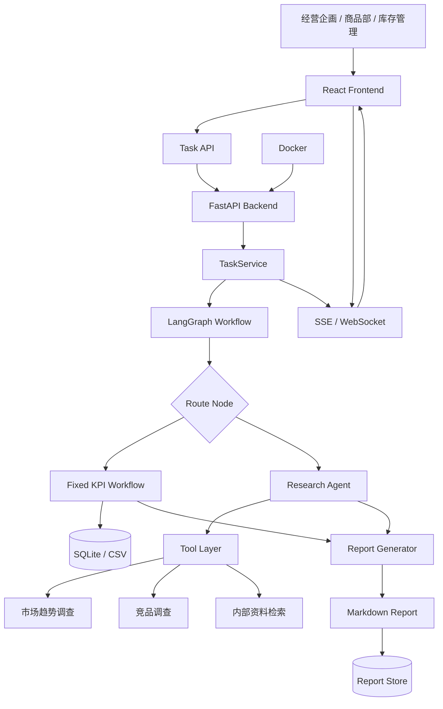
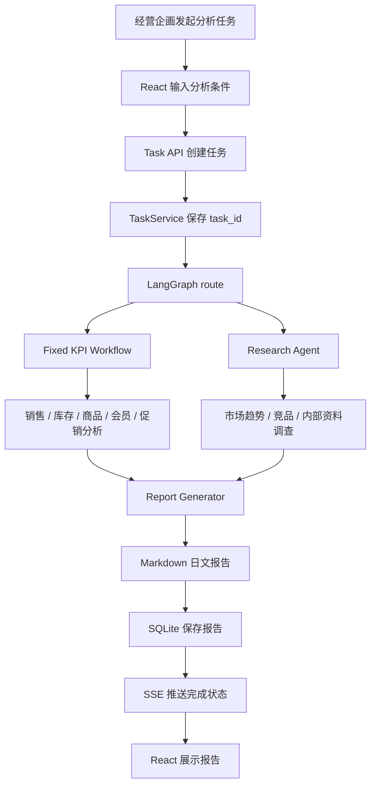

# 01_日本AI项目实战

## 目录

- [第一章 项目概述](#第一章-项目概述)
- [第二章 行业背景](#第二章-行业背景)
- [第三章 客户课题](#第三章-客户课题)
- [第四章 系统需求](#第四章-系统需求)
- [第五章 系统整体架构](#第五章-系统整体架构)
- [第六章 核心模块设计](#第六章-核心模块设计)
- [第七章 技术选型与设计决策](#第七章-技术选型与设计决策)
- [第八章 我的担当范围](#第八章-我的担当范围)
- [第九章 业务流程](#第九章-业务流程)
- [第十章 数据流](#第十章-数据流)
- [第十一章 API设计](#第十一章-api-设计)
- [第十二章 LangGraph Workflow设计](#第十二章-langgraph-workflow-设计)
- [第十三章 Research Agent设计](#第十三章-research-agent-设计)
- [第十四章 Streaming设计](#第十四章-streaming-设计)
- [第十五章 Docker与部署方案](#第十五章-docker-与部署方案)
- [第十六章 Production Gap与企业升级](#第十六章-production-gap-与企业升级)
- [第十七章 日本现场开发流程](#第十七章-日本现场开发流程)
- [第十八章 面试中如何介绍该项目](#第十八章-面试中如何介绍该项目)
- [第十九章 面试追问与回答](#第十九章-面试追问与回答)
- [第二十章 总结](#第二十章-总结)
- [第二十一章 设计中的失败与改进](#第二十一章-设计中的失败与改进)
- [第二十二章 性能优化路线图](#第二十二章-性能优化路线图)
- [第二十三章 TL Review案例](#第二十三章-tl-review-案例)
- [第二十四章 Architecture Evolution](#第二十四章-architecture-evolution)
- [第二十五章 生产事故案例](#第二十五章-生产事故案例)
- [第二十六章 技术债务管理](#第二十六章-技术债务管理)

## TL面试地图

业务理解<br>
↓<br>
项目概述<br>
↓<br>
系统架构<br>
↓<br>
技术选型<br>
↓<br>
ADR<br>
↓<br>
失败案例<br>
↓<br>
TL Review<br>
↓<br>
性能优化<br>
↓<br>
Architecture Evolution<br>
↓<br>
生产事故<br>
↓<br>
技术债务

## 面试高频问题索引

### 架构设计

- 为什么不用同步 API → [ADR-001](#adr-001)
- 为什么采用 TaskService → [ADR-002](#adr-002)
- 为什么采用 LangGraph → [ADR-003](#adr-003)
- 为什么不全部使用 Agent → [ADR-004](#adr-004)
- 为什么采用 SSE → [ADR-005](#adr-005)

### AI Agent

- Research Agent 设计 → [第十三章](#第十三章-research-agent-设计)
- Multi-Agent 扩展 → [Evolution-04](#evolution-04)
- Prompt Registry → [Evolution-05](#evolution-05)
- Model Router → [Evolution-09](#evolution-09)

### 性能优化

- 100 任务扩展方案 → [第二十二章](#第二十二章-性能优化路线图)
- 1000 任务扩展方案 → [第二十二章](#第二十二章-性能优化路线图)
- 10000 任务扩展方案 → [第二十二章](#第二十二章-性能优化路线图)

### 生产事故

- Research 超时 → [事故 01](#incident-01)
- Prompt 错误 → [事故 02](#incident-02)
- Redis 故障 → [事故 04](#incident-04)
- 模型异常 → [事故 05](#incident-05)
- RabbitMQ 积压 → [事故 06](#incident-06)

### TL Review

- TaskService 职责过大 → [Review 01](#review-01)
- State 过大 → [Review 02](#review-02)
- API 不统一 → [Review 03](#review-03)
- Research 超时 → [Review 04](#review-04)
- KPI 版本管理 → [Review 06](#review-06)

## 第一章 项目概述

Retail Insight AI 是面向日本小売業客户的 AI 经营分析平台。客户的经营企画、商品部、库存管理、会员运营和门店负责人，需要在经营会议前确认销售、库存、商品、会员和促销情况，并把市场调查和竞品调查整合成日文管理层报告。

项目名称：Retail Insight AI  
日文名称：小売業向け AI 経営分析システム  
系统定位：日本零售行业 AI 经营分析平台  
核心目标：把经营分析任务从“人工整理 Excel / CSV / 调查资料”改造成可追踪、可 Review、可保守改修的系统流程。

我的担当范围：

- Backend
- FastAPI
- API Design
- TaskService
- LangGraph Workflow
- Fixed KPI Workflow
- Research Agent
- Streaming / SSE
- Report Generation
- Prompt
- Docker
- Architecture Design
- Review

【为什么这样设计】

日本小売業客户的经营分析不是一次性问答。销售、库存、商品、会员、促销、市场调查和管理层报告之间存在明确的业务顺序。系统必须先承接任务，再异步执行分析，再实时通知进度，最后生成报告并保存结果。因此项目采用 Task API + TaskService + LangGraph Workflow + Streaming + Report Store 的结构。

【调用顺序】

```text
React
↓
Task API
↓
TaskService
↓
LangGraph Workflow
↓
Fixed KPI Workflow / Research Agent
↓
Report Generator
↓
SQLite
↓
SSE
↓
React
```

【源码映射】

```text
app/frontend/
app/api/
app/service/
app/workflow/
app/kpi/
app/research/
app/report/
app/streaming/
app/db/
app/config/
app/tests/
```

【TL Review】

- 项目边界是否能对应日本小売業客户的经营会议流程。
- Backend、Workflow、Research、Report 是否职责单一。
- 任务失败、报告失败、Research 超时是否有处理路径。
- 日志是否包含 task_id、request_id、workflow_node、user_id。
- 架构是否能扩展到 Redis、PostgreSQL、OpenSearch、VectorDB、OpenTelemetry。

【后续扩展】

- Redis：任务状态缓存和事件缓存。
- PostgreSQL：销售、库存、商品、会员和报告数据持久化。
- RabbitMQ：异步任务队列。
- OpenTelemetry：API、Workflow、Research、Report 的可観測性。
- Kubernetes：多环境部署和滚动发布。

## 第二章 行业背景

日本零售行业的经营管理重视月次报告、门店表现、商品结构、库存周转、会员行为和促销效果。经营会议前，经营企画需要把 POS、库存、商品、会员、销售、CSV、Excel、日报和月报统一整理，形成可以给管理层判断的日文报告。

多店舗业务带来地域差异。POS 数据反映实际销售。商品数据决定分类、价格、成本和毛利。库存数据决定欠品、过剩和周转风险。会员数据帮助判断复购和购买偏好。促销数据影响销售峰值和毛利波动。CSV / Excel 是日本现场常见的数据交换形式，系统必须能承接这些现实输入。

【为什么这样设计】

系统不从技术名词出发，而从日本小売業现场的月次经营流程出发。固定 KPI 分析服务于经营会议，Research Agent 服务于市场和竞品判断，Report Generator 服务于管理层阅读。

【调用顺序】

```text
POS / CSV / Excel
↓
数据清洗与业务字段映射
↓
Fixed KPI Workflow
↓
Research Agent 补充外部与内部信息
↓
日文经营报告
```

【源码映射】

```text
app/db/importer.py
app/db/schemas.py
app/kpi/sales.py
app/kpi/inventory.py
app/kpi/product.py
app/kpi/member.py
app/report/monthly.py
```

【TL Review】

- 字段命名是否体现 POS、库存、商品、会员、促销的业务含义。
- CSV / Excel 导入失败时是否记录原因和行号。
- 经营指标是否有统一口径。
- 月次报告是否能追溯数据来源。

【后续扩展】

- PostgreSQL 管理业务主数据。
- OpenSearch 支持商品名、门店名、促销名搜索。
- 数据导入增加 schema validation 和影响調査。

## 第三章 客户课题

日本小売業客户的经营企画需要每月整理销售数据、库存数据、商品数据、会员数据和促销结果。数据分散在 POS、CSV、Excel、内部 API 和日报月报中。人工整理需要耗费时间，且报告口径容易随担当者变化。

商品部关注商品别销售、粗利、滞销和促销效果。库存管理部门关注欠品、过剩库存和补货风险。会员运营关注复购、客单价和促销响应。门店负责人关注本店与区域平均的差异。经营层需要快速判断异常、原因和行动方向。

【为什么这样设计】

客户课题不是“需要一个 AI 回答问题”，而是需要经营分析任务系统化。同步 API 会受到 HTTP Timeout 和用户等待时间影响；直接让 LLM 处理全部任务会导致 KPI 口径不稳定。因此采用异步 Task API、固定 KPI Workflow 和 Research Agent 组合。

【调用顺序】

```text
经营企画提出分析任务
↓
系统创建 task_id
↓
TaskService 接管生命周期
↓
KPI 与 Research 分开处理
↓
报告统一生成
```

【源码映射】

```text
app/api/tasks.py
app/service/task_service.py
app/workflow/router.py
app/kpi/
app/research/
app/report/
```

【TL Review】

- 是否把客户课题拆成可实现的系统需求。
- 是否区分 KPI 稳定计算和 Research 弹性调查。
- 是否避免把长时间任务塞进同步 API。
- 是否有課題管理和影响調査记录。

【后续扩展】

- RabbitMQ 承接长任务。
- Redis 保存任务状态。
- Audit Log 保存任务发起人、参数和报告版本。

## 第四章 系统需求

系统需要支持销售分析、库存分析、商品分析、会员分析、促销分析、市场调查、竞品调查、Research Agent、日文经营报告生成、SSE 实时进度显示和报告结果保存。

客户要求经营分析任务可能持续几十秒甚至几分钟。系统不能让浏览器一直等待同步 HTTP 响应。因此 API 创建任务后立即返回 task_id，后台 TaskService 管理生命周期，前端通过 SSE 获取进度。

【为什么这样设计】

Task API 降低 HTTP Timeout 风险。TaskService 保证任务生命周期集中管理。LangGraph Workflow 让任务节点可 Review。Streaming 改善用户体验。Report Store 让经营会议前可以复查报告。

【调用顺序】

```text
POST /api/tasks
↓
返回 task_id
↓
TaskService 标记 running
↓
LangGraph 执行 Workflow
↓
SSE 推送 status
↓
报告保存
↓
前端读取报告
```

【源码映射】

```text
app/api/tasks.py
app/api/streams.py
app/service/task_service.py
app/workflow/graph.py
app/db/task_repository.py
app/report/store.py
```

【TL Review】

- Task API 是否幂等。
- 重复提交是否会生成重复任务。
- Task 失败后状态是否明确。
- SSE 断线后能否重新读取状态。
- Report 生成失败是否有错误记录。

【后续扩展】

- Redis 保存 task status。
- RabbitMQ 执行后台任务。
- PostgreSQL 保存任务和报告。
- OpenTelemetry 追踪任务全链路。

## 第五章 系统整体架构



架构按照客户业务执行顺序组织，而不是按技术堆叠组织。React 接收经营分析任务。FastAPI 提供服务边界。TaskService 管理生命周期。LangGraph 负责编排。Fixed KPI Workflow 保证经营指标稳定。Research Agent 处理市场和竞品信息。Report Generator 输出日文报告。SSE 把进度返回前端。

【为什么这样设计】

同步 API 无法承接长任务。全部交给 Agent 会降低 KPI 稳定性。只有固定 Workflow 又无法处理市场调查和竞品调查。因此采用固定 Workflow + Research Agent 的组合。

【调用顺序】

```text
React -> Task API -> TaskService -> LangGraph -> KPI / Research -> Report -> Store -> SSE -> React
```

【源码映射】

```text
app/frontend/
app/api/tasks.py
app/api/streams.py
app/service/task_service.py
app/workflow/graph.py
app/kpi/workflow.py
app/research/agent.py
app/research/tools.py
app/report/generator.py
app/db/
```

【TL Review】

- API 层是否只处理 HTTP，不直接写业务逻辑。
- TaskService 是否承担 use case。
- LangGraph node 是否职责清晰。
- KPI 与 Research 是否边界明确。
- Report 是否保留来源和风险。

【后续扩展】

- Redis / RabbitMQ 分离状态和队列。
- PostgreSQL 替换 SQLite。
- OpenSearch / VectorDB 承接资料检索。
- Kubernetes 管理部署。

## 第六章 核心模块设计

React Frontend 不只是页面。它负责经营分析任务输入、任务状态展示、SSE 进度订阅、报告阅读和错误提示。业务人员需要知道系统在做销售分析、库存分析、Research 还是报告生成。

FastAPI API 不只是接口层。客户任务可能持续较长时间，因此 API 不能等待完整报告生成后再响应。Task API 创建任务并返回 task_id，后续状态由 SSE 和查询 API 承接。

TaskService 是系统中最关键的 use case 层。它负责创建任务、更新状态、调用 LangGraph、保存报告、发布事件、记录错误。

LangGraph Workflow 负责 route、KPI workflow、research agent、report generation。每个 node 读取 state 并返回状态更新，便于 Review 和障害対応。

Fixed KPI Workflow 负责销售、库存、商品、会员、促销等指标。它避免 KPI 逻辑漂移，保证经营数字可追溯。

Research Agent 负责市场趋势调查、竞品调查和内部资料检索。它通过 Tool Layer 调用具体工具，并把来源交给报告生成。

Streaming 负责进度显示。Report Generator 负责日文经营报告。Docker 负责环境一致性和部署基础。

【为什么这样设计】

每个模块对应一个日本小売業客户的明确需求：前端承接使用者，API 承接任务，Service 承接生命周期，Workflow 承接业务顺序，KPI 承接经营数字，Research 承接调查，Report 承接经营会议，Docker 承接部署。

【调用顺序】

```text
React
↓
FastAPI API
↓
TaskService
↓
LangGraph Workflow
↓
Fixed KPI Workflow
↓
Research Agent
↓
Report Generator
↓
Streaming
```

【源码映射】

```text
app/frontend/src/
app/api/
app/service/
app/workflow/
app/kpi/
app/research/
app/report/
app/streaming/
app/docker/
```

【TL Review】

- 模块是否职责单一。
- 是否存在 API 层直接调用 SQL 的设计。
- 是否有统一异常和日志。
- Research Agent 超时是否影响 KPI 报告。
- Report Generator 是否可测试。

【后续扩展】

- app/service 增加 retry policy。
- app/research 增加 tool timeout。
- app/report 增加 template version。
- app/streaming 增加 reconnect 支持。

## 第七章 技术选型与设计决策

FastAPI 的选择来自 API 边界需求。Retail Insight AI 需要创建任务、查询状态、订阅 SSE、读取报告和 health check。FastAPI 与 Python、Pydantic、Streaming、LangGraph 结合自然，适合 Backend API。

LangGraph 的选择来自 Workflow 需求。系统有 route、KPI workflow、research agent、report generation，不是一个函数能清晰承载的流程。LangGraph 的 State、Node、Edge、checkpoint 让流程可 Review。

Fixed KPI Workflow 的选择来自经营数字治理。销售、库存、商品、会员和促销 KPI 需要稳定口径，不能全部交给 Agent 自由推理。

Research Agent 的选择来自市场调查和竞品调查的不确定性。调查任务的来源和路径会随问题变化，需要 Tool Layer 和来源保留。

SSE 的选择来自用户体验和 HTTP Timeout 风险。经营分析任务不适合同步等待，SSE 能把 status、token、error、done 推送给前端。

Docker 的选择来自环境一致性。日本现场 Review、結合試験、部署准备都需要可重复运行方式。

SQLite / CSV 用于承接当前 POS、库存、商品、会员、销售数据结构。企业版通过 PostgreSQL、Redis、VectorDB 扩展。

【为什么这样设计】

设计的核心 trade-off 是稳定性与灵活性。KPI 使用固定 Workflow 保证稳定，Research 使用 Agent 保证灵活，Task API 和 Streaming 保证用户体验，Docker 保证运行一致。

【调用顺序】

```text
Task API
↓
固定 Workflow 判断业务主线
↓
Agent 补充不确定信息
↓
Report 合成统一输出
```

【源码映射】

```text
app/api/
app/workflow/
app/kpi/
app/research/
app/report/
```

【TL Review】

- 为什么不用同步 API。
- 为什么不用直接 LLM。
- 为什么不用全部 Agent。
- 为什么不用普通函数代替 LangGraph。
- 为什么当前数据层可以从 SQLite / CSV 开始，并如何升级。

【后续扩展】

- PostgreSQL 管理主数据。
- Redis 管理任务状态。
- VectorDB 管理内部资料语义检索。
- OpenTelemetry 管理可観測性。

<a id="adr-001"></a>

### ADR-001 为什么不用同步 API

**背景**

第一次 API 设计 Review 时，前端希望像普通查询接口一样，提交分析条件后直接拿到完整报告。后端确认一次任务会串联 KPI、Research 和报告生成，处理时间受数据量、外部调查和模型响应影响，无法给出稳定的完成时间。

**问题**

如果 HTTP 连接一直等待，网关、浏览器或代理任意一层超时都会让前端看到失败，但后台可能仍在执行。用户再次提交后，还会出现同一经营分析被重复执行的问题。

**候选方案**

**方案 A**

保留同步 API，由一个请求执行全部流程并返回报告。实现最直接，但请求生命周期和分析生命周期被绑在一起。

**方案 B**

保留同步 API，只调大各层 timeout。短期改动少，但没有解决执行时间不稳定、断线后状态丢失和重复提交问题。

**方案 C**

采用 Task API。创建任务后立即返回 `task_id`，后台继续执行，前端通过状态 API 和 SSE 获取进度，完成后再读取报告。

**最终选择**

选择方案 C。HTTP 请求只负责受理任务，分析任务拥有独立生命周期。

**为什么放弃其它方案**

方案 A 无法满足长任务的稳定性要求。方案 B 只是把超时推迟，并会把网关、前端和后端都变成长连接依赖，障害时仍然无法判断任务是否完成。

**获得的收益**

前端能快速得到受理结果；任务可以被查询、追踪和恢复；断线不会直接等于任务失败；重复提交可以通过幂等控制处理。

**未来风险**

Task API 增加了状态管理、结果保存和过期清理责任。如果任务状态只保存在单进程内，多实例部署后会出现状态不一致，后续需要 Redis、PostgreSQL 和任务队列承接。

**TL Review**

TL 同意拆分请求生命周期与分析生命周期，但要求设计书明确“accepted 不等于 completed”，并统一 `task_id`、失败状态、幂等键和报告获取时机。

<a id="adr-002"></a>

### ADR-002 为什么采用 TaskService

**背景**

Task API 确定后，初版讨论曾把创建任务、启动 Workflow、更新状态、发布事件和保存报告都写在 API handler 中。代码可以运行，但一次状态变更会同时影响 HTTP、Workflow 和 Streaming。

**问题**

谁拥有任务生命周期不清楚。API 层既处理协议又处理业务过程，单元测试需要模拟过多组件，SSE 与状态库也可能收到不同顺序的事件。

**候选方案**

**方案 A**

由每个 API handler 直接编排任务。文件少，但生命周期逻辑分散。

**方案 B**

让 LangGraph 同时承担任务创建、状态持久化、事件发布和报告保存。流程集中，但把业务编排和系统任务管理混在一起。

**方案 C**

引入 TaskService 作为 use case 层，统一负责创建任务、状态迁移、启动 Workflow、发布事件、保存结果和记录失败。

**最终选择**

选择方案 C。API 只做请求校验和响应转换，LangGraph 只做分析流程，TaskService 管理二者之间的任务生命周期。

**为什么放弃其它方案**

方案 A 会让新增取消、重试或恢复功能时修改多个 API。方案 B 会让 Workflow State 承担系统级职责，节点测试和失败恢复变得更复杂。

**获得的收益**

任务状态迁移有单一入口；API、SSE、Workflow 和 Report Store 的调用顺序可统一；后续替换 Redis、RabbitMQ 或 PostgreSQL 时，影响集中在服务与 Repository 边界。

**未来风险**

TaskService 容易继续膨胀成“大服务”。它不能吸收 KPI 计算、Research 细节和报告模板逻辑，后续 Review 必须持续检查职责边界。

**TL Review**

TL 接受 TaskService，但要求状态迁移规则可测试，并明确它只协调组件，不实现各组件内部业务逻辑。

<a id="adr-003"></a>

### ADR-003 为什么采用 LangGraph

**背景**

经营分析已经形成 route、KPI、Research、Report 四段流程，并存在条件分支、部分失败和后续恢复需求。团队需要在设计 Review 和障害调查时明确看到任务停在哪一步、状态被谁更新。

**问题**

继续用嵌套函数和条件语句可以完成调用，但分支、状态和重试散落后，流程图与代码容易失去对应关系，节点级测试和问题定位成本会上升。

**候选方案**

**方案 A**

使用普通 Python 函数顺序调用。依赖少，适合稳定且无分支的短流程。

**方案 B**

只依赖后台队列串联多个处理函数。适合分发任务，但队列消息本身不能清楚表达完整业务状态和条件路由。

**方案 C**

使用 LangGraph，把共享 State、处理 Node、连接 Edge 和条件路由显式定义，并为 checkpoint、interrupt 和恢复保留位置。

**最终选择**

选择方案 C。LangGraph 负责分析流程编排，TaskService 仍然负责外层任务生命周期。

**为什么放弃其它方案**

方案 A 在当前分支数量下已经出现可读性和状态归属问题。方案 B 能解决异步执行，却不能替代业务流程模型，而且会让 Review 只能追消息，不能直接审查流程。

**获得的收益**

State、Node、Edge 和条件路由能与基本设计对应；每个 Node 的输入、输出和状态更新可以独立测试；checkpoint 为失败恢复和人工介入提供基础。

**未来风险**

如果把所有小函数都包装成 Node，图会变得碎片化；如果 State 无边界增长，节点耦合反而更严重。LangGraph 版本升级也需要回归验证 checkpoint 和 streaming 行为。

**TL Review**

TL 的结论不是“用了 LangGraph 就通过”，而是要求每个 Node 有明确业务职责、只返回必要状态更新，所有 Edge 都能说明路由条件和终止路径。

<a id="adr-004"></a>

### ADR-004 为什么不全部使用 Agent

**背景**

初期方案曾考虑让一个 Agent 自行判断数据、选择工具、计算 KPI、调查市场并生成报告。业务方在 Review 中追问同一批销售和库存数据能否每次得到同一指标，以及数字错误时由谁解释计算过程。

**问题**

Agent 的灵活性适合开放式调查，但经营会议中的 KPI 要求固定口径、可重复计算和变更可审计。把两类任务混在一起，会让系统无法明确区分“确定计算”和“推理补充”。

**候选方案**

**方案 A**

全部使用 Agent，自主完成 KPI、Research 和报告。流程灵活，但数字路径和工具选择不稳定。

**方案 B**

全部使用固定 Workflow。结果稳定，但市场趋势和竞品调查难以覆盖问题变化。

**方案 C**

固定 KPI Workflow 负责确定性计算，Research Agent 只负责调查型任务，最后由 Report Generator 合并两类结果。

**最终选择**

选择方案 C。系统只在信息来源和调查步骤不确定的地方使用 Agent。

**为什么放弃其它方案**

方案 A 不满足 KPI 可追溯要求，也扩大了工具权限面。方案 B 无法有效处理调查对象和路径经常变化的 Research 请求。

**获得的收益**

经营数字可以测试和复算；Research 保留必要弹性；故障可以快速判断属于 KPI、Research 还是报告合成；权限和超时策略也能分别设置。

**未来风险**

边界需要持续维护。Research 结论不能反向改写 KPI 数值，新增需求也不能因为实现方便就默认交给 Agent。

**TL Review**

TL 要求设计书对每个能力标注“固定流程”或“Agent 调查”，并规定所有进入管理层报告的 KPI 必须携带口径、期间和来源版本。

<a id="adr-005"></a>

### ADR-005 为什么采用 SSE

**背景**

Task API 解决了长任务受理问题，但业务人员提交后仍需要知道当前是在计算 KPI、执行 Research 还是生成报告。前端提出轮询、SSE 和 WebSocket 三种方案。

**问题**

进度通知主要是服务端到浏览器的单向事件。如果频繁轮询，会产生大量重复状态查询；如果直接采用双向连接，连接管理和错误处理会超过当前需求。

**候选方案**

**方案 A**

前端定时轮询任务状态。实现直观，但状态变化不及时，任务多时会形成无效请求。

**方案 B**

采用 WebSocket。支持双向通信，但当前没有持续的客户端指令流，运维复杂度与需求不匹配。

**方案 C**

采用 SSE 推送 `status`、`token`、`error` 和 `done`，状态 API 作为断线后的事实来源。

**最终选择**

选择方案 C。当前交互以服务端单向进度通知为主，SSE 与 Task API 的职责最匹配。

**为什么放弃其它方案**

方案 A 会把实时性与请求频率变成两难。方案 B 能力更强，但当前没有足够的双向业务需求支撑额外的连接管理和协议复杂度。

**获得的收益**

前端可以连续显示任务时间线；服务端事件模型简单；HTTP 基础设施容易接入；断线后可以用 `task_id` 重新查询，而不是依赖单一连接保存事实。

**未来风险**

代理缓冲、连接中断、多实例事件分发和 token 事件过密都可能影响体验。后续需要 heartbeat、重连、事件序号和 Redis 事件缓存。

**TL Review**

TL 要求明确 SSE 只是通知通道，不是最终状态库；`error` 后必须停止 loading，`done` 只能代表成功完成，重连不能重复渲染已消费事件。

### ADR-006 为什么 KPI 固定 Workflow

**背景**

销售额、毛利、库存周转、商品表现、会员和促销指标会直接进入月次经营报告。业务部门要求同一期间、同一数据版本、同一计算规则得到一致结果，并能在数字变化时完成影响调查。

**问题**

如果 KPI 的筛选、聚合和计算由模型临时决定，结果可能随 Prompt、模型版本或上下文变化，无法成为经营会议的稳定依据。

**候选方案**

**方案 A**

让 LLM 根据自然语言生成并解释 KPI。开发入口统一，但计算口径不可稳定复现。

**方案 B**

只在报表 SQL 中直接计算。数字稳定，但业务规则、异常处理和跨指标编排容易散落在数据访问层。

**方案 C**

建立 Fixed KPI Workflow，由明确的计算函数、数据版本、校验和输出 Schema 组成，LLM 只解释已计算结果。

**最终选择**

选择方案 C。KPI 计算和自然语言说明彻底分开。

**为什么放弃其它方案**

方案 A 无法通过数字再现性 Review。方案 B 可以作为部分实现手段，但不能独立承担指标版本、业务校验、异常结果和报告上下文的完整责任。

**获得的收益**

计算可测试、可复算、可版本管理；口径变更能定位影响范围；报告可以同时展示指标值、来源和确认点。

**未来风险**

固定 Workflow 会随着指标增加而复杂化。若缺少 KPI 版本管理和回归基线，不同月份报告仍可能出现口径漂移。

**TL Review**

TL 要求 KPI 变更必须同时提交计算规则、数据范围、版本、测试样例和历史报告影响说明，不能只修改 Prompt 文案。

### ADR-007 为什么 Research Agent 独立

**背景**

市场趋势、竞品和内部资料调查最初被放在 KPI 流程内部。一次外部调查超时后，整个任务被标记失败，已经完成的 KPI 结果也无法交付，障害日志又难以区分计算失败还是工具失败。

**问题**

Research 的数据源、超时、权限和质量判断与 KPI 不同。如果共用一个执行单元，外部依赖的不稳定性会扩大到核心经营数字。

**候选方案**

**方案 A**

Research 继续作为 KPI Workflow 的内部步骤。调用简单，但失败边界不清楚。

**方案 B**

完全移除 Research，只输出内部 KPI。稳定性高，但不能满足市场和竞品调查需求。

**方案 C**

Research Agent 独立负责工具选择、调查、来源保存和超时控制，通过明确结果契约交给 Report Generator。

**最终选择**

选择方案 C。KPI 与 Research 在 LangGraph 中是不同职责的 Node，并允许 Research 降级后继续生成带风险说明的报告。

**为什么放弃其它方案**

方案 A 让外部工具故障影响核心分析，也不利于独立扩展检索能力。方案 B 与业务要求不符，管理层无法看到外部因素说明。

**获得的收益**

可以分别设置 timeout、重试、权限和质量门槛；Research 失败更容易定位；KPI 结果可保留；OpenSearch 和 VectorDB 的扩展不会侵入 KPI 计算。

**未来风险**

独立后需要定义清楚合并规则。来源不足、资料过期或权限过滤后无结果时，Report Generator 必须明确标记，不能把缺失信息写成确定结论。

**TL Review**

TL 要求 Research 输出固定包含来源、更新时间、摘要、风险和错误状态，并限制工具集合、调用次数和总执行时间。

### ADR-008 为什么先 SQLite 后 PostgreSQL

**背景**

当前阶段需要先固定 POS、库存、商品、会员、任务和报告的数据边界。客户现场仍有大量 CSV 和 Excel 输入，表结构与字段映射需要在业务 Review 中逐步确认。

**问题**

一开始直接投入 PostgreSQL 运用设计，会同时处理数据模型、迁移、备份、权限和高可用；但长期停留在 SQLite，又无法支持并发写入、多实例和正式的数据治理。

**候选方案**

**方案 A**

从第一版开始使用 PostgreSQL，并一次完成正式运用能力。长期方向正确，但会让尚未稳定的业务模型与运用设计同时变化。

**方案 B**

持续使用 SQLite 和 CSV。开发与确认简单，但不满足多用户、并发、备份和权限要求。

**方案 C**

先用 SQLite / CSV 固定数据模型、Repository 边界和导入规则；业务结构稳定后迁移 PostgreSQL，并执行数据校验、备份与回滚设计。

**最终选择**

选择方案 C。SQLite 是当前阶段的持久化选择，不是企业运用的最终数据库。

**为什么放弃其它方案**

方案 A 会把业务字段确认和数据库运用问题绑在同一阶段，Review 焦点分散。方案 B 缺少清晰退出条件，容易把临时限制带入正式运用。

**获得的收益**

团队能先确认数据语义和接口；Repository 降低迁移影响；CSV / Excel 导入问题可以先被暴露；PostgreSQL 迁移有明确对象而不是重新设计全部模块。

**未来风险**

SQLite 与 PostgreSQL 在并发、事务和类型行为上不同。如果代码依赖 SQLite 特性或绕过 Repository，迁移成本会迅速上升。

**TL Review**

TL 批准阶段性使用 SQLite，但把 PostgreSQL 迁移列为高优先级 Production Gap，并要求从现在开始避免业务层直接依赖数据库实现。

### ADR-009 为什么 Production Gap 优先做 RBAC 和 Audit Log

**背景**

Production Gap Review 中同时出现性能、搜索、部署、权限、审计和可观测性需求。业务方指出商品部、库存管理、经营企画和经营层看到的数据范围不同，管理层报告还必须能追踪生成者、数据和操作过程。

**问题**

如果先扩容和增加功能，却没有访问控制与操作证据，系统处理得越快、覆盖的数据越多，误访问和无法追责的影响越大。

**候选方案**

**方案 A**

先做 Redis、RabbitMQ 和 Kubernetes，优先解决吞吐和部署扩展。

**方案 B**

先做 OpenSearch、VectorDB 和更多 Research 能力，优先扩大信息覆盖面。

**方案 C**

先建立 RBAC 与 Audit Log，确定谁能访问什么、谁执行了什么，再推进性能和检索扩展。

**最终选择**

选择方案 C。RBAC 和 Audit Log 作为正式运用前的治理门槛，与 SSO、数据权限和报告追溯一起设计。

**为什么放弃其它方案**

方案 A 能提升容量，但不能降低越权和追踪缺失风险。方案 B 会让 Agent 接触更多内部资料，在权限模型未完成时扩大暴露面。两者不是取消，而是调整顺序。

**获得的收益**

部门、角色和数据范围有明确边界；任务、工具调用和报告生成可追踪；障害、误操作和报告争议能找到责任链；后续检索与扩容有安全前提。

**未来风险**

RBAC 设计过粗会无法表达门店、部门和项目范围，设计过细又会增加维护成本。Audit Log 若记录敏感原文，也会形成新的数据风险，因此需要最小化记录和保留策略。

**TL Review**

TL 的结论是先完成权限矩阵和审计事件清单，再开放更多数据源。性能优化可以并行评估，但不能以吞吐目标为理由绕过权限校验和审计记录。

## 第八章 我的担当范围

日语面试表达：

```text
Retail Insight AI、小売業向け AI 経営分析システムの開発を担当しました。
担当範囲は Backend API、FastAPI、API Design、LangGraph Workflow、Research Agent、Streaming、Report Generation、Prompt、Docker、Architecture Design、Review です。

特に、経営分析タスクが長時間になることを前提に、Task API で task_id を返し、TaskService がライフサイクルを管理し、SSE で進捗を返す構成を設計しました。
KPI は Fixed KPI Workflow で安定して処理し、市場調査と競合調査は Research Agent が担当する設計にしています。
```

中文项目表达：

我负责 Backend API、FastAPI、API Design、LangGraph Workflow、Research Agent、Streaming、Report Generation、Prompt、Docker、Architecture Design 和 Review。重点是把长时间经营分析任务拆成可运维的任务生命周期，把 KPI 和 Research 分离，把日文报告生成纳入统一 Workflow。

【为什么这样设计】

日本现场面试中，TL 关心的不是“接触过哪些技术”，而是担当范围是否能落到系统职责、源码目录、异常处理、日志、测试和保守改修。

【调用顺序】

```text
我的担当
↓
API Design
↓
TaskService
↓
Workflow
↓
Research / KPI
↓
Report
↓
Review
```

【源码映射】

```text
app/api/
app/service/
app/workflow/
app/research/
app/report/
app/tests/
docs/design/
```

【TL Review】

- 担当范围是否具体。
- 是否能说明代码放在哪个目录。
- 是否能说明异常和日志如何设计。
- 是否能说明保守改修时影响范围。

【后续扩展】

- 增加 API 契约文档。
- 增加結合試験结果记录。
- 增加 Review 指摘管理表。

## 第九章 业务流程



业务流程强调不可跳过 TaskService。没有 TaskService，API 层会承担太多生命周期逻辑；没有 LangGraph，任务节点和状态流转难以 Review；没有固定 KPI Workflow，经营数字难以保证口径；没有 Research Agent，市场和竞品信息无法纳入报告；没有 SSE，用户无法确认任务进度。

【为什么这样设计】

客户的经营分析任务是跨部门、跨数据源、跨步骤的业务流程。系统必须把流程显式化，才能支持保守改修、障害対応和性能改善。

【源码映射】

```text
app/service/task_service.py
app/workflow/graph.py
app/workflow/state.py
app/kpi/
app/research/
app/report/generator.py
app/streaming/sse.py
```

【TL Review】

- route 条件是否可读。
- Workflow 是否存在循环失控。
- state 是否过大。
- 每个节点失败是否能标记 task failed。
- SSE 是否能反映真实状态。

【后续扩展】

- RabbitMQ 执行异步任务。
- checkpoint 支持中断恢复。
- OpenTelemetry 记录 node latency。

## 第十章 数据流

POS、CSV、Excel、商品、库存、会员、促销数据进入系统后，先进行字段映射和业务校验，再进入 Fixed KPI Workflow。Research Agent 读取市场、竞品和内部资料。Report Generator 把结构化 KPI 和 Research 结果统一成日文经营报告。

数据流不是单纯读取文件。日本小売業客户需要知道每个报告数字来自哪个数据来源，哪个部门提供，哪个字段参与计算，哪个版本进入报告。

【为什么这样设计】

经营报告需要可追溯。没有数据来源和字段映射，Review 时无法回答“这个数字从哪里来”。因此数据流必须保留 source、version、import_time、task_id。

【调用顺序】

```text
POS / CSV / Excel / API
↓
字段映射
↓
数据校验
↓
KPI 计算
↓
Research 补充
↓
Report 生成
```

【源码映射】

```text
app/db/importer.py
app/db/validators.py
app/db/repositories.py
app/kpi/calculators.py
app/research/retriever.py
app/report/context_builder.py
```

【TL Review】

- CSV 格式变化时是否能检测。
- Excel 导入失败是否有错误明细。
- 数据来源是否进入报告 metadata。
- 权限字段是否能扩展。

【后续扩展】

- PostgreSQL 保存业务数据。
- S3 保存原始文件。
- Audit Log 保存导入记录。
- OpenSearch 支持数据和报告检索。

## 第十一章 API 设计

客户要求经营分析任务可能持续几十秒甚至几分钟，因此不采用同步等待完整报告的 API。Task API 创建任务后立即返回 task_id，前端通过 SSE 订阅状态，通过报告 API 获取结果。

主要 API：

```text
POST /api/tasks
GET /api/tasks/{task_id}
GET /api/tasks/{task_id}/events
GET /api/tasks/{task_id}/report
GET /api/health
```

【为什么这样设计】

同步 API 会增加 HTTP Timeout 风险，也会让用户无法知道当前进度。Task API + SSE 可以让系统把长任务拆成可观察的状态流。

【调用顺序】

```text
POST /api/tasks -> task_id
GET /api/tasks/{task_id}/events -> progress
GET /api/tasks/{task_id}/report -> report
```

【源码映射】

```text
app/api/tasks.py
app/api/streams.py
app/api/reports.py
app/api/health.py
app/schemas/task.py
app/schemas/report.py
```

【TL Review】

- API 是否幂等。
- 错误码是否统一。
- request_id 是否进入日志。
- task_id 是否可追踪。
- health check 是否能区分 API、DB、Queue 状态。

【后续扩展】

- API Gateway。
- SSO token 验证。
- Rate limit。
- OpenAPI 文档自动生成。

## 第十二章 LangGraph Workflow 设计

LangGraph Workflow 由 route、KPI workflow、research agent、report generation 组成。state 保存 question、task_id、mode、KPI 结果、Research 结果、source、error 和 report。

route 判断任务需要 KPI、Research 或组合流程。KPI workflow 计算稳定经营指标。research agent 补充市场和竞品信息。report generation 生成日文报告。checkpoint 支持状态追踪和障害調査。

【为什么这样设计】

普通函数可以执行简单流程，但 Retail Insight AI 需要状态、节点、条件路由、checkpoint 和 Review。LangGraph 让 Workflow 结构显式化。

【调用顺序】

```text
route
↓
KPI workflow
↓
research agent
↓
report generation
↓
checkpoint
```

【源码映射】

```text
app/workflow/state.py
app/workflow/graph.py
app/workflow/nodes/route.py
app/workflow/nodes/kpi.py
app/workflow/nodes/research.py
app/workflow/nodes/report.py
app/workflow/checkpoint.py
```

【TL Review】

- State 是否定义清晰。
- Node 输入输出是否可测试。
- 条件路由是否有 fallback。
- checkpoint 是否记录 task_id。
- 节点异常是否被 TaskService 捕获。

【后续扩展】

- interrupt / resume。
- Human approval。
- node retry。
- checkpoint 存储迁移到 PostgreSQL。

## 第十三章 Research Agent 设计

Research Agent 面向市场趋势、竞品调查和内部资料检索。它不负责 KPI 计算，而是通过 Tool Layer 获取补充信息，并把来源、摘要、风险点交给 Report Generator。

市场趋势调查用于解释销售变化背后的外部环境。竞品调查用于确认价格、促销和商品策略。内部资料检索用于确认促销规则、商品政策、库存处理规则和会议资料。

【为什么这样设计】

全部使用固定 Workflow 会缺少外部解释能力。全部交给 Agent 又会影响 KPI 稳定性。Research Agent 与 Fixed KPI Workflow 分离，是稳定性和灵活性的折中。

【调用顺序】

```text
Research request
↓
Tool selection
↓
market / competitor / internal search
↓
source retention
↓
report context
```

【源码映射】

```text
app/research/agent.py
app/research/tools.py
app/research/sources.py
app/research/prompts.py
app/research/timeouts.py
```

【TL Review】

- Tool 调用是否有 timeout。
- Research 失败是否影响整体报告。
- 来源是否保留。
- Prompt 是否限制输出格式。
- 内部资料是否有权限过滤。

【后续扩展】

- OpenSearch。
- VectorDB。
- Tool allowlist。
- Prompt injection guard。
- Research result cache。

## 第十四章 Streaming 设计

Streaming 负责把任务状态实时返回给 React。事件包括 started、status、kpi_started、kpi_done、research_started、research_done、report_started、token、error、done。

前端根据事件构建时间线。用户可以看到经营分析任务正在执行哪个步骤，避免长时间等待时无法判断系统状态。

【为什么这样设计】

经营分析报告生成不是瞬时动作。SSE 比同步响应更适合单向进度通知。WebSocket 保留给取消任务、追加问题、审批操作等双向交互。

【调用顺序】

```text
TaskService event
↓
EventBus
↓
SSE
↓
React timeline
```

【源码映射】

```text
app/streaming/events.py
app/streaming/sse.py
app/service/event_bus.py
app/frontend/components/TaskTimeline.tsx
```

【TL Review】

- SSE 断线后是否能恢复当前状态。
- error 后是否停止 loading。
- done 是否只在成功完成时发送。
- token 是否会造成前端渲染压力。
- proxy buffering 是否考虑。

【后续扩展】

- reconnect。
- heartbeat。
- backpressure。
- Redis pub/sub。
- WebSocket command channel。

## 第十五章 Docker 与部署方案

Docker 用于统一开发、結合試験、Review 和部署准备中的运行环境。React、FastAPI、SQLite / CSV 和环境变量需要稳定组合，避免“个人电脑能跑，Review 环境不能跑”的问题。

Docker Compose 管理前后端组合启动。企业部署可以扩展到 ECS、EKS 或 Kubernetes。FastAPI 作为后端容器运行，React 作为静态资源或前端容器部署，PostgreSQL、Redis、OpenSearch、VectorDB 和 OpenTelemetry 作为运用扩展组件。

【为什么这样设计】

日本现场需要可重复的构建、测试和部署流程。Docker 是部署标准化的基础，不只是开发便利工具。

【调用顺序】

```text
Docker build
↓
Docker Compose
↓
結合試験
↓
CI/CD
↓
ECS / EKS / Kubernetes
```

【源码映射】

```text
Dockerfile
docker-compose.yml
.env.example
deployment/
app/config/
```

【TL Review】

- 环境变量是否外部化。
- secret 是否进入镜像。
- health check 是否配置。
- log 是否输出到 stdout。
- image 是否可扫描。

【后续扩展】

- CI/CD pipeline。
- image scan。
- Kubernetes manifest。
- Helm chart。
- blue/green deploy。

## 第十六章 Production Gap 与企业升级

| 项目 | 当前状态 | 为什么需要 | 企业版怎么做 | 优先级 |
| --- | --- | --- | --- | --- |
| SSO | API 可接收身份上下文 | 日本小売業客户使用统一登录 | OIDC / SAML / IdP 接入 | 高 |
| RBAC | 模块保留权限边界 | 商品部、库存管理、经营层权限不同 | role、permission、department scope | 高 |
| Audit Log | 任务和报告事件可记录 | 报告需要追踪操作者和来源 | user_id、task_id、tool call、report id | 高 |
| Redis | 状态缓存可扩展 | 高频状态查询和 SSE 事件缓存 | task status、event cache、hot report cache | 中 |
| PostgreSQL | SQLite / CSV 承接数据模型 | 结构化业务数据长期管理 | sales、inventory、product、member、task、report tables | 高 |
| RabbitMQ | TaskService 承接任务生命周期 | 并行任务和重试需要队列 | worker、retry、dead letter、priority queue | 中 |
| VectorDB | RAG 扩展点 | 内部资料和月报语义检索 | Chunk、Embedding、metadata、ACL filter | 中 |
| OpenSearch | 搜索扩展点 | 商品、门店、促销和文档全文检索 | index、analyzer、hybrid search | 中 |
| OpenTelemetry | 日志和 metrics 可扩展 | 障害対応需要 trace | trace_id、span、metrics、log correlation | 高 |
| CI/CD | Docker 提供基础 | 团队开发需要质量门禁 | test、lint、build、image scan、deploy | 中 |
| Kubernetes | 容器化基础 | 多环境和滚动发布 | ECS / EKS / Kubernetes | 中 |
| Secrets Manager | 配置外部化 | DB password、API key 需要保护 | Secrets Manager / Vault | 高 |
| Load Test | 性能测试入口 | 长任务和 SSE 需要容量评估 | k6 / Locust | 中 |
| Backup | 数据持久化扩展 | 报告和业务数据需要恢复 | DB backup、object version、restore test | 高 |
| Rollback | 部署可版本化 | 发布异常需要恢复 | versioned deploy、migration rollback | 高 |

【TL Review】

- Production Gap 是否按优先级排序。
- 每个扩展项是否有业务理由。
- 权限、审计、日志、监控是否优先。
- 性能改善是否基于指标。

【后续扩展】

- 把 Gap 转成 Jira 課題管理。
- 按 P0 / P1 / P2 划分改修计划。
- 与基本設計、詳細設計、非機能要件关联。

## 第十七章 日本现场开发流程

需求整理阶段确认经营会议场景、使用者、数据来源、KPI、报告格式和权限边界。基本設計整理系统范围、架构、API、Workflow、数据、权限和非機能要件。詳細設計整理类、函数、状态、错误、日志和测试点。

开发阶段按 API、TaskService、Workflow、KPI、Research、Report、Streaming、Docker 分工。测试阶段覆盖単体試験、結合試験、异常系、权限系、Streaming 断线和报告内容。Review 阶段关注职责、命名、异常、日志、性能和保守改修。部署阶段关注环境变量、health check、日志、监控、回滚。保守阶段处理 KPI 追加、数据源追加、报告格式调整和障害対応。

【为什么这样设计】

日本现场重视設計、レビュー、課題管理、影響調査、保守改修。Retail Insight AI 的文档必须能映射到这些交付活动。

【源码映射】

```text
docs/basic_design.md
docs/detail_design.md
docs/api_design.md
docs/test_design.md
docs/review_log.md
docs/operation.md
```

【TL Review】

- 基本設計是否能解释业务范围。
- 詳細設計是否能指导实现。
- Review 指摘是否有状态。
- 障害対応是否能定位 task_id。

【后续扩展】

- 设计 Review 票。
- 障害票模板。
- 保守改修影响調査模板。

## 第十八章 面试中如何介绍该项目

30 秒版本：

```text
小売業では、経営会議の前に売上や在庫、市場動向など、多くの情報を整理する必要があります。
そこで、分析作業を効率化し、判断に必要な情報を一つのレポートにまとめる Retail Insight AI を設計・実装しました。
私はバックエンドを中心に、Task API、LangGraph のワークフロー、Research Agent、レポート生成を担当しました。
また、権限管理や監査ログなどの Production Gap も、将来的な運用を見据えて設計しました。
```

1 分钟版本：

```text
小売業では、経営会議のたびに POS、在庫、商品、会員、販促などのデータを集め、市場や競合の情報も含めて報告資料を作る必要があります。
Retail Insight AI は、その分析作業を効率化し、経営判断に必要な情報を日本語のレポートとして一貫した形で提供する、小売業向け AI 経営分析システムです。
私はバックエンドの設計・実装を担当し、FastAPI の Task API、TaskService、LangGraph のワークフロー、Research Agent、SSE、レポート生成までを組み立てました。
設計では、正確性が必要な KPI は固定ワークフロー、調査経路が変わる市場・競合調査は Agent と役割を分けています。
さらに、将来的な運用を見据えて、RBAC、監査ログ、PostgreSQL、Redis、可観測性などの Production Gap も整理しています。
```

3 分钟版本：

```text
私が担当した Retail Insight AI についてご説明します。
小売業の経営企画では、経営会議の前に POS、在庫、商品、会員、販促など、複数のデータを確認し、市場や競合の情報も一つの資料にまとめる必要があります。そのため、作業負荷が高く、分析の観点もばらつきやすいという課題があります。
そこで、必要なデータと調査結果を一つの流れで処理し、経営判断に使える日本語レポートを生成する、小売業向け AI 経営分析システムを設計しました。
私はバックエンドを中心に、API 設計、TaskService、LangGraph のワークフロー、固定 KPI ワークフロー、Research Agent、SSE、レポート生成、Docker、アーキテクチャレビューを担当しました。
売上や在庫などの KPI は、計算根拠と再現性が重要なので固定ワークフローで処理します。一方、市場や競合の調査は、質問に応じて参照先や手順が変わるため Research Agent に担当させました。
また、分析には時間がかかるため、Task API で task_id を返し、SSE で進捗を通知します。LangGraph では状態と処理ノードを明確にし、途中経過や失敗箇所を追いやすくしました。
将来的な運用を見据え、SSO、RBAC、監査ログ、PostgreSQL、Redis、OpenTelemetry、CI/CD などを Production Gap として整理しています。
```

5 分钟版本：

```text
それでは、私が設計・実装を担当した Retail Insight AI について、業務背景からご説明します。
小売業の経営企画や商品部では、経営会議に向けて POS、在庫、商品、会員、販促などのデータを集め、売上状況や在庫リスク、商品の動き、会員の購買傾向を確認します。市場動向や競合情報も含めて経営層が判断できる形にまとめる必要があり、収集の負荷とレポート品質のばらつきが課題になります。
Retail Insight AI の目的は、この一連の分析をシステム化し、進捗と根拠を追跡できる日本語の経営分析レポートを生成することです。
私はバックエンドを中心に、FastAPI の API 設計、TaskService、LangGraph のワークフロー、固定 KPI ワークフロー、Research Agent、SSE、レポート生成、Docker、アーキテクチャレビューを担当しました。
長時間処理には Task API を採用し、task_id を返した後、TaskService が状態とイベントを管理します。フロントエンドは SSE で進捗を受け取り、完了後にレポートを取得します。
LangGraph では route、KPI、research、report を状態付きのグラフとして構成し、分岐、再試行、部分的な失敗を追いやすくしました。
また、すべてを Agent にせず、正確性と再現性が必要な KPI は固定ワークフロー、情報源や探索手順が変わる市場・競合調査は Research Agent と役割を分けています。
将来的な運用を見据えた Production Gap として、SSO、RBAC、監査ログ、PostgreSQL、Redis、OpenTelemetry、CI/CD、バックアップ、ロールバックなどを整理しています。特に、権限制御、計算根拠の追跡性、障害時の可観測性を優先する方針です。
```

【TL Review】

- 面试表达是否先业务后技术。
- 担当范围是否具体。
- Production Gap 是否自然连接。
- 是否能回答源码目录和调用顺序。

【后续扩展】

- 结合 `02_日本AI现场面试.md` 增加深掘り回答。
- 增加日语口语化表达。

## 第十九章 面试追问与回答

### 1. プロジェクト概要を説明してください。

```text
Retail Insight AI は、日本の小売業向け AI 経営分析システムです。POS、在庫、商品、会員、販促などのデータと、市場・競合の調査結果を一つの流れで処理し、経営判断に必要な日本語レポートを生成します。
```

### 2. 担当範囲を教えてください。

```text
私はバックエンドを中心に、FastAPI の API 設計、TaskService、LangGraph のワークフロー、固定 KPI ワークフロー、Research Agent、SSE、レポート生成、Docker、アーキテクチャレビューを担当しました。
```

### 3. なぜ FastAPI を使いましたか。

```text
分析処理と LangGraph を Python で実装しているため、API 層も同じ言語にするとデータモデルや例外処理を共有しやすいからです。また、Pydantic による入力検証、非同期 API、SSE を整理して実装でき、Task API の要件に合っていると判断しました。
```

### 4. なぜ LangGraph を使いましたか。

```text
依頼内容の判定、KPI 分析、Research、レポート生成という複数の処理があり、条件分岐や失敗時の扱いも必要だからです。LangGraph で State、Node、Edge を明示し、どの処理で何が起きたかをレビューや障害調査で追いやすくしました。
```

### 5. なぜ固定 KPI Workflow が必要ですか。

```text
売上や在庫などの KPI は経営判断の根拠になるため、計算式、対象期間、集計条件を明確にし、同じ入力から同じ結果を出す必要があります。固定ワークフローにすることで、計算ロジックのテストと変更時の影響調査を行いやすくしました。
```

### 6. なぜ全部 Agent にしないのですか。

```text
すべてを Agent にすると、KPI の処理経路や結果が変わり、計算根拠を説明しにくくなるためです。経営判断に使う数値は固定ワークフローで処理し、情報源や調査手順が変わる市場・競合調査だけを Research Agent に任せました。
```

### 7. Research Agent は何を担当しますか。

```text
市場トレンド、競合調査、内部資料の検索を担当します。Tool Layer を通じて情報を取得し、出典、更新日、要約を保持した上でレポート生成へ渡します。利用できる Tool と実行回数、タイムアウトも制限します。
```

### 8. Streaming はなぜ必要ですか。

```text
経営分析は複数の処理を含み、完了までの時間が一定ではないため、利用者が進捗を確認できるようにする必要があります。SSE で status、token、error、done のイベントを送り、フロントエンドに現在の処理状況を表示します。
```

### 9. SSE と WebSocket の使い分けは何ですか。

```text
このシステムでは、主にサーバーから画面へ進捗を通知する一方向通信なので SSE を選びました。チャット中の双方向操作や、頻繁なメッセージ交換が必要であれば WebSocket を検討します。
```

### 10. TaskService はなぜ必要ですか。

```text
TaskService は、API と分析ワークフローの間でタスクのライフサイクルを一元管理します。タスク作成、状態更新、ワークフロー起動、イベント発行、結果保存を API 層から分離し、保守改修時の影響を小さくしました。
```

### 11. 同期 API にしない理由は何ですか。

```text
経営分析は、KPI 計算、外部調査、レポート生成を含み、処理時間が一定ではありません。同期 API では HTTP タイムアウトや再送による二重実行が起きやすいため、Task API で task_id を先に返し、SSE で進捗を通知する設計にしました。
```

### 12. Docker は何のために使いますか。

```text
バックエンド、フロントエンド、依存関係を含む実行環境を統一し、開発、テスト、レビューで同じ条件を再現するためです。また、将来的に ECS や Kubernetes でコンテナ運用する際の基礎にもなります。
```

### 13. SQLite / CSV を使う理由は何ですか。

```text
CSV や Excel は小売業のデータ連携で扱う機会が多いため、文字コード、列名、日付形式、欠損値を検証して取り込みます。SQLite は現在のデータ構造と処理の境界を整理するために使用し、将来的な運用を見据えて PostgreSQL への移行方針を整理しています。
```

### 14. PostgreSQL へどう拡張しますか。

```text
販売、在庫、商品、会員、店舗などの業務データと、タスク、イベント、レポートなどのシステムデータを分けてモデル化します。Repository 層を通してアクセスし、データ移行、整合性確認、バックアップ、ロールバックまで設計します。
```

### 15. Redis はどこに使いますか。

```text
タスクの一時状態、SSE のイベント履歴、短時間のキャッシュ、分散ロックに使う想定です。永続化が必要なレポートや監査情報は PostgreSQL に保存し、Redis には TTL と障害時のフォールバックを設けます。
```

### 16. VectorDB はどこに使いますか。

```text
社内の商品資料、月次報告、会議資料などを Research Agent が意味検索する場面で使います。文書を適切な単位に分割し、Embedding とメタデータを登録した上で、部門や店舗の権限によるフィルタを適用します。
```

### 17. Audit Log はなぜ必要ですか。

```text
経営分析レポートは意思決定に使われるため、誰が、いつ、どのデータと機能を使って生成したかを確認できる必要があります。user_id、task_id、操作種別、対象リソース、結果、trace_id を記録し、機密データそのものは残さない設計にします。
```

### 18. 障害が発生した場合どう調査しますか。

```text
まず影響範囲と発生時刻を確認し、必要であれば処理の停止や切り戻しを判断します。その後、task_id と trace_id を基に、API、TaskService、LangGraph のノード、Research Tool、レポート生成の順に追います。
```

### 19. 日本现场开发では何を意識しますか。

```text
要件整理、基本設計、詳細設計、API 設計、開発、テスト、レビュー、リリース、保守改修の流れを意識します。特に、設計理由、責務分離、ログ、権限、テスト観点を明確にし、変更時には影響範囲を確認します。
```

### 20. 今後の拡張ポイントは何ですか。

```text
将来的な運用を見据え、まず SSO、RBAC、監査ログ、PostgreSQL、Redis、OpenTelemetry を優先します。その後、業務影響と負荷を確認しながら、タスクキュー、CI/CD、Kubernetes、秘密情報管理、負荷試験、バックアップ、ロールバックを段階的に整備します。
```

## 第二十章 总结

Retail Insight AI 体现了业务理解、系统设计、Backend 能力、AI Agent 能力、日本现场沟通能力和企业扩展思维。

业务理解体现在 POS、库存、商品、会员、促销、经营会议和月次报告。系统设计体现在 React、FastAPI、TaskService、LangGraph Workflow、Fixed KPI Workflow、Research Agent、Streaming、Report Generator 和 Docker 的组合。Backend 能力体现在 API Design、任务管理、状态查询、SSE、报告保存、health check 和分层设计。AI Agent 能力体现在 Research Agent 的工具调用、来源保留和报告合成。日本现场沟通能力体现在基本設計、詳細設計、Review、結合試験、障害対応、保守改修的表达。企业扩展思维体现在 Production Gap 的持续管理。

【TL Review】

- 项目是否从日本小売業客户问题出发。
- 是否体现系统设计而不是技术罗列。
- 是否能回答调用顺序和源码映射。
- 是否能说明 Production Gap 和优先级。

【后续扩展】

- 与 `02_日本AI现场面试.md` 对齐日语回答。
- 与 `05_TL代码审查.md` 对齐 Review checklist。
- 与 `04_日本现场开发.md` 对齐设计书和保守改修流程。

## 第二十一章 设计中的失败与改进

[↑ 返回目录](#目录)

这些问题不是上线后的抽象风险清单，而是在 Retail Insight AI 的设计、实现和 Review 过程中实际暴露出的结构性问题。每次改进都保留了原业务目标，只调整职责、状态和失败边界。

### 案例 01：最初全部使用 Agent

**问题**

最初方案让 Agent 同时选择数据、计算 KPI、执行 Research 和生成报告。同一输入在不同执行中可能选择不同处理路径，业务方无法确认销售额和库存指标是否可复算。

**原因**

团队把“能自主处理复杂任务”直接等同于“适合处理所有步骤”，没有先区分确定性计算和开放式调查。

**改进**

把销售、库存、商品、会员和促销指标迁入 Fixed KPI Workflow。Research Agent 只负责市场、竞品和内部资料调查，Report Generator 负责合并，不允许 Agent 改写 KPI。

**结果**

KPI 可以通过固定输入回归测试，Research 仍保留调查弹性。数字问题和调查问题也能分别定位。

**TL Review**

任何新增能力都要先判断是否要求确定性、可追溯和固定权限；只有调查路径确实不确定时，才进入 Agent 边界。

### 案例 02：最初采用同步 API

**问题**

前端提交请求后等待完整报告。Research 较慢时连接超时，用户看到错误后重新提交，但后台可能仍在执行原任务，形成重复报告。

**原因**

API 设计沿用了普通查询接口的思路，没有把 HTTP 请求生命周期和经营分析生命周期分开。

**改进**

改成 Task API：创建时返回 `task_id`，TaskService 后台执行，SSE 推送进度，报告完成后由独立 API 获取。

**结果**

连接中断不再直接决定任务成败，用户能看到进度，重复提交也可以通过幂等控制识别。

**TL Review**

受理、执行、完成必须是三个不同状态；接口文档不能把“任务已受理”描述成分析成功。

### 案例 03：最初把 Research 和 KPI 混在一起

**问题**

外部调查超时会中断 KPI 流程，日志只显示分析失败，无法快速判断是内部数据计算、外部工具还是报告生成出了问题。

**原因**

团队按最终报告章节组织代码，而不是按稳定性、权限和失败特征划分职责。

**改进**

在 LangGraph 中拆分 KPI Node 与 Research Node，分别定义输入、输出、timeout 和错误状态，由 Report Node 决定完整合成或降级输出。

**结果**

Research 故障不再抹掉已经完成的 KPI，障害调查能直接定位到具体 Node，两个模块也可以独立扩展。

**TL Review**

模块拆分不能只看业务名称，还要看失败是否应该相互传播。KPI 和 Research 的失败边界不同，必须独立。

### 案例 04：最初 State 过大

**问题**

Workflow State 曾同时保存原始导入数据、全部中间计算、Research 原文、事件历史和完整报告。节点读取字段越来越多，checkpoint 体积也持续增大。

**原因**

开发时把 State 当作共享内存，缺少“谁拥有数据、哪个节点真正需要”的约束。

**改进**

State 只保留路由和流程需要的摘要、引用标识、结果 Schema、错误与状态；原始数据和完整结果留在 Repository 与 Report Store，通过标识读取。

**结果**

节点输入输出更清晰，checkpoint 更轻，敏感数据在节点间传播的范围也缩小。

**TL Review**

新增 State 字段必须说明生产者、消费者、生命周期和是否需要 checkpoint；仅为调试方便的内容不能进入长期状态。

### 案例 05：最初日志不足

**问题**

出现报告失败时只能看到一条异常文本，无法从 API 请求追到 TaskService、Workflow Node、Research Tool 和 Report Generator。

**原因**

日志按模块各自输出，没有统一关联标识，也没有定义关键状态迁移事件。

**改进**

统一记录 `request_id`、`task_id`、`trace_id`、`user_id`、`workflow_node`、状态变更和错误类型，并避免记录原始敏感数据。

**结果**

同一任务可以跨组件串联调查，Review 能区分业务失败、外部超时和系统异常，为 OpenTelemetry 接入建立了字段基础。

**TL Review**

关联标识必须在边界处生成或传递，不能由每个模块自行创建；日志能追踪流程，但不能成为敏感数据副本。

### 案例 06：最初 TaskService 职责过大

**问题**

TaskService 一度同时包含任务状态、KPI 计算、Research Prompt 拼装、报告格式和 SSE 事件文本。任何业务修改都会触碰同一个类。

**原因**

团队把“统一协调入口”误解为“所有逻辑都写在入口中”，缺少 use case 协调与领域处理的边界。

**改进**

TaskService 只保留生命周期协调：创建任务、启动 Workflow、状态迁移、事件发布、结果保存和失败收口。KPI、Research、Report 各自回到对应模块。

**结果**

TaskService 测试聚焦状态顺序，各模块可以独立修改，RabbitMQ 或 Redis 接入时也不需要改写 KPI 和报告逻辑。

**TL Review**

TaskService 可以调用多个组件，但不能知道组件内部算法和 Prompt 内容；发现此类字段时必须回退到模块边界。

### 案例 07：最初 SSE 事件语义不统一

**问题**

部分异常路径先发 `error` 又发 `done`，前端把 `done` 当成成功，导致失败任务仍显示“报告生成完成”。重连后还会重复展示旧事件。

**原因**

事件名称先于状态契约实现，前后端分别解释语义，没有统一终止规则和事件序号。

**改进**

统一 `started`、`status`、`error`、`done` 的含义；`done` 只代表成功，`error` 是失败终止事件；状态 API 保存最终事实，SSE 事件携带可去重的顺序信息。

**结果**

前端 loading 状态与后端任务状态一致，重连可以从已知位置继续，失败提示不再被成功事件覆盖。

**TL Review**

Streaming 契约必须和任务状态机一起 Review，不能只检查“浏览器是否收到消息”。

### 案例 08：最初报告缺少版本与来源

**问题**

报告正文看起来完整，但业务方追问某个数字来自哪个数据版本、某段市场结论来自哪里时，系统无法给出一致答案。

**原因**

报告生成只关注自然语言质量，没有把 KPI 口径、数据版本、Research 来源和模板版本作为交付物的一部分。

**改进**

Report Generator 接收结构化 KPI 与 Research 结果，保存 source、数据期间、版本、风险和确认点，并为报告模板保留版本字段。

**结果**

管理层 Review 可以从结论回到证据，报告格式变更能评估历史影响，争议数字也能复算。

**TL Review**

没有来源和版本的报告只能作为临时文本，不能作为经营判断记录进入 Report Store。

### 案例 09：最初没有幂等控制

**问题**

用户双击提交或网络重试时会创建多个内容相同的任务，重复占用 Research 调用并生成多份报告。

**原因**

设计只考虑正常提交，没有把浏览器重试、代理重发和用户误操作纳入 API 异常系。

**改进**

Task API 接受幂等标识，TaskService 在相同用户和请求范围内检查已受理任务；状态查询和报告读取始终以 `task_id` 为准。

**结果**

重复请求可以返回已有任务，降低重复计算和成本，也避免业务人员误把多份报告当成不同分析结果。

**TL Review**

幂等范围、有效期间和参数差异必须写进 API 设计，不能只在前端禁用按钮。

### 案例 10：最初 Research 超时没有降级路径

**问题**

只要一个 Research Tool 超时，整个任务就失败。即使 KPI 已完成，用户仍拿不到任何报告，也不知道缺少的是哪类外部信息。

**原因**

异常处理只有成功和失败两种结论，没有区分核心结果与补充结果，也没有定义可接受的部分完成。

**改进**

为 Research 设置明确总时限和工具级失败记录。超时后保留 KPI，Report Generator 输出缺失来源、风险和确认建议；只有核心 KPI 或报告持久化失败时才终止交付。

**结果**

外部依赖波动不会完全阻断经营分析，用户能识别报告缺口，障害记录也能指导后续重试或人工确认。

**TL Review**

降级不是隐藏失败。报告必须明确哪些结论缺失、哪些来源未取得，以及是否需要业务担当补充确认。

## 第二十二章 性能优化路线图

[↑ 返回目录](#目录)

以下“任务数”统一指同一业务时间窗口内等待执行和正在执行的经营分析任务规模。路线图不是固定容量承诺，实际升级必须由 API 延迟、队列等待时间、Node 耗时、数据库负载、SSE 连接数和失败率共同触发。

### 当前

当前结构以 FastAPI、TaskService、LangGraph、SQLite / CSV 和进程内事件处理为主，目标是先固定任务边界、KPI 口径、Research 契约和报告结构。

```text
React
↓
FastAPI / TaskService
↓
LangGraph
├── Fixed KPI Workflow
└── Research Agent
↓
SQLite / Report Store
↓
SSE
```

当前阶段优先测量每个 Node 的耗时、Research timeout、报告生成耗时和单任务事件量。SQLite 适合当前数据结构确认，但任务状态、事件和业务数据还没有跨实例的一致性能力，因此不以增加 API 进程作为首要优化手段。

### 100 任务

当同一时间窗口进入约 100 个任务时，首先把“API 受理”和“后台执行”拆开。RabbitMQ 承接排队和重试，TaskService 发布任务，Worker 执行 LangGraph。Redis 保存高频任务状态和短期 SSE 事件，PostgreSQL 保存任务、业务数据、报告和审计记录。

```text
FastAPI
├── 创建任务 -> PostgreSQL
└── 投递任务 -> RabbitMQ
                    │
                    ▼
             LangGraph Worker
             ├── KPI
             └── Research
                    │
                    ▼
PostgreSQL <- 最终状态 / 报告
Redis      <- 热状态 / SSE 事件
```

这一阶段的重点不是先增加更多容器，而是消除单进程状态、控制重复执行，并建立背压。OpenTelemetry 串联 API、TaskService、队列、Workflow Node 和报告生成，确认瓶颈究竟在排队、数据库、Research 还是模型调用。

### 1000 任务

约 1000 个任务时，不同工作负载需要独立扩展。KPI Worker 主要受数据计算和 PostgreSQL 访问影响，Research Worker 主要受外部工具、OpenSearch、VectorDB 和模型响应影响，Report Worker 负责合并与持久化。RabbitMQ 按任务类型分发，避免慢 Research 阻塞 KPI。

```text
RabbitMQ
├── KPI 任务 -> KPI Worker -> PostgreSQL
├── Research 任务 -> Research Worker
│                     ├── OpenSearch
│                     └── VectorDB
└── Report 任务 -> Report Worker -> PostgreSQL

Redis -> 状态聚合 / SSE 事件
OpenTelemetry -> 跨队列 Trace / Node 指标 / 错误关联
```

OpenSearch 承接商品、门店、促销和资料的关键词检索，VectorDB 承接内部资料语义检索，两者都必须带 Metadata 与 ACL 过滤。PostgreSQL 的业务数据、任务数据和报告访问需要按访问模式分离压力。缓存只用于可重建的热状态和重复查询，不能代替审计与报告持久化。

### 10000 任务

约 10000 个任务时，系统按可独立伸缩的部署单元运行在 Kubernetes：API、KPI Worker、Research Worker、Report Worker 和 SSE 服务根据各自负载扩展。RabbitMQ 负责削峰和失败任务隔离，Redis 支撑分布式状态与事件读取，PostgreSQL 继续作为系统事实来源。

```text
Kubernetes
├── FastAPI 集群
├── KPI Worker 集群
├── Research Worker 集群
├── Report Worker 集群
└── SSE 服务集群
        │
        ├── RabbitMQ：排队、重试、失败隔离
        ├── Redis：热状态、事件、分布式协调
        ├── PostgreSQL：任务、业务数据、报告、Audit Log
        ├── OpenSearch：关键词与条件检索
        ├── VectorDB：语义检索与 ACL 过滤
        └── OpenTelemetry：Trace、Metrics、Log 关联
```

此时优化单位从“一个请求”转为“整条任务链”。Kubernetes 只解决部署与伸缩，不解决慢查询、无限重试和 Agent 失控。必须根据队列等待、各类 Worker 利用率、PostgreSQL 延迟、检索耗时、Research 成功率和每任务成本分别扩展，并为过载场景保留限流、降级和人工处理路径。

### 路线图决策原则

- Redis 解决热状态和事件读取，不保存唯一业务事实。
- RabbitMQ 解决排队、背压、重试和工作负载隔离，不代替 Workflow State。
- PostgreSQL 负责可恢复、可审计的任务、业务数据和报告。
- OpenSearch 与 VectorDB 只在 Research 检索量和资料规模需要时扩展，并始终执行 ACL 过滤。
- Kubernetes 在服务边界和容量指标稳定后使用，不能提前掩盖职责不清。
- OpenTelemetry 从 100 任务阶段开始贯穿全链路，为后续扩容提供证据。

**TL Review**

每次升级必须回答三个问题：当前测到的瓶颈是什么、哪个组件对准这个瓶颈、上线后用什么指标确认改善。不能因为任务数增长就一次性引入全部组件。

## 第二十三章 TL Review 案例

[↑ 返回目录](#目录)

<a id="review-01"></a>

### Review 01：TaskService 职责过大

**Review 发现**

TaskService 中出现 KPI 计算、Research Prompt 和报告 Markdown 拼装。

**为什么有问题**

协调层知道过多模块细节，任何业务修改都会扩大回归范围。

**如何修改**

TaskService 只管理任务状态、Workflow 启动、事件、结果保存和失败收口，业务逻辑回到对应模块。

**修改后的收益**

状态测试与业务测试分离，组件替换和保守改修影响更小。

<a id="review-02"></a>

### Review 02：Workflow State 过大

**Review 发现**

State 保存原始 CSV 内容、全部 Research 原文和完整事件历史。

**为什么有问题**

checkpoint 变重，节点耦合扩大，敏感数据传播范围不受控。

**如何修改**

State 只保存流程所需摘要、结果 Schema、引用标识、错误和路由字段，原文由 Repository 管理。

**修改后的收益**

节点契约更清晰，恢复成本和数据暴露风险下降。

<a id="review-03"></a>

### Review 03：API 返回格式不统一

**Review 发现**

创建任务、查询状态和读取报告分别使用不同的错误字段与状态命名。

**为什么有问题**

前端需要为每个接口写分支，日志也无法按统一错误类型统计。

**如何修改**

统一响应中的任务标识、状态、错误代码、可读消息和关联标识，业务错误与系统错误分开。

**修改后的收益**

前端处理简化，异常统计和接口契约 Review 更直接。

<a id="review-04"></a>

### Review 04：Research 超时无处理

**Review 发现**

Research Tool 调用没有独立 timeout，一次外部阻塞会占住整个任务。

**为什么有问题**

任务完成时间不可控，KPI 和报告资源也被连带占用。

**如何修改**

定义工具级和 Research 总时限，记录失败来源，并让 Workflow 进入明确的降级或失败路径。

**修改后的收益**

外部依赖故障被隔离，任务延迟和失败原因可观测。

### Review 05：日志缺少 request_id

**Review 发现**

日志只有 `task_id`，无法确认任务由哪个 HTTP 请求受理，也无法关联入口校验失败。

**为什么有问题**

障害调查从后台任务追不到 API 边界，重复请求也难以辨别。

**如何修改**

在 API 边界生成或接收 `request_id`，传递给 TaskService、Workflow 和日志上下文，同时保留 `task_id` 与 `trace_id`。

**修改后的收益**

从请求到报告的调查链完整，重试和重复提交更容易识别。

<a id="review-06"></a>

### Review 06：KPI 无版本管理

**Review 发现**

KPI 计算函数被修改后只更新代码，没有记录口径版本和历史报告影响。

**为什么有问题**

同名指标在不同月份可能代表不同计算规则，管理层无法比较。

**如何修改**

为 KPI 结果保存规则版本、数据期间和来源版本，变更时增加回归结果与影响调查。

**修改后的收益**

数字可以复算和解释，口径变更不会悄然进入报告。

### Review 07：Node 输入输出不清晰

**Review 发现**

Research Node 会读取并修改与自身无关的 KPI 字段，Report Node 又依赖隐含字段存在。

**为什么有问题**

State 更新责任不明确，局部修改可能破坏后续节点。

**如何修改**

为每个 Node 列出输入字段、输出字段、错误字段和禁止修改字段，只返回必要状态更新。

**修改后的收益**

节点可以独立测试，图与代码的状态流一致。

### Review 08：条件路由没有 fallback

**Review 发现**

route 遇到未知 mode 时没有明确去向，任务停留在 running。

**为什么有问题**

状态机存在无终止路径，前端会无限等待。

**如何修改**

为所有条件路由定义默认拒绝或安全 fallback，并由 TaskService 收口成明确终态。

**修改后的收益**

所有输入都有可预测结果，异常路径能被测试和监控。

### Review 09：同步逻辑残留在 API 层

**Review 发现**

某个接口为了“快速返回”仍直接执行简化 KPI，导致同一业务存在同步和异步两套路径。

**为什么有问题**

口径、日志和错误处理会逐渐分叉，调用方也无法判断该用哪条路径。

**如何修改**

统一通过 TaskService 和 Fixed KPI Workflow 执行，API 只负责受理与查询。

**修改后的收益**

业务路径唯一，测试和保守改修不需要维护两套实现。

### Review 10：SSE 把 done 当通用结束

**Review 发现**

成功和失败都发送 `done`，前端只能通过文本猜测结果。

**为什么有问题**

事件语义不稳定，容易把失败任务显示为成功。

**如何修改**

规定 `done` 只表示成功，失败发送 `error` 并结束；最终状态仍由状态 API 确认。

**修改后的收益**

前后端状态一致，错误提示和 loading 控制可靠。

### Review 11：SSE 断线后无法恢复

**Review 发现**

浏览器刷新后只能重新连接，无法知道已经完成哪些步骤。

**为什么有问题**

连接被误当成状态存储，网络波动会造成进度丢失或重复展示。

**如何修改**

保存任务最终状态和短期事件序号，重连先查询任务，再补充未消费事件。

**修改后的收益**

断线不会影响任务事实，前端时间线可以恢复。

### Review 12：Research 来源没有进入报告

**Review 发现**

Research Agent 返回了摘要，但 Report Generator 只取正文，没有保留来源和更新时间。

**为什么有问题**

市场和竞品结论无法核验，过期资料也可能被当成当前事实。

**如何修改**

Research 输出统一携带来源、更新时间、摘要、风险和取得状态，报告保留引用关系。

**修改后的收益**

结论可以追到证据，业务人员能判断信息时效性。

### Review 13：Report Generator 混入数据查询

**Review 发现**

Report Generator 为补字段直接查询 SQLite，导致相同任务在不同时间生成的内容可能变化。

**为什么有问题**

报告失去输入快照，生成逻辑和数据访问耦合，难以复现。

**如何修改**

由 Workflow 提供经过校验的结构化 KPI 与 Research 结果，Report Generator 只做模板合成与输出校验。

**修改后的收益**

报告可重复生成，数据来源和生成时间边界明确。

### Review 14：SQLite 被业务层直接访问

**Review 发现**

KPI 和 TaskService 中出现直接数据库调用，绕过 Repository。

**为什么有问题**

PostgreSQL 迁移会扩散到业务层，事务与异常处理也无法统一。

**如何修改**

所有持久化通过 Repository 契约完成，业务层只依赖数据语义，不依赖 SQLite 行为。

**修改后的收益**

数据库迁移边界清晰，测试可使用受控的数据实现。

### Review 15：任务状态迁移没有约束

**Review 发现**

任意模块都能把任务从 running 改为任意状态，甚至出现 failed 后又变 completed。

**为什么有问题**

状态历史不可信，SSE、报告读取和 Audit Log 会互相矛盾。

**如何修改**

由 TaskService 统一执行允许的状态迁移，终态不可被普通流程覆盖，异常迁移记录为错误。

**修改后的收益**

任务生命周期可验证，前后端和审计记录使用同一事实。

### Review 16：重试没有幂等边界

**Review 发现**

节点失败后整条 Workflow 重跑，可能重复 Research 调用、重复保存报告和重复发送完成事件。

**为什么有问题**

重试会产生副作用和额外成本，结果数量也可能不一致。

**如何修改**

按 Node 区分可重试错误，持久化操作使用任务与版本标识防止重复，成功节点通过 checkpoint 避免无条件重做。

**修改后的收益**

恢复范围更小，重复副作用受控，失败成本下降。

### Review 17：权限只在前端判断

**Review 发现**

页面根据角色隐藏入口，但 API、Research 检索和报告读取没有完整的服务端权限校验。

**为什么有问题**

调用者可以绕过页面直接访问接口，内部资料和管理层报告存在越权风险。

**如何修改**

在 API、数据访问、Research 检索和报告读取各边界执行 RBAC 与数据范围校验，并记录审计事件。

**修改后的收益**

权限不依赖前端可信，部门和门店数据边界可以被验证。

### Review 18：Audit Log 记录敏感原文

**Review 发现**

为方便调查，审计记录直接保存完整 Prompt、内部资料和报告正文。

**为什么有问题**

Audit Log 变成新的敏感数据副本，访问范围和保留期限更难控制。

**如何修改**

只记录 `user_id`、`task_id`、操作、对象标识、结果、时间和 `trace_id`，敏感内容保留在原系统并按权限读取。

**修改后的收益**

保留追责能力，同时降低审计系统的数据暴露面。

### Review 19：性能扩展没有测量依据

**Review 发现**

设计提案直接要求引入 Redis、RabbitMQ 和 Kubernetes，却没有当前延迟、队列等待或失败率数据。

**为什么有问题**

组件增加后运维复杂度上升，但不一定解决实际瓶颈。

**如何修改**

先用 OpenTelemetry 关联 API、Workflow Node、Research、数据库和报告耗时，再根据测量结果分阶段扩展。

**修改后的收益**

每个架构投入都有证据，性能改善可以在上线后验证。

### Review 20：Production Gap 优先级只看功能

**Review 发现**

计划先增加更多检索和分析能力，RBAC、Audit Log 和可观测性被排到后面。

**为什么有问题**

系统接触的数据越多，越权、无法追踪和障害影响越大，正式运用风险先于功能收益出现。

**如何修改**

先完成 RBAC、Audit Log、身份上下文和追踪字段，再开放更多数据源，并按负载证据推进性能组件。

**修改后的收益**

功能扩展建立在权限、审计和障害调查能力之上，正式运用边界更清楚。

## 第二十四章 Architecture Evolution

[↑ 返回目录](#目录)

如果让我重新做一次 Retail Insight AI，我不会推翻现有业务链路，而会更早明确哪些能力只服务当前规模，哪些边界必须为正式运用预留。下面的 Evolution 记录的是基于现有问题重新排序后的架构选择。

### Evolution-01：SQLite → PostgreSQL

**现状**

SQLite / CSV 承接销售、库存、商品、会员、任务和报告的数据结构，Repository 已作为访问边界。

**问题**

并发写入、多实例一致性、备份恢复和正式权限管理能力不足。任务量上升后，业务数据、任务状态和报告写入会互相影响。

**未来方案**

从项目早期就按 PostgreSQL 的数据边界设计，分开业务数据、任务、报告和 Audit Log；SQLite 只保留为本地验证手段，不承担正式运用路径。

**收益**

减少后期迁移中的类型、事务和并发差异，任务与报告可以可靠持久化，多实例部署有统一事实来源。

**风险**

业务字段尚未稳定时过早固化表结构，会增加迁移和 Review 成本；数据库运用责任也会提前出现。

**TL Review**

TL 会要求先固定 Repository 契约和数据责任，再迁移存储；不能把更换数据库误当成数据模型已经成熟。

### Evolution-02：SSE → SSE + WebSocket

**现状**

SSE 单向推送任务进度、错误和完成事件，前端通过状态 API 获取最终事实。

**问题**

当业务需要取消任务、追加条件、人工审批或恢复中断节点时，单向通知无法承接客户端指令，继续新增 HTTP 操作接口会让交互状态分散。

**未来方案**

保留 SSE 负责稳定的进度通知，增加 WebSocket 作为取消、追加问题和审批指令通道。任务状态仍由 TaskService 和持久化层统一管理，两种连接都不保存唯一事实。

**收益**

现有进度链路无需重写，双向操作拥有明确通道，审批和中断恢复可以实时反馈。

**风险**

连接管理、鉴权、重连和消息顺序更复杂；若 SSE 与 WebSocket 同时发布状态，容易出现重复或冲突事件。

**TL Review**

只有出现明确双向业务场景才增加 WebSocket。Review 必须确认命令通道、通知通道和任务状态库各自职责。

### Evolution-03：单 Worker → RabbitMQ Worker Pool

**现状**

后台执行仍以单 Worker 思路为主，TaskService 启动 LangGraph 并等待任务完成。

**问题**

慢 Research 会占用执行能力，任务突增时没有可靠背压；进程重启还可能中断正在执行的任务。

**未来方案**

TaskService 只受理并向 RabbitMQ 投递任务，由 Worker Pool 执行。KPI、Research 和 Report 按工作负载拆分消费边界，失败任务进入受控重试和人工处理路径。

**收益**

API 与执行解耦，不同任务类型可以独立扩展，突发任务通过队列削峰，失败恢复范围更清楚。

**风险**

消息重复、乱序、积压和重试副作用会成为新问题；没有幂等与监控时，Worker 数量增加只会放大故障。

**TL Review**

引入 Worker Pool 前必须完成幂等边界、状态迁移、最大重试和失败任务处理设计，并用队列等待时间证明扩展必要性。

<a id="evolution-04"></a>

### Evolution-04：Research Agent → Multi-Agent

**现状**

一个 Research Agent 同时处理市场趋势、竞品和内部资料检索，通过 Tool Layer 返回来源与摘要。

**问题**

三类调查的权限、资料范围、时限和评价标准不同。单 Agent 的 Prompt 与上下文不断变大，问题定位也容易停留在“Research 失败”。

**未来方案**

在 Research 边界内拆分市场、竞品和内部资料角色，由 Supervisor 根据任务类型分派并合并结果。Fixed KPI Workflow 继续保持独立，不进入 Multi-Agent 自主协商。

**收益**

角色权限和工具集合更明确，各类调查可以独立评价与扩展，失败能定位到具体 Research 职责。

**风险**

Agent 间消息、成本、终止条件和结果冲突会增加复杂度。任务简单时，多次协作反而增加延迟。

**TL Review**

TL 会要求用权限差异、上下文隔离或独立扩展需求证明拆分价值；不能为了“多 Agent”而增加无业务必要的角色。

<a id="evolution-05"></a>

### Evolution-05：分散 Prompt → Prompt Registry

**现状**

Research 与 Report Prompt 保存在各自模块中，修改随应用代码一起发布。

**问题**

Prompt 版本、适用场景、审批人和回滚关系不清楚。一次文案调整可能改变报告结论，但 Git 变更无法直接对应具体任务使用的版本。

**未来方案**

建立 Prompt Registry，统一管理 Prompt 标识、版本、适用模块、变更理由、评价结果和启用状态；任务和报告记录实际使用版本。

**收益**

Prompt 变更可 Review、可灰度、可回滚，事故调查能复现当时的生成条件。

**风险**

Registry 与应用发布版本可能不一致；若缺少审批和兼容性检查，集中管理反而会加快错误 Prompt 的传播。

**TL Review**

Prompt 不能绕过测试直接切换。TL 会检查版本、评价基线、审批记录、回滚条件和报告追溯字段。

### Evolution-06：单租户 → Multi Tenant

**现状**

系统按单一客户组织设计，部门、门店和数据范围在同一租户上下文内处理。

**问题**

如果未来服务多个零售客户，仅依赖 `user_id` 和部门权限无法防止跨客户数据访问，索引、报告和 Audit Log 也缺少统一隔离键。

**未来方案**

从 API、TaskService、Workflow State、PostgreSQL、OpenSearch、VectorDB、Report Store 和 Audit Log 全链路传递 `tenant_id`，并在服务端强制执行租户与角色双重过滤。

**收益**

客户间数据边界明确，同一平台可以按租户管理配置、权限、报告和运用指标。

**风险**

任何一个漏掉租户过滤的查询都会形成高影响数据泄露；租户配置差异也会提高测试和保守成本。

**TL Review**

Multi Tenant 不是新增一个字段。TL 会逐层检查隔离点、默认拒绝策略、审计记录和跨租户运维权限。

### Evolution-07：本地权限 → SSO + RBAC

**现状**

系统保留用户与权限上下文，但身份和角色主要在应用内部确认，尚未接入客户统一身份体系。

**问题**

账号生命周期、部门变更和离职停用无法与客户组织同步，前端隐藏入口也不能替代 API、检索和报告层的授权。

**未来方案**

接入 SSO 取得可信身份，以 RBAC 管理经营层、经营企画、商品部、库存管理和门店范围，并把权限结果传递到 Research 与报告读取。

**收益**

身份由客户统一管理，权限规则集中，人员变更能及时生效，重要操作可以关联真实用户进入 Audit Log。

**风险**

角色映射错误可能造成大范围拒绝或越权；SSO 故障还会影响系统入口，需要明确运用与恢复流程。

**TL Review**

TL 会先 Review 权限矩阵和数据范围，再看技术接入。默认权限必须是拒绝，管理权限不能与业务查询权限混用。

### Evolution-08：固定报告 → Report Template Engine

**现状**

Report Generator 按固定章节生成日文经营分析报告，KPI、Research、来源和风险使用统一结构。

**问题**

经营层、商品部和门店负责人关注点不同。继续在一个模板里增加条件，会让格式分支、审批和历史兼容越来越难管理。

**未来方案**

建立 Report Template Engine，按报告类型管理章节、必填字段、KPI 组合、Research 区域、语言表达和模板版本；生成前校验输入是否满足模板要求。

**收益**

不同业务角色可以获得稳定且可版本化的报告，模板变更不必修改 KPI 与 Research 逻辑，历史报告仍可追溯。

**风险**

模板数量失控会形成维护负担；业务方自行调整模板时，可能删除必要来源、风险或确认点。

**TL Review**

模板必须定义 Owner、版本和必填治理字段。任何模板都不能绕过 KPI 口径、来源引用和风险说明。

<a id="evolution-09"></a>

### Evolution-09：单模型 → Model Router

**现状**

Research 与 Report 依赖单一主模型路径，模型异常时任务容易整体失败，成本和响应时间也缺少按任务区分。

**问题**

市场调查、资料摘要和管理层报告对质量、延迟和成本的要求不同。统一模型无法同时优化所有任务，供应方异常还会形成单点依赖。

**未来方案**

引入 Model Router，按任务类型、数据敏感度、质量要求和当前可用性选择模型，并保留受控 fallback。任务记录实际模型、版本、成本和失败原因。

**收益**

外部模型异常时可以降级，简单任务降低成本，关键报告使用更稳定的模型，评价结果能按模型比较。

**风险**

不同模型输出差异会影响报告一致性；fallback 若未经过同等评价，可能在事故中生成低质量结果而不易发现。

**TL Review**

路由规则必须可解释，模型切换必须经过评价基线。高敏感数据和关键报告不能只按价格自动选择模型。

### Evolution-10：人工 Review → Human Approval Workflow

**现状**

报告生成后由业务人员在线下 Review，再决定是否进入经营会议或形成改善行动，系统只保存报告结果。

**问题**

谁确认了哪一版报告、提出了什么修正、拒绝原因是什么没有进入任务链。重新生成后，旧的人工判断也可能与新报告混在一起。

**未来方案**

在 LangGraph 中增加 Human Approval Workflow。报告生成后进入待审批状态，通过 interrupt 等待有权限的人员批准、退回或要求补充，审批结果和报告版本进入 Audit Log。

**收益**

高影响报告在交付前有明确质量门禁，审批责任和修改历史可追踪，失败或退回可以从对应节点恢复。

**风险**

审批人不在线会阻塞任务；权限、超时、代理审批和版本竞争处理不清时，会出现错误批准或重复审批。

**TL Review**

TL 会要求先定义哪些报告必须审批、谁有权限、等待多久、退回到哪个节点，以及审批对象是否绑定不可变报告版本。

## 第二十五章 生产事故案例

[↑ 返回目录](#目录)

以下案例按正式运用中的事故视角进行模拟，重点记录发现、止血、根因和永久改修，而不是把异常描述成单纯的技术报错。

<a id="incident-01"></a>

### 事故 01：Research 超时导致任务堆积

**事故背景**

市场调查工具响应变慢，Research Worker 长时间等待，后续经营分析任务持续进入队列。

**发现方式**

经营企画反馈进度长时间停在 `research_started`，监控同时显示队列等待时间和 Research Node 耗时持续上升。

**影响范围**

包含 Research 的报告延迟，纯 KPI 结果已计算但不能及时交付；同步等待 Research 的 Worker 被占满。

**根因分析**

工具级 timeout 和 Research 总时限未统一，Research 与 Report 共用执行能力，慢调用没有及时释放 Worker。

**临时处理**

暂停新的 Research 调用，对已完成 KPI 的任务生成带缺失说明的降级报告，并人工清理确认无效的等待任务。

**永久解决方案**

为工具与 Research 定义分层 timeout，KPI 和 Research 使用独立 Worker Pool，队列监控增加等待时间告警，Workflow 明确降级路径。

**TL Review**

不能只调大 timeout。TL 要检查失败是否隔离、资源是否释放、降级是否对用户可见，以及恢复后是否会重复执行。

<a id="incident-02"></a>

### 事故 02：Prompt 修改导致报告结论错误

**事故背景**

为改善日语表达修改 Report Prompt 后，模型把“需要确认的风险”改写成确定结论，部分报告出现过度断言。

**发现方式**

业务 Review 发现报告正文与来源证据不一致，追踪后确认问题集中在同一次 Prompt 发布后的任务。

**影响范围**

该 Prompt 版本生成的管理层报告需要停止交付并重新确认；KPI 数值本身未受影响。

**根因分析**

Prompt 没有独立版本和回归评价，文案修改与应用一起发布，也没有检查风险语句和来源一致性。

**临时处理**

回滚到上一版 Prompt，冻结问题版本生成的报告，对已交付对象通知重新 Review。

**永久解决方案**

建立 Prompt Registry、版本记录、离线评价和审批门禁；报告保存实际 Prompt 版本，并对确定结论、风险和引用执行质量检查。

**TL Review**

Prompt 是生产变更，不是普通文案。任何修改都必须有影响范围、评价结果、批准人和回滚条件。

### 事故 03：CSV 格式变化导致导入失败

**事故背景**

上游 POS 导出的 CSV 调整了列名和日期格式，月次数据导入从第一行开始连续失败。

**发现方式**

导入任务失败率告警触发，数据分析担当同时发现本月报告没有新的销售数据版本。

**影响范围**

销售与相关 KPI 无法按计划生成，库存和会员数据虽可用，但完整经营报告被延迟。

**根因分析**

上游变更没有提前通知，导入校验只返回通用错误，没有在正式导入前验证 schema 版本和日期格式。

**临时处理**

暂停本批导入，确认变更字段后使用受控映射处理文件，并在报告中标记数据延期，禁止用旧数据冒充本月数据。

**永久解决方案**

为各来源维护 schema 版本、必填列和格式校验，导入前执行预检查，错误记录到行与字段，并建立上游变更通知与影响调查流程。

**TL Review**

兼容处理不能静默猜测列含义。TL 要求业务担当确认映射，数据版本和导入结果必须进入 Audit Log。

<a id="incident-04"></a>

### 事故 04：Redis 失效导致任务状态不可见

**事故背景**

Redis 不可用后，前端无法读取热状态和 SSE 事件，多个正在执行的任务显示为未知状态。

**发现方式**

状态查询错误率和 SSE 重连次数上升，但 PostgreSQL 中任务仍在更新，Worker 也继续执行。

**影响范围**

用户看不到实时进度并重复提交部分任务；最终报告数据未丢失，但使用体验和任务判断受到影响。

**根因分析**

状态读取路径把 Redis 当成唯一来源，没有在缓存失效时回退 PostgreSQL，SSE 也缺少明确的不可用提示。

**临时处理**

关闭实时进度入口，状态 API 临时改读 PostgreSQL，向用户说明任务仍在执行并阻止重复提交。

**永久解决方案**

明确 PostgreSQL 是任务事实来源，Redis 只保存可重建热状态和短期事件；增加回退路径、健康检查和恢复后的状态重建。

**TL Review**

TL 会确认缓存失效不会改变任务事实。任何只存在 Redis 且无法重建的关键状态都必须迁回持久化层。

<a id="incident-05"></a>

### 事故 05：外部模型 API 异常导致 Agent 失败

**事故背景**

主模型 API 连续返回错误，Research 摘要和报告生成无法完成，大量任务在模型调用节点失败。

**发现方式**

OpenTelemetry 显示模型调用错误率突增，多个不同任务在相同供应方和时间窗口失败。

**影响范围**

Research 与 Report 受影响，Fixed KPI Workflow 仍可完成；已生成的历史报告不受影响。

**根因分析**

系统只有单一主模型路径，重试策略没有区分临时错误与不可恢复错误，连续重试加重了队列积压。

**临时处理**

停止无上限重试，保留 KPI 结果并暂停报告交付；对允许降级的任务切换到已验证备用模型，其余任务等待恢复或人工处理。

**永久解决方案**

建立 Model Router、受控 fallback、供应方健康状态和模型级评价基线；任务保存模型版本、错误与重试记录。

**TL Review**

模型切换不能只以“接口恢复”为成功标准。TL 要检查输出质量、敏感数据边界、成本和失败期间生成报告的重新确认范围。

<a id="incident-06"></a>

### 事故 06：RabbitMQ 积压导致报告延迟

**事故背景**

月次经营会议前任务集中提交，Research 消费速度低于进入速度，RabbitMQ 中待执行任务持续增加。

**发现方式**

队列等待时间告警先于 API 错误出现，前端显示任务已受理但长时间未进入第一个 Workflow Node。

**影响范围**

新任务整体延迟，Research 类型最严重；API 仍可受理，容易让用户误以为系统处理能力正常。

**根因分析**

容量评估只看 API 响应，没有看端到端完成时间；KPI 与 Research 共用消费资源，缺少背压和业务优先级策略。

**临时处理**

限制新任务受理，优先处理经营会议所需任务，暂停非紧急 Research，并在前端展示预计延迟和人工联系路径。

**永久解决方案**

分离 KPI、Research 和 Report Worker，按队列等待与处理耗时扩展 Worker Pool，建立限流、过载降级和失败任务隔离。

**TL Review**

增加 Worker 前要确认瓶颈不在 PostgreSQL、模型或外部工具。容量指标必须使用端到端完成时间，而不只是 API 延迟。

### 事故 07：权限配置错误导致越权风险

**事故背景**

角色映射变更后，一组门店负责人获得了跨区域报告查询权限，虽然未确认发生大规模下载，但访问边界已经错误。

**发现方式**

Audit Log 检测到某用户查询了不属于本区域的报告，权限矩阵与实际授权结果对比后发现配置偏差。

**影响范围**

相关角色和时间窗口内的报告访问都需要调查，涉及经营数据与内部 Research 来源。

**根因分析**

角色配置直接变更，没有双人 Review 和自动化权限回归；部分数据查询只检查角色，未同时检查门店范围。

**临时处理**

撤销问题角色权限，暂停相关报告访问，保存审计证据并逐条确认实际访问对象。

**永久解决方案**

RBAC 同时校验角色和数据范围，权限变更进入审批流程，关键角色增加回归测试和定期复核，默认策略改为拒绝。

**TL Review**

权限事故不能只修配置。TL 要追查所有执行点是否统一授权，并确认通知、证据保全和影响范围判断完整。

### 事故 08：Audit Log 膨胀影响写入

**事故背景**

Audit Log 保存了过多 Prompt、Research 原文和报告内容，数据快速增长并拖慢任务完成时的写入。

**发现方式**

报告已生成但任务迟迟不能进入 completed，数据库监控显示 Audit Log 写入和存储增长异常。

**影响范围**

所有需要记录审计事件的任务完成时间上升，数据库备份窗口也受到影响。

**根因分析**

审计目标没有限定为“谁在何时对什么做了什么”，开发为了调查方便把完整业务内容重复写入日志，也没有保留策略。

**临时处理**

停止写入大字段，保留必要标识和结果；对历史数据先确认审计要求，再按批准流程处理冗余内容。

**永久解决方案**

定义审计事件 Schema、敏感字段禁止清单、保留期限和归档规则；正文留在原数据系统，Audit Log 只保存可追踪引用。

**TL Review**

删除或归档审计记录必须经过业务与安全确认。TL 会同时检查写入性能、合规保留和调查可用性。

### 事故 09：KPI 口径变更造成月报不一致

**事故背景**

库存周转指标修改了过滤条件，但报告模板和历史比较仍按旧口径解释，导致本月数值与上月不可直接比较。

**发现方式**

经营会议前 Review 发现业务实际变化不大，但 KPI 波动异常；复算后确认数据相同、规则版本不同。

**影响范围**

使用新规则生成的报告需要重新标注，历史趋势解释和相关行动建议需要复核。

**根因分析**

KPI 变更只修改计算函数，没有同步版本、回归基线、报告说明和影响调查。

**临时处理**

暂停相关报告发布，恢复旧口径完成本次月报，并把新口径结果作为内部对照，不直接进入管理层报告。

**永久解决方案**

建立 KPI Registry 与版本管理，变更同时提交公式、期间、过滤条件、测试结果和历史影响；报告明确展示口径版本。

**TL Review**

KPI 变更是业务变更。TL 会要求业务 Owner 批准，并明确新旧口径何时切换、历史数据是否重算。

### 事故 10：Kubernetes 滚动发布失败

**事故背景**

新版本滚动发布后，部分 Pod 使用新 Workflow State，部分仍使用旧版本，正在执行的任务恢复时出现字段不兼容。

**发现方式**

发布监控显示健康检查通过，但 checkpoint 恢复错误增加，问题只发生在跨版本继续执行的长任务。

**影响范围**

发布窗口内跨版本执行的任务失败；新创建且在单一版本完成的任务影响较小。

**根因分析**

健康检查只确认 API 存活，没有验证 Workflow State 与 checkpoint 兼容；发布计划也未处理长任务排空和版本绑定。

**临时处理**

停止继续滚动，回滚应用版本，冻结受影响任务并按 `task_id` 判断可恢复或需要重新执行。

**永久解决方案**

为 Workflow State 和 checkpoint 建立版本兼容策略，发布前验证恢复路径，长任务绑定执行版本，并把 rollback 纳入发布判定。

**TL Review**

Pod 健康不等于业务流程健康。TL 会检查发布期间的任务迁移、State 兼容、回滚数据和事故任务处置方案。

## 第二十六章 技术债务管理

[↑ 返回目录](#目录)

技术债务不是“以后有时间再做”的清单。每项债务都要有业务风险、处理窗口和 Owner，在正式运用门槛、容量增长或变更计划触发时进入实施。

### 技术债务 01：SQLite 仍承担主要持久化

**债务内容**

任务、业务数据和报告仍以 SQLite / CSV 为主要持久化路径。

**为什么存在**

项目优先固定数据语义、导入规则和 Repository 边界，没有在业务模型变化期同时承担正式数据库运用。

**风险**

并发、多实例、备份恢复和事务一致性不足，正式运用规模扩大后迁移成本上升。

**计划处理时间**

多实例部署和正式数据迁移前完成 PostgreSQL 迁移与恢复验证。

**优先级**

P0。

**TL Review**

先完成数据清单、迁移校验和回滚方案，禁止业务层继续新增 SQLite 直接依赖。

### 技术债务 02：自动化测试覆盖不足

**债务内容**

异常路由、Research 降级、SSE 重连、权限和报告版本的自动化测试覆盖不足。

**为什么存在**

早期开发优先打通 Task API、Workflow 和报告主链路，异常系主要依赖人工 Review。

**风险**

状态迁移、Prompt 或 Workflow 调整可能破坏失败路径，问题到结合测试或运用阶段才暴露。

**计划处理时间**

每个 Production Gap 实施前补齐对应回归用例，正式运用前完成关键异常系基线。

**优先级**

P0。

**TL Review**

覆盖率数字不是唯一目标，必须优先覆盖任务终态、幂等、权限、KPI 和降级交付。

### 技术债务 03：Prompt 缺少版本管理

**债务内容**

Research 与 Report Prompt 随代码管理，没有独立版本、审批、评价和快速回滚能力。

**为什么存在**

Prompt 数量少时采用模块内管理，先保证调用边界和输出结构稳定。

**风险**

报告质量变化难以追溯，错误 Prompt 会随应用发布影响所有新任务。

**计划处理时间**

在开放业务方 Prompt 调整权限或启用多模型前建立 Prompt Registry。

**优先级**

P0。

**TL Review**

任务和报告必须保存实际 Prompt 版本，切换前需要评价结果与批准记录。

### 技术债务 04：缺少 SSO

**债务内容**

身份仍由应用上下文承接，未连接客户统一登录和账号生命周期。

**为什么存在**

当前阶段先验证经营分析流程，客户 IdP 与组织映射尚未进入接入范围。

**风险**

离职、转岗和账号停用不能及时同步，用户身份可信度不足。

**计划处理时间**

正式开放客户用户前完成 SSO 接入、失败处理和账号映射测试。

**优先级**

P0。

**TL Review**

SSO 接入必须与 RBAC 一起验证，登录成功不能自动等于拥有业务数据权限。

### 技术债务 05：缺少完整 RBAC

**债务内容**

角色和数据范围尚未覆盖 API、Research 检索、报告和运维操作的全部边界。

**为什么存在**

当前先保留权限接口，完整部门、门店和经营层权限矩阵仍需客户确认。

**风险**

可能出现跨部门、跨门店或高权限功能越权，后加权限还会修改多个查询路径。

**计划处理时间**

新增内部资料源和正式用户接入前完成权限矩阵与服务端强制校验。

**优先级**

P0。

**TL Review**

默认拒绝，角色与数据范围必须同时检查；前端控制不计入安全边界。

### 技术债务 06：Audit Log 不完整

**债务内容**

任务、工具调用、报告读取和权限变更尚未形成统一审计事件。

**为什么存在**

已有日志先用于障害调查，审计保留范围、敏感字段和业务责任人仍在确认。

**风险**

报告争议、越权调查和重要操作无法形成完整证据链。

**计划处理时间**

正式运用前与 RBAC 同批完成事件清单、保留策略和访问权限。

**优先级**

P0。

**TL Review**

审计事件必须最小化记录敏感内容，同时确保 `user_id`、`task_id`、对象、结果和 `trace_id` 可关联。

### 技术债务 07：缺少 OpenTelemetry 全链路追踪

**债务内容**

日志已有部分关联标识，但 API、TaskService、Workflow、Research、Report 和数据库尚未形成完整 Trace。

**为什么存在**

项目先统一日志字段和任务边界，再接入跨组件可观测性。

**风险**

性能问题和间歇故障需要人工拼接日志，无法快速判断时间消耗和错误传播位置。

**计划处理时间**

引入 RabbitMQ 或多 Worker 前完成关键链路 Trace 与指标基线。

**优先级**

P0。

**TL Review**

先定义要回答的运维问题，再设计 Span；不能只接入采集而没有告警和调查路径。

### 技术债务 08：缺少 Load Test

**债务内容**

尚未验证任务突增、SSE 长连接、Research 慢调用和报告写入同时发生时的容量。

**为什么存在**

业务流程和任务状态仍在稳定，过早得到的容量数字缺少代表性。

**风险**

月次集中提交时可能出现队列积压、数据库争用和前端状态延迟。

**计划处理时间**

PostgreSQL、Redis 和 RabbitMQ 边界确定后，正式容量评审前执行端到端负载测试。

**优先级**

P1。

**TL Review**

测试必须覆盖完成时间和失败恢复，不能只看 Task API 受理速度。

### 技术债务 09：缺少 Backup 恢复验证

**债务内容**

业务数据、任务、报告和审计记录尚未形成统一备份与恢复演练。

**为什么存在**

当前 SQLite / CSV 阶段的数据责任和正式保留期限尚未全部确定。

**风险**

数据损坏或误删除后无法确认能恢复到哪个时间点，备份存在也可能不可用。

**计划处理时间**

PostgreSQL 正式迁移完成后、业务验收前执行首次恢复演练。

**优先级**

P0。

**TL Review**

Backup 完成不代表风险关闭，必须用恢复结果、耗时和数据校验证明可用。

### 技术债务 10：缺少发布 Rollback 机制

**债务内容**

应用、Workflow State、Prompt、数据库变更和报告模板尚未形成一致的回滚边界。

**为什么存在**

当前发布规模较小，回退主要依赖人工操作和版本切换。

**风险**

长任务跨版本执行时可能无法恢复，应用回滚后数据与 checkpoint 仍不兼容。

**计划处理时间**

Kubernetes 正式部署前完成版本兼容、回滚判定和演练。

**优先级**

P0。

**TL Review**

回滚必须覆盖数据和在途任务，不能只证明旧容器可以重新启动。

### 技术债务 11：任务状态仍依赖进程内处理

**债务内容**

高频任务状态和 SSE 事件尚未完全迁入可跨实例共享的 Redis 边界。

**为什么存在**

单实例阶段优先验证状态语义和事件契约，避免过早引入分布式一致性问题。

**风险**

进程重启或多实例部署后，状态查询和事件订阅可能不一致。

**计划处理时间**

扩展到多个 API 或 SSE 实例前完成 Redis 状态缓存与 PostgreSQL 回退。

**优先级**

P1。

**TL Review**

Redis 只能保存可重建状态，任务终态和报告事实必须持久化。

### 技术债务 12：缺少 RabbitMQ 队列与重试治理

**债务内容**

任务执行尚未完全通过 RabbitMQ 解耦，重试、积压和失败任务处理规则不完整。

**为什么存在**

单 Worker 阶段先明确 TaskService、Workflow 和 Node 的失败责任。

**风险**

任务突增时无法背压，进程故障会影响在途任务，无边界重试还可能重复产生副作用。

**计划处理时间**

并发任务进入 100 任务容量阶段前完成队列化与恢复测试。

**优先级**

P1。

**TL Review**

先定义幂等、最大重试和人工处理，再上线队列；队列不是失败处理本身。

### 技术债务 13：Report Template 缺少版本治理

**债务内容**

报告结构稳定但模板版本、角色差异和必填治理字段尚未独立管理。

**为什么存在**

当前先满足统一管理层报告，尚未开放多种报告格式。

**风险**

模板条件持续增加后难以测试，历史报告无法准确对应生成规则。

**计划处理时间**

新增第二种业务报告或开放模板调整前建立 Report Template Engine。

**优先级**

P1。

**TL Review**

模板版本必须绑定报告，来源、风险和 KPI 口径字段不得由模板删除。

### 技术债务 14：CSV Schema 变更治理不足

**债务内容**

CSV / Excel 已有字段校验，但来源级 schema 版本、变更通知和兼容策略不完整。

**为什么存在**

上游文件种类和责任部门仍在逐步确认，先实现基础导入与错误记录。

**风险**

上游列名、编码或日期变化会阻断月次报告，错误映射还可能生成错误 KPI。

**计划处理时间**

下一次新增数据源前完成 schema 清单，并在月次正式导入前启用预检查。

**优先级**

P0。

**TL Review**

格式兼容必须经过业务确认，禁止自动猜测字段后静默导入。

### 技术债务 15：KPI 口径缺少统一 Registry

**债务内容**

KPI 计算已固定，但规则版本、业务 Owner、适用期间和历史重算策略尚未集中管理。

**为什么存在**

现阶段先把 KPI 从 Agent 中分离并建立可测试函数，治理流程尚未完全落地。

**风险**

口径变更可能只修改代码，导致跨月报告不可比，影响经营判断。

**计划处理时间**

下一个 KPI 口径变更前建立 Registry 和变更审批，不等待事故触发。

**优先级**

P0。

**TL Review**

KPI Registry 必须连接代码版本、测试结果和报告元数据，不能只维护一份说明表。
