# 08_架构图册

# 目录

- [1. Overall Architecture](#1-overall-architecture)
- [2. User to API Flow](#2-user-to-api-flow)
- [3. Task API Architecture](#3-task-api-architecture)
- [4. TaskService Architecture](#4-taskservice-architecture)
- [5. LangGraph Workflow](#5-langgraph-workflow)
- [6. Fixed KPI Workflow](#6-fixed-kpi-workflow)
- [7. Research Agent Workflow](#7-research-agent-workflow)
- [8. RAG Architecture](#8-rag-architecture)
- [9. SSE Architecture](#9-sse-architecture)
- [10. Report Generator Flow](#10-report-generator-flow)
- [11. PostgreSQL Architecture](#11-postgresql-architecture)
- [12. Redis Architecture](#12-redis-architecture)
- [13. RabbitMQ Architecture](#13-rabbitmq-architecture)
- [14. RBAC Architecture](#14-rbac-architecture)
- [15. Audit Log Architecture](#15-audit-log-architecture)
- [16. OpenTelemetry Architecture](#16-opentelemetry-architecture)
- [17. Docker Deployment](#17-docker-deployment)
- [18. Kubernetes Deployment](#18-kubernetes-deployment)
- [19. Multi Agent Architecture](#19-multi-agent-architecture)
- [20. Enterprise Architecture](#20-enterprise-architecture)

本文遵守 `PROJECT_BIBLE.md`。图中的 SQLite、单一 Research Agent、SSE 和 Docker 属于当前能力；PostgreSQL、Redis、RabbitMQ、RBAC、Audit Log、OpenTelemetry、Kubernetes 和 Multi Agent 属于企业化演进目标。

## 1. Overall Architecture

**业务目的**

把日本零售企业的 KPI 分析、市场调查和管理层报告纳入同一条可追踪任务链。

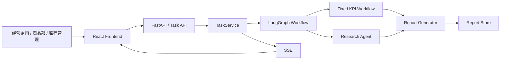

**技术说明**

TaskService 拥有外层任务生命周期，LangGraph Workflow 拥有分析状态与路由；KPI 和 Research 保持独立失败边界。

**面试讲解方式**

先说明经营会议场景，再按 User、Task API、TaskService、Workflow、KPI / Research、Report、SSE 的顺序说明。

**TL追问**

- 重点确认任务状态的唯一所有者。
- 重点确认 Research 失败不会覆盖 KPI 结果。

**Production扩展方向**

以 PostgreSQL 作为事实来源，Redis 保存热状态，RabbitMQ 分发任务，OpenTelemetry 贯穿全链路。

## 2. User to API Flow

**业务目的**

让业务用户提交分析任务后立即得到受理结果，并持续获知执行状态。

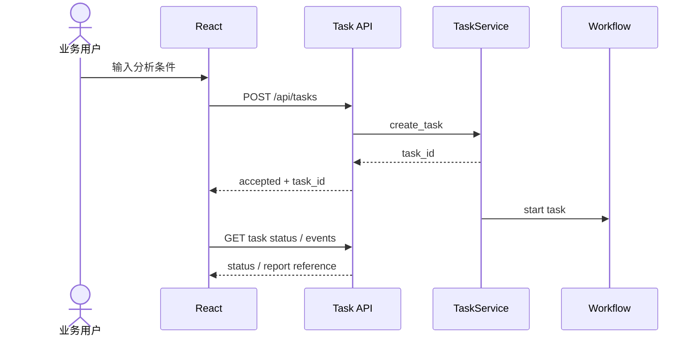

**技术说明**

HTTP 请求只负责受理，长时间分析不占用同步响应；task_id 是状态、事件、报告和日志的关联键。

**面试讲解方式**

强调“accepted 不等于 completed”，用户拿到 task_id 后通过 SSE 或状态 API 继续确认。

**TL追问**

- 重点确认重复提交与幂等范围。
- 重点确认输入校验失败时不创建任务。

**Production扩展方向**

增加 SSO、Rate Limit、API Gateway、请求幂等键和统一错误合同。

## 3. Task API Architecture

**业务目的**

为创建任务、查询状态、订阅事件和读取报告提供稳定边界。

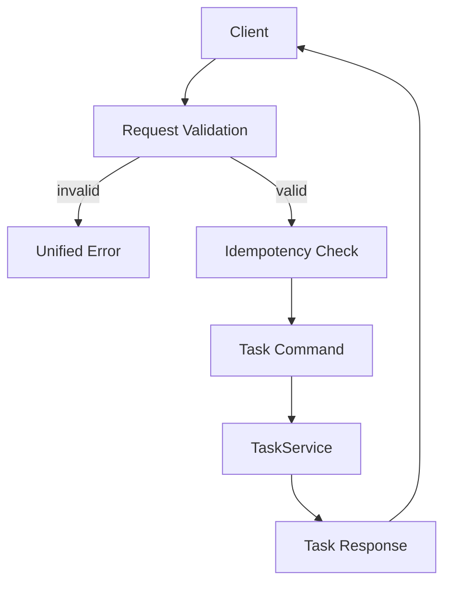

**技术说明**

API 层只处理认证上下文、Schema 校验、幂等检查、Service 调用和响应转换，不直接执行 Workflow 或访问 SQL。

**面试讲解方式**

用“HTTP 边界”和“业务用例边界”说明 API 与 TaskService 的分工。

**TL追问**

- 重点确认错误码、request_id 和 task_id 的一致性。
- 重点确认状态查询和报告读取的权限校验。

**Production扩展方向**

引入 SSO、API Gateway、请求限流、版本管理和契约测试。

## 4. TaskService Architecture

**业务目的**

统一管理任务从创建到完成或失败的生命周期。

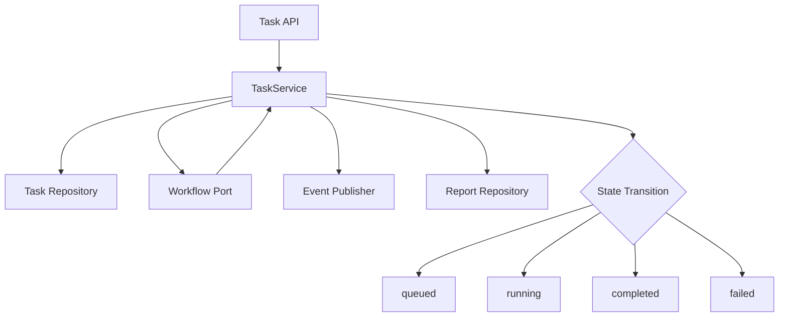

**技术说明**

TaskService 只协调状态、Workflow、事件和结果，不包含 KPI 算法、Research Prompt 或报告模板。

**面试讲解方式**

说明它是 use case 层，不是通用“大 Service”；状态迁移由单一入口控制。

**TL追问**

- 重点确认终态不可被普通流程覆盖。
- 重点确认重试不会重复保存报告或发送完成事件。

**Production扩展方向**

将 Workflow 启动改为 RabbitMQ 投递，任务事实迁移 PostgreSQL，热状态同步 Redis。

## 5. LangGraph Workflow

**业务目的**

显式表达经营分析的状态、节点、条件路由、失败位置和终止路径。

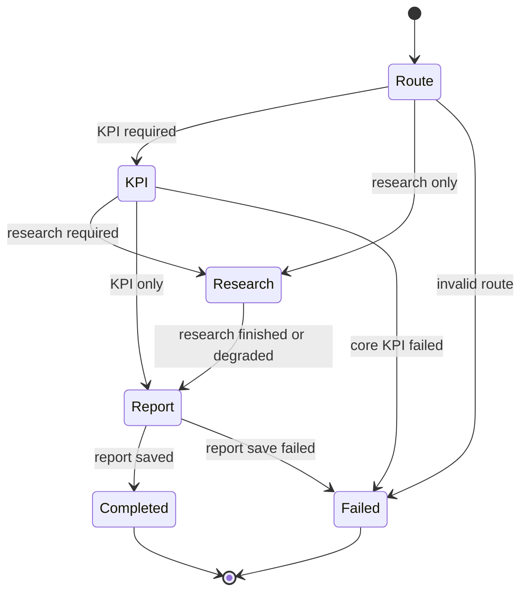

**技术说明**

State 只保存路由和后续 Node 所需的结构化结果；Node 返回局部更新，Edge 明确所有分支与终止条件。

**面试讲解方式**

按 State、Node、Edge、Checkpoint 四个词说明为什么普通串行函数不足。

**TL追问**

- 重点确认未知路由不会停留在 running。
- 重点确认副作用 Node 的幂等性和 checkpoint 版本。

**Production扩展方向**

增加持久化 checkpoint、interrupt / resume、Node 级 retry、人工审批和 State Schema 版本治理。

## 6. Fixed KPI Workflow

**业务目的**

保证销售、库存、商品、会员和促销 KPI 的口径稳定、可复算、可审计。

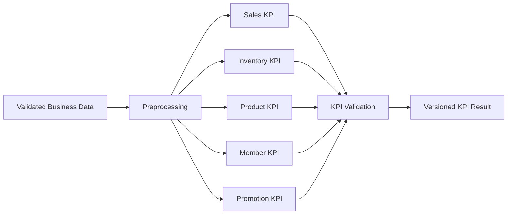

**技术说明**

KPI 结果携带计算规则版本、数据期间和来源版本；LLM 只解释结果，不参与数值计算。

**面试讲解方式**

突出“同一输入、同一版本、同一结果”，说明为什么 KPI 不交给 Agent。

**TL追问**

- 重点确认缺失值、舍入、期间和过滤条件。
- 重点确认口径变更的影响调查与历史兼容。

**Production扩展方向**

建立 KPI Registry、审批流程、回归基线和历史报告重算策略。

## 7. Research Agent Workflow

**业务目的**

为管理层报告补充市场趋势、竞品信息和内部资料证据。

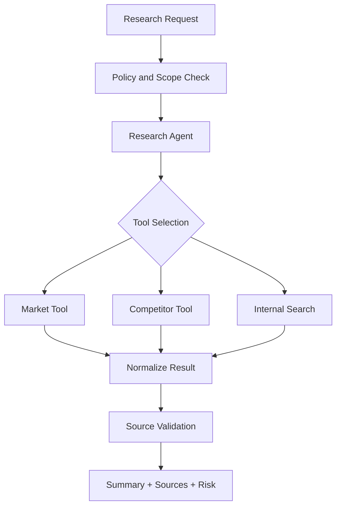

**技术说明**

Agent 受到 Tool allowlist、权限范围、调用次数和总 timeout 约束，输出必须包含来源、更新时间、摘要和风险。

**面试讲解方式**

说明 Research 的灵活性来自信息源变化，而不是让 Agent 接管核心业务规则。

**TL追问**

- 重点确认 timeout 后的降级报告。
- 重点确认内部资料的 ACL 和 Prompt Injection 防护。

**Production扩展方向**

增加检索质量评价、Research 缓存、Model Router、工具健康状态和人工确认门槛。

## 8. RAG Architecture

**业务目的**

让 Research Agent 基于可授权、可更新、可引用的内部资料回答。

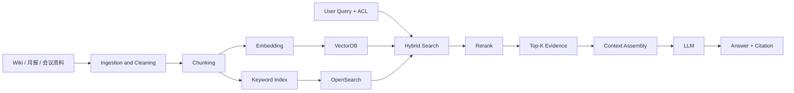

**技术说明**

查询携带用户权限；Hybrid Search 结合关键词精确性与语义召回，Rerank 后再组装带引用的 Context。

**面试讲解方式**

按资料接入、Chunk、索引、ACL、Hybrid Search、Rerank、Context、答案引用说明完整链路。

**TL追问**

- 重点确认文档更新、删除和权限变更如何反映到索引。
- 重点确认检索命中率与答案 groundedness 的评价基线。

**Production扩展方向**

增加增量索引、去重、Query Rewrite、Context 压缩、检索评价和反馈回流。

## 9. SSE Architecture

**业务目的**

让用户实时看到任务进度，同时保证连接中断不影响后台任务。

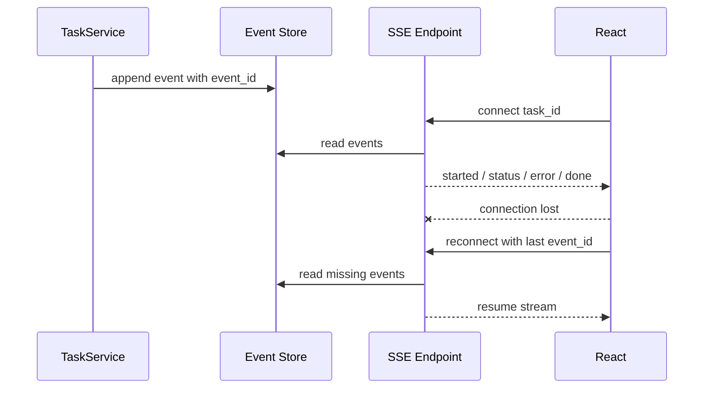

**技术说明**

SSE 是通知通道，最终状态保存在任务库；done 只代表成功，error 代表失败终止。

**面试讲解方式**

强调单向通信、连接与任务解耦、event_id 重连和状态 API 兜底。

**TL追问**

- 重点确认多实例下事件顺序和重复消费。
- 重点确认代理缓冲、heartbeat 和连接上限。

**Production扩展方向**

Redis 保存短期事件，SSE 服务独立扩展，增加 heartbeat、backpressure 和重连上限。

## 10. Report Generator Flow

**业务目的**

把结构化 KPI 和有来源的 Research 结果合成为可审查的日文经营报告。

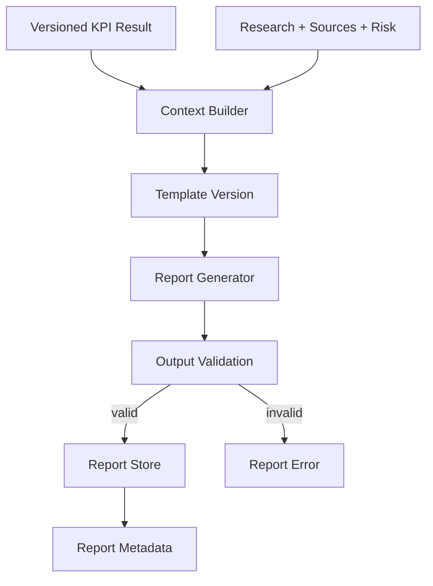

**技术说明**

生成输入是结构化快照，输出校验必填章节、KPI 引用、来源和版本；Generator 不直接查询业务数据库。

**面试讲解方式**

说明报告不是自由文本，而是带数据版本、Prompt / Template 版本和来源的交付物。

**TL追问**

- 重点确认报告失败能否只重跑生成阶段。
- 重点确认模型输出不会改写 KPI 数值。

**Production扩展方向**

引入 Report Template Engine、Prompt Registry、审批流程和报告质量评价。

## 11. PostgreSQL Architecture

**业务目的**

为多用户、多实例环境提供一致、可恢复、可审计的数据事实来源。

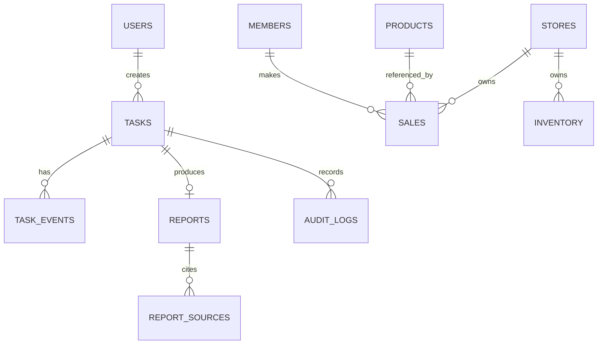

**技术说明**

业务表与任务、报告、审计表分域；Repository 隐藏存储实现，事务保护状态与结果的一致性。

**面试讲解方式**

说明 SQLite 是当前阶段选择，PostgreSQL 是企业运用的数据事实来源，而不是简单替换连接字符串。

**TL追问**

- 重点确认 tenant、department、store scope 的索引和过滤。
- 重点确认迁移校验、备份、恢复和 rollback。

**Production扩展方向**

增加读写容量评估、连接池、分区策略、备份演练和灾害恢复。

## 12. Redis Architecture

**业务目的**

承接高频任务状态、SSE 事件和可重建缓存，降低主数据库读取压力。

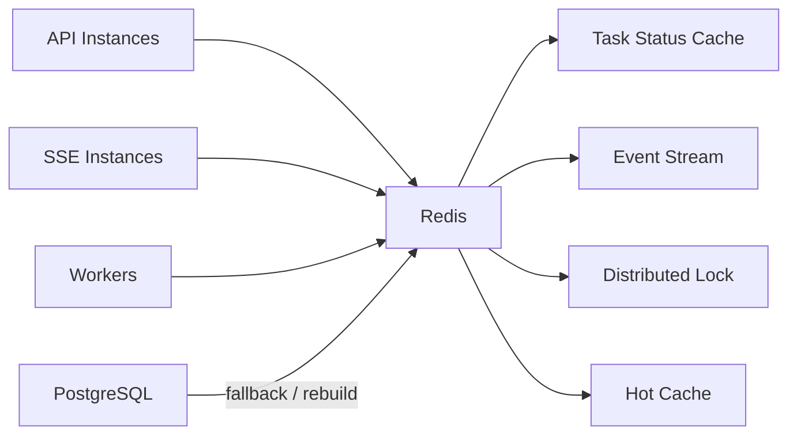

**技术说明**

Redis 不保存唯一业务事实；缓存失效时从 PostgreSQL 回退，所有 key 定义 TTL 和数据归属。

**面试讲解方式**

用“热状态与事实来源分离”说明 Redis 和 PostgreSQL 的边界。

**TL追问**

- 重点确认 Redis 故障时任务事实是否仍可恢复。
- 重点确认分布式锁过期和缓存不一致。

**Production扩展方向**

增加高可用、内存容量告警、event_id 保留策略和缓存重建流程。

## 13. RabbitMQ Architecture

**业务目的**

隔离 API 受理与后台执行，为任务突增提供排队、背压和失败隔离。

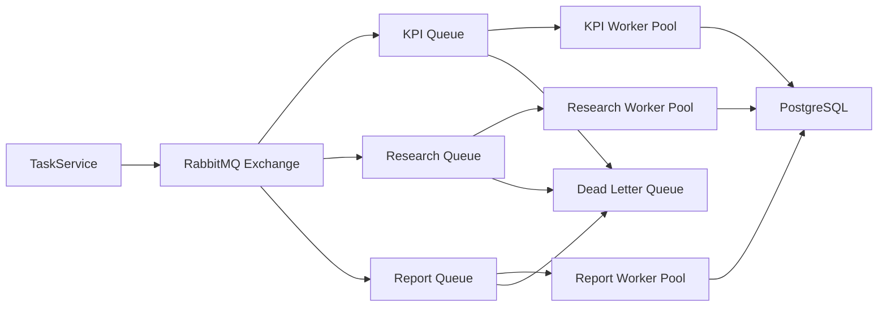

**技术说明**

不同工作负载独立扩展；消费端必须幂等，重试按错误类型限制，超过上限进入 DLQ。

**面试讲解方式**

说明 Queue 解决削峰与解耦，但不替代 Workflow State 和失败治理。

**TL追问**

- 重点确认消息重复、顺序、重放和 poison message。
- 重点确认队列积压时的限流与业务优先级。

**Production扩展方向**

增加 queue latency 告警、消费者自动扩展、DLQ 处置流程和任务取消协议。

## 14. RBAC Architecture

**业务目的**

确保经营层、经营企画、商品部、库存管理和门店人员只能访问授权数据与操作。

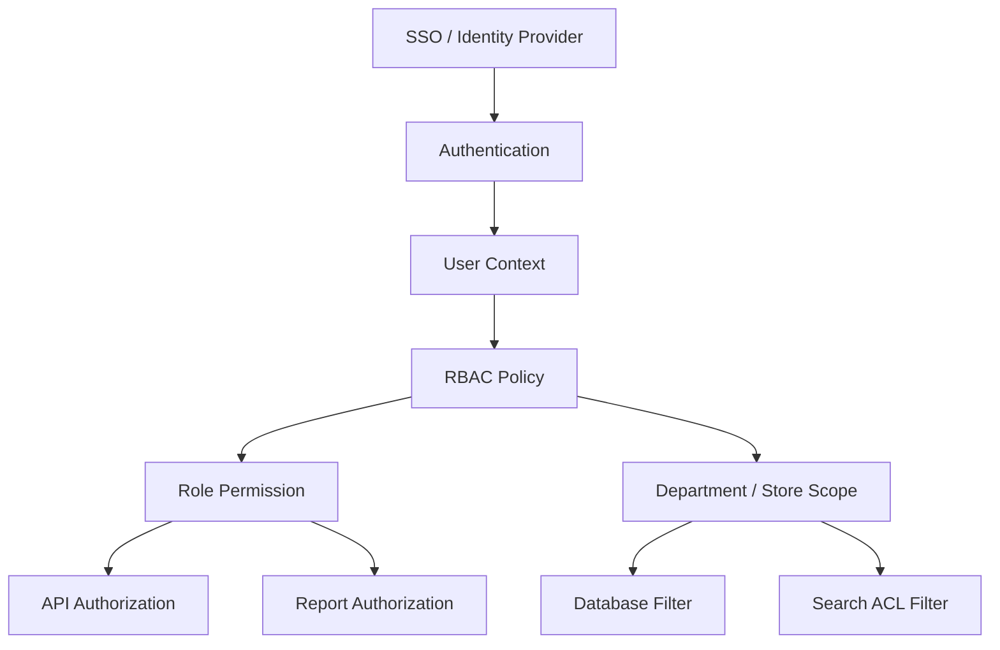

**技术说明**

授权同时检查角色与数据范围，并在 API、Service、数据库、检索和报告读取边界执行；默认拒绝。

**面试讲解方式**

说明前端隐藏按钮不是权限控制，服务端全链路校验才是安全边界。

**TL追问**

- 重点确认组织变更与历史任务权限快照。
- 重点确认管理权限与业务数据权限分离。

**Production扩展方向**

增加权限矩阵审批、定期复核、拒绝事件监控和多租户隔离。

## 15. Audit Log Architecture

**业务目的**

为任务、数据访问、Tool 调用、报告生成和权限变更提供不可抵赖的追踪记录。

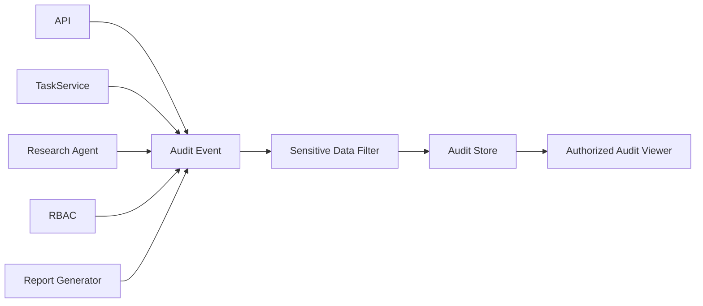

**技术说明**

审计事件记录 user_id、task_id、操作、对象、结果、时间和 trace_id，不复制 Prompt 全文、会员数据或 Secret。

**面试讲解方式**

区分业务审计与调试日志：前者服务追责与合规，后者服务障害调查。

**TL追问**

- 重点确认访问权限、保留期限和完整性保护。
- 重点确认审计写入失败是否阻止高风险操作。

**Production扩展方向**

增加追加写入、归档、完整性校验、审计查询和异常访问告警。

## 16. OpenTelemetry Architecture

**业务目的**

跨 API、异步任务、Workflow Node、Tool 和数据库定位延迟与失败。

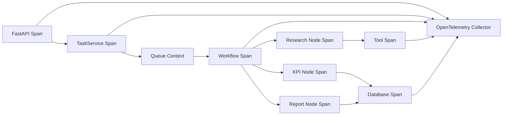

**技术说明**

trace context 与 task_id 一起跨异步边界传递；日志、Metrics、Trace 关联，但不采集敏感业务正文。

**面试讲解方式**

从一次 task_id 如何追到 Node、Tool、DB 和报告说明可观测性价值。

**TL追问**

- 重点确认异步 context propagation。
- 重点确认采样、成本、敏感字段和告警责任人。

**Production扩展方向**

建设 Collector 高可用、Dashboard、SLO、告警、成本指标和 Incident Runbook。

## 17. Docker Deployment

**业务目的**

统一开发、测试、Review 和部署准备环境，保证构建可重复。

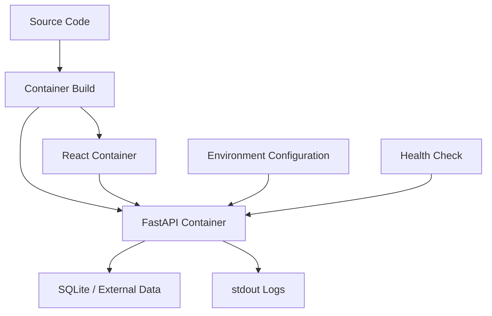

**技术说明**

配置与 Secret 不进入镜像；容器以非 root 运行，health check、标准输出日志和镜像扫描纳入发布要求。

**面试讲解方式**

说明 Docker 解决环境一致性，不自动等于高可用或完成 Kubernetes 运用。

**TL追问**

- 重点确认镜像版本、依赖漏洞和 Secret 管理。
- 重点确认 graceful shutdown 与在途任务处理。

**Production扩展方向**

接入 CI/CD、镜像签名、SBOM、集中日志和容器资源限制。

## 18. Kubernetes Deployment

**业务目的**

按 API、SSE、KPI、Research、Report 的不同负载独立扩展并支持滚动发布。

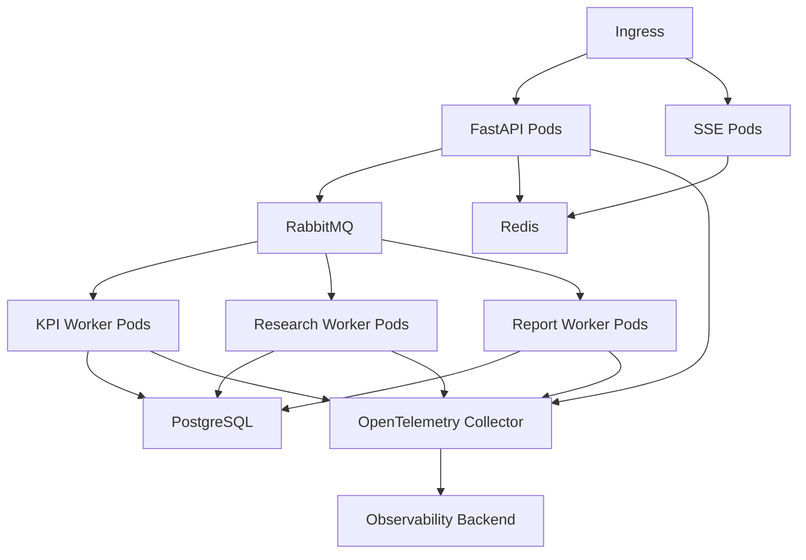

**技术说明**

部署单元按扩展特性划分，不把每个 Agent 机械拆成服务；readiness、资源限制和 Pod 终止流程保护在途任务。

**面试讲解方式**

说明 Kubernetes 解决部署与伸缩，不能替代幂等、数据库优化或队列治理。

**TL追问**

- 重点确认 rolling update 下的 State / checkpoint 兼容。
- 重点确认 SSE 连接排空和 Worker graceful shutdown。

**Production扩展方向**

增加 HPA、PodDisruptionBudget、Secrets 管理、Canary、灾害恢复和多环境隔离。

## 19. Multi Agent Architecture

**业务目的**

当市场、竞品和内部资料调查在权限、上下文和扩展特性上明显分离时，独立治理各类 Research。

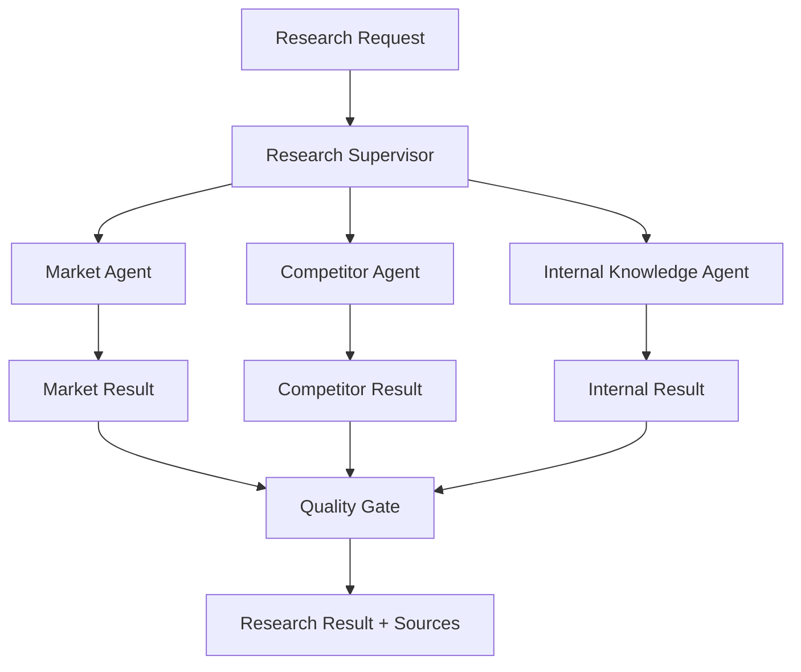

**技术说明**

Supervisor 只分派与汇总；各 Agent 拥有独立 Tool、权限、预算和终止条件。Fixed KPI Workflow 不进入 Agent 协商。

**面试讲解方式**

先说明当前单一 Research Agent 足够，再说明何时因职责、权限或扩展需求升级 Multi Agent。

**TL追问**

- 重点确认 Agent 数量是否有业务必要性。
- 重点确认消息协议、冲突处理、预算和终止保护。

**Production扩展方向**

增加 Agent 级评价、并行执行、预算控制、结果仲裁和人工质量门禁。

## 20. Enterprise Architecture

**业务目的**

形成支持多部门、多门店、可审计、可恢复、可扩展的企业级经营分析平台。

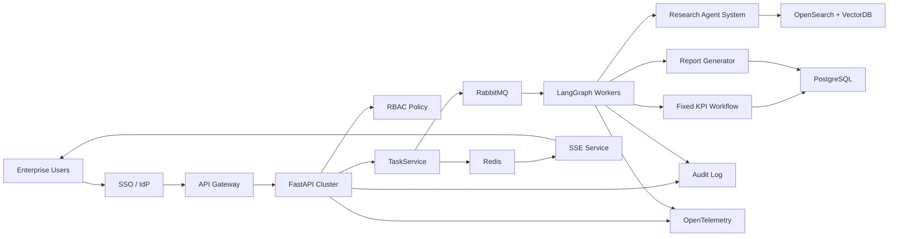

**技术说明**

身份、授权、任务、Workflow、检索、持久化、事件、审计和可观测性各有明确所有者；所有跨层调用通过稳定契约完成。

**面试讲解方式**

按信任边界和数据流说明企业化：谁访问、谁授权、谁执行、数据存哪里、失败如何追踪和恢复。

**TL追问**

- 重点确认高可用不建立在单一 Redis、Queue 或数据库节点上。
- 重点确认多租户隔离、SLO、成本、备份和灾害恢复责任。

**Production扩展方向**

分阶段完成 SSO / RBAC、PostgreSQL、Redis / RabbitMQ、OpenTelemetry、Kubernetes、多租户和 SaaS 治理。
