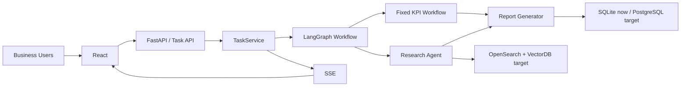

# 09_系统设计书

# 目录

- [1. 项目概要](#1-项目概要)
- [2. 系统目标](#2-系统目标)
- [3. 业务背景](#3-业务背景)
- [4. 用户角色](#4-用户角色)
- [5. 功能列表](#5-功能列表)
- [6. 非功能需求](#6-非功能需求)
- [7. 系统架构](#7-系统架构)
- [8. API设计](#8-api设计)
- [9. DB设计](#9-db设计)
- [10. LangGraph设计](#10-langgraph设计)
- [11. Agent设计](#11-agent设计)
- [12. RAG设计](#12-rag设计)
- [13. 权限设计](#13-权限设计)
- [14. 审计设计](#14-审计设计)
- [15. 日志设计](#15-日志设计)
- [16. 监控设计](#16-监控设计)
- [17. 容灾设计](#17-容灾设计)
- [18. 部署设计](#18-部署设计)
- [19. 运维设计](#19-运维设计)
- [20. Production Gap](#20-production-gap)

本文是 Retail Insight AI（小売業向け AI 経営分析システム）的基本设计书。当前能力与企业目标以 `PROJECT_BIBLE.md` 为准；未落地能力明确标记为 Production Gap。

## 1. 项目概要

| 项目 | 内容 |
| --- | --- |
| 系统名称 | Retail Insight AI |
| 日文名称 | 小売業向け AI 経営分析システム |
| 客户类型 | 日本中大型零售企业 |
| 主要用户 | 经营层、经营企画、商品部、库存管理、会员运营、门店负责人、IT 部门 |
| 主要输入 | POS、库存、商品、会员、销售、门店、CSV、Excel、API、日报、月报 |
| 主要输出 | KPI、异常提示、市场与竞品调查结果、日文经营分析报告 |
| 当前实现 | FastAPI、TaskService、LangGraph Workflow、Fixed KPI Workflow、Research Agent、SSE、Report Generator、SQLite、Docker |
| 企业目标 | PostgreSQL、Redis、RabbitMQ、SSO、RBAC、Audit Log、OpenTelemetry、Kubernetes |

系统范围从分析任务受理开始，到报告保存、进度通知和结果读取结束。上游 POS 与业务系统的源数据生成、管理层的最终经营决策不属于本系统责任。

## 2. 系统目标

| ID | 目标 | 验收观点 |
| --- | --- | --- |
| OBJ-01 | 缩短经营会议前的数据整理与报告制作时间 | 任务可从统一入口发起并自动生成报告 |
| OBJ-02 | 固定 KPI 计算口径 | 同一数据版本与规则版本可复算 |
| OBJ-03 | 为市场与竞品结论保留证据 | Research 输出包含来源与更新时间 |
| OBJ-04 | 让长时间任务可观察 | 可查询任务状态并通过 SSE 接收进度 |
| OBJ-05 | 支持障害调查与影响分析 | request_id、task_id、trace_id 可关联 |
| OBJ-06 | 为企业运用建立权限与审计基础 | RBAC 与 Audit Log 在正式开放前完成 |

不以“增加 Agent 数量”作为目标。Agent 只用于调查路径不确定、且能够被权限与 Tool 边界约束的任务。

## 3. 业务背景

日本零售企业在固定经营会议前，需要跨部门收集销售、库存、商品、会员、促销、市场与竞品信息。当前业务面临以下问题：

- 数据来源分散，CSV、Excel、API 和内部资料格式不统一。
- KPI 计算口径可能随担当者变化，历史报告难以复算。
- 市场与竞品信息缺少统一来源记录。
- 报告制作耗时，任务执行状态不可见。
- 部门和门店权限不同，报告与内部资料存在访问边界。

目标业务流程：

```text
数据接入与校验
→ Fixed KPI Workflow
→ Research Agent
→ Report Generator
→ 管理层 Review
→ 改善行动
```

## 4. 用户角色

| 角色 | 主要操作 | 数据范围 | 高风险操作 |
| --- | --- | --- | --- |
| 经营层 | 查看全社 KPI 与管理层报告 | 经授权的全社范围 | 报告批准 |
| 经营企画 | 创建分析任务、查看综合报告 | 经授权的部门与门店 | 报告再生成 |
| 商品部 | 查看商品、毛利、促销分析 | 商品与负责区域 | 商品资料 Research |
| 库存管理 | 查看欠品、过剩、周转分析 | 仓库与门店范围 | 库存规则确认 |
| 会员运营 | 查看会员与促销响应 | 经脱敏的会员范围 | 会员数据导出 |
| 门店负责人 | 查看本店结果 | 自门店 | 无跨店访问 |
| 数据分析担当 | 数据导入、口径确认 | 经授权的数据集 | 数据版本发布 |
| IT 运维 | 配置、监控、障害対応 | 系统元数据 | 运维操作 |
| 审计担当 | 查询 Audit Log | 审计数据 | 审计导出 |

角色不能直接等同数据范围；授权结果必须同时包含 role 与 department / store scope。

## 5. 功能列表

| ID | 功能 | 说明 | 当前状态 |
| --- | --- | --- | --- |
| F-01 | 创建分析任务 | 校验输入并返回 task_id | 已实现 |
| F-02 | 查询任务状态 | 返回 queued / running / completed / failed | 已实现 |
| F-03 | 订阅任务事件 | SSE 推送 started / status / error / done | 已实现 |
| F-04 | Fixed KPI 分析 | 销售、库存、商品、会员、促销 KPI | 已实现 |
| F-05 | Research | 市场、竞品、内部资料调查 | 已实现 |
| F-06 | 报告生成 | 合并 KPI、Research、来源与风险 | 已实现 |
| F-07 | 报告保存与读取 | 按 task_id 保存和读取 | 已实现 |
| F-08 | 数据导入校验 | CSV / Excel Schema 与业务规则校验 | 已实现边界 |
| F-09 | SSO | 对接客户统一身份 | Production Gap |
| F-10 | RBAC | 角色与数据范围授权 | Production Gap |
| F-11 | Audit Log | 记录关键操作与结果 | Production Gap |
| F-12 | 分布式任务执行 | RabbitMQ 与 Worker Pool | Production Gap |
| F-13 | 企业检索 | OpenSearch + VectorDB + ACL | Production Gap |
| F-14 | 人工审批 | 报告批准、退回与恢复 | Production Gap |

## 6. 非功能需求

| 分类 | 设计要求 | 确认方式 |
| --- | --- | --- |
| 可用性 | API、任务执行、SSE、数据层分别定义健康状态 | Health Check 与障害演练 |
| 性能 | 分别测量受理延迟、队列等待、Node 延迟、完成时间 | Load Test 与 Trace |
| 扩展性 | API、SSE、KPI、Research、Report 可独立扩展 | Worker 与部署单元评审 |
| 安全性 | SSO、RBAC、Secret 外部化、默认拒绝 | 权限测试与安全 Review |
| 可追踪性 | request_id、task_id、trace_id 全链路关联 | 日志与 OpenTelemetry |
| 审计性 | 关键操作不可遗漏，敏感正文不进入审计 | Audit Log Review |
| 可恢复性 | 数据备份、checkpoint、重试与 rollback | Restore Test |
| 可维护性 | 层次与依赖方向固定，契约可测试 | Architecture Test |
| 数据质量 | 来源、版本、期间、导入结果可追踪 | 数据校验报告 |
| AI 质量 | 来源正确、输出结构稳定、失败可降级 | Offline Evaluation |

SLA、SLO、Error Budget 的具体数值由业务部门与 IT 部门在正式运用前共同确定，本设计不虚构容量或可用性数值。

## 7. 系统架构



架构规则：

- Frontend 不拥有任务事实。
- API 不包含 Workflow 和 SQL 逻辑。
- TaskService 不包含 KPI、Research、Report 内部算法。
- LangGraph Node 不直接处理 HTTP。
- Repository 是业务层访问存储的唯一边界。
- Agent 不能绕过 Tool Layer、权限和 Audit Log。

## 8. API设计

### 8.1 API 一览

| Method | Path | 用途 | 成功结果 |
| --- | --- | --- | --- |
| POST | `/api/tasks` | 创建分析任务 | task_id、accepted 状态 |
| GET | `/api/tasks/{task_id}` | 查询任务状态 | 当前状态、进度、错误摘要 |
| GET | `/api/tasks/{task_id}/events` | 订阅 SSE | 事件流 |
| GET | `/api/tasks/{task_id}/report` | 读取报告 | 报告与 metadata |
| GET | `/api/health` | 健康检查 | 组件状态 |

### 8.2 共通设计

- 请求必须包含或生成 request_id。
- 创建任务支持幂等键；幂等范围包含用户、请求参数和有效期间。
- 错误响应包含 code、message、request_id，已创建任务还包含 task_id。
- 认证与授权失败不创建任务。
- report API 在读取时重新检查权限，不只依赖任务创建时权限。
- API 版本变更遵循向后兼容，破坏性变更采用新版本路径。

## 9. DB设计

### 9.1 逻辑表

| 表 | 主键 | 主要内容 | 数据责任 |
| --- | --- | --- | --- |
| users | user_id | 用户与组织引用 | 身份关联 |
| stores | store_id | 门店主数据 | 业务主数据 |
| products | product_id | 商品、分类、价格、成本 | 业务主数据 |
| members | member_id | 会员引用与必要属性 | 受限数据 |
| sales | sale_id | 销售事实 | KPI 来源 |
| inventory | inventory_id | 库存快照 | KPI 来源 |
| tasks | task_id | 状态、参数摘要、版本 | 任务事实 |
| task_events | event_id | 状态事件 | 进度恢复 |
| reports | report_id | 报告、版本、状态 | 业务交付物 |
| report_sources | source_id | 报告引用来源 | 证据链 |
| audit_logs | audit_id | 操作、对象、结果 | 审计事实 |

### 9.2 数据规则

- 当前 SQLite / CSV 通过 Repository 访问；企业目标迁移 PostgreSQL。
- 业务数据、系统数据、审计数据分域，不共享无边界事务。
- tenant_id、department_id、store_id 作为企业扩展字段进入访问路径。
- 原始文件保存 hash、来源部门、导入时间、Schema 版本和导入结果。
- 迁移必须执行件数、金额、期间和抽样明细校验。

## 10. LangGraph设计

### 10.1 State

| 字段 | 生产者 | 消费者 | 说明 |
| --- | --- | --- | --- |
| task_id | TaskService | 全 Node | 关联任务 |
| request | API / Route | Route、KPI、Research | 结构化输入 |
| route | Route Node | Edge | 执行路径 |
| kpi_result | KPI Node | Report Node | 版本化 KPI |
| research_result | Research Node | Report Node | 摘要、来源、风险 |
| errors | 各 Node | TaskService、Report | 结构化错误 |
| report_ref | Report Node | TaskService | 报告引用 |

### 10.2 Node 与 Edge

| Node | 输入 | 输出 | 失败处理 |
| --- | --- | --- | --- |
| route | request | route | 未知输入安全失败 |
| kpi | request、数据引用 | kpi_result | 核心失败终止 |
| research | request、权限 | research_result | 可降级 |
| report | KPI、Research | report_ref | 保留中间结果后重试 |

所有 Edge 必须有终止路径；副作用 Node 在 retry 前确认幂等性。正式运用时 checkpoint 持久化到 PostgreSQL，并保存 State Schema 版本。

## 11. Agent设计

Research Agent 的责任限定为市场趋势、竞品调查与内部资料检索。

| 控制项 | 设计 |
| --- | --- |
| 输入 | 结构化问题、用户权限、数据期间、调查类型 |
| Tool | allowlist 管理，按调查类型与权限开放 |
| 输出 | summary、sources、updated_at、risk、error |
| timeout | Tool 级与 Research 总时限分离 |
| retry | 仅临时错误，次数受限 |
| 终止 | 最大 Tool 次数、总时间与预算 |
| 降级 | 保留 KPI，报告明确 Research 缺失 |
| 审计 | 记录 Tool、对象标识、结果和 trace_id |

Fixed KPI Workflow 不属于 Agent。Multi Agent 仅在职责、权限或扩展特性明确分离时启用。

## 12. RAG设计

### 12.1 数据源

- 商品政策与说明资料。
- 月次报告与会议资料。
- 促销规则与库存处理规则。
- 经授权的内部 Wiki 与 FAQ。

### 12.2 处理链

```text
资料接入
→ 清洗与去重
→ Chunk
→ Embedding + 关键词索引
→ Metadata / ACL
→ Hybrid Search
→ Rerank
→ Top-K
→ Context
→ LLM
→ 答案与引用
```

### 12.3 设计要求

- Chunk 保存 document_id、section、version、updated_at、department、store_scope。
- Query 必须携带用户权限，检索后再次验证 ACL。
- 商品代码与固有名词优先关键词检索，抽象问题组合语义检索。
- 文档更新、删除、权限变化触发增量索引。
- 评价覆盖 recall@k、MRR、引用正确性、groundedness、延迟和无结果率。

## 13. 权限设计

### 13.1 授权模型

```text
可信身份
× Role Permission
× Tenant / Department / Store Scope
× Resource State
= Authorization Decision
```

### 13.2 权限点

| 资源 | 操作 | 校验位置 |
| --- | --- | --- |
| Task | create、read、cancel、retry | API + TaskService |
| Business Data | read、import | Service + Repository |
| Research Source | search、read | Tool Layer + Search Filter |
| Report | read、regenerate、approve | API + Report Service |
| Configuration | change | Admin Service |
| Audit Log | query、export | Audit Service |

权限默认拒绝。前端显示控制不构成安全边界。权限变更和拒绝访问进入 Audit Log。

## 14. 审计设计

### 14.1 审计事件

| 事件 | 必须字段 |
| --- | --- |
| task.created | user_id、task_id、request_id、result |
| data.imported | source_id、schema_version、result |
| tool.called | task_id、tool_id、resource_ref、result |
| report.generated | report_id、task_id、versions、result |
| report.viewed | user_id、report_id、scope、result |
| permission.changed | actor、target、before、after |
| access.denied | user_id、resource_ref、reason |

### 14.2 审计规则

- 不记录 Secret、完整 Prompt、会员原文或报告全文。
- 审计写入使用追加模式，访问权限独立于应用日志。
- 保留期限由客户合规要求确定。
- 高风险操作的审计写入失败时，操作默认失败关闭。

## 15. 日志设计

结构化日志共通字段：

| 字段 | 说明 |
| --- | --- |
| timestamp | 事件时间 |
| level | DEBUG / INFO / WARN / ERROR |
| service | API、Worker、SSE 等 |
| environment | dev / test / production |
| request_id | 请求关联 |
| task_id | 任务关联 |
| trace_id | Trace 关联 |
| user_id | 经脱敏的操作者标识 |
| workflow_node | Node 名称 |
| event | 事件类型 |
| duration_ms | 处理时间 |
| error_code | 结构化错误 |

禁止把 API Key、Token、会员数据、完整 Prompt 与内部资料正文写入日志。日志、Audit Log、业务数据的用途和权限必须分离。

## 16. 监控设计

| 层 | 指标 | 主要告警 |
| --- | --- | --- |
| API | 请求数、延迟、错误率、限流数 | 错误率与延迟异常 |
| Task | queued、running、failed、完成时间 | 长时间 running、失败突增 |
| Queue | depth、oldest age、consume rate | 积压与消费者停止 |
| Workflow | Node 延迟、retry、fallback | 特定 Node 异常 |
| Research | Tool 成功率、timeout、成本 | 外部依赖异常 |
| SSE | 连接数、断线、重连 | 重连失败与连接异常 |
| DB | 连接、慢查询、锁、存储 | 连接耗尽与慢查询 |
| RAG | 无结果率、recall、引用正确性 | 检索质量下降 |
| Report | 成功率、验证失败、生成时间 | 报告失败突增 |

OpenTelemetry 负责 Trace、Metrics、Logs 关联；告警必须指定 Owner、严重度、初步操作和升级路径。

## 17. 容灾设计

### 17.1 故障边界

| 故障 | 业务影响 | 恢复策略 |
| --- | --- | --- |
| API 实例故障 | 新请求受影响 | 多实例摘除故障节点 |
| SSE 连接中断 | 进度暂不可见 | 重连与状态 API 兜底 |
| Worker 故障 | 在途任务中断 | checkpoint + Queue 重投 |
| Redis 故障 | 热状态与事件不可用 | PostgreSQL 回退与缓存重建 |
| RabbitMQ 故障 | 新任务不能分发 | 恢复 Queue 后继续消费 |
| PostgreSQL 故障 | 任务事实与报告不可用 | 备份恢复或高可用切换 |
| Research Tool 故障 | 外部调查缺失 | Circuit Breaker + 降级报告 |
| 模型故障 | Research / Report 失败 | 受控 fallback 或等待恢复 |

### 17.2 恢复要求

- RPO、RTO 由业务影响与客户运维标准确定。
- 备份完成不代表可恢复，必须执行 restore test。
- 恢复后核对任务终态、报告版本、审计连续性和重复执行。
- 灾害恢复手册记录判断人、执行人、沟通路径和恢复确认。

## 18. 部署设计

### 18.1 环境

| 环境 | 目的 | 数据 |
| --- | --- | --- |
| Development | 开发与单体确认 | 合成数据 |
| Test | 结合测试与性能基线 | 脱敏测试数据 |
| Staging | 发布前验证与恢复演练 | 生产相似数据 |
| Production | 正式业务 | 受控生产数据 |

### 18.2 部署单元

- Frontend。
- FastAPI API。
- SSE Service。
- KPI Worker。
- Research Worker。
- Report Worker。
- OpenTelemetry Collector。

当前以 Docker 保证环境一致性。企业目标部署 Kubernetes 或客户标准容器平台；发布前验证 DB Migration、State / Checkpoint 兼容和 rollback。

## 19. 运维设计

### 19.1 日常运维

- 确认任务失败率、队列等待、SSE 连接和报告成功率。
- 确认数据导入批次、Schema 变化和索引更新。
- 确认权限变更、拒绝访问和 Audit Log 异常。
- 确认模型、Tool、数据库、Redis、RabbitMQ 健康状态。
- 确认 Token / 成本趋势与容量余量。

### 19.2 障害対応

```text
影响确认
→ 止血与业务沟通
→ request_id / task_id / trace_id 调查
→ 恢复
→ 根因分析
→ 恒久对应
→ 再发防止与 Runbook 更新
```

### 19.3 变更管理

KPI、Prompt、Template、Workflow State、DB Schema、权限和部署配置全部版本化。高风险变更必须包含影响调查、测试证据、批准与 rollback 条件。

## 20. Production Gap

| 优先级 | 项目 | 当前 | 完成条件 |
| --- | --- | --- | --- |
| P0 | SSO | 身份上下文边界 | IdP 接入、停用与故障验证 |
| P0 | RBAC | 权限模型设计 | 全链路服务端校验与回归测试 |
| P0 | Audit Log | 字段与事件设计 | 独立存储、权限、保留策略 |
| P0 | PostgreSQL | SQLite / CSV | 迁移、校验、备份、恢复 |
| P0 | OpenTelemetry | 关联 ID 与观测点 | Collector、Dashboard、Alert |
| P0 | Backup / Restore | 需求识别 | 首次恢复演练通过 |
| P0 | Rollback | 人工切回思路 | 应用、DB、State 联合演练 |
| P1 | Redis | 使用边界设计 | 多实例状态与事件恢复 |
| P1 | RabbitMQ | 队列设计 | 幂等、retry、DLQ、积压告警 |
| P1 | Load Test | 测量项定义 | 容量基线与瓶颈报告 |
| P1 | OpenSearch / VectorDB | 检索设计 | ACL、更新、离线评价 |
| P1 | CI/CD | 质量门禁设计 | 自动构建、验证、发布与回滚 |
| P1 | Kubernetes | 部署设计 | 伸缩、滚动发布、恢复验证 |
| P2 | Multi Tenant | 隔离点设计 | tenant 全链路隔离测试 |
| P2 | Multi Agent | 未来边界 | 角色价值与评价证据成立 |

Production Gap 关闭标准不是“组件已安装”，而是业务验收、测试证据、监控、Runbook、权限和恢复路径全部可用。
