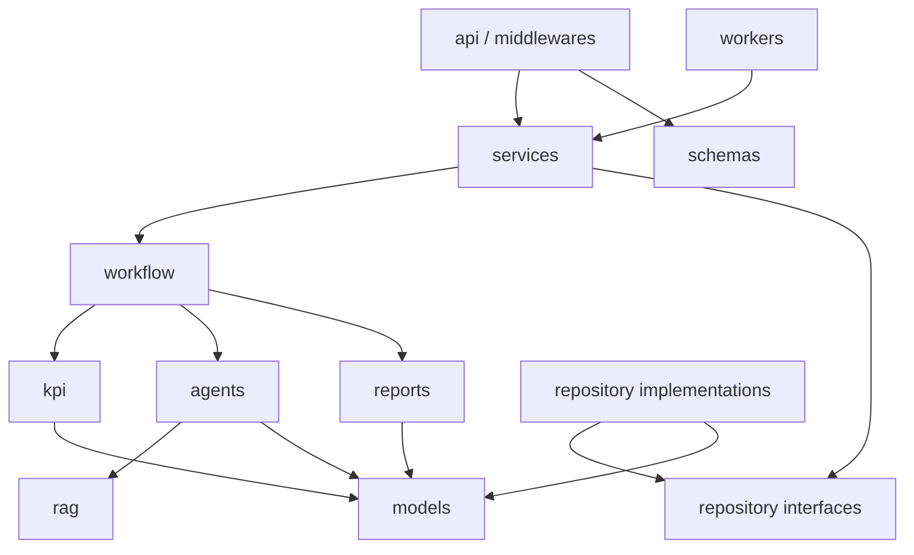

# 11_Project_Structure

# 目录

- [1. 设计目标](#1-设计目标)
- [2. 顶层目录](#2-顶层目录)
- [3. Backend 目录](#3-backend-目录)
- [4. Frontend 目录](#4-frontend-目录)
- [5. Infra 目录](#5-infra-目录)
- [6. Docs 目录](#6-docs-目录)
- [7. 模块职责](#7-模块职责)
- [8. 依赖方向](#8-依赖方向)
- [9. 允许调用](#9-允许调用)
- [10. 禁止调用](#10-禁止调用)
- [11. 运行时流程](#11-运行时流程)
- [12. State 与数据所有权](#12-state-与数据所有权)
- [13. 测试结构](#13-测试结构)
- [14. 部署单元映射](#14-部署单元映射)
- [15. 架构守护规则](#15-架构守护规则)

## 1. 设计目标

本目录结构面向 Retail Insight AI 的企业化实现，目标如下：

- 业务规则不依赖 HTTP、数据库实现或部署平台。
- TaskService 与 LangGraph Workflow 职责分离。
- Fixed KPI Workflow 与 Research Agent 保持独立边界。
- Agent 只能通过受控 Tool / Service 访问外部能力。
- Repository 隐藏 SQLite、PostgreSQL、Redis、OpenSearch 和 VectorDB 的实现差异。
- API、Worker、SSE 可作为独立部署单元扩展，但不为每个类创建服务。
- 目录结构能够映射基本设计、详细设计、测试和运维责任。

## 2. 顶层目录

```text
retail-insight-ai/
├── backend/
├── frontend/
├── infra/
├── docs/
├── pyproject.toml
├── package.json
├── docker-compose.yml
└── README.md
```

| 目录 | 责任 | 不负责 |
| --- | --- | --- |
| backend | API、任务、Workflow、KPI、Research、Report、数据访问 | 页面展示、云资源定义 |
| frontend | 任务提交、进度展示、报告阅读、错误处理 | 任务事实、权限最终判定 |
| infra | 容器、云资源、部署、观测配置 | 业务规则、Prompt、KPI 公式 |
| docs | 设计、ADR、API、DB、运维、测试证据 | 运行时代码 |

## 3. Backend 目录

```text
backend/
├── app/
│   ├── main.py
│   ├── api/
│   │   ├── dependencies/
│   │   ├── routes/
│   │   │   ├── tasks.py
│   │   │   ├── streams.py
│   │   │   ├── reports.py
│   │   │   └── health.py
│   │   └── error_handlers.py
│   ├── services/
│   │   ├── task_service.py
│   │   ├── report_service.py
│   │   ├── authorization_service.py
│   │   └── import_service.py
│   ├── workflow/
│   │   ├── graph.py
│   │   ├── state.py
│   │   ├── routing.py
│   │   ├── checkpoint.py
│   │   └── nodes/
│   │       ├── route_node.py
│   │       ├── kpi_node.py
│   │       ├── research_node.py
│   │       └── report_node.py
│   ├── kpi/
│   │   ├── workflow.py
│   │   ├── definitions.py
│   │   ├── sales.py
│   │   ├── inventory.py
│   │   ├── product.py
│   │   ├── member.py
│   │   └── promotion.py
│   ├── agents/
│   │   ├── research_agent.py
│   │   ├── policies.py
│   │   ├── prompts.py
│   │   └── tools/
│   │       ├── market_tool.py
│   │       ├── competitor_tool.py
│   │       └── internal_search_tool.py
│   ├── rag/
│   │   ├── ingestion.py
│   │   ├── chunking.py
│   │   ├── retriever.py
│   │   ├── reranker.py
│   │   ├── context_builder.py
│   │   └── evaluation.py
│   ├── reports/
│   │   ├── generator.py
│   │   ├── context.py
│   │   ├── validators.py
│   │   └── templates/
│   ├── repositories/
│   │   ├── interfaces/
│   │   │   ├── task_repository.py
│   │   │   ├── business_repository.py
│   │   │   ├── report_repository.py
│   │   │   └── audit_repository.py
│   │   └── implementations/
│   │       ├── sqlite/
│   │       ├── postgres/
│   │       ├── redis/
│   │       └── search/
│   ├── models/
│   │   ├── task.py
│   │   ├── kpi.py
│   │   ├── research.py
│   │   ├── report.py
│   │   └── authorization.py
│   ├── schemas/
│   │   ├── task_api.py
│   │   ├── report_api.py
│   │   ├── events.py
│   │   └── errors.py
│   ├── events/
│   │   ├── publisher.py
│   │   ├── consumer.py
│   │   ├── task_events.py
│   │   └── sse_store.py
│   ├── middlewares/
│   │   ├── request_context.py
│   │   ├── authentication.py
│   │   ├── authorization.py
│   │   └── access_log.py
│   ├── observability/
│   │   ├── logging.py
│   │   ├── tracing.py
│   │   └── metrics.py
│   ├── config/
│   │   ├── settings.py
│   │   └── providers.py
│   └── workers/
│       ├── kpi_worker.py
│       ├── research_worker.py
│       └── report_worker.py
└── tests/
    ├── unit/
    ├── integration/
    ├── contract/
    ├── architecture/
    ├── security/
    ├── performance/
    └── fixtures/
```

## 4. Frontend 目录

```text
frontend/
├── src/
│   ├── app/
│   ├── api/
│   │   ├── taskClient.ts
│   │   ├── reportClient.ts
│   │   └── eventClient.ts
│   ├── components/
│   │   ├── TaskForm.tsx
│   │   ├── TaskTimeline.tsx
│   │   ├── ReportViewer.tsx
│   │   └── ErrorPanel.tsx
│   ├── features/
│   │   ├── tasks/
│   │   ├── reports/
│   │   └── authorization/
│   ├── state/
│   ├── types/
│   └── observability/
└── tests/
    ├── unit/
    ├── integration/
    └── e2e/
```

Frontend 只保存 UI 状态和最后接收的 event_id。任务终态、权限决定和报告事实必须从 Backend 获取。

## 5. Infra 目录

```text
infra/
├── docker/
│   ├── backend.Dockerfile
│   ├── frontend.Dockerfile
│   └── compose.yaml
├── kubernetes/
│   ├── base/
│   ├── overlays/
│   │   ├── dev/
│   │   ├── staging/
│   │   └── production/
│   └── policies/
├── database/
│   ├── migrations/
│   └── seed/
├── observability/
│   ├── otel-collector/
│   ├── dashboards/
│   └── alerts/
├── ci/
│   ├── test.yaml
│   ├── build.yaml
│   └── deploy.yaml
└── security/
    ├── image-policy/
    └── secret-policy/
```

Infra 只描述部署、配置、资源和策略，不复制应用业务逻辑。Secret 实值不得进入仓库。

## 6. Docs 目录

```text
docs/
├── architecture/
│   ├── system-context.md
│   ├── container-view.md
│   └── data-flow.md
├── adr/
├── api/
├── database/
├── security/
├── operations/
│   ├── runbook.md
│   ├── incident-response.md
│   ├── backup-restore.md
│   └── rollback.md
├── testing/
└── release/
```

Docs 保存正式设计与运维证据。生成文件必须能追溯到 Owner、版本、批准和适用环境。

## 7. 模块职责

| 模块 | 输入 | 输出 | 所有权 |
| --- | --- | --- | --- |
| api | HTTP 请求、身份上下文 | HTTP / SSE 响应 | 协议边界 |
| services | 用例命令、查询 | 用例结果 | 业务协调 |
| workflow | 任务 State | Node 状态更新 | 分析编排 |
| kpi | 业务数据、规则版本 | KPI 结果 | 确定性计算 |
| agents | Research 请求、Tool | Research 结果 | 调查决策 |
| rag | 文档、Query、ACL | Evidence | 检索质量 |
| reports | KPI、Research、Template | Report | 报告合成 |
| repositories | Domain 查询与保存命令 | Domain Model | 持久化抽象 |
| models | 业务实体和值对象 | Domain 数据 | 业务语义 |
| schemas | 外部输入输出 | 序列化对象 | 边界契约 |
| events | 领域 / 任务事件 | Queue / SSE 消息 | 异步契约 |
| middlewares | Request | Request Context | 横切边界 |
| observability | Log / Span / Metric | Telemetry | 可观测性 |
| workers | Queue Message | Workflow 执行结果 | 后台执行 |

## 8. 依赖方向



依赖原则：

1. 外层依赖内层抽象，内层不依赖部署实现。
2. API 和 Worker 都通过 Service 调用用例。
3. Workflow 依赖 KPI、Agent、Report 的稳定接口，不依赖 HTTP。
4. Repository Implementation 实现 Interface，不能反向定义业务语义。
5. Observability 通过注入或装饰边界接入，不改变业务结果。

## 9. 允许调用

| 调用方 | 允许调用 | 条件 |
| --- | --- | --- |
| api | services、schemas、middlewares | 不调用 Workflow Node |
| workers | services、events | 消息必须校验并支持幂等 |
| services | workflow、repository interfaces、events | 仅做用例协调 |
| workflow | kpi、agents、reports、models | 通过明确 Node 契约 |
| agents | tools、rag、models | 必须带权限与 timeout |
| kpi | models、repository interfaces | 不调用 LLM |
| reports | models、validators、templates | 不直接查询数据库 |
| repository implementations | repository interfaces、models、config | 隐藏数据库驱动 |
| middlewares | config、observability、authorization service | 不执行业务 Workflow |

## 10. 禁止调用

| 禁止关系 | 原因 |
| --- | --- |
| api → SQL / repository implementation | 协议层不拥有数据访问实现 |
| api → workflow node | 绕过 TaskService 生命周期 |
| TaskService → KPI 内部函数 | 协调层不能绑定算法细节 |
| KPI → Agent / LLM | KPI 必须保持确定性 |
| Agent → Database Driver | Agent 只能通过受控 Tool 或 Service |
| Report Generator → Business Repository | 报告必须基于输入快照可复现 |
| models → FastAPI / Redis / RabbitMQ | Domain 不依赖基础设施 |
| repository interface → implementation | 抽象不能依赖实现 |
| frontend → Database / Queue | 前端只通过 API 访问系统 |
| infra → Business Logic | 部署配置不能复制业务规则 |

任何例外必须通过 ADR 记录 Context、影响和退出条件。

## 11. 运行时流程

### 11.1 创建与执行

```text
React
→ API Route
→ Request Validation / Authentication
→ TaskService
→ Task Repository
→ Event Publisher or Workflow Port
→ LangGraph Workflow
→ KPI / Research / Report
→ Result Repository
→ TaskService Final State
```

### 11.2 SSE

```text
TaskService / Worker
→ Event Publisher
→ Event Store
→ SSE Route
→ Frontend TaskTimeline
```

### 11.3 RAG

```text
Research Agent
→ Internal Search Tool
→ Authorization Filter
→ Hybrid Retriever
→ Reranker
→ Context Builder
→ Research Result
```

## 12. State 与数据所有权

| 数据 | 唯一所有者 | 缓存 / 副本 | 禁止事项 |
| --- | --- | --- | --- |
| Task 终态 | PostgreSQL Task Repository | Redis 热状态 | 只存在进程内或 Redis |
| Workflow State | LangGraph Checkpoint Store | Worker 内存 | 无版本持久化 |
| KPI 规则 | KPI Definition Registry | Worker Cache | Prompt 动态改写 |
| Research 结果 | Task / Research Repository | Report Context | 丢失来源与权限 |
| Report | Report Repository | 热缓存 | Generator 临时内存作为事实 |
| SSE Event | Event Store | Client 最后 event_id | SSE 连接作为唯一状态 |
| Audit Event | Audit Repository | 查询索引 | 写入普通调试日志替代审计 |
| Search Index | Search Platform | Retriever Cache | 作为原始文档唯一副本 |

## 13. 测试结构

| 测试目录 | 目标 | 代表范围 |
| --- | --- | --- |
| unit | 单模块行为 | KPI、Node、Validator、Policy |
| integration | 组件组合 | API + Service + DB、Workflow + Repository |
| contract | 边界兼容 | API、Event、Tool、Repository Contract |
| architecture | 依赖规则 | 禁止跨层 import、循环依赖 |
| security | 权限与敏感数据 | RBAC、ACL、Audit、Secret、Prompt Injection |
| performance | 延迟与容量 | API、Queue、Worker、SSE、DB、RAG |
| fixtures | 可复现数据 | POS、库存、商品、会员、Research 文档 |

测试不能共享生产 Secret 或未脱敏数据。涉及外部 Tool 的测试必须区分受控替身与真实服务验证。

## 14. 部署单元映射

| 逻辑模块 | 初期部署 | 企业部署 |
| --- | --- | --- |
| api / services | FastAPI Container | API Pods |
| streams | FastAPI 内部 Route | SSE Pods |
| workflow / kpi / agents / reports | Backend Process | KPI / Research / Report Workers |
| repositories | SQLite / Local | PostgreSQL / Redis / Search Clients |
| events | In-process | RabbitMQ + Redis Event Store |
| observability | Structured Logs | OpenTelemetry Collector |
| frontend | React Container | Static / Frontend Pods |

逻辑模块不自动等同微服务。只有独立扩展、故障隔离、权限或发布需求成立时才拆分部署。

## 15. 架构守护规则

合并前必须验证：

- API 是否绕过 TaskService。
- TaskService 是否吸收 KPI、Prompt、Template 逻辑。
- Workflow State 是否新增无消费者或敏感原文。
- KPI 是否调用模型或 Agent。
- Agent 是否绕过 Tool、权限、timeout 与 Audit Log。
- Report Generator 是否直接读取当前数据库而破坏输入快照。
- Repository 抽象是否泄露数据库实现类型。
- Event 是否包含版本、task_id 和幂等标识。
- 日志与 Trace 是否泄露业务正文或 Secret。
- 新部署单元是否有独立扩展或隔离理由。

违反规则的变更必须在合并前修正，或提交 ADR 说明必要性、风险、Owner 和退出条件。

<!-- DOC-SYNC:START group=study-and-runbook -->
## 文档同步块

- group: `study-and-runbook`
- file: `ai-agent-retail-handbook-v3/11_Project_Structure.md`
- self_sha256: `a40c03fd0eadeb68466c3a44a53ddf58769d104af40d37f6b658135157ef09bb`
- peers:
- `retail-insight-ai/RUNBOOK_LOCAL.md` | sha256=82e649ea6d4a1124aef7bac0e5296b5bbd4077586f02199892583fefaf930f1a | # RUNBOOK_LOCAL / 这份手册用于在 VS Code + WSL Ubuntu 中，从零启动 Retail Insight AI，并亲自验证 Backend、Frontend、SSE 和 Report 全流程。所有命令默认在 WSL Ubuntu 终端执行。 / ## 1. 前提条件 / 需要以下工具：
- `retail-insight-ai/CODE_STUDY_GUIDE.md` | sha256=7835d7b286bdaad961b008b3623bf07ff31edf644e60239270d09e108eded449 | # CODE STUDY GUIDE / 这份指南面向第一次阅读 React、FastAPI 和 LangGraph 项目的学习者。建议先把 Backend 和 Frontend 都运行起来，再按本文顺序阅读；每读到一个步骤，就在页面或日志中观察它的实际效果。 / > 路径说明：下文路径都相对于 `retail-insight-ai/`。需求中提到的 `api/routes/tasks.py` 在本项目中的实际路径是 `backend/
- `retail-insight-ai/VERIFY_CHECKLIST.md` | sha256=a102715dbf95744db73011bb1df9cd7999da3fc9d576d4677eb230a34d77b925 | # VERIFY CHECKLIST / 所有命令默认先进入项目根目录： / ```bash / cd ~/workspace/vscode_study/ai-lab/ai-learn/retail-insight-ai
- `retail-insight-ai/STUDY_PLAN_DAY1_DAY3.md` | sha256=23659aa081e315f7a7cf87c0e3266ad81620d0b0577954f4138c7a1280b6f7c5 | # Retail Insight AI 学习计划（Day1～Day3） / 这是一份面向初学者的“边运行、边阅读、边验证”学习计划。所有路径都相对于 `retail-insight-ai/` 项目根目录；命令均可直接复制到 WSL Ubuntu 的 Bash 终端执行。 / ## 三天学习目标 / 通过三天时间，完成以下目标：
- `ai-agent-retail-handbook-v3/01_日本AI项目实战.md` | sha256=aa0cf1068c64dbdeedf2f1f5e38d235fab7d19a23aa2ad23ceee7645ac7ebac1 | # 01_日本AI项目实战 / ## 目录 / - [第一章 项目概述](#第一章-项目概述) / - [第二章 行业背景](#第二章-行业背景)
- `ai-agent-retail-handbook-v3/04_日本现场开发.md` | sha256=bca69b09dcf09db6f0869f4af8121a3d7f4e280757c8e377cd761370c68295e5 | # 04_日本现场开发 / ## 第一章 日本现场开发总流程 / Retail Insight AI 按日本现场流程推进：需求整理、基本設計、詳細設計、API 設計、開発、単体試験、結合試験、レビュー、部署、保守改修。 / 【TL Review】
- `ai-agent-retail-handbook-v3/05_TL代码审查.md` | sha256=797c312f4566abe80afb5f87dbbf97b22d983195cb9610de8de81f47af01c9c3 | # 05_TL代码审查 / ## 第一章 Review 总原则 / TL Review 的目标是确认 Retail Insight AI 能支撑日本小売業客户的经营分析、运用监视、障害対応和保守改修。 / 【TL Review】
- `ai-agent-retail-handbook-v3/06_学习路线.md` | sha256=1b39176bff4feb5bcde639affcec4036334622aca73dac53c321b649d8c11e3f | # 06_学习路线 / ## 第一章 成长目标 / 目标是能够在日本 AI Agent 现场说明 Retail Insight AI 的业务背景、系统架构、担当范围、设计决策、Review 观点和运用扩展。 / 【TL Review】

说明：
- 这个块由 `scripts/sync_retail_handbook_docs.py` 自动维护。
- 只同步这个块，不覆盖各自正文。
- 任一组内文档正文变化时，整组文档的同步块都会一起刷新。
<!-- DOC-SYNC:END group=study-and-runbook -->
