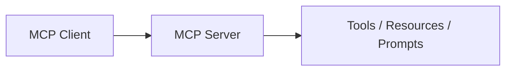

# ai-agent-retail-handbook-v3 Architecture

最后更新：2026-06-29

本文件记录项目实际架构。未实现的能力必须明确标注，不得把规划写成现状。

## 技术架构图

> 当前为治理初始化视图。后续必须依据真实代码、文档或运行结果细化。

## 系统架构

- 当前实现：待根据项目结构确认。
- 外部依赖：待确认。
- 数据边界：待确认。
- 部署方式：待确认。

## Agent 架构

- 是否包含 Agent：待确认。
- Agent 角色、状态、工具、权限和失败处理：待确认。

## RAG 流程图

> 如果项目不包含 RAG，应明确标记“不适用”；如果包含，应替换为实际流程。

## MCP 流程图

> 如果项目不包含 MCP，应明确标记“不适用”；如果包含，应补充权限、参数校验和审计边界。

## 更新规则

- 架构变化必须同步更新本文件。
- 重要决策必须登记到 `DECISIONS.md`。
- 复杂流程优先使用 Mermaid，并与真实实现保持一致。

