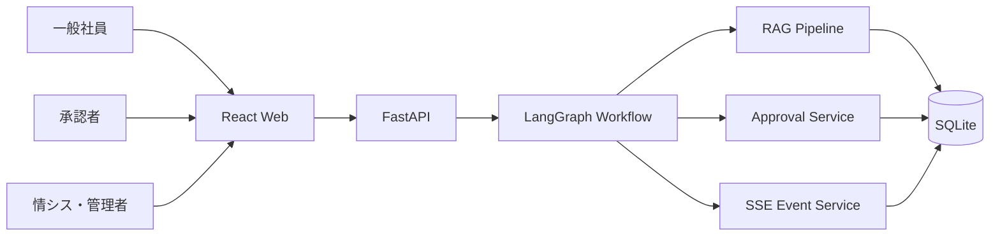
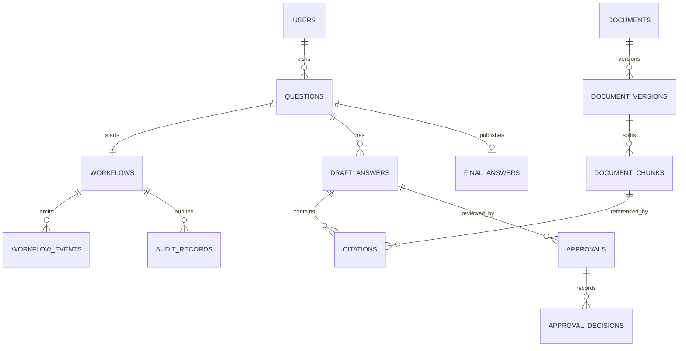
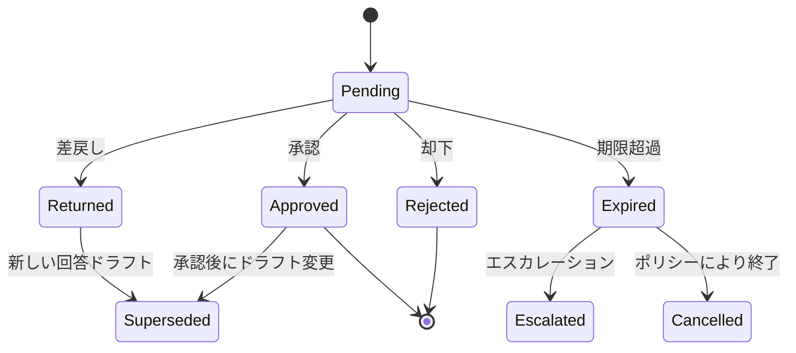
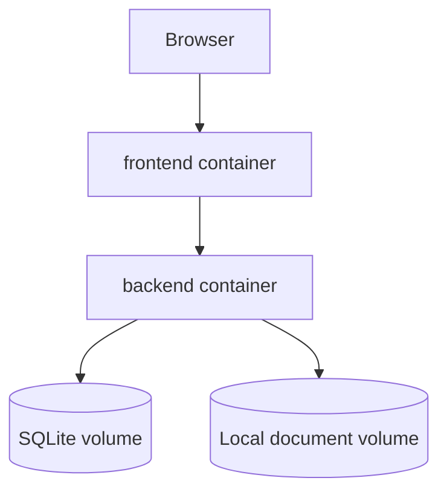

# 社内文書検索・承認ワークフローAIエージェント 基本设计书

文档状态：基本设计（基本設計）  
适用阶段：架构资产与后续最小垂直切片  
语言约定：中文说明为主，画面和业务状态保留关键日语术语

## 目录

- [1. 系统概要](#1-系统概要)
- [2. 功能列表](#2-功能列表)
- [3. 非功能需求](#3-非功能需求)
- [4. API 设计](#4-api-设计)
- [5. DB 设计](#5-db-设计)
- [6. RAG 设计](#6-rag-设计)
- [7. LangGraph Workflow 设计](#7-langgraph-workflow-设计)
- [8. Approval Workflow 设计](#8-approval-workflow-设计)
- [9. 权限设计](#9-权限设计)
- [10. 审计设计](#10-审计设计)
- [11. 日志设计](#11-日志设计)
- [12. 监控设计](#12-监控设计)
- [13. 部署设计](#13-部署设计)
- [14. 运维设计](#14-运维设计)
- [15. 前提与未决事项](#15-前提与未决事项)

## 1. 系统概要

### 1.1 目的

为有权限的员工提供统一的社内文書检索入口，生成可验证的回答草案，并对高风险内容执行人工审批。系统必须在效率提升与组织治理之间保持明确边界。

### 1.2 系统上下文



### 1.3 设计前提

- 当前不连接真实 LLM 或任何外部模型 API。
- 回答生成使用可替换的 Static Answer Provider。
- 本地单实例使用 SQLite；组件接口不绑定具体数据库。
- 所有文档均假定已经过授权导入，导入源连接器暂不实现。
- 单一 LangGraph 负责业务编排，Retriever、Rerank、Risk、Approval 是独立组件，不部署成独立微服务。

## 2. 功能列表

| ID | 功能 | 使用角色 | 当前垂直切片 | 说明 |
| --- | --- | --- | --- | --- |
| F-001 | 用户提问 | 一般社員 | 计划实现 | question、department、可选 context |
| F-002 | 问题状态查询 | 提问者、担当者 | 计划实现 | 返回当前状态和允许动作 |
| F-003 | SSE 进度订阅 | 有权用户 | 计划实现 | 支持 sequence 续传 |
| F-004 | 文档检索 | 系统 | 计划实现 | ACL + 关键词 Retriever |
| F-005 | 候选再排序 | 系统 | 计划实现 | 确定性规则评分 |
| F-006 | 回答草案生成 | 系统 | 计划实现 | Static Provider |
| F-007 | 风险分类 | 系统 | 计划实现 | 规则与证据门控 |
| F-008 | 审批任务查询 | 承認者 | 计划实现 | 按责任领域过滤 |
| F-009 | 承認/差戻し/却下 | 承認者 | 计划实现 | 乐观锁和幂等键 |
| F-010 | 正式回答取得 | 提问者 | 计划实现 | 仅发布后可读 |
| F-011 | 文档登记 | 部門担当者 | 后续 | 内容、元数据、ACL、版本 |
| F-012 | 文档停用 | 部門担当者 | 后续 | 不物理删除历史依据 |
| F-013 | 策略管理 | 管理者 | 后续 | 风险和审批路由版本化 |
| F-014 | 审计查询 | 限定管理员 | 后续 | 查询动作自身也被审计 |
| F-015 | 健康检查 | 情シス | 计划实现 | liveness/readiness |

## 3. 非功能需求

### 3.1 性能与容量目标

当前数值是设计目标，实施后必须通过基准测试校正。

| 项目 | 本地基线 | 生产候选目标 |
| --- | --- | --- |
| 创建问题 API | P95 < 300 ms | P95 < 200 ms |
| 首个 SSE 事件 | P95 < 1 s | P95 < 500 ms |
| 固定语料检索 | P95 < 500 ms | 按索引规模制定 |
| 低风险完整流程 | P95 < 3 s | P95 < 5 s，不含人工等待 |
| 并发连接 | 单实例 20 | 容量测试后确定 |
| 可用性 | 不承诺 | 核心工作时间 99.9% 候选 |

### 3.2 可靠性

- 状态变更与事件写入采用同事务或 Outbox 语义。
- API 写操作接受 `Idempotency-Key`。
- Workflow 节点设置超时、有限重试和错误分类。
- 人工等待不占用进程；状态和 checkpoint 持久化。
- 服务重启后可根据 DB 状态恢复，不依赖 SSE 连接存活。

### 3.3 安全

- 身份认证在生产由 SSO 提供；当前通过测试身份依赖注入。
- 所有文档检索应用资源级权限过滤。
- 输入长度、文件类型、内容类型和请求频率受限。
- 文档内容视为不可信数据，不能作为系统指令执行。
- 敏感正文不写日志，API 错误不返回堆栈。
- 依赖锁定、镜像扫描、SBOM 和签名作为生产供应链要求。

### 3.4 可维护性

- API、领域模型、Repository 和 Provider 分层。
- Workflow State 字段版本化，节点只返回增量。
- 策略、Prompt/Template、索引和文档版本可追踪。
- 关键模块具备单元、契约、集成和端到端测试。

## 4. API 设计

### 4.1 共通规则

- Base path：`/api/v1`
- JSON：UTF-8，时间为 ISO 8601 UTC。
- Header：`X-Request-ID` 可由客户端提供；写请求使用 `Idempotency-Key`。
- 普通 API 使用统一 envelope；SSE 使用独立事件合同。
- 错误码稳定，message 可本地化，detail 不暴露内部实现。

成功 envelope：

```json
{
  "success": true,
  "request_id": "req-...",
  "data": {},
  "error": null
}
```

失败 envelope：

```json
{
  "success": false,
  "request_id": "req-...",
  "data": null,
  "error": {
    "code": "APPROVAL_VERSION_CONFLICT",
    "message": "Approval target has changed",
    "detail": {}
  }
}
```

### 4.2 Endpoint 一览

| Method | Path | 用途 | 主要权限 | 正常状态 |
| --- | --- | --- | --- | --- |
| GET | `/health/live` | 进程存活 | 无 | 200 |
| GET | `/health/ready` | DB 与必要依赖就绪 | 无 | 200/503 |
| POST | `/questions` | 创建问题 | employee | 202 |
| GET | `/questions/{id}` | 查询状态 | owner/担当者 | 200 |
| GET | `/questions/{id}/events` | SSE 订阅 | owner/担当者 | 200 |
| GET | `/questions/{id}/answer` | 读取正式回答 | owner/担当者 | 200/409 |
| GET | `/approvals` | 查询待审批 | approver | 200 |
| GET | `/approvals/{id}` | 审批详情 | assigned approver | 200 |
| POST | `/approvals/{id}/decisions` | 提交决定 | assigned approver | 200/409 |
| POST | `/documents` | 登记文档 | department_owner | 201 |
| POST | `/documents/{id}/versions` | 新版本 | department_owner | 201 |
| POST | `/documents/{id}/deactivate` | 停用 | department_owner | 200 |
| GET | `/audit-records` | 受控审计查询 | auditor/admin | 200 |

### 4.3 创建问题

Request：

```json
{
  "question": "個人情報を含む障害ログの共有手順を確認したい",
  "department": "IT",
  "locale": "ja-JP"
}
```

Response `202`：

```json
{
  "success": true,
  "request_id": "req-001",
  "data": {
    "question_id": "q-001",
    "workflow_id": "wf-001",
    "status": "received"
  },
  "error": null
}
```

### 4.4 审批决定

Request：

```json
{
  "decision": "approved",
  "draft_version": 2,
  "comment": "引用規程と適用範囲を確認済み"
}
```

服务端从认证上下文取得 actor，不接受客户端提交 `approver_id`。版本冲突返回 409，权限不足返回 403，已处理的相同幂等请求返回原决定。

## 5. DB 设计

### 5.1 当前逻辑模型



### 5.2 主要表

| 表 | 主键 | 关键字段 | 约束/索引 |
| --- | --- | --- | --- |
| users | user_id | department_id、status | unique corporate_subject |
| role_assignments | assignment_id | user_id、role、scope | user+role+scope index |
| questions | question_id | actor_id、text、status、risk_level | actor/status/created_at |
| workflows | workflow_id | question_id、state_version、checkpoint | unique question_id |
| workflow_events | event_id | workflow_id、sequence、type、payload | unique workflow+sequence |
| documents | document_id | type、owner、classification、status | owner/status |
| document_versions | version_id | document_id、version、effective range、hash | unique document+version |
| document_chunks | chunk_id | version_id、section、content、search_text | version/section |
| draft_answers | draft_id | question_id、version、body、template_version | unique question+version |
| citations | citation_id | draft_id、chunk_id、claim_ref、score | draft/score |
| approvals | approval_id | draft_id、risk_domain、status、due_at、lock_version | status/domain/due_at |
| approval_decisions | decision_id | approval_id、actor_id、decision、comment | idempotency unique |
| final_answers | answer_id | question_id、draft_id、published_at | unique question_id |
| audit_records | audit_id | actor、action、resource、hashes、occurred_at | workflow/time/action |
| outbox_events | outbox_id | aggregate、event_type、payload、published_at | unpublished index |

### 5.3 数据规则

- 文档版本和正式回答不原地覆盖；状态变化保留历史。
- `document_chunks` 必须属于有效 `document_version`。
- citation 必须指向用户在回答发布时有权访问的 chunk。
- approvals 绑定唯一 draft 版本；新草案创建时旧 pending 审批失效。
- audit_records 只追加，不提供普通 update/delete Repository。
- SQLite 开启 foreign keys、WAL 和 busy timeout；写事务保持短小。

## 6. RAG 设计

### 6.1 Pipeline

```text
Question
→ Normalize
→ ACL Filter
→ Retrieve top_n=20
→ Rerank top_k=5
→ Evidence Gate
→ Context Builder
→ Static Answer Provider
→ Citation Validator
```

### 6.2 组件合同

| 组件 | 输入 | 输出 | 失败策略 |
| --- | --- | --- | --- |
| QueryAnalyzer | question、actor context | normalized query、filters、risk hints | 校验失败转人工 |
| Retriever | query、ACL filters、top_n | candidate chunks + retrieval scores | 超时有限重试；无结果正常返回 |
| Reranker | query、candidates、top_k | ordered evidence | 失败可降级使用 retrieval score，并记录 |
| EvidenceGate | ordered evidence、threshold policy | sufficient/insufficient + reasons | 异常按 insufficient |
| ContextBuilder | evidence、budget | structured context + citations | 超预算截断低分项 |
| AnswerProvider | question、context、template version | draft answer | 超时转 error/retry |
| CitationValidator | draft、citations | validation result | 不通过不得自动发布 |

### 6.3 检索评价

- Recall@5/10/20：相关文档是否进入候选。
- MRR、NDCG@5：正确依据是否排在前面。
- ACL leakage rate：必须为 0。
- stale citation rate：过期版本被引用比例。
- answerable/unanswerable accuracy：无资料时能否拒答。
- citation precision：回答主张是否被引用支持。

评价集按文档类型、部门、风险领域和日文表达方式分层，避免平均指标掩盖高风险漏检。

### 6.4 安全控制

- 文档中的“忽略系统规则”等内容按普通资料处理。
- Context 采用结构化字段，区分 instruction 和 evidence。
- 文档导入执行类型校验、恶意文件扫描和元数据验证。
- 输出只允许引用实际检索结果，不接受 Provider 自报 source。

## 7. LangGraph Workflow 设计

### 7.1 State

```text
workflow_id, question_id, actor_context, question,
normalized_query, risk_hints, candidates, evidence,
evidence_status, draft_answer, draft_version, citations,
risk_level, risk_reasons, approval_id, approval_status,
final_answer_id, status, error
```

State 中只保存节点协作所需的数据。完整文档正文、认证 token 和敏感密钥不得进入 checkpoint。

### 7.2 Node 与路由

| Node | 责任 | 超时/重试 |
| --- | --- | --- |
| validate_request | 输入与 actor context 校验 | 不重试 |
| analyze_query | 规范化和风险提示 | 1 次有限重试 |
| retrieve | ACL 范围内检索 | 2 次指数退避 |
| rerank | 重新排序 | 可降级，不无限重试 |
| evidence_gate | 判断证据是否充分 | 确定性，不重试 |
| draft | 形成草案 | 1 次重试 |
| validate_citations | 引用校验 | 确定性 |
| classify_risk | 规则风险分类 | 确定性，异常 fail closed |
| request_approval | 创建审批并 interrupt | 幂等 |
| apply_decision | 校验决定和草案版本 | 不重试冲突 |
| publish | 创建正式回答 | 幂等，事务保护 |
| finalize | 终态事件和审计 | 可重试 |

### 7.3 条件边

- Evidence insufficient → 生成说明性草案后进入人工确认，不自动发布。
- low risk + citation valid → publish。
- medium/high/critical 或 uncertainty → request_approval。
- approved → publish；returned → draft；rejected → finalize rejected。

### 7.4 Checkpoint 与恢复

- 每个外部副作用前后保存状态版本。
- interrupt 返回 approval_id，不保持内存协程等待。
- resume 接受审批决定引用，从 DB 重新读取并验证。
- `workflow_id + node + state_version` 形成幂等边界。
- 不可重试错误进入 failed，并发布可操作的 error_code。

## 8. Approval Workflow 设计

### 8.1 审批路由

| 风险领域 | 主审批角色 | 候补/升级 |
| --- | --- | --- |
| 契約・法務 | Legal Approver | Legal Manager |
| 個人情報 | Privacy Approver | DPO/管理者 |
| セキュリティ | Security Approver | CISO delegate |
| 経費 | Finance Approver | Finance Manager |
| 障害対応 | Incident Manager | IT Manager |

多领域问题采用“全部必要审批”或指定主责任人规则，必须由策略版本明确定义，不能由前端选择。

### 8.2 状态迁移



### 8.3 并发与幂等

- 使用 `lock_version` 乐观锁防止两个审批者同时覆盖决定。
- Idempotency-Key 防止浏览器重复提交。
- 决定写入、Workflow resume 事件和 Outbox 在一致性边界内完成。
- 审批详情返回 ETag 或 version；旧版本提交返回 409。

## 9. 权限设计

### 9.1 权限模型

本地基线采用 RBAC + resource scope：角色决定动作集合，scope 决定部门、文档等级和风险领域。生产可扩展 ABAC，但不把所有判断散落在路由中。

| 资源/动作 | 一般社員 | 部門担当者 | 承認者 | 情シス | 管理者 |
| --- | --- | --- | --- | --- | --- |
| 创建问题 | 自己 | 自己 | 自己 | 自己 | 自己 |
| 查看回答 | 自己且有文档权限 | 部门范围 | 指派范围 | 运维必要最小范围 | 策略允许范围 |
| 维护文档 | 否 | 所属范围 | 否 | 连接配置 | 全局配置但受审计 |
| 审批 | 否 | 仅被授予时 | 指派风险领域 | 否 | 默认否，紧急权限需另行启用 |
| 查看审计 | 否 | 有限业务记录 | 自己决定记录 | 技术元数据 | 受控查询 |

### 9.2 信任边界

- React 提交的 role、department、approver_id 均不可信。
- FastAPI 从认证上下文构造 ActorContext。
- Repository 查询必须接受并执行 scope，不允许 Service 取全量后过滤。
- 管理员紧急权限需要时限、理由、二次确认和审计。

## 10. 审计设计

### 10.1 审计原则

- 业务动作追加写，记录 before/after hash 和策略版本。
- actor 使用企业不可变 subject，不只保存显示名。
- 审计时间使用服务端 UTC，必要时接可信时间源。
- 内容最小化；敏感正文放在受控业务表，审计保存引用和哈希。
- 导出、查询、保留期变更也属于审计动作。

### 10.2 审计事件

`QUESTION_CREATED`、`DOCUMENT_RETRIEVED`、`DRAFT_CREATED`、`RISK_CLASSIFIED`、`APPROVAL_REQUESTED`、`APPROVAL_DECIDED`、`ANSWER_PUBLISHED`、`DOCUMENT_VERSION_CHANGED`、`ROLE_CHANGED`、`POLICY_CHANGED`、`AUDIT_EXPORTED`。

### 10.3 完整性

本地阶段使用追加写表和测试约束。生产候选可采用哈希链、WORM 存储、受限写账号和定期完整性验证，具体方案由合规保留要求决定。

## 11. 日志设计

### 11.1 结构化字段

`timestamp`、`level`、`service`、`environment`、`event`、`message`、`request_id`、`trace_id`、`workflow_id`、`question_id`、`approval_id`、`node`、`status`、`duration_ms`、`error_code`、`retry_count`。

### 11.2 规则

- 不记录 API Key、认证 token、完整问题、完整回答或文档正文。
- 使用稳定 event/error_code，不依赖自由文本做告警。
- INFO 记录状态边界，DEBUG 仅在受控环境启用，ERROR 包含可诊断但不含敏感的信息。
- Audit Log 和 Application Log 分开存储、授权和保留。

## 12. 监控设计

### 12.1 Metrics

- HTTP：request count、latency、4xx/5xx、active SSE connections。
- Workflow：node latency、completion/failure、retry、checkpoint/resume failure。
- RAG：retrieve latency、zero result、evidence score、citation validation failure。
- Approval：pending count、age、decision latency、return/reject/expire rate。
- Data：DB lock time、connection usage、outbox lag、index freshness。
- Quality：answerable accuracy、citation precision、high-risk recall、ACL leakage。

### 12.2 Trace

生产使用 OpenTelemetry 将 HTTP → Workflow → Retriever → DB → Event 关联。人工等待形成 trace link 或新的 span，而不是让单个 span 开放数小时。

### 12.3 告警候选

- high/critical 未审批发布：立即告警。
- ACL leakage：立即停止相关索引或发布路径。
- 审批积压超过阈值：通知责任部门。
- Outbox lag、DB 锁冲突、SSE error rate 持续异常：通知情シス。

## 13. 部署设计

### 13.1 当前逻辑与部署单元

逻辑组件不等于微服务。初始部署保持两个应用容器和一个持久卷：

- `frontend`：React 静态资源和反向代理。
- `backend`：FastAPI、LangGraph、RAG、Approval、SSE。
- `sqlite-data`：本地持久卷，仅适合单 backend 实例。

### 13.2 Docker Compose 候选



### 13.3 生产演进

Frontend 经 CDN/WAF，Backend 多实例部署；PostgreSQL 保存事务数据，OpenSearch/VectorDB 提供检索，Queue 执行异步任务，Redis 只承担经测量确认的缓存/协调职责，Telemetry Collector 汇聚观测数据。Secrets 由云密钥服务注入，不进入镜像或仓库。

### 13.4 CI/CD

- PR：格式、类型、单元、契约、安全扫描、Mermaid/文档检查。
- Main：构建不可变镜像、SBOM、签名、集成测试。
- Deploy：环境审批、DB migration check、逐步发布、自动健康判定。
- Rollback：应用镜像可回滚；DB migration 必须具备 forward-fix/兼容策略。

## 14. 运维设计

### 14.1 日常运维

- 检查服务、DB、索引和事件积压。
- 检查待审批 aging 和责任人缺失。
- 定期审查过期文档、无命中查询和低分领域。
- 按策略执行备份、恢复演练和权限复核。

### 14.2 故障处理

| 故障 | 用户影响 | 初动 | 恢复 |
| --- | --- | --- | --- |
| Backend 不可用 | 无法提问/审批 | 健康检查、日志、最近变更 | 回滚或重启，验证 DB |
| Retriever 异常 | 无法取得证据 | 停止自动发布 | 降级关键词检索或转人工 |
| DB 锁/不可用 | 状态无法可靠写入 | 拒绝新写入 | 恢复 DB，重放 Outbox |
| SSE 中断 | 页面进度停止 | 客户端重连 | 查询当前状态并按 sequence 续传 |
| 错误权限同步 | 信息泄露风险 | 停止检索/发布 | 撤销索引、复核审计、事件响应 |

### 14.3 备份与恢复

本地阶段提供 SQLite 一致性备份说明。生产必须分别定义 PostgreSQL PITR、检索索引重建、文档源恢复、RPO/RTO、加密密钥恢复和定期演练。

### 14.4 变更管理

文档 schema、Workflow State、风险策略、审批路由和回答模板均版本化。高风险策略变更需要双人 Review；部署记录关联变更票和审计记录。

## 15. 前提与未决事项

| ID | 未决事项 | 决策责任者 | 影响 |
| --- | --- | --- | --- |
| Q-001 | 企业 IdP 与用户主数据来源 | 情シス | 认证与部门 scope |
| Q-002 | 文档保密等级和 ACL 来源 | 情シス/各部门 | 检索隔离 |
| Q-003 | 各风险领域审批责任矩阵 | 法务/安全/财务 | Workflow 路由 |
| Q-004 | 审批 SLA、超时和代理人规则 | 业务负责人 | 升级流程 |
| Q-005 | Audit Log 保留期与导出要求 | 合规/法务 | 存储与权限 |
| Q-006 | 日文检索评价集所有者 | 部門担当者 | 质量门槛 |
| Q-007 | 生产 RPO/RTO 和峰值容量 | 情シス | 部署拓扑 |
| Q-008 | OpenSearch/VectorDB 选型条件 | 架构委员会 | 检索平台 |

