# 社内文書検索・承認ワークフローAIエージェント 架构图册

## 目录

- [图 1：Overall Architecture](#图-1overall-architecture)
- [图 2：User Question Flow](#图-2user-question-flow)
- [图 3：Document Ingestion Flow](#图-3document-ingestion-flow)
- [图 4：RAG Retrieval Flow](#图-4rag-retrieval-flow)
- [图 5：Approval Workflow](#图-5approval-workflow)
- [图 6：Risk Classification Flow](#图-6risk-classification-flow)
- [图 7：SSE Event Flow](#图-7sse-event-flow)
- [图 8：Audit Log Flow](#图-8audit-log-flow)
- [图 9：RBAC Architecture](#图-9rbac-architecture)
- [图 10：VectorDB / OpenSearch Architecture](#图-10vectordb--opensearch-architecture)
- [图 11：Docker Deployment](#图-11docker-deployment)
- [图 12：Enterprise Architecture](#图-12enterprise-architecture)
- [图册共通说明](#图册共通说明)

## 图 1：Overall Architecture

### 业务目的

展示从员工提问、知识检索、风险判断、人工审批到正式回答的系统全貌，明确业务入口、编排层、能力组件和数据事实来源。

### Mermaid 图

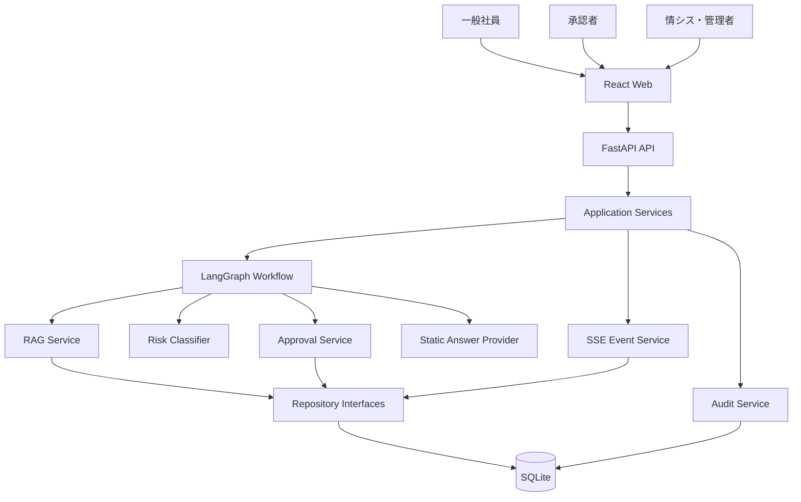

### 技术说明

逻辑组件保留清晰接口，但初始部署不拆成多个微服务。LangGraph 只负责编排和状态路由；Task/Question 生命周期、审批权限和持久化由 Service 与 Repository 管理。Static Answer Provider 保证当前不依赖外部模型。SQLite 是单实例事实来源，SSE 只承担通知。

### 面试怎么讲

先说明客户要解决的是内部资料分散和高风险回答失控，再说明采用 RAG 提供依据、采用 Approval Workflow 保留责任边界。最后指出当前组件是逻辑分层，并未为了使用 Agent 概念而增加网络跳转。

### TL 会追问什么

- LangGraph State 与数据库状态谁是事实来源？
- 为什么 Approval Service 不由前端直接更新状态？
- 服务重启后怎样恢复人工等待中的 Workflow？
- 单一 Workflow 何时需要拆分？

## 图 2：User Question Flow

### 业务目的

说明一般社員从提交问题到取得正式回答的完整时序，并突出回答草案与正式回答的差异。

### Mermaid 图

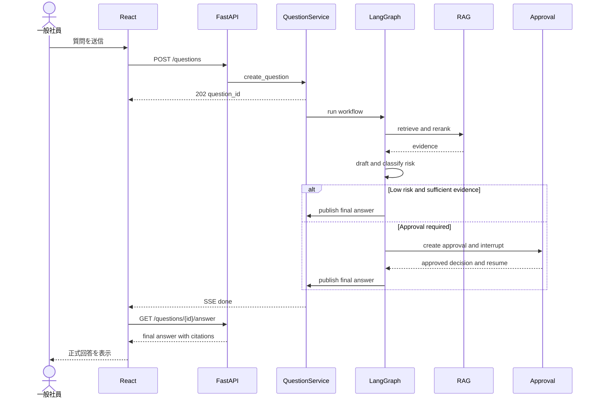

### 技术说明

POST 返回 202，不占用连接等待完整流程。客户端通过 SSE 接收状态，收到 done 后再读取正式回答。人工等待通过 checkpoint 和 interrupt 实现，不保持线程或协程。批准必须绑定 draft_version。

### 面试怎么讲

强调异步 API、SSE 和查询 API 的分工：SSE 提高可见性，但正式回答仍从可授权、可重试的 GET API 读取。

### TL 会追问什么

- POST 成功后后台执行失败如何通知？
- 用户刷新页面后如何恢复？
- SSE done 已收到但报告 GET 失败怎么办？
- 重复 POST 如何保证幂等？

## 图 3：Document Ingestion Flow

### 业务目的

确保只有经过所有者确认、权限标注、版本校验和安全检查的文档进入可检索知识库。

### Mermaid 图

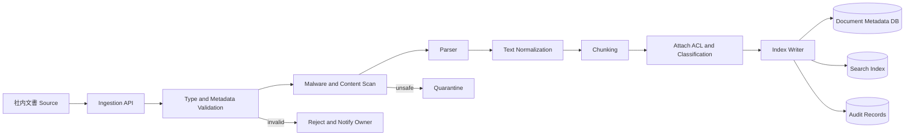

### 技术说明

文档导入不是简单上传。每个 chunk 必须继承 document_id、version、section、classification 和 ACL。内容哈希用于去重和追踪。当前阶段只设计接口，后续最小实现使用受控固定文档；生产索引写入采用版本化 alias 或双索引切换。

### 面试怎么讲

说明检索质量取决于文档治理。只有切块算法而没有版本、权限、所有者和有效期，无法用于企业内部正式回答。

### TL 会追问什么

- 文档更新时旧引用怎样处理？
- ACL 变化后索引多久生效？
- 解析失败、恶意文件如何隔离？
- 如何保证 DB 元数据和搜索索引一致？

## 图 4：RAG Retrieval Flow

### 业务目的

在用户权限范围内找到最相关、最新且可引用的证据，并在证据不足时安全转人工，而不是强行生成答案。

### Mermaid 图

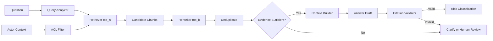

### 技术说明

Retriever 优化召回，Reranker 优化前列精度，两者独立评价。ACL filter 与检索查询一起执行，禁止全量取回后在应用层过滤。Evidence Gate 检查最低分、版本、引用数量和冲突；Citation Validator 确保草案主张可映射到实际 chunk。

### 面试怎么讲

不要只讲 embedding。说明检索流程包含权限、召回、排序、证据门控和引用校验，并给出 Recall@K、NDCG、citation precision、ACL leakage 等指标。

### TL 会追问什么

- top_n 和 top_k 如何决定？
- Reranker 失败能否降级？
- 日文同义词和复合词如何处理？
- 无答案测试集怎样建立？

## 图 5：Approval Workflow

### 业务目的

确保高风险草案由正确责任人审核，并支持承認、差戻し、却下、超时升级和版本冲突处理。

### Mermaid 图

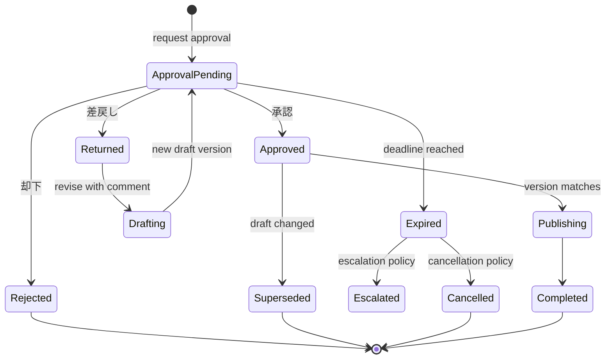

### 技术说明

审批记录包含 approval_id、risk_domain、assignee scope、draft_version、policy_version、due_at 和 lock_version。决定写入使用幂等键与乐观锁。Workflow 在 request approval 节点持久化 checkpoint 并 interrupt；resume 时重新读取决定和权限上下文。

### 面试怎么讲

强调人工审批是可恢复的业务状态，不是同步接口里等待用户点击。承認只对特定草案版本有效，任何修改都需要重新确认。

### TL 会追问什么

- 多个风险领域是任一批准还是全部批准？
- 承認者休假时如何代理？
- 审批超时是否允许自动通过？
- 两名审批者同时操作如何解决？

## 图 6：Risk Classification Flow

### 业务目的

以稳定、可解释的方式识别契約、個人情報、セキュリティ、経費、法務和障害対応风险，避免高影响回答未经确认直接发布。

### Mermaid 图

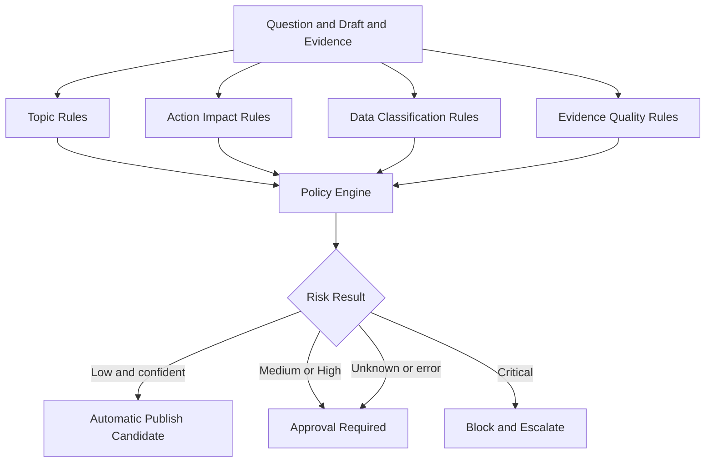

### 技术说明

风险分类与回答生成分离。规则输出 risk_level、domains、matched_rules、reasons 和 policy_version。合并策略采用最高风险优先。未知、异常、证据冲突均 fail closed。未来分类模型只能作为额外信号，不能绕过规则上限。

### 面试怎么讲

说明风险控制看重漏判成本，因此 high-risk recall 优先于整体 accuracy。每次判定保留规则和版本，便于回归与审计。

### TL 会追问什么

- 规则误报过多如何优化？
- 风险词出现在否定句中怎么办？
- critical 与 high 的处理差异是什么？
- 策略热更新如何保证在途 Workflow 一致？

## 图 7：SSE Event Flow

### 业务目的

让提问者和审批者及时看到检索、草案、等待审批和完成状态，同时保证断线不会改变业务结果。

### Mermaid 图

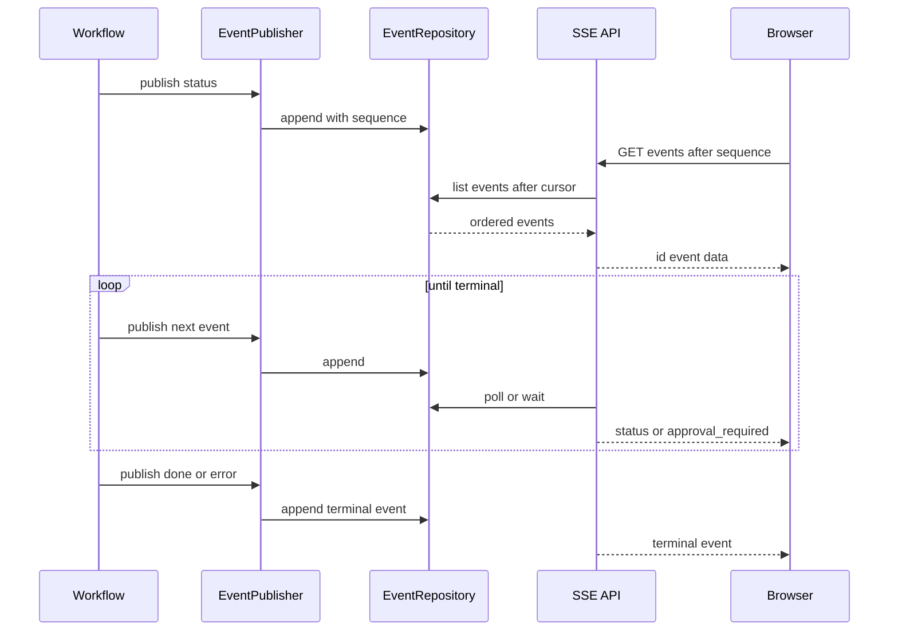

### 技术说明

事件先持久化再推送。每个 workflow 内 sequence 单调递增，客户端保存最后序号并重连。服务端设置 keepalive、连接上限和慢客户端背压策略。SSE payload 只含最小状态、资源 ID 和安全 message。

### 面试怎么讲

解释为什么选择 SSE：服务端到浏览器单向进度足够，协议简单且浏览器原生支持。正式业务状态在 DB，SSE 断开不需要回滚 Workflow。

### TL 会追问什么

- EventSource 不能自定义 Authorization header 怎么办？
- 多实例下由谁推送事件？
- 慢客户端和连接泄漏如何处理？
- approval_required 是否会泄露敏感信息？

## 图 8：Audit Log Flow

### 业务目的

还原谁在何时、以什么权限、基于哪版文档和策略，对哪版草案执行了什么动作。

### Mermaid 图

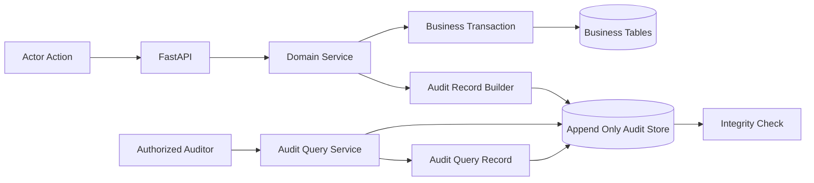

### 技术说明

业务变更和审计写入应处于可靠一致性边界；跨服务时采用 Outbox。审计保存 actor subject、role/scope、action、resource、workflow_id、before/after hash、policy version 和 result。敏感正文保留受控引用，不复制到审计表。

### 面试怎么讲

区分 Audit Log 与应用日志：审计是长期业务证据、不可随意修改；应用日志用于故障排查，可以轮转和采样。查询审计本身也要留痕。

### TL 会追问什么

- 如何证明 Audit Log 未被篡改？
- DB 事务成功但审计写入失败怎么办？
- GDPR/个保法删除请求与审计保留如何协调？
- 谁可以导出审计数据？

## 图 9：RBAC Architecture

### 业务目的

确保用户只能检索有权文档、执行被授权动作，并把审批权限限制在责任领域和资源范围内。

### Mermaid 图

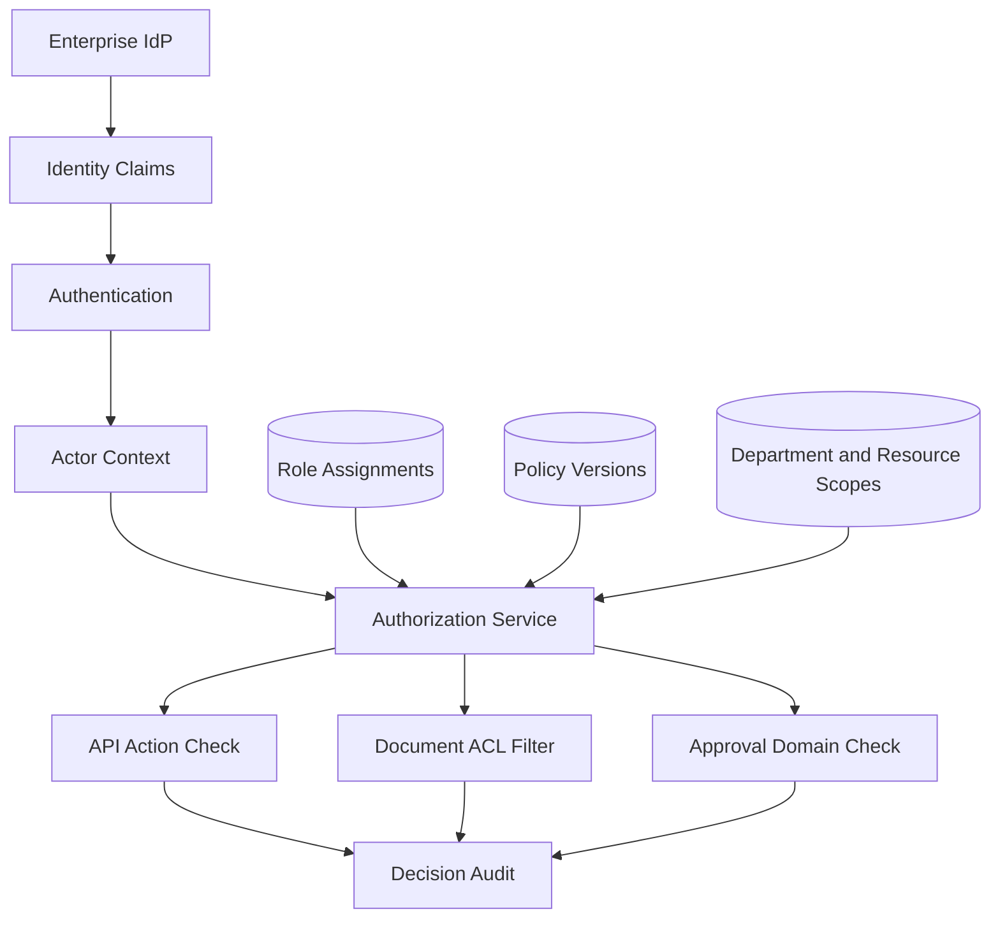

### 技术说明

认证和授权分离。生产从 SSO token 建立 ActorContext，但不信任前端传入的 role/department。Authorization Service 统一评估 action、resource、role、scope 和 policy version。Repository 查询接收 scope，执行行级或索引级过滤。

### 面试怎么讲

说明只有路由级 RBAC 不够：同为一般社員，不同部门可见文档不同；同为承認者，负责的风险领域也不同，因此需要资源 scope。

### TL 会追问什么

- 角色变化后缓存多久失效？
- 情シス排障是否能看到文档正文？
- 管理员 break-glass 如何控制？
- Search index 如何实施 document-level security？

## 图 10：VectorDB / OpenSearch Architecture

### 业务目的

为生产规模下的日文全文与语义检索设计可演进的混合检索拓扑，同时避免在当前需求未量化前绑定单一产品。

### Mermaid 图

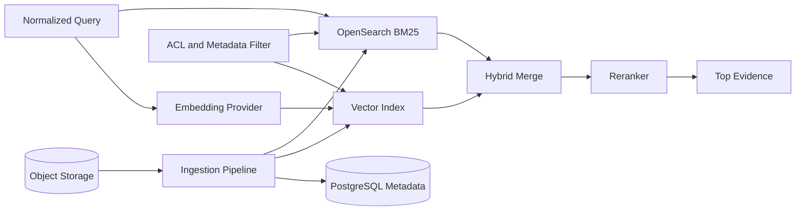

### 技术说明

OpenSearch 负责日文 analyzer、BM25 和过滤；Vector Index 提供语义候选。Hybrid Merge 可采用 RRF，之后统一 Rerank。ACL 必须同时应用于两路查询。Embedding model、chunk schema 和 index version 绑定，升级采用双写/重建与 alias 切换。

### 面试怎么讲

不直接声称向量检索优于全文检索。说明企业文档包含编号、术语和精确条款，BM25 与语义检索各有优势，最终用评价集选择权重。

### TL 会追问什么

- 为什么同时需要 OpenSearch 和 VectorDB？
- ACL filter 会不会降低 ANN 召回？
- embedding 模型升级如何重建索引？
- RRF 与加权分数融合如何选？

## 图 11：Docker Deployment

### 业务目的

提供可重复的本地运行边界，使前端、后端和持久数据在不依赖外部服务的条件下完成端到端验证。

### Mermaid 图

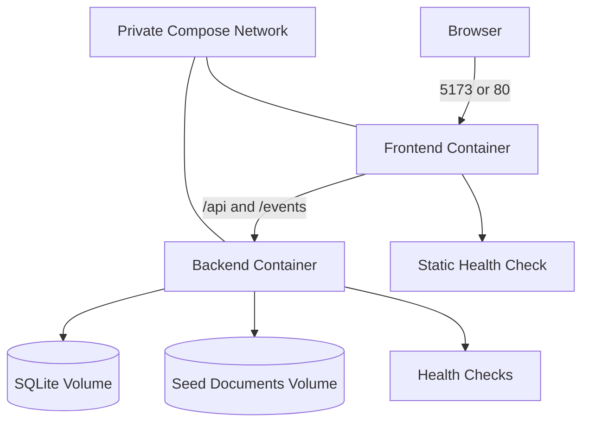

### 技术说明

Frontend 反向代理 API，浏览器只访问一个 origin。Backend 运行单实例，因为 SQLite 不适合多实例共享写入。卷保存 DB 和固定文档；镜像内不放 secrets。健康检查区分进程存活与 DB readiness。

### 面试怎么讲

明确这是部署基线而非最终拓扑。选择两个容器是为了保持职责和构建边界，同时避免在本地引入无必要的数据库和队列服务。

### TL 会追问什么

- Backend 容器重启时审批状态是否保留？
- SQLite volume 如何备份？
- 为什么不能扩成两个 Backend replica？
- 前端如何处理 SSE 反向代理缓冲？

## 图 12：Enterprise Architecture

### 业务目的

展示从本地垂直切片演进到企业生产环境时，需要补齐的身份、检索、事务、异步、观测、安全和运维能力。

### Mermaid 图

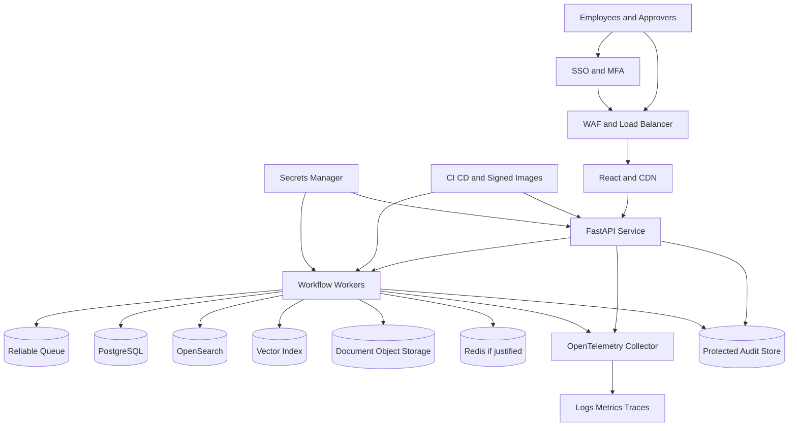

### 技术说明

生产拓扑将同步 API 与长任务 Worker 分离，通过 Queue 提供可靠投递、重试、死信和背压。PostgreSQL 管理事务状态；OpenSearch/Vector Index 管理检索；对象存储保存原文。Redis 仅在测量到缓存或协调瓶颈后引入。OpenTelemetry 关联 HTTP、Workflow 和检索，审计存储独立保护。

### 面试怎么讲

按“当前边界 → 触发条件 → 演进组件”说明，不把未来能力描述成已完成。例如，只有当任务跨实例、需要可靠重试和背压时才引入 Queue；只有检索规模与质量证明需要时才采用混合索引。

### TL 会追问什么

- Workflow worker 如何保证 exactly-once 或等效幂等？
- PostgreSQL、Search 和 Audit 跨系统一致性如何处理？
- 如何定义 RPO/RTO、灾备和回滚？
- 多租户、数据驻留和密钥轮换如何设计？
- 如何控制模型、检索和审批的整体延迟与成本？

## 图册共通说明

### 逻辑架构与部署架构的区别

图中的 Service、Retriever、Reranker、Risk Classifier 和 Approval 代表责任边界，不表示必须独立部署。只有安全域、扩缩容、故障隔离或团队所有权产生明确需要时，才增加进程和网络边界。

### 共通可靠性规则

- 所有写操作幂等，外部副作用有唯一业务键。
- 超时和重试按组件配置，禁止无限重试。
- Workflow checkpoint 不保存密钥或完整受限正文。
- 高影响动作必须人工批准，超时不默认为通过。
- 状态事实保存在持久层，SSE 和缓存不能成为唯一来源。

### 共通安全规则

- 文档内容是不可信输入，防止提示注入改变系统规则。
- ACL 在检索阶段强制执行。
- 认证主体、角色和部门不从前端请求体取得。
- 日志和事件最小化敏感数据。
- 依赖、镜像、配置和 secrets 接受供应链与变更控制。

