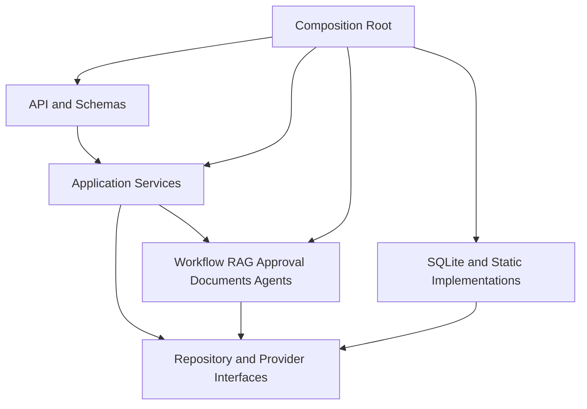

# Internal Knowledge Approval Agent 代码结构设计

## 目录

- [1. 设计目标](#1-设计目标)
- [2. 未来目录结构](#2-未来目录结构)
- [3. 根目录职责](#3-根目录职责)
- [4. Backend 目录职责](#4-backend-目录职责)
- [5. Frontend 目录职责](#5-frontend-目录职责)
- [6. 依赖方向](#6-依赖方向)
- [7. 禁止调用](#7-禁止调用)
- [8. 核心接口与状态所有权](#8-核心接口与状态所有权)
- [9. 测试结构](#9-测试结构)
- [10. 配置、错误与日志规则](#10-配置错误与日志规则)
- [11. 实施顺序](#11-实施顺序)
- [12. Code Review 检查项](#12-code-review-检查项)

## 1. 设计目标

未来代码采用模块化单体（modular monolith）作为初始形态。目标是让 API、业务用例、Workflow、RAG、Approval、存储和 UI 的责任清楚，同时避免在没有扩缩容或安全域理由时把每个组件拆成网络服务。

设计必须支持以下演进：

- Static Answer Provider 可替换，但业务流程不依赖具体模型 SDK。
- SQLite Repository 可迁移到 PostgreSQL。
- 关键词 Retriever 可迁移到 OpenSearch/VectorDB 混合检索。
- 进程内执行可迁移到 Queue + Worker。
- 本地身份可替换为 SSO/RBAC，而不改写领域规则。

## 2. 未来目录结构

```text
internal-knowledge-approval-agent/
├── backend/
│   ├── app/
│   │   ├── main.py
│   │   ├── api/
│   │   │   ├── dependencies.py
│   │   │   ├── health.py
│   │   │   ├── questions.py
│   │   │   ├── approvals.py
│   │   │   └── documents.py
│   │   ├── services/
│   │   │   ├── question_service.py
│   │   │   ├── approval_service.py
│   │   │   └── document_service.py
│   │   ├── workflow/
│   │   │   ├── state.py
│   │   │   ├── graph.py
│   │   │   ├── nodes.py
│   │   │   └── policies.py
│   │   ├── rag/
│   │   │   ├── contracts.py
│   │   │   ├── query_analyzer.py
│   │   │   ├── retriever.py
│   │   │   ├── reranker.py
│   │   │   ├── context_builder.py
│   │   │   └── citation_validator.py
│   │   ├── approval/
│   │   │   ├── models.py
│   │   │   ├── policy.py
│   │   │   └── routing.py
│   │   ├── documents/
│   │   │   ├── models.py
│   │   │   ├── parser.py
│   │   │   ├── chunker.py
│   │   │   └── ingestion.py
│   │   ├── agents/
│   │   │   ├── answer_agent.py
│   │   │   └── providers/
│   │   │       └── static_answer.py
│   │   ├── repositories/
│   │   │   ├── interfaces/
│   │   │   └── implementations/
│   │   │       └── sqlite/
│   │   ├── schemas/
│   │   │   ├── common.py
│   │   │   ├── questions.py
│   │   │   ├── approvals.py
│   │   │   ├── documents.py
│   │   │   └── events.py
│   │   ├── events/
│   │   │   ├── publisher.py
│   │   │   └── sse.py
│   │   └── config/
│   │       ├── settings.py
│   │       ├── container.py
│   │       ├── logging.py
│   │       └── errors.py
│   ├── migrations/
│   ├── tests/
│   │   ├── unit/
│   │   ├── contract/
│   │   ├── integration/
│   │   ├── api/
│   │   └── fixtures/
│   ├── requirements.txt
│   └── Dockerfile
├── frontend/
│   ├── src/
│   │   ├── api/
│   │   ├── components/
│   │   ├── features/
│   │   │   ├── questions/
│   │   │   ├── approvals/
│   │   │   └── documents/
│   │   ├── pages/
│   │   ├── types/
│   │   └── App.tsx
│   ├── package.json
│   └── Dockerfile
├── docs/
│   ├── api/
│   ├── operations/
│   └── evaluation/
├── scripts/
│   ├── check_env.sh
│   ├── start_backend.sh
│   ├── start_frontend.sh
│   └── run_tests.sh
├── docker-compose.yml
└── README.md
```

目录树表示未来目标，不授权在本阶段创建这些文件。

## 3. 根目录职责

| 路径 | 责任 | 不负责 |
| --- | --- | --- |
| `backend/` | API、业务用例、Workflow、检索、审批和持久化 | 浏览器 UI |
| `frontend/` | 用户交互、页面状态、SSE 消费和 API Client | 业务授权最终判断 |
| `docs/` | API、运维、评价基准等随实现演进的附属文档 | 运行时代码 |
| `scripts/` | 可重复的环境检查、启动和测试入口 | 隐藏生产部署逻辑 |
| `docker-compose.yml` | 本地容器编排 | 生产 HA 拓扑 |
| `README.md` | 快速理解、启动入口和边界 | 代替详细设计书 |

## 4. Backend 目录职责

### `app/main.py`

唯一 FastAPI 组合入口：创建 App、加载 Container、注册 middleware、exception handler、health 和业务路由。禁止在该文件实现检索或审批规则。

### `app/api/`

负责 HTTP/SSE 边界：解析 Schema、取得认证上下文、调用 Service、转换响应和 HTTP status。路由不直接执行 SQL、不构造具体 Provider、不决定风险等级。

### `app/services/`

负责应用用例与事务顺序：创建 Question、启动/恢复 Workflow、保存 Final Answer、执行审批决定、发布事件与审计。Service 依赖 Repository Protocol 和领域组件，不依赖 FastAPI Request/Response。

### `app/workflow/`

负责 LangGraph State、Node、Edge、interrupt 和恢复路由。Node 应保持小而明确，外部副作用通过注入的 Service/Port 完成。Workflow 不拥有用户认证、数据库连接或 SSE 连接。

### `app/rag/`

负责 Query Analysis、Retriever、Rerank、Evidence Gate、Context Build 和 Citation Validation。所有候选必须带 ACL 已应用的证明和 source coordinates。该目录不发布正式回答。

### `app/approval/`

负责 Approval 领域模型、状态迁移、责任领域路由、超时与升级策略。权限执行由 Authorization Port 配合，前端输入不能决定 approver。

### `app/documents/`

负责文档元数据、解析、切块、版本和导入流程。它产生可索引 chunk，但不直接处理用户问答。

### `app/agents/`

负责把结构化 evidence 转换为 DraftAnswer。`providers/static_answer.py` 是当前固定实现。Agent 不直接访问 Repository、审批表或整个文档库，也不决定是否正式发布。

### `app/repositories/`

`interfaces/` 定义领域需要的最小存储合同；`implementations/sqlite/` 实现 SQL、事务、行映射和 migration 兼容。业务层不能导入 implementations。

建议接口：

- `QuestionRepository`
- `WorkflowRepository`
- `DocumentRepository`
- `ApprovalRepository`
- `AnswerRepository`
- `EventRepository`
- `AuditRepository`
- `OutboxRepository`

### `app/schemas/`

定义 HTTP Request/Response 和 SSE payload。Schema 不直接作为领域实体或数据库 ORM model，避免一个模型承担所有边界。

### `app/events/`

负责事件持久化、sequence 和 SSE 编码。Publisher 接受领域事件，不拼装业务状态；SSE streamer 不修改 Workflow。

### `app/config/`

- `settings.py`：环境配置和启动校验。
- `container.py`：唯一 composition root，连接具体实现。
- `logging.py`：结构化日志和 context。
- `errors.py`：稳定 error_code、领域异常与 HTTP 映射。

具体 SQLite、Static Provider 和外部 Adapter 只允许在 Container 中被选择。

## 5. Frontend 目录职责

| 路径 | 责任 |
| --- | --- |
| `src/api/` | fetch、统一 envelope、EventSource、错误转换 |
| `src/components/` | 无业务所有权的可复用 UI |
| `src/features/questions/` | 提问表单、进度时间线、引用和正式回答 |
| `src/features/approvals/` | 待办列表、草案比较、承認/差戻し/却下 |
| `src/features/documents/` | 文档登记和版本视图，后续实现 |
| `src/pages/` | 路由级页面组合与权限入口 |
| `src/types/` | 与 API/SSE 合同对应的前端类型 |
| `src/App.tsx` | 全局路由、layout 和顶层 error boundary |

Frontend 可以根据 API 返回的 allowed_actions 控制显示，但 Backend 必须再次授权。Frontend 不持有正式 Workflow 状态，不根据关键词自行判断风险。

## 6. 依赖方向

### 6.1 Backend 依赖图



箭头表示“允许依赖”。核心规则不得反向依赖 Web 框架或具体存储。

### 6.2 调用顺序

```text
HTTP Request
→ API Schema / Authentication Context
→ Application Service
→ Workflow / Domain Component
→ Repository or Provider Interface
→ Adapter Implementation
```

返回路径反向转换为 Domain Result → Response Schema。SSE 读取 EventRepository，不直接订阅 LangGraph 内部回调。

## 7. 禁止调用

| 调用方 | 禁止直接调用 | 原因 |
| --- | --- | --- |
| React | SQLite、Workflow node、Search index | 绕过 API、权限和审计 |
| API route | SQLite implementation、具体 Provider | 路由不拥有基础设施选择 |
| API route | Risk rules 内部函数 | 风险判断属于受控用例 |
| Task/Question Service | FastAPI Request/Response | 保持框架独立和可测试 |
| Workflow | React/SSE connection | Workflow 状态不依赖客户端存活 |
| RAG | Approval Repository | 检索不决定审批生命周期 |
| Agent/Generator | 全文 Document Repository | 只能使用已授权 evidence |
| Agent/Generator | Approval decision API | 防止生成过程批准自身结果 |
| Repository interface | SQLite ORM/SQL 类型 | Port 不能泄露 Adapter |
| Static Provider | 环境 Secret 或外部网络 | 当前边界不允许真实模型调用 |
| Application Log | 完整问题、回答、文档正文、token | 数据最小化与安全要求 |

禁止通过 `utils.py`、全局单例或动态 import 绕过这些依赖规则。必要的共通类型应放在命名明确的模块中，而不是建立无边界公共目录。

## 8. 核心接口与状态所有权

### 8.1 接口候选

```python
class Retriever(Protocol):
    async def retrieve(self, query: RetrievalQuery) -> list[RetrievalCandidate]: ...

class Reranker(Protocol):
    async def rerank(self, query: str, candidates: list[RetrievalCandidate]) -> list[Evidence]: ...

class AnswerProvider(Protocol):
    async def draft(self, request: DraftRequest) -> DraftAnswer: ...

class ApprovalRepository(Protocol):
    def create_pending(self, approval: Approval) -> Approval: ...
    def decide(self, command: ApprovalDecisionCommand) -> Approval: ...
```

以上只表示接口形状，实施时应补充明确错误、超时和类型，不在当前阶段创建 Python 文件。

### 8.2 状态所有权

| 状态 | 所有者 | 读取者 |
| --- | --- | --- |
| Question 生命周期 | QuestionService + QuestionRepository | API、Workflow、UI |
| Workflow checkpoint | WorkflowRepository / LangGraph checkpointer | Workflow Service |
| Retrieval candidates | Workflow State（短期） | Reranker、评价日志 |
| 文档与 ACL | DocumentRepository/Search Adapter | Retriever |
| DraftAnswer | AnswerRepository | Risk、Approval、UI |
| Approval | ApprovalService + ApprovalRepository | Workflow、API、UI |
| FinalAnswer | AnswerRepository | API、UI |
| SSE Event | EventRepository | SSE endpoint、UI |
| Audit Record | AuditRepository | 受控审计查询 |

SSE UI、缓存和运行日志均不是业务事实所有者。

### 8.3 超时与重试

| 组件 | 超时基线 | 重试 | 幂等要求 |
| --- | --- | --- | --- |
| Retriever | 2 s | 瞬态错误 2 次 | 只读 |
| Reranker | 1 s | 0～1 次，可降级 | 只读 |
| Static Answer Provider | 1 s | 1 次 | 相同 request/version 输出稳定 |
| SQLite write | 事务级短超时 | 锁冲突有限重试 | 唯一业务键 |
| Publish FinalAnswer | 3 s | 可重试 | question_id 唯一 |
| Approval decision | 3 s | 客户端可安全重试 | Idempotency-Key + lock_version |

具体值在性能测试后调整，禁止无限重试。

## 9. 测试结构

```text
backend/tests/
├── unit/
│   ├── test_risk_policy.py
│   ├── test_reranker.py
│   ├── test_evidence_gate.py
│   └── test_approval_state.py
├── contract/
│   ├── test_retriever_contract.py
│   ├── test_answer_provider_contract.py
│   └── test_repository_contracts.py
├── integration/
│   ├── test_sqlite_repositories.py
│   ├── test_workflow_checkpoint.py
│   └── test_outbox_events.py
├── api/
│   ├── test_questions_api.py
│   ├── test_approvals_api.py
│   ├── test_sse_api.py
│   └── test_authorization.py
└── fixtures/
    ├── documents/
    ├── retrieval_cases.json
    └── risk_cases.json
```

### 9.1 Unit Test

验证纯规则与状态迁移：risk level、审批合法迁移、Rerank、Evidence Gate、引用校验。不得启动 FastAPI 或真实数据库。

### 9.2 Contract Test

所有 Retriever、Provider 和 Repository 实现运行同一合同测试。例如，任何 ApprovalRepository 都必须拒绝过期 lock_version，任何 Retriever 都不能返回 scope 外文档。

### 9.3 Integration Test

使用临时 SQLite 验证事务、foreign key、migration、checkpoint、Outbox 和并发冲突。测试后清理临时资源。

### 9.4 API Test

通过 ASGI client 验证状态码、envelope、request_id、权限、幂等、SSE 事件顺序和错误不泄露内部信息。

### 9.5 Workflow Test

至少覆盖：

- 低风险自动完成。
- 高风险 interrupt → approved → resume → completed。
- returned → 新草案 → 新审批。
- rejected 终止且无 FinalAnswer。
- evidence insufficient 转人工。
- 重复 resume 不重复发布。
- 旧 draft_version 审批返回冲突。
- 节点超时和服务重启后恢复。

### 9.6 Frontend Test

- 提交问题后建立 SSE。
- status、approval_required、done、error 正确显示。
- done 后单独获取 Answer。
- Approver 只能对 allowed_actions 执行操作。
- 409 版本冲突显示刷新提示。
- EventSource 关闭和重连不泄漏连接。

## 10. 配置、错误与日志规则

### 配置

配置通过 typed Settings 读取；启动时拒绝未知 Provider、无效路径和不安全生产默认值。`.env.example` 只含非敏感示例，不包含密钥。

### 错误

错误分为 Validation、Authentication、Authorization、NotFound、Conflict、Dependency、Workflow 和 Internal。每类有稳定 code、HTTP status、retryable 和安全 message。

### 日志

统一 `request_id`、`workflow_id`、`question_id`、`approval_id`、`node`、`status`、`duration_ms` 和 `error_code`。敏感正文只通过受控数据访问，不写日志。

## 11. 实施顺序

按垂直切片实施，不先建立所有目录的空文件：

1. API/SSE Schema、领域模型、错误码和评价 fixture。
2. SQLite migration 与 Question/Event/Audit Repository。
3. 固定文档、Retriever、Reranker、Evidence Gate。
4. Static Answer Provider 和 Citation Validator。
5. LangGraph 低风险路径。
6. Approval interrupt/resume、版本冲突和幂等。
7. React Question 与 Approval 页面。
8. 安全、失败、恢复和端到端测试。
9. Docker Compose、健康检查和运维手册。

每一步都应形成可运行、可测试的纵向能力，避免先生成大量无实现的目录。

## 12. Code Review 检查项

- 是否绕过 Service 直接访问具体 Repository？
- 是否在检索前应用 ACL，而不是结果返回后隐藏？
- 是否把 DraftAnswer 误当成 FinalAnswer？
- 是否对副作用定义幂等键、事务和重试边界？
- 是否把完整敏感正文写入 State、Event、Log 或 Audit？
- 是否验证 approval 的 actor scope、draft_version 和 lock_version？
- 是否给新状态、事件和错误码增加测试？
- 是否记录实际 template、policy、document 和 index 版本？
- 是否说明新依赖的运维、安全和供应链影响？
- 是否用测量数据证明缓存、并行化或新基础设施的必要性？

