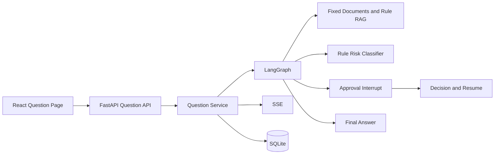

# 社内文書検索・承認ワークフローAIエージェント Day1～Day5 计划

## 目录

- [计划目标](#计划目标)
- [共通工作方式](#共通工作方式)
- [Day1：理解业务场景](#day1理解业务场景)
- [Day2：理解 RAG](#day2理解-rag)
- [Day3：理解 Approval Workflow](#day3理解-approval-workflow)
- [Day4：理解 API / SSE](#day4理解-api--sse)
- [Day5：准备最小可运行代码](#day5准备最小可运行代码)
- [五日评审](#五日评审)
- [未决事项记录](#未决事项记录)

## 计划目标

五天后应形成可进入实现评审的共同理解，而不是追求文件数量。参与者应能说明业务责任、RAG 证据链、审批状态、API/SSE 合同、持久化边界和最小垂直切片范围。

本计划不连接真实 LLM，不申请 OpenAI API，不准备 API Key，不引入生产基础设施。

## 共通工作方式

每天按日本现场常用的“前提确认 → 设计阅读 → 场景走查 → 产出复核 → 未决事项”推进。

### 每日共通完成标准

- 能用自己的语言说明当天主题。
- 能指出系统责任者和失败时的处理责任。
- 能列出至少一个正常路径、一个异常路径和一个权限路径。
- 不把当前设计范围描述成已实现功能。
- 未决事项记录 owner、期限和影响，不以猜测代替决定。

## Day1：理解业务场景

### 目标

理解为什么项目同时需要社内文書检索和人工审批，确认五类用户、七类文档与六类高风险领域。

### 阅读范围

1. `PROJECT_BIBLE.md`：项目定位、角色、范围、术语和不变量。
2. `01_项目实战.md`：客户课题、业务流程和现场说明。
3. `03_架构图册.md` 的图 1、图 2：整体结构和用户问题时序。

### 场景走查

| 场景 | 预期路径 | 重点确认 |
| --- | --- | --- |
| 一般手順查询 | 检索 → 草案 → 低风险发布 | 引用、版本、权限 |
| 個人情報共享手順 | 检索 → 高风险 → Privacy 承認 | 责任领域、证据、审计 |
| 障害対応紧急操作 | 检索 → critical → 阻断/升级 | 不因紧急自动批准 |
| 无相关文档 | Evidence insufficient → 转人工 | 不补造答案 |
| 用户无文档权限 | 检索结果为空或受控提示 | 不泄露文档存在性 |

### 当日产出

- 一页业务流程说明。
- Role × Action × Resource 的初版矩阵。
- 风险领域与承認者责任矩阵。
- “当前范围/Production Gap”口头说明。

### 完成标准

- 能用 60 秒日语说明项目，不先罗列技术名词。
- 能解释草案与正式回答的区别。
- 能解释为何情シス不能默认代替业务承認者。
- 能列出禁止自动发布的条件。

### 当日总结

- 已确认的业务规则：
- 仍需客户确认的规则：
- 最容易误解的角色边界：
- 明日需要带入 RAG 设计的问题：

## Day2：理解 RAG

### 目标

理解 Retrieval、Rerank、Evidence Gate、Context 和 Citation 的责任，建立“有依据才回答”的质量观。

### 阅读范围

1. `02_系统设计书.md` 第 5、6 节。
2. `03_架构图册.md` 的图 3、图 4、图 10。
3. `04_ADR.md` 的 ADR-001、009、010、011、012、013。

### 设计走查

按以下数据流逐项说明输入输出：

```text
Question
→ QueryAnalyzer
→ ACL Filter
→ Retriever top_n
→ Reranker top_k
→ Evidence Gate
→ Context Builder
→ Static Answer Provider
→ Citation Validator
```

### 评价准备

建立不含真实敏感数据的最小评价样例分类：

- 精确规则编号查询。
- 日文同义表达查询。
- 多版本文档冲突。
- 无答案问题。
- 无权限文档命中尝试。
- 高风险主题与一般主题边界。

记录计划指标：Recall@K、MRR/NDCG、citation precision、zero-result rate、stale citation rate、ACL leakage rate。

### 当日产出

- Retriever/Reranker/AnswerProvider 接口草案。
- 五到十条固定检索评价样例定义。
- Evidence sufficient 的初始判定条件。
- 文档元数据与 citation 必填字段。

### 完成标准

- 能解释 Retriever 和 Reranker 为何分离。
- 能说明 ACL 应在哪一步执行。
- 能说明无证据、低分和版本冲突分别如何处理。
- 不把 VectorDB 当作 RAG 成立的必要前提。

### 当日总结

- 最重要的检索质量指标：
- 当前固定 Retriever 的能力边界：
- 需要客户提供的评价资料：
- 尚未决定的索引策略：

## Day3：理解 Approval Workflow

### 目标

掌握风险分类、审批路由、interrupt/resume、草案版本、幂等和超时升级。

### 阅读范围

1. `02_系统设计书.md` 第 7、8、9、10 节。
2. `03_架构图册.md` 的图 5、图 6、图 8、图 9。
3. `04_ADR.md` 的 ADR-002、003、004、006、007、014。

### 状态走查

逐条画出并说明：

- low risk → publish → completed。
- high risk → approval_pending → approved → publish。
- approval_pending → returned → 新 draft_version → 再审批。
- approval_pending → rejected → 无 FinalAnswer。
- approval_pending → expired → escalate/cancel。
- approved 后草案改变 → 原批准 superseded。

### 异常与并发走查

| 条件 | 预期结果 |
| --- | --- |
| 两名审批者同时提交 | 一人成功，另一人收到 version conflict |
| 浏览器重复发送承認 | 幂等返回相同决定，不重复发布 |
| 无责任领域权限 | 403 并写 Audit Record |
| 服务在等待中重启 | 从 checkpoint 和 DB 恢复 pending |
| 分类器异常 | fail closed，进入审批 |
| 审批超时 | 不自动通过，按策略升级或取消 |

### 当日产出

- Approval 状态迁移表。
- 风险规则与责任领域映射。
- ApprovalDecisionCommand 字段定义。
- 版本冲突、幂等和超时测试清单。

### 完成标准

- 能解释人工等待为何不占用进程。
- 能解释 approval_id、draft_version、lock_version 和 policy_version 的作用。
- 能说明 Audit Log 与 Application Log 的区别。
- 能指出至少三个不能由前端决定的字段。

### 当日总结

- 已理解的状态迁移：
- 需要业务确认的审批规则：
- 最危险的并发场景：
- 明日 API 需要表达的冲突：

## Day4：理解 API / SSE

### 目标

形成稳定的 HTTP、错误、事件和重连合同，理解异步创建、状态查询、SSE 通知和结果读取的分工。

### 阅读范围

1. `02_系统设计书.md` 第 3、4、11、12 节。
2. `03_架构图册.md` 的图 2、图 7。
3. `04_ADR.md` 的 ADR-005、015。
4. `05_代码结构设计.md` 的依赖方向、状态所有权和测试结构。

### API 合同走查

| 场景 | API | 关键结果 |
| --- | --- | --- |
| 创建问题 | `POST /api/v1/questions` | 202、question_id、workflow_id |
| 查询当前状态 | `GET /api/v1/questions/{id}` | status、risk、allowed_actions |
| 订阅进度 | `GET /api/v1/questions/{id}/events` | sequence、typed event |
| 取得回答 | `GET /api/v1/questions/{id}/answer` | FinalAnswer + citations |
| 查看审批 | `GET /api/v1/approvals/{id}` | draft、risk、evidence、version |
| 提交决定 | `POST /api/v1/approvals/{id}/decisions` | decision result 或 409 |

### SSE 合同走查

- `status`：普通节点进度。
- `approval_required`：问题进入人工等待。
- `approval_updated`：决定已被接受。
- `done`：正式回答资源可读取。
- `error`：Workflow 进入失败状态。

确认 sequence、重连参数、终态关闭、权限校验、代理缓冲和慢客户端处理。事件不携带完整文档正文。

### 当日产出

- OpenAPI Schema 草案。
- 稳定 error_code 列表。
- SSE payload 与事件顺序样例。
- API/SSE 权限和幂等测试表。

### 完成标准

- 能解释为什么 POST 返回 202。
- 能解释为什么 done 后仍要 GET answer。
- 能解释 SSE 断线为什么不影响 Workflow 事实。
- 能说明 401、403、404、409、422、500/503 的使用边界。

### 当日总结

- 已固定的 API 合同：
- 需要前后端共同确认的字段：
- 重连和幂等策略：
- 明日实现前仍未解决的问题：

## Day5：准备最小可运行代码

### 目标

把设计转换为一个可实施的最小垂直切片计划，明确文件顺序、验收场景和不进入本轮的能力。Day5 只做实施准备，不在架构阶段批量生成代码。

### 阅读范围

1. `05_代码结构设计.md` 全文。
2. `02_系统设计书.md` 的 DB、Workflow、部署和运维设计。
3. `04_ADR.md` 全文，确认当前 Accepted 决策。

### 最小垂直切片



### 计划实现顺序

1. 建立 Backend/Frontend 最小工程和环境脚本。
2. 定义 Schema、领域状态、错误码、事件和测试 fixture。
3. 实现 SQLite migration 和 Repository contracts。
4. 实现固定文档 Retriever、规则 Reranker 和 Evidence Gate。
5. 实现 Static Answer Provider、Citation Validator 和风险规则。
6. 实现 low-risk Workflow 与 SSE。
7. 实现 approval interrupt/resume、承認/差戻し/却下。
8. 实现 Question 页面、Approval 页面和错误显示。
9. 增加端到端、权限、恢复和幂等测试。
10. 增加 Docker Compose 和运行验证清单。

### 必须先写的验收场景

- 一般 FAQ 问题自动完成并返回有效 citation。
- 個人情報问题进入 approval_pending，承認后完成。
- 高风险问题未经审批无法读取 FinalAnswer。
- 差戻し产生新 draft_version，旧批准不能使用。
- 无权限用户无法检索引用或查看审批。
- SSE 断线重连后不丢事件、不重复业务动作。
- 服务重启后 pending approval 仍存在。
- 重复决定不重复发布 FinalAnswer。

### 当前不实施

- 真实 LLM 或 OpenAI API。
- 企业 SSO、真实用户目录和生产 RBAC。
- PostgreSQL、Redis、Queue、OpenSearch 或 VectorDB。
- 外部文档系统同步和复杂文件解析。
- 多实例、高可用、云部署和生产告警。

### 当日产出

- 可评审的垂直切片 backlog。
- 文件级实施顺序和负责人。
- API/DB/Workflow 合同冻结清单。
- 验收场景与测试分层。
- 风险、依赖、未决事项和 Production Gap 更新。

### 完成标准

- 任一开发者能按顺序开始实现，不需要猜测核心状态和边界。
- 每个 backlog 项都关联验收场景，不以“创建目录”作为完成。
- 当前阶段不产生外部服务费用或密钥依赖。
- TL、业务负责人、情シス对最小范围和不实施项达成一致。

### 当日总结

- 已冻结的合同：
- 第一条垂直切片：
- 实现前最大风险：
- 所需测试数据：
- 下一次设计评审日期与参加者：

## 五日评审

### 评审参加者

- 业务负责人
- 部門担当者代表
- 承認者代表
- 情シス
- Backend/Frontend 负责人
- Security/Privacy 代表（涉及相应领域时）

### 评审判定

| 项目 | Go 条件 |
| --- | --- |
| 业务范围 | 角色、文档、风险领域和责任矩阵明确 |
| RAG | ACL、评价指标、证据不足路径明确 |
| Approval | 状态、版本、幂等、超时和升级明确 |
| API/SSE | 合同、错误、重连、权限明确 |
| Data | SQLite schema、事务和审计边界明确 |
| Security | 敏感数据、提示注入、最小权限控制明确 |
| Delivery | 垂直切片、测试、验收和不实施项明确 |

任何 high/critical 未审批直出路径、ACL 后置过滤或审计缺失均为 No-Go。

## 未决事项记录

| ID | 事项 | Owner | 期限 | 影响 | 状态 |
| --- | --- | --- | --- | --- | --- |
| Q-001 | 企业身份与部门数据来源 | 情シス | 待定 | 权限设计 | Open |
| Q-002 | 风险领域责任矩阵 | 业务负责人 | 待定 | 审批路由 | Open |
| Q-003 | 文档分类和保留期 | 各部门/法务 | 待定 | 导入与审计 | Open |
| Q-004 | 审批 SLA 和代理规则 | 业务负责人 | 待定 | 超时升级 | Open |
| Q-005 | 检索评价数据所有者 | 部門担当者 | 待定 | 质量门槛 | Open |

