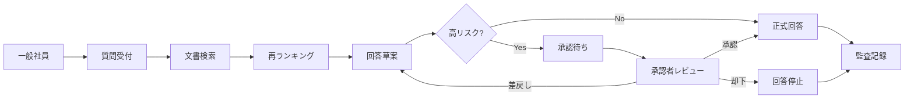

# Internal Knowledge Approval Agent

日本語名称：**社内文書検索・承認ワークフローAIエージェント**

## 目录

- [项目概要](#项目概要)
- [业务范围](#业务范围)
- [核心流程](#核心流程)
- [当前阶段](#当前阶段)
- [文档导航](#文档导航)
- [设计原则](#设计原则)
- [后续实施顺序](#后续实施顺序)

## 项目概要

Internal Knowledge Approval Agent 面向日本企业内部知识检索与高风险回答审批。员工提交问题后，系统从社内規程、業務マニュアル、FAQ、障害票、議事録、手順書和申請書類中检索依据，形成带引用的回答草案。涉及契約、個人情報、セキュリティ、経費、法務或障害対応时，回答必须进入承認 Workflow，由有权限的负责人确认后才能成为正式回答。

系统将“找到资料”“形成草案”“判断风险”“取得批准”“留下审计证据”视为一条完整业务流程，而不是单次文本生成请求。

## 业务范围

| 范围 | 当前设计 |
| --- | --- |
| 问答入口 | React 任务提交与结果页面 |
| HTTP 边界 | FastAPI typed API |
| 流程编排 | LangGraph StateGraph |
| 知识检索 | Retriever → Rerank → Context Builder |
| 回答生成 | 本地固定 Answer Provider，不连接外部模型 |
| 风险控制 | 规则分类、证据阈值、人工审批 |
| 进度通知 | SSE status / approval_required / done / error |
| 本地存储 | SQLite |
| 部署基线 | Docker Compose 单机拓扑 |

## 核心流程

## 当前阶段

本阶段只建立架构资产，共 7 份 Markdown 文档。尚未创建 Backend、Frontend、数据库或容器文件，不连接真实 LLM，不使用 OpenAI API，不保存任何 API Key。

下一阶段的最小实现应采用固定文档、规则 Retriever、固定 Rerank 和 Static Answer Provider，以便先验证 API、Workflow、审批中断、SSE 和审计边界。

## 文档导航

| 文档 | 用途 |
| --- | --- |
| [PROJECT_BIBLE.md](./PROJECT_BIBLE.md) | 项目定位、术语、范围和不可突破的边界 |
| [01_项目实战.md](./01_项目实战.md) | 日本现场业务说明、面试表达与 TL 追问 |
| [02_系统设计书.md](./02_系统设计书.md) | 基本设计、API、DB、权限、运维和部署 |
| [03_架构图册.md](./03_架构图册.md) | 12 张业务与技术架构图 |
| [04_ADR.md](./04_ADR.md) | 关键架构决策及权衡 |
| [05_代码结构设计.md](./05_代码结构设计.md) | 未来代码目录、依赖方向和测试结构 |
| [06_学习计划.md](./06_学习计划.md) | Day1～Day5 的设计理解与实现准备 |

## 设计原则

1. 正式回答必须有可追踪的检索依据，无法取得充分证据时明确拒答或转人工。
2. 高风险分类采用确定性规则优先，分类不确定时按高风险处理。
3. 审批是 Workflow 的持久状态，不是前端弹窗；恢复执行必须校验审批版本和权限。
4. Retriever、Rerank、Generator 分离，便于独立评估、替换和降级。
5. SSE 只通知进度和资源位置，不承载完整文档或敏感正文。
6. 所有状态变化写入不可篡改语义的 Audit Log，业务日志不得替代审计记录。
7. 当前使用 SQLite 是单机基线，不代表并发生产拓扑。

## 后续实施顺序

1. 固定 API Schema、Workflow State、事件合同和评价样例。
2. 实现 SQLite Repository 与固定文档检索。
3. 实现风险分类、审批中断和恢复。
4. 实现 React 提问、审批和结果页面。
5. 增加安全、审计、错误路径和恢复测试。
6. 完成容器化与本地端到端验证。

