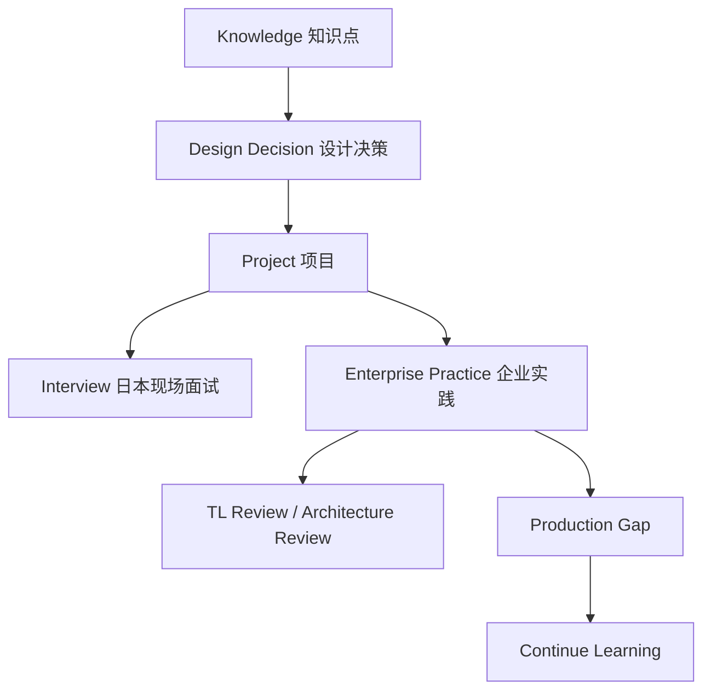

# 00_Enterprise_AI_Architecture_Handbook

> 定位：公共企业架构章节。其它知识和项目文档如果出现重复的运用化、Review、Design Decision 内容，应引用本章，不再拆成大量小文件。

## Knowledge → Design Decision → Project → Interview → Enterprise Practice

本知识库采用四层结构：

## Enterprise Design Principles

- 小売業向け AI 経営分析システムは、業務価値、API、Workflow、Research Agent、レポート生成、運用拡張を一体で説明する主项目として扱う。
- 企业设计必须回答为什么使用、为什么不用、替代方案、风险、成本、维护成本和扩展性。
- AI Agent 设计必须区分确定性流程和自主 Agent。关键业务动作优先确定性工作流，高风险动作需要人工确认。
- RAG 设计必须关注来源、权限、评估、索引刷新、无答案策略和 prompt injection。
- API 设计必须关注 schema、错误码、认证、权限、日志、trace_id、超时和限流。
- Streaming 设计必须关注事件协议、错误结束、代理缓冲、心跳、取消和断线恢复。
- LangGraph 设计必须关注 State、Node、Edge、Checkpoint、Interrupt、重试、终止条件和审计。
- MCP 设计必须关注 Tool schema、权限、allowlist、超时、重试、审计和人工审批。

## Design Decision

本知识库采用“少文件、强主题、重企业实践”的结构，而不是细碎 wiki。原因是面试复习和 TL Review 更需要快速定位、快速讲清楚、快速连接项目经验。

- 为什么保留 `knowledge/`：知识领域会持续增长，需要按领域维护。
- 为什么保留 `projects/`：项目经验会持续增长，每个项目需要独立讲清楚业务、架构和 Review。
- 为什么合并 Interview / Review / Case / Roadmap：这些内容服务于复习和表达，拆太碎会降低面试前的检索效率。
- 为什么不追求 Obsidian 图谱：当前目标是 小売業向け AI 経営分析システム Handbook，而是面试和项目说明手册。

适用场景：个人作品集、企业 项目复盘、日本 AI 面试准备、TL Review 准备。

不适用场景：需要多人并行维护上千知识节点的大型企业知识门户。

## TL Review

日本企业 TL 会检查这份 Handbook 是否满足：

- 设计理由是否明确。
- 担当範囲、設計判断、拡張ポイントが明確か。
- 運用版缺口是否列出。
- 面试时能否讲清楚项目、风险和取舍。
- 文档结构是否足够简单，是否便于新人和 Reviewer 快速定位。

## Enterprise Practice

小売業向け AI 経営分析システムの知识库は、技術名詞だけではなく“业务问题 -> 开发 -> 设计决策 -> 运用扩展 -> Review 观点”整理。银行、保险、制造、零售和政府项目都会要求证据链、审批链、障害対応和保守性。

## Standard Production Gap

小売業向け AI 経営分析システム进入本格運用时需要补齐：

- Authentication: OIDC/SAML/SSO/JWT/session。
- Authorization: RBAC/ABAC、tenant isolation、resource policy。
- Audit: 操作者、请求、工具调用、来源、审批、IP、trace_id。
- Observability: structured logs、metrics、trace/span、token/cost accounting。
- Reliability: timeout、retry、circuit breaker、fallback、queue、idempotency。
- Data: VectorDB、metadata DB、Redis、DWH、backup、migration。
- Security: prompt injection 防御、PII masking、secret management、supply chain scan。
- DevOps: CI/CD、Docker image scan、Kubernetes、health/readiness probe、rollback。
- Evaluation: offline golden set、recall@k、MRR、groundedness、faithfulness、regression gate。

## Standard TL Review Questions

- なぜこの設計にしましたか。
- なぜ他の方式を使わなかったのですか。
- 本格運用に向けた拡張ポイントはどこですか。
- 障害時にどこを見れば原因が分かりますか。
- ログ、監視、監査、権限、セキュリティはどうなっていますか。
- データ量が 100 倍になった場合、どこがボトルネックになりますか。
- 人手承認が必要な処理はどこですか。
- テストと評価はどのように設計しますか。

## Standard Continue Learning

- 官方文档：用于确认 API、版本差异和推荐用法。
- 源码：用于理解框架抽象的边界，避免把框架当黑盒。
- GitHub 示例：用于比较真实项目结构和错误处理方式。
- 企业最佳实践：用于补齐认证、权限、监控、审计、CI/CD。
- 线上故障案例：用于训练 TL Review 和架构风险判断。

## Production Gap

本 Handbook 仍是 draft。本格運用化前需要补齐：每个项目的源码级审查、每个知识领域的更具体企业案例、面试回答的日语润色、架构图一致性检查、链接有效性检查。

## Continue Learning

继续学习方向：官方文档确认 API，源码理解框架边界，GitHub 小売業向け AI 経営分析システム学习目录结构，日本现场设计文档学习交付物表达，云平台和 DevOps 学习发布与运维能力。
