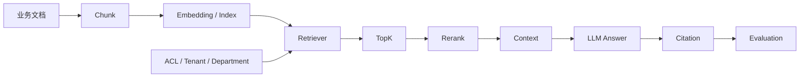

# 01_RAG核心知识

> 定位：本文是 RAG 设计手册，作为日本小売業向け AI 経営分析システム开发 / 面试 / TL Review 中用于说明 RAG 设计判断的核心手册。当前内容用于内部研发和作品集说明，

## 5分钟总览

企业 RAG 的主线不是“向量数据库”，而是：



面试和 Review 时要能说明：每一步为什么存在、什么时候不用、规模扩大后如何调整、权限和引用如何保证。

---

# KN-RAG-001 Chunk

## 元数据

- ID: KN-RAG-001
- 领域: RAG
- 关联项目: PRJ-006 doc_qa_agent, PRJ-007 rag_api_demo, PRJ-015 internal_hybrid_rag_demo
- 关联设计决策: DES-RAG-001

## 5分钟定位

Chunk 是 RAG 的最小工程单元。它把 Word、PDF、Wiki、制度文档、会议纪要等长文本拆成可以检索、引用、权限过滤和评估的小段。没有 Chunk，RAG 会变成“把整篇文档塞给模型”的不可控做法。

## 为什么需要 Chunk

- LLM context 有长度限制，不能把 100 页制度文档或大量社内 Wiki 全部放进 prompt。
- Embedding 需要固定粒度的文本单位；一整本手册向量化后语义太粗，一个标题又太细。
- Retriever 需要最小检索单元，否则无法判断哪一段真正回答了问题。
- Citation 需要定位来源，用户不能只看到“根据某文档”，而要看到文档名、章节、段落或页码。
- ACL 需要权限过滤；企业中同一篇文档可能按部门、租户、机密等级拆分可见范围。
- Evaluation 需要最小测试单元；评估召回率、引用正确率时，要知道标准答案应该命中哪些 Chunk。

## Chunk 太大 / 太小的问题

| Chunk 大小 | 适合场景 | 风险 |
| --- | --- | --- |
| 约 500 字符 | FAQ、短制度、客服知识、字段说明 | 上下文可能不足，跨段落答案容易断裂 |
| 约 1000 字符 | 通用社内文档、业务手册、Wiki 页面 | 常用起点，成本和召回质量比较平衡 |
| 约 1500 字符 | 法务条款、操作手顺、报告类文档 | 语义更完整，但噪声、token 成本和检索误命中会上升 |

Chunk 太大时，一个命中结果里混入无关内容，LLM 容易引用错误段落，TopK 也会浪费上下文。Chunk 太小时，答案所需条件被切散，例如“适用对象”和“例外条件”分到两个 Chunk，模型容易回答不完整。

## 日本现场怎么解释

日语回答可以这样说：

```text
Chunk は、長い社内文書を検索・引用・権限制御・評価しやすい単位に分割するために使います。
単にトークン数を減らすためだけではなく、Retriever の最小単位、Citation の根拠単位、ACL の制御単位として重要です。
开发初期では 1000 文字前後から始め、本格運用化する場合は評価セットで recall@k と引用正確性を見ながら調整します。
```

## 常见误区

- 只按固定字符数切，不考虑标题、表格、段落和业务语义。
- Chunk ID 没有保存 source、page、section、updated_at，后续无法引用和审计。
- 把 Chunk 大小当成经验值，不通过 evaluation set 调参。

---

# KN-RAG-002 Chunk Overlap

## 元数据

- ID: KN-RAG-002
- 领域: RAG
- 关联项目: PRJ-006, PRJ-007
- 关联设计决策: DES-RAG-002

## 5分钟定位

Chunk Overlap 是相邻 Chunk 之间保留少量重复文本，用来降低跨段落语义断裂风险。它需要按成本和效果平衡，而是用成本换连续性。

## 为什么需要 Overlap

企业文档常见答案不是完整落在一个段落里。例如请假制度中，“対象者”在上一段，“申請期限”在下一段；安全手顺中，“操作步骤”与“禁止事项”分开。没有 Overlap 时，Retriever 可能只召回其中一半，LLM 就会漏掉限制条件。

Overlap 的作用是让边界附近的信息在两个 Chunk 中都可检索，减少因为机械切分造成的语义断裂。

## Overlap 过大 / 过小的问题

- 过大：重复索引增加，Embedding 成本增加，TopK 里出现高度重复结果，LLM 看到同一证据多次后可能误以为证据更强。
- 过小：跨段落答案仍然断裂，尤其是表格说明、流程步骤、规则例外条件。
- 不需要 Overlap 的情况：FAQ 每条独立、结构化数据库记录、已按标题/段落做语义切分、Parent Document Retriever 已经能返回父文档上下文。

## 日本 TL 会怎么追问

- なぜ overlap を 100 / 200 にしましたか。
- 重複 Chunk が TopK に入った場合、どう deduplicate しますか。
- overlap によって token cost が増えた分、効果をどう測りますか。

推荐回答：開発初期は 10%～20% 作为起点，之后用 evaluation set 比较 recall@k、重复率、平均 token 数和引用正确率。本格運用版要加 chunk_id 去重和 source-level dedup。

## 常见误区

- 把 Overlap 当成默认开关，不衡量重复率。
- Overlap 后没有做去重，导致 TopK 结果看似很多，其实都是同一段。
- 对表格、代码、FAQ 仍然按纯文本 overlap，破坏结构。

---

# KN-RAG-003 TopK

## 元数据

- ID: KN-RAG-003
- 领域: RAG
- 关联项目: PRJ-006, PRJ-007
- 关联设计决策: DES-RAG-003

## 5分钟定位

TopK 决定 Retriever 返回多少个候选 Chunk 进入 prompt 或 rerank。它直接控制召回、噪声、token 成本和延迟。

## Top3 / Top5 / Top10 的区别

| TopK | 适合场景 | 风险 |
| --- | --- | --- |
| Top3 | FAQ、答案集中、低延迟 API | 召回不足，漏掉补充条件 |
| Top5 | 通用社内文档问答 开发初期的常见起点 | 需要评估，不应写死为经验值 |
| Top10 | 问题复杂、需要多证据、多文档比较 | 噪声和成本上升，LLM 更容易被无关证据带偏 |

TopK 太小会导致“找不到其实存在的答案”；TopK 太大会把无关内容带进上下文，增加 token 成本，也让模型更难判断主证据。

## 企业如何调参

企业不应该靠“感觉”决定 TopK。正确做法是准备 evaluation set：

- 查询集合：来自真实业务问题、客服记录、制度问答、经营分析问题。
- 标准证据：每个问题标注应命中的文档或 Chunk。
- 指标：recall@k、MRR、引用正确率、回答 groundedness、平均延迟、平均 token 成本。
- 调参：比较 Top3 / Top5 / Top10，再结合 rerank 和 hybrid search 结果选择。

## 日本面试如何回答“为什么 TopK=4/5”

```text
开发初期では TopK=5 を初期値にしました。理由は、社内文書 QA では単一の Chunk だけでなく、条件・例外・手順が複数箇所に分かれることがあるためです。
ただし固定値が正解という意味ではありません。本格運用化する場合は evaluation set を作り、recall@k、引用正確性、レイテンシ、token cost を比較して調整します。
```

## 常见误区

- 把 TopK 当成检索质量本身。TopK 是候选数量，质量还取决于 chunk、embedding、retriever、rerank。
- 所有问题都用同一个 TopK。運用版可以按 query type 动态调整。
- TopK 增大后不做 rerank，导致上下文噪声失控。

---

# KN-RAG-004 Retriever

## 元数据

- ID: KN-RAG-004
- 领域: RAG
- 关联项目: PRJ-006, PRJ-007, PRJ-015
- 关联设计决策: DES-RAG-004, DES-RAG-005

## 5分钟定位

Retriever 是 RAG 的召回层，负责从知识库里找候选证据。它负责召回候选证据，LLM 负责基于证据生成答案。Retriever 的质量决定 LLM 有没有机会基于正确证据回答。

## 三类常见 Retriever

| 类型 | 适合场景 | 局限 |
| --- | --- | --- |
| 关键词检索 | 文档术语稳定、编号/产品名/制度名明确、开发初期 | 同义词、日中英混合表达、口语问题召回差 |
| Embedding 检索 | 用户表达和文档表达不一致，需要语义匹配 | 对专有名词、数字、代码、精确条件不如关键词稳定 |
| Hybrid Search | 既要精确词命中，又要语义召回 | 架构、调参、评分融合和评估成本更高 |

关键词足够的场景：内部制度编号、商品 SKU、固定 FAQ、项目文档很少且问题表述接近原文。

必须 Embedding 的场景：用户用自然语言描述问题，文档用正式业务术语表达；日语、中文、英文混合；客服问法和知识库标题差异大。

需要 Hybrid Search 的场景：日本企业常见的社内 Wiki、Confluence、SharePoint 混合资料，既有“棚卸”“粗利率”“SKU”这类精确词，也有口语化问题。

## 100万文档时如何设计

- 建立 ingestion pipeline：文档解析、chunk、metadata、ACL、embedding、index version。
- 检索前必须做 tenant_id、department_id、document_acl 过滤，不能先全库召回再过滤。
- 使用分片或集合隔离：按租户、业务域、语言、文档类型拆 index。
- 加缓存：热门 query、文档 metadata、权限结果可缓存，但要处理权限变更失效。
- 做离线评估和在线监控：query 无结果率、低分召回率、引用错误率、延迟、成本。

## 日本现场怎么解释

```text
Retriever は LLM ではなく、回答に使う候補証拠を取得する層です。
开发初期ではキーワード検索から始めても問題ありませんが、表現揺れや多言語文書が増える場合は embedding、さらに精度が必要な場合は hybrid search と rerank を検討します。
100万文書規模では、ACL フィルタ、index version、評価セット、監視が必須になります。
```

## 常见误区

- 把“召回不到”归因给 LLM，其实是 Retriever 没拿到正确证据。
- 只做向量检索，忽略数字、编号、产品名等精确匹配。
- 先全库检索再做权限过滤，造成越权风险和性能浪费。

---

# KN-RAG-005 Embedding

## 元数据

- ID: KN-RAG-005
- 领域: RAG
- 关联项目: PRJ-015
- 关联设计决策: DES-RAG-005

## 5分钟定位

Embedding 把文本转换为向量，用于计算语义相似度。它解决“用户问法”和“文档写法”不一致的问题，例如用户问“退職時の手続き”，文档标题可能是“退職申請および貸与物返却フロー”。

## 企业为什么关注模型选择

日本企业文档经常是日语为主，夹杂英语产品名、中文开发资料、代码片段和业务缩写。Embedding 模型如果多语言能力不足，日中英混合检索会明显下降。

选择 Embedding 时要看：

- 语言覆盖：日语、中文、英文、多语言混合。
- 维度：维度越高通常存储和检索成本越高，但需要通过检索评估确认效果。
- 成本：文档初次索引、增量索引、查询 embedding 都有成本。
- 更新频率：每日更新、实时更新、月度更新的设计不同。
- 数据合规：是否允许把文档发送到外部 API，是否需要本地模型。

## 什么时候不需要 Embedding

- 固定 SQL / API 已能回答，例如销售额、库存数、用户状态。
- 文档量很小，关键词搜索足够。
- 查询高度结构化，如 SKU、订单号、员工编号。
- 当前目标 API/SSE/LangGraph 链路，暂不验证语义检索。

## 企业中如何重新索引

Embedding 模型变更后不能只替换查询侧模型。文档向量和查询向量必须来自同一或兼容的向量空间，否则相似度没有意义。因此模型变更通常需要 re-embedding：

1. 新建 index version。
2. 后台批量重算文档 embedding。
3. 双写或灰度查询，比较旧/新 index 的 recall 和引用正确率。
4. 切流量，保留 rollback。
5. 清理旧 index。

## 日本现场怎么解释

```text
Embedding は表現揺れを吸収するために使います。ただし、モデルを変更すると既存文書のベクトルも再作成が必要です。
日本語文書、英語の製品名、中国語の開発資料が混在する場合は、多言語性能、コスト、データ持ち出し制約を確認して選定します。
```

## 常见误区

- 只看向量维度，不做检索评估。
- 查询侧换模型，文档侧不 re-embedding。
- 忽略日语敬语、表记ゆれ、英数字、产品缩写对检索的影响。

---

# KN-RAG-006 VectorDB

## 元数据

- ID: KN-RAG-006
- 领域: RAG
- 关联项目: PRJ-015
- 关联设计决策: DES-RAG-006

## 5分钟定位

VectorDB 用来存储和检索 embedding 向量，并管理 metadata、filter、index、更新和查询性能。它不是每个系统 的必需品，但一旦文档量、权限、增量更新和多人使用上来，就会成为核心基础设施。

## 常见选择定位

| 方案 | 适合阶段 | 特点 |
| --- | --- | --- |
| FAISS | 本地实验、离线评估、单机 開発 | 快、轻量，但服务化、权限、运维需要自己补 |
| Chroma | 教学、小团队 開発 | 上手快，适合验证链路 |
| PostgreSQL + pgvector | 企业已有 PostgreSQL、小中规模、强事务/metadata 需求 | 运维简单，业务数据和向量 metadata 统一管理 |
| Qdrant | 需要服务化向量检索、metadata filter、较好开发体验 | 适合中大型系统 |
| Milvus | 大规模向量、独立向量平台、性能和扩展要求高 | 运维复杂度更高，适合平台团队 |

## 開発 / 小团队 / 企业生产怎么选

- 开发初期：FAISS、Chroma 或 pgvector，优先证明数据链路和评估方式。
- 小团队内部工具：pgvector 往往足够，尤其公司已有 PostgreSQL 运维能力。
- 中大型企业知识库：Qdrant 或 Milvus，重点看 ACL filter、分片、备份、监控、SLA。
- 已有搜索平台：可以先 OpenSearch + Hybrid Search，不一定立刻上独立 VectorDB。

## PostgreSQL + pgvector 什么时候足够

文档量在可控范围内、团队已有 PostgreSQL、metadata filter 很重要、事务一致性和备份恢复优先于极限向量性能时，pgvector 是务实选择。

## 什么时候需要 Milvus / Qdrant

百万到千万级 Chunk、高并发语义检索、多租户向量集合、复杂 metadata filter、独立检索平台团队、需要水平扩展和专门监控时，应评估 Qdrant / Milvus。

## 日本现场怎么回答

```text
开发初期では pgvector や Chroma で十分な場合が多いです。既存の PostgreSQL 運用がある会社なら pgvector は現実的です。
一方で、文書数や検索 QPS が大きく、ベクトル検索を独立した基盤として運用する場合は Qdrant や Milvus を検討します。
選定は流行ではなく、文書量、ACL、運用体制、SLA、コストで決めます。
```

## 常见误区

- 开发初期一开始就上重型 VectorDB，反而拖慢业务验证。
- 只比较 QPS，不比较 ACL filter、备份、监控、运维人员能力。
- VectorDB 中 metadata 不完整，导致引用、权限、删除和重建困难。

---

# KN-RAG-007 Rerank

## 元数据

- ID: KN-RAG-007
- 领域: RAG
- 关联项目: PRJ-015
- 关联设计决策: DES-RAG-007

## 5分钟定位

Rerank 是第二阶段排序：第一阶段 Retriever 先广泛召回候选，Rerank 再根据 query 和候选内容重新排序，把最可靠证据放到前面。

## 为什么第一阶段召回不够

向量检索擅长找到“语义相近”的内容，但不一定能判断哪个证据最能回答当前问题。Hybrid Search 也可能把关键词命中但上下文不相关的段落排前。企业问答中，TopK 里的第 1 条如果错了，LLM 很容易被带偏。

Rerank 的价值是提升证据排序质量，尤其适合：

- TopK=20 先广召回，再 rerank 到 Top5。
- 法务、制度、客服场景需要更高引用准确率。
- 查询复杂，需要比较多个候选段落。

## 成本和延迟

Rerank 通常需要额外模型调用或 cross-encoder 推理，会增加延迟和费用。高并发 API 中要考虑：

- 是否只对低置信度 query 启用。
- 是否缓存 query + candidate 的 rerank 结果。
- 是否设置最大候选数，例如先召回 30，再 rerank 10 或 20。
- 是否有超时 fallback：rerank 超时则使用原始排序并标记低置信度。

## 什么时候不用 Rerank

- 文档量小，TopK 准确率已经足够。
- 低延迟要求极高，无法接受额外模型调用。
- 查询是 SKU、订单号、制度编号这类精确检索。
- 当前目标是先验证端到端链路，而不是优化召回质量。

## 企业里如何评估效果

比较启用前后：

- MRR / nDCG：正确证据是否排得更靠前。
- 引用正确率：回答引用是否真能支持结论。
- 回答 groundedness：回答是否只基于证据。
- 延迟和成本：P95 latency、每次查询平均费用。

## 常见误区

- 以为加 Rerank 一定更好，不看延迟和成本。
- Rerank 后不保留原始 score，无法分析召回问题还是排序问题。
- 让 rerank 替代 ACL，导致越权候选先被模型看到。

---

# KN-RAG-008 Citation

## 元数据

- ID: KN-RAG-008
- 领域: RAG
- 关联项目: PRJ-006, PRJ-007, PRJ-015, PRJ-022
- 关联设计决策: DES-RAG-008

## 5分钟定位

Citation 是企业 RAG 的信任边界。它告诉使用者：答案依据来自哪里、是否可复核、是否可以用于业务判断。

## 为什么企业 RAG 必须有引用

没有 Citation 的 RAG 在企业里很难通过 Review，因为：

- 用户无法判断答案是来自制度、FAQ、旧资料还是模型生成。
- 客服场景无法追溯误答来源。
- 银行、保险、医疗、政府等场景有监管和审计要求。
- 社内制度问答需要告诉员工原制度位置，不能只给模型总结。
- 经营报告需要区分“数据库事实”“市场调查”“推测建议”。

## Citation 错误怎么办

Citation 错误比没有 Citation 更危险，因为它会给错误答案披上可信外衣。運用版要做：

- source_id、document_id、chunk_id、page、section、updated_at 标准化。
- 引用段落必须来自进入 prompt 的证据，不允许模型编造 URL 或文档名。
- UI 中显示引用片段，并允许打开原文。
- 对高风险答案标记“要人工确认”。
- 评估集中增加 citation correctness。

## UI 中如何展示

- 答案正文后列“根拠資料”。
- 每条引用显示文档名、章节、更新时间、片段。
- 对权限文档只展示用户有权查看的标题和片段。
- 对经营报告区分“数据来源”“调查来源”“人工确认事项”。

## 日本现场怎么解释

```text
企業向け RAG では Citation が必須です。理由は、回答の根拠を利用者、レビュー担当、監査担当が確認できるようにするためです。
特に社内規程、保険、金融、カスタマーサポートでは、回答だけではなく、どの文書のどの箇所に基づくかを表示する必要があります。
```

## 常见误区

- 让 LLM 自己生成引用，而不是从检索结果 metadata 组装。
- 引用只显示文件名，不显示章节、页码或更新时间。
- Citation 没有权限检查，引用标题本身就泄露机密。

---

# KN-RAG-009 ACL

## 元数据

- ID: KN-RAG-009
- 领域: RAG
- 关联项目: PRJ-015, PRJ-022
- 关联设计决策: DES-RAG-009

## 5分钟定位

ACL 是企业 RAG 的安全底线。权限过滤不能只在生成后做，必须在检索前或检索中做，因为 LLM 一旦看到无权限文档，就已经发生了信息泄露。

## 为什么权限过滤必须前置

错误做法：

```text
全库检索 -> 把结果给 LLM -> 生成后再隐藏无权限内容
```

风险是 LLM 可能已经吸收了机密信息，即使最终答案删掉引用，也可能在总结中泄露。

正确方向：

```text
用户身份 -> tenant_id / department_id / role -> 检索 filter -> 只召回有权限 Chunk -> LLM
```

## 企业常见权限字段

- user_id：个人权限、收藏、历史记录、审计。
- tenant_id：多租户隔离，SaaS 或集团公司必需。
- department_id：部门可见范围，例如人事、法务、财务。
- document_acl：文档级权限，来自 SharePoint、Confluence、社内 Wiki。
- source_system：来源系统，便于权限同步和故障定位。
- confidentiality_level：公开、社内、机密、特秘。

## SharePoint / Confluence / 社内 Wiki 权限同步

企业资料的权限不是静态的。员工转岗、离职、项目结束、文档迁移都会改变权限。生产版要考虑：

- 定期同步权限 metadata。
- 文档删除或权限收紧后，相关 Chunk 和向量必须失效。
- 检索 filter 使用最新权限快照。
- 审计日志记录谁在什么时候检索了什么 source。
- 权限同步失败时要 fail closed，不能默认放开。

## 日本小売業向け AI 経営分析システム为什么非常重要

日本现场对情報漏洩、個人情報、社外秘、部門別資料非常敏感。RAG 如果越权召回工资制度、客户合同、未公开经营数据，即使在开发阶段，也会在 Review 中被视为重大风险。

## TL Review 会追问

- ACL は検索前に効いていますか、それとも回答後ですか。
- tenant_id と department_id は index metadata に入っていますか。
- SharePoint の権限変更はいつ反映されますか。
- 権限同期に失敗した場合は fail open ですか、fail closed ですか。
- 監査ログで誰がどの文書にアクセスしたか追跡できますか。

## 常见误区

- 认为“前端不显示引用”就等于安全。
- Chunk metadata 没有权限字段，后续无法补 ACL filter。
- 開発段階完全不提权限，面试时被问到就只能说“以后加”。

---

# 小売業向け AI 経営分析システム Handbook Extension

## Design Decision

RAG 的设计决策要从业务风险出发，优先从业务风险和可维护性出发。

- Chunk：为了解决 context 限制、检索粒度、引用定位、权限过滤和评估。
- Overlap：为了解决跨段落语义断裂，但要控制重复率和成本。
- TopK：用于平衡召回、噪声、延迟和 token 成本，運用版通过 evaluation set 调参。
- Retriever：关键词、Embedding、Hybrid Search 要按文档类型和查询类型组合，应按查询类型组合。
- Embedding：解决语义相似度，但模型选择、数据合规、re-embedding 成本必须提前说明。
- VectorDB：当文档量、metadata filter、增量更新和性能要求上来时才成为必要基础设施。
- Rerank：用于提高证据排序质量，但会增加延迟和费用。
- Citation：企业问答必须可追溯，否则难以审计和纠错。
- ACL：权限必须进入检索层，不能只靠生成后处理。
- 什么时候不用 RAG：答案来自确定性 SQL/API/规则、没有可信知识源、权限无法治理、误答成本高且无法人工确认时，不应强行 RAG。

## TL Review

日本企业 TL Review RAG 时会重点追问：

- この回答はどの文書のどの Chunk に基づいていますか。
- Chunk サイズと overlap は評価結果で決めていますか。
- TopK を固定値にした理由は何ですか。
- Retriever は keyword / embedding / hybrid のどれですか。なぜですか。
- VectorDB を使う場合、ACL filter はどこで効きますか。
- モデル変更時の re-embedding 計画はありますか。
- Citation が間違った場合、どう検知しますか。
- 権限変更、文書削除、index 更新はどのように反映しますか。
- 100万文書になった場合、index、cache、monitoring はどう設計しますか。

## Enterprise Practice

- 银行：制度、稟議、商品说明检索必须有 Citation 和审计；ACL 按部门和角色过滤。
- 保险：条款问答需要引用条款编号，Rerank 和人工确认比速度更重要。
- 制造：作业手顺和故障対応文档要按工厂、设备、语言过滤；Chunk 要保护表格和步骤结构。
- 电商：客服知识库适合 Hybrid Search；热门问题可缓存；错误引用会直接影响用户说明。
- 医疗：内部规程可做 RAG，但患者个人信息和诊疗建议必须有严格边界。
- 政府/自治体：公开制度问答可用 RAG，但更新时间、来源和法规版本非常关键。

## Production Gap

当前 RAG 模块，主要验证文档读取、Chunk、TopK、Prompt、Sources、API 化和 Streaming。本格運用版通常还缺：

| Gap | 当前状态 | 生产需要 | 优先级 |
| --- | --- | --- | --- |
| Authentication | 多数示例未实现登录 | SSO / OIDC / SAML / session | 高 |
| RBAC / ACL | 多数示例没有检索前权限过滤 | tenant_id、department_id、document_acl filter | 高 |
| VectorDB | 教学版常用内存或本地文件 | pgvector / Qdrant / Milvus / OpenSearch | 中 |
| Index Refresh | 手动 reload 或启动时加载 | 增量索引、版本、回滚、删除同步 | 高 |
| Evaluation | 少量 smoke test | recall@k、MRR、citation correctness、groundedness | 高 |
| Observability | 日志有限 | trace_id、query log、retrieval score、token cost、告警 | 高 |
| Security | prompt injection 未系统测试 | 来源隔离、工具 allowlist、恶意文档测试 | 高 |

## Continue Learning

下一步不要只学“怎么调用向量库”，要按企业问题继续：

- Hybrid Search：解决关键词精确性和语义召回的组合问题。
- Reranker：学习如何用评估集证明排序质量提升，通过评估集确认排序质量提升。
- Parent Document Retriever：小 Chunk 检索、大父文档返回，适合制度和手册。
- Contextual Compression：减少 TopK 噪声和 token 成本。
- RAG Evaluation：recall@k、MRR、citation correctness、faithfulness 是面试和 Review 的关键语言。
- GraphRAG / Corrective RAG：只在关系型、多跳、检索质量不稳定场景学习，不要过早引入。

## References

- 公共企业架构章节：`knowledge/00_Enterprise_AI_Architecture_Handbook.md`
- 项目案例：`projects/PRJ-006_doc_qa_agent.md`, `projects/PRJ-007_rag_api_demo.md`, `projects/PRJ-015_internal_hybrid_rag_demo.md`, `projects/PRJ-022_japan_retail_analysis_agent.md`
- 面试手册：`01_日本AI现场面试宝典.md`
