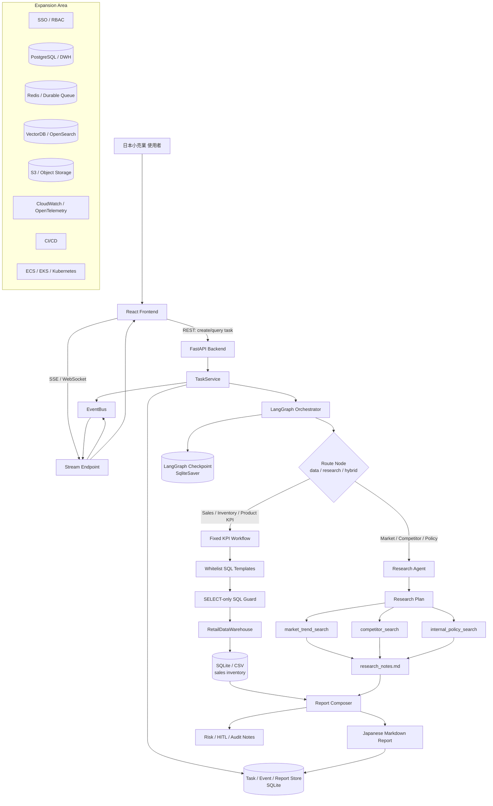
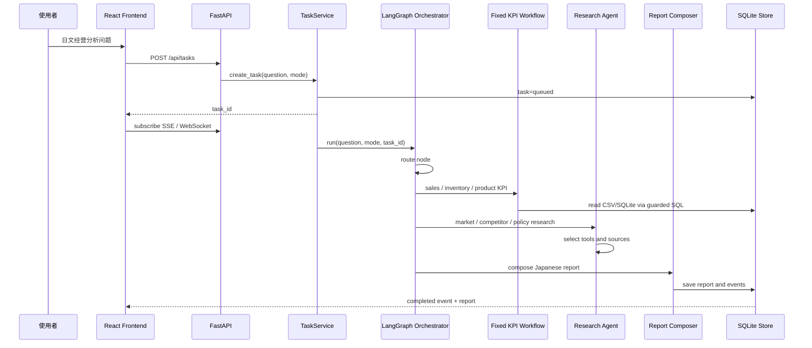
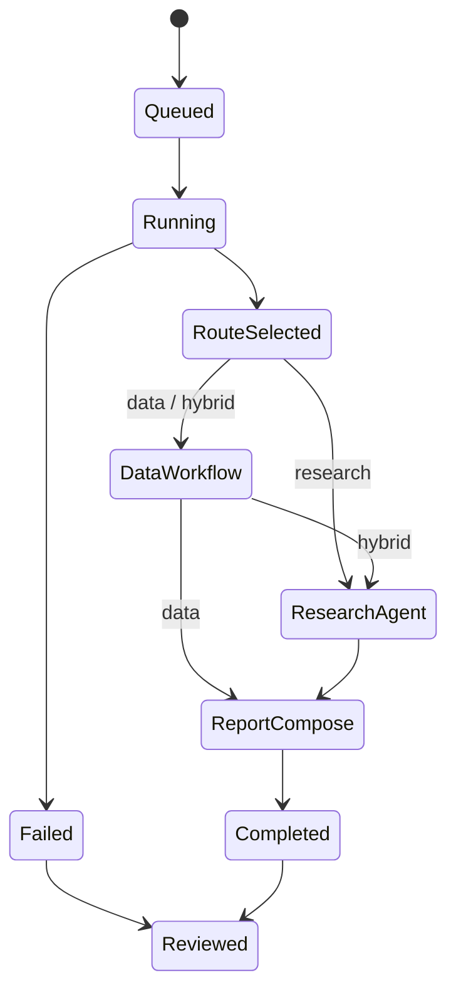
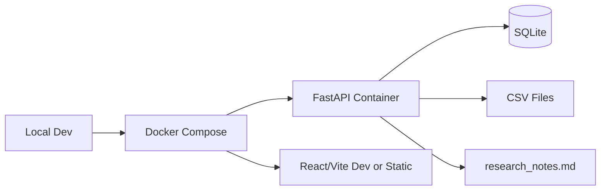
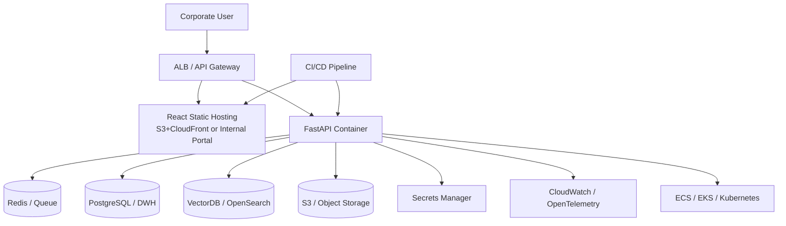

# PRJ-022 japan_retail_analysis_agent

> 统一项目名称：**小売業向け AI 経営分析システム**  
> 面试表达：**小売業向け AI 経営分析システムの開発を担当しました。**

## 元数据

- 项目 ID: PRJ-022
- main.py: `ai-learn/agent-advanced/projects/japan_retail_analysis_agent/main.py`
- 项目目录: `ai-learn/agent-advanced/projects/japan_retail_analysis_agent/`
- 主项目: 是
- 业务领域: 日本小売业经营分析
- 核心能力: React、FastAPI、REST、SSE、WebSocket、TaskService、LangGraph StateGraph、SqliteSaver checkpoint、SQLite task/event/report store、固定 KPI workflow、Research Agent、本地工具、日文 Markdown report、Dockerfile、docker-compose、unittest
- 关联知识点: KN-RAG-001～009, KN-API-001, KN-STREAM-001, KN-AGENT-003, KN-LANGGRAPH-001

## Business

### 业务背景

本系统面向日本小売业客户的经营分析业务。客户拥有多店舗、多地域、多商品、多渠道销售数据，需要在经营会议前快速整理销售、库存、商品、粗利、促销、市场趋势和竞品信息。

业务人员通常需要从 Excel、CSV、数据库、社内资料、调查报告中手工整理数据和结论。这个过程耗时，且容易出现统计口径不统一、来源不清晰、风险事项遗漏的问题。

小売業向け AI 経営分析システム的目标是把固定 KPI 分析、市场调查、社内资料确认、日文经营报告生成整合到一个工作流中，让经营分析过程更清晰、可追踪、可 Review。

### 客户需求

- 月次销售分析：按月份、分类、地域确认销售额、粗利、客数。
- 地域别销售差异：识别地域表现差异和异常波动。
- 商品别粗利分析：识别高销售低粗利、低销售高粗利商品。
- 库存风险检测：发现欠品、过剩库存、补货风险。
- 市场趋势调查：整理市场变化和消费者需求变化。
- 竞品调查：确认竞争对手活动、价格、促销方向。
- 社内政策检索：确认促销、折扣、库存处理是否符合内部规则。
- 经营层日文报告生成：输出适合会议前阅读的日本语 Markdown report。
- 任务进度实时显示：分析执行过程中实时显示 route、workflow、research、report 的进度。

### 项目现场设定

| 角色 | 主要职责 |
| --- | --- |
| PM | 业务范围、优先级、验收条件、日程管理 |
| TL | 架构 Review、技术选型、代码 Review、风险判断 |
| Backend | FastAPI、Task API、TaskService、Repository、SSE/WebSocket |
| Frontend | React、任务列表、进度流、报告展示 |
| AI Engineer | LangGraph、Research Agent、Prompt、RAG/Tool 设计 |
| QA | 测试设计、异常系、回归测试、报告校验 |
| Infra | Docker、环境变量、日志、部署验证 |

## Requirement

### 业务需求

- 使用者可以输入日文经营分析问题。
- 系统按问题类型选择 `data`、`research`、`hybrid` 模式。
- KPI 类问题要稳定、可复核、可测试。
- 市场、竞品、社内资料类问题要保留来源。
- 报告必须区分数据库结果、调查结果、风险、人工确认事项。
- 前端需要看到任务状态和最终报告。

### 系统需求

- FastAPI 提供任务创建、任务查询、事件流和健康检查。
- TaskService 管理任务生命周期，避免 HTTP Router 直接调用 workflow。
- LangGraph 管理 route、data workflow、research agent、report node。
- SQLite 承担任务、事件、报告、checkpoint 存储。
- CSV / SQLite 管理经营数据，`research_notes.md` 管理市场和社内资料。
- Docker/docker-compose 提供统一运行方式。

### 非功能需求

- API schema 清晰。
- 任务状态可追踪。
- 事件流顺序可解释。
- 日志和 trace_id 可用于障害调查。
- 权限、审计、监控、CI/CD、Kubernetes、DWH、企业搜索作为扩展设计。

## Architecture

### 整体架构



### Sequence / 调用流程



### State Flow / 状态流



## 技术选型

### FastAPI

FastAPI 负责 API 边界。系统需要任务创建、任务查询、事件流、报告取得、health check，因此需要清晰的 HTTP schema 和异步处理能力。FastAPI 与 Python 数据处理、LangGraph、Streaming 的组合比较自然。

### LangGraph

系统包含 route、data workflow、research agent、report generation 多个节点。LangGraph 的 State、Node、Edge、Conditional Edge、checkpoint 让 workflow 结构更清晰，也方便 TL Review 时说明每个节点的输入、输出和状态更新。

### SSE / WebSocket

SSE 用于任务进度单向推送，例如 started、workflow_completed、research_completed、completed。WebSocket 用于后续双向交互，例如任务取消、追加问题、承认操作。两者按交互方向区分。

### 固定 SQL + Research Agent

KPI 查询必须稳定，所以销售额、粗利、库存、地域差异这类问题走固定 SQL / whitelist workflow。让 Agent 自由生成 SQL 会带来 SQL Injection、Hallucination、数字口径不一致、审计困难和性能不可控。

市场调查、竞品调查、社内政策检索则由 Research Agent 处理，因为这些任务的问题形式和信息来源更加灵活。

## 自己负责内容

面试中可以这样说明：

- API：FastAPI router、请求/响应 schema、health、task API。
- Workflow：LangGraph route、data workflow、research agent、report generation。
- KPI：固定 SQL 模板、SELECT-only guard、销售/库存/商品分析。
- Research Agent：市场趋势、竞品、社内政策工具和来源整理。
- Streaming：SSE / WebSocket 事件设计和状态流。
- Report：日文 Markdown 经营分析报告、风险、人工确认事项。
- Docker：Dockerfile、docker-compose、环境变量整理。
- System Design：职责分离、扩展点、权限、审计、监控、部署设计。

## Database

### 当前数据结构

- `sales.csv`：销售、粗利、客数、地域、商品等经营数据。
- `inventory.csv`：库存、欠品、过剩风险。
- SQLite：任务、事件、报告、checkpoint。
- `research_notes.md`：市场趋势、竞品、社内政策资料。

### 扩展设计

- PostgreSQL / MySQL / DWH：经营数据只读连接，使用连接池、超时、查询成本限制。
- Redis / durable queue：任务状态、事件缓存、后台任务队列。
- VectorDB / OpenSearch：社内资料、Wiki、Confluence、SharePoint 检索。
- S3 / Object Storage：报告、附件、原始文件。
- Audit DB：用户、权限、检索、工具调用、报告生成审计。

## Deployment

### Local / Docker Compose



### Cloud / Kubernetes



## Risk

- 经营数字口径不一致。
- Research Agent 引用旧资料或低可信来源。
- SSE/WebSocket 在代理、超时、断线重连下需要额外设计。
- 权限、审计、日志、trace_id 不足会影响障害调查。
- SQL 安全、prompt injection、tool allowlist 需要持续 Review。

## Production Gap

| Gap | 当前设计 | 扩展方向 | 优先级 |
| --- | --- | --- | --- |
| Authentication | API 可扩展认证层 | SSO / OAuth / OIDC / SAML | 高 |
| RBAC / ACL | 设计中保留权限字段 | role、tenant_id、department_id、document_acl | 高 |
| SQL Safety | SELECT-only guard | SQL AST parser、表/字段白名单、最大行数、超时 | 高 |
| Database | SQLite / CSV | PostgreSQL / DWH 只读账号、连接池、migration | 高 |
| Queue | TaskService 后台执行 | Redis Queue / Celery / Arq / Cloud Tasks | 高 |
| Search | research_notes.md | SharePoint / Confluence / OpenSearch / VectorDB | 中 |
| Observability | 基础日志和 metrics | trace_id、OpenTelemetry、CloudWatch、Grafana | 高 |
| CI/CD | Docker 构成 | test、lint、build、image scan、deploy pipeline | 中 |
| Security | Tool 分层 | tool allowlist、prompt injection test、secret 管理 | 高 |

## TL Review

### 如果我是日本现场 TL，我会这样 Review

| TL 追问 | 推荐回答 |
| --- | --- |
| 为什么 SQLite？ | 当前用于任务、事件、报告和 checkpoint 的轻量持久化。扩展时会替换为 PostgreSQL/DWH，并加 migration、备份、连接池。 |
| 为什么不用 Redis？ | 任务量较小时 SQLite 可以保存事件。并发任务和横向扩展时会引入 Redis 或 durable queue。 |
| 为什么不用 VectorDB？ | 当前资料量以 research_notes 为主。文档规模扩大后，会接 OpenSearch/VectorDB，并在检索层加入 ACL filter。 |
| 为什么 SSE 和 WebSocket 都有？ | SSE 适合进度单向推送，WebSocket 适合任务取消、追加问题、承认操作等双向交互。 |
| 为什么 LangGraph？ | 处理包含 route、data、research、report 多节点状态流，便于 Review、checkpoint 和后续恢复设计。 |
| SQL 安全怎么保证？ | 固定 SQL、SELECT-only guard、whitelist workflow。扩展时加 AST parser、字段白名单、超时、最大行数。 |
| 多租户怎么做？ | tenant_id 贯穿 API schema、task、checkpoint、repository、数据访问和日志。 |
| 日志和 trace_id 怎么设计？ | request_id / task_id / user_id / tenant_id 进入结构化日志；LangGraph node、SQL、tool call、report generation 写 trace span。 |

## Enterprise Upgrade

升级建议按风险顺序推进：

1. API 契约固定：请求/响应 schema、错误码、event type。
2. 身份与权限：SSO、RBAC、tenant_id、department_id。
3. SQL 安全：AST parser、白名单、参数绑定、超时、最大行数。
4. 数据源升级：CSV/SQLite -> PostgreSQL/DWH。
5. Research 升级：research_notes.md -> SharePoint/Confluence/OpenSearch/VectorDB。
6. 任务系统升级：TaskService -> durable queue。
7. 观测性：trace_id、OpenTelemetry、metrics、dashboard、alert。
8. LangGraph 升级：interrupt/resume、人工审批 UI、幂等恢复。
9. CI/CD：测试、构建、镜像扫描、部署、rollback。
10. 负载与安全测试：SSE/WebSocket、prompt injection、权限越权、故障演练。

## 日本现场开发怎么讲

### 基本设计书会写什么

- 背景：日本小売业经营分析。
- 系统范围：销售/库存 KPI、市场/竞品/社内资料调查、日文报告、任务进度。
- 使用者：经营企画、店铺管理、数据分析担当。
- 外部系统：DWH、SharePoint、Confluence、社内 Wiki。
- 非功能：权限、审计、性能、可用性、运维监控。

### 详细设计书会写什么

- FastAPI router、TaskService、Repository、EventBus 的职责。
- LangGraph State、Node、Edge、Conditional Edge。
- Fixed KPI Workflow 的 SQL 模板和 guard。
- Research Agent 的 tool schema、source metadata、错误处理。
- Report Composer 的输出结构、风险和人工确认事项。

### API设计书会写什么

- `POST /api/tasks`：创建分析任务。
- `GET /api/tasks/{task_id}`：查询任务状态和报告。
- `GET /api/tasks/{task_id}/events`：SSE 事件流。
- WebSocket endpoint：双向交互扩展。
- 错误码、trace_id、认证头、权限字段。

### 测试设计会写什么

- 正常系：data/research/hybrid/auto。
- 异常系：不存在 task、SQL guard 拦截、tool 失败、report 生成失败。
- 权限系：tenant 越权、department 越权、文档 ACL。
- 性能系：并发任务、长连接、任务超时。
- 回归系：固定 KPI 的 expected result、报告引用正确率。

## Continue Learning

- LangGraph interrupt/resume：把人工确认升级为真实审批流程。
- RAG ACL：把 research_notes 替换为 SharePoint/Confluence/VectorDB，并做权限过滤。
- Observability：用 trace_id 打通 API、TaskService、LangGraph node、SQL、tool call。
- Evaluation：建立经营问数 golden set 和报告引用正确率评估。
- Deployment：从 docker-compose 迁移到 ECS/EKS/Kubernetes。

## 日本现场如何介绍

```text
小売業向け AI 経営分析システムの開発を担当しました。
売上、粗利、在庫などの経営 KPI は、数値の正確性と監査性が必要なため、固定 SQL テンプレートと固定 workflow で処理しています。
一方、市場トレンド、競合情報、社内ポリシーの確認は、質問によって必要な情報が変わるため、Research Agent が tool を選択して調査します。

構成としては、React、FastAPI、TaskService、SSE / WebSocket、LangGraph StateGraph、SQLite checkpoint、Report Composer、Docker を組み合わせています。
私は API 設計、workflow、Research Agent、固定 KPI 分析、Streaming、日文レポート生成、Docker、システム設計を担当しました。
```
