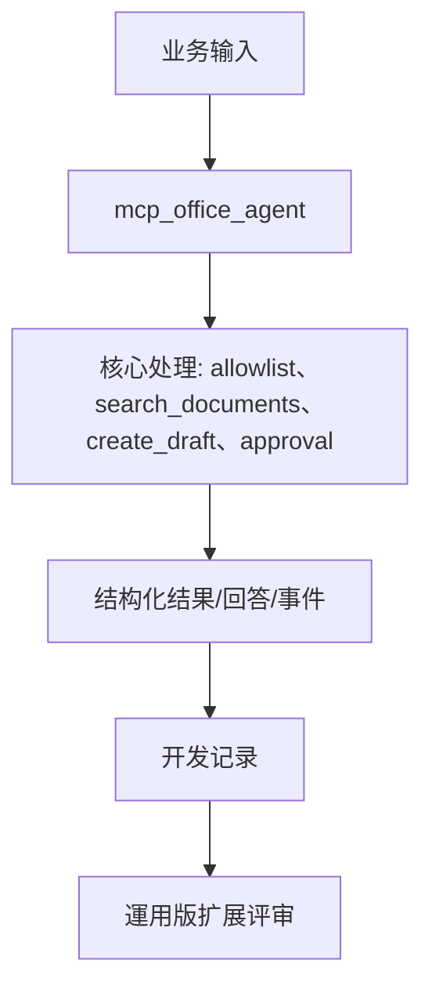
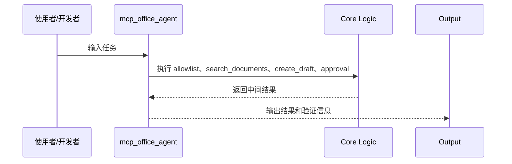
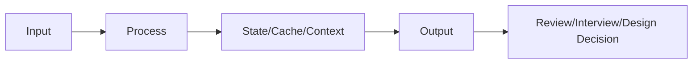
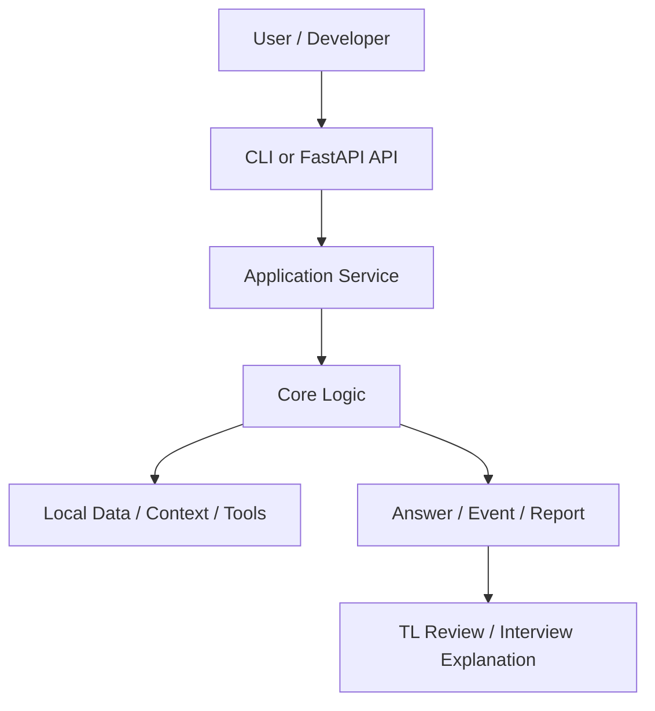
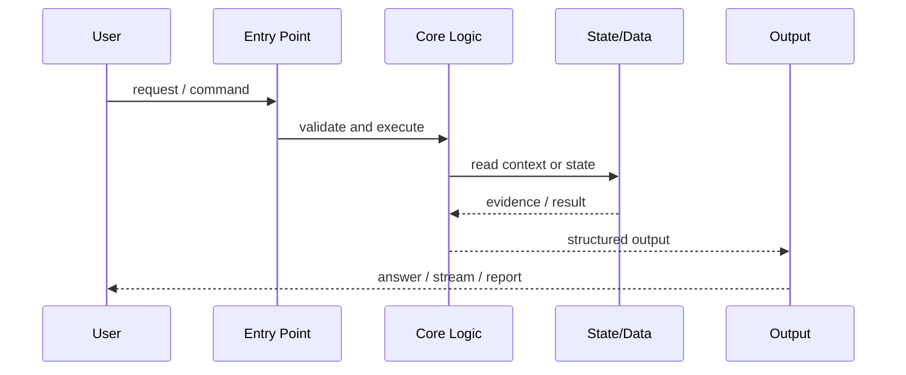
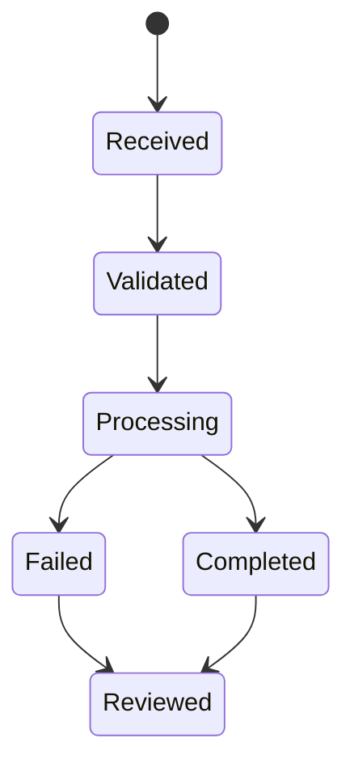
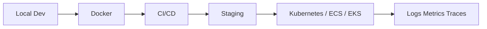

# PRJ-025 mcp_office_agent

## 元数据

- 项目 ID: PRJ-025
- main.py: `ai-learn/agent-advanced/business-agents/mcp_office_agent/main.py`
- 定位: 小売業向け AI 経営分析システム
- 领域: MCP Office Agent
- 验证重点: allowlist、search_documents、create_draft、approval
- 关联知识点: KN-AGENT-001, DES-MCP-002

## 1. 项目背景

本项目小売業向け AI 経営分析システム的开发模块。它用于验证 `allowlist、search_documents、create_draft、approval` 如何支撑小売業向け AI 経営分析システム的设计讨论、基本设计、详细设计、代码 Review 和面试说明。

## 2. 业务目标

- 验证日本小売業務是否可以通过 AI 辅助降低人工检索、整理、审查或响应成本。
- 为社内知识库、客服、审批、文档检索、代码 Review、SES 营业支援等场景积累可说明的 開発経験。
- 适合 IT 服务公司、SES 现场、自社开发团队、受托开发团队和 AI 開発チーム。

## 3. 系统目标

- 输入业务请求或技术任务。
- 执行该模块所需的核心处理。
- 输出可解释、可 Review、可扩展的结果。
- 保留升级到正式小売業向け AI 経営分析システム时需要补充的边界：认证、权限、审计、日志、监控、CI/CD、Kubernetes、多租户。

## 4. 技术架构

### 调用流程图

### 数据流图

## 5. 技术选型

- Python: AI 生态、开发速度和脚本化验证效率高。
- FastAPI: API 化が必要なプロジェクトでは FastAPI を使い、CLI やルール設計だけで十分な場合は過剰に導入しない。
- SSE: 長時間処理や逐次生成が必要な場合のみ SSE を使う。同期応答で十分な場合は導入しない。
- RAG: 社内文書やナレッジを根拠に回答する必要がある場合に RAG を使う。固定ルールや小規模データだけなら RAG は不要。
- LangGraph: 状態、分岐、レビュー、再実行、人手承認が必要になった段階で LangGraph を検討する。単純な一方向処理では Workflow 関数で十分。
- 不用其它方案的理由: 当前阶段优先验证核心链路，不提前引入会增加维护成本的组件。

## 6. 自己负责内容

个人研发视角下，本项目可以说明自己负责了后端逻辑、API 或 CLI 边界、核心处理流程、Prompt 或规则设计、调试、README 文档、测试观点整理，以及后续 Docker / CI/CD 扩展方向评估。

## 7. 運用版扩展

进入正式项目需要补充：

- 登录和用户识别
- RBAC / ACL 权限
- 审计日志
- 结构化日志和 trace_id
- Redis 缓存或任务状态
- VectorDB / DB 持久化
- CI/CD
- Docker / Kubernetes
- 监控、告警、容量规划
- 多租户隔离

## 8. 技术难点

- 開発段階要避免过度设计，同时保留企业扩展路径。
- 需要把“能跑”升级为“能说明为什么这样设计”。
- 需要明确已实现能力、扩展能力和运用设计。

## 9. TL Review

日本 TL 会重点看：

- 命名是否能表达业务含义
- 是否有异常处理和日志
- 是否有测试观点
- 是否存在硬编码配置
- 是否能扩展到正式项目
- 是否清楚说明担当范围和设计意图

## 10. 日本现场如何介绍

Office 操作の安全境界を確認する 開発 です。

面接や設計レビューでは、小売業向け AI 経営分析システムの構成要素として、設計意図、担当範囲、今後の拡張ポイントを説明します。

## 11. 面试说明要点

- 这是小売業向け AI 経営分析システム的组成模块。
- 能说明业务目标、系统目标、技术选型、限制和扩展方向。
- 能说明自己负责的后端、API、RAG、Streaming、Tool、Workflow、Prompt、调试、文档或 Docker 相关工作。

## 12. 关联

- 知识点: KN-AGENT-001, DES-MCP-002
- 项目索引: `02_INDEX_项目.md`
- 设计决策索引: `03_INDEX_设计决策.md`
- 面试索引: `05_INDEX_日本AI现场面试.md`

<!-- ENTERPRISE-HANDBOOK-UPGRADE-V1 -->

---

# Enterprise Handbook Upgrade

> 本节说明该模块如何进入小売業向け AI 経営分析システム的系统设计、Review 和运用扩展。

## Business

本项目用于验证小売業向け AI 経営分析システム 在内部研发中的可行性。业务价值核心不在于“使用某个框架”，而是降低资料检索、报告整理、工具调用、问答响应或流程编排的人工成本，并形成可 Review 的架构资产。

## Requirement

- 明确输入、输出、使用者和业务边界。
- 结果必须可解释、可追溯、可测试。
- 開発段階允许本地数据和 mock provider，但必须标注运用扩展。
- 面试说明必须区分已实现能力和未来扩展能力。

## Architecture

## Sequence

## State Flow

## Database

开发初期可使用内存、CSV、Markdown 或 SQLite。運用版应按数据性质选择 PostgreSQL、DWH、VectorDB、Redis、对象存储和审计数据库。任何涉及权限的数据都必须带 user_id、tenant_id、source_id、trace_id。

## Deployment

## Risk

- 担当范围、权限、监控和审计没有说明清楚。
- 缺认证、授权、审计、监控。
- 外部模型、VectorDB、工具服务不可用。
- RAG 来源不准或权限越权。
- Streaming 错误状态处理不一致。

## Production Gap

本格運用版通常需要补充 authentication、RBAC、多租户、Redis、VectorDB、structured logs、OpenTelemetry、audit trail、CI/CD、Kubernetes、alert、load test、security scan、backup、rollback。

## TL Review

日本 TL 会追问：为什么这样设计、为什么不用其它方案、本格運用に向けた拡張ポイント、障害时如何定位、日志与监控在哪里、权限如何控制、性能瓶颈在哪里、扩展到 100 倍数据量怎么办。

## Enterprise Upgrade

升级顺序建议：接口契约和评估集 -> 服务分层 -> 权限与审计 -> 持久化和缓存 -> 观测性 -> 异步任务和恢复 -> CI/CD -> 容器和 Kubernetes -> 负载测试 -> 正式运维流程。

## Continue Learning

继续学习不应只看教程，而要看官方文档确认 API，读源码理解抽象边界，参考 GitHub 小売業向け AI 経営分析システム结构，补充安全、观测、部署和障害対応能力。
