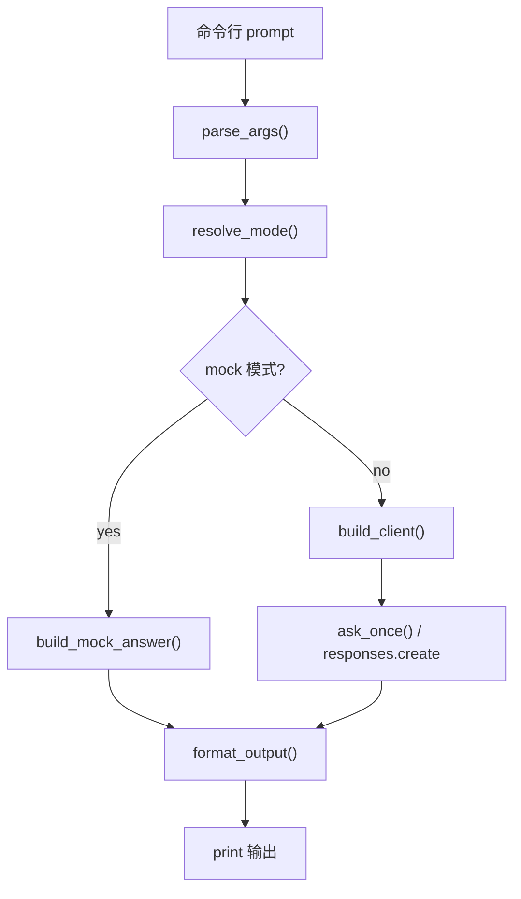

# 02. 模型调用基础

这一章只解决一件事：

> 让 Python 程序稳定完成一次模型调用。

先把这条最小链路跑通，后面的结构化输出、RAG、FastAPI、Tool Calling 才有基础。

```text
命令行输入 -> Python 程序 -> OpenAI Client -> 模型响应 -> 终端输出
```

## 1. 学完要会什么

完成本章后，应该能做到：

- 从环境变量读取 `OPENAI_API_KEY`
- 创建 `OpenAI` 客户端
- 发送一次 `responses.create(...)` 请求
- 读取 `response.output_text`
- 用命令行参数传入 prompt 和模型名
- 区分 mock 模式和真实 API 模式
- 看懂并修改 [chat_cli](../agent-lab/projects/chat_cli/README.md)

## 2. 核心概念

| 名词 | 可以理解成什么 | 在代码里对应什么 |
| --- | --- | --- |
| API Key | 调用权限凭证 | `OPENAI_API_KEY` |
| Client | Python SDK 客户端 | `OpenAI(api_key=...)` |
| Model | 使用哪个模型回答 | `model="gpt-5"` |
| Instructions | 给模型的行为说明 | `instructions=...` |
| Input | 本次用户问题 | `input=prompt` |
| Response | 模型返回结果 | `response.output_text` |

一句话理解：

```text
Python 负责组织请求和处理结果，模型负责根据输入生成内容。
```

## 3. 最小调用流程



如果 Markdown 预览器不支持 Mermaid，可以按下面的文本流程理解：

```text
prompt
  -> 解析命令行参数
  -> 判断 mock / real
  -> mock: 生成假回答
  -> real: 创建 client 并调用 responses.create
  -> 格式化输出
  -> print
```

对应 demo：

- [../agent-lab/projects/chat_cli/README.md](../agent-lab/projects/chat_cli/README.md)
- [../agent-lab/projects/chat_cli/main.py](../agent-lab/projects/chat_cli/main.py)

## 4. 最小代码

```python
import os
import sys

from openai import OpenAI


def main() -> None:
    # 读取 API Key，缺失则退出
    api_key = os.getenv("OPENAI_API_KEY")
    if not api_key:
        print("ERROR: OPENAI_API_KEY is not set.", file=sys.stderr)
        sys.exit(1)

    # 创建客户端并发起一次模型调用
    client = OpenAI(api_key=api_key)
    response = client.responses.create(
        model="gpt-5",
        instructions="You are a concise assistant.",
        input="用一句话解释什么是 RAG",
    )
    # 输出模型返回的文本结果
    print(response.output_text)


if __name__ == "__main__":
    # 脚本入口
    main()
```

先看懂 4 步：

1. 读 Key
2. 建客户端
3. 发请求
4. 打印结果

## 5. 推荐练习项目

正式可运行 demo 在：

- [../agent-lab/projects/chat_cli](../agent-lab/projects/chat_cli)

从仓库根目录运行：

```bash
# mock 模式：无需 API Key
python3 ai-learn/agent-lab/projects/chat_cli/main.py --mock "用一句话解释什么是 agent"
# mock 模式：限制输出长度
python3 ai-learn/agent-lab/projects/chat_cli/main.py --mock --max-chars 80 "详细解释 RAG 和 Agent 的区别"
```

有 API Key 后再跑真实模式：

```bash
# 设置 API Key，准备真实调用
export OPENAI_API_KEY="your_api_key"
# real 模式：发起实际请求
python3 ai-learn/agent-lab/projects/chat_cli/main.py --real "给我一个三步学习计划"
```

也可以进入项目目录运行：

```bash
# 进入 demo 目录运行
cd ai-learn/agent-lab/projects/chat_cli
# mock 模式：快速测试
python3 main.py --mock "你好"
```

## 6. 读 `chat_cli/main.py` 时看哪里

| 函数 | 层次 | 重点 |
| --- | --- | --- |
| `parse_args()` | 输入层 | 命令行参数如何进入程序 |
| `resolve_mode()` | 配置层 | auto / mock / real 如何切换 |
| `build_client()` | 基础设施层 | API Key 和 SDK 客户端在哪里处理 |
| `ask_once()` | 调用层 | mock 回答或真实 API 调用 |
| `run_interactive()` | 控制层 | 连续提问、退出、异常处理 |
| `format_output()` | 输出层 | 输出截断这种业务规则怎么加 |

## 7. 常见错误

| 问题 | 表现 | 处理 |
| --- | --- | --- |
| 没有 API Key | `OPENAI_API_KEY is not set` | 先用 `--mock`，或设置环境变量 |
| 模型名不可用 | 请求失败 | 先用项目默认模型 |
| 依赖没装 | `ModuleNotFoundError: openai` | `pip install -r ai-learn/agent-lab/projects/chat_cli/requirements.txt` |
| 路径不对 | 找不到 `main.py` | 先确认当前目录 |
| 只会跑不会改 | 不知道改哪里 | 先改 `instructions`、`--model`、`--max-chars` |

## 8. 练习任务

按难度推进：

1. 修改 `SYSTEM_INSTRUCTIONS`，让回答固定使用中文。
2. 用 `--max-chars` 比较完整输出和截断输出。
3. 给 `chat_cli` 增加 `--max-lines` 参数。
4. 把 `build_mock_answer()` 改成两种模板，通过参数切换。

## 9. 验收标准

学完本章，至少要能回答：

- `OPENAI_API_KEY` 在哪里读取？
- mock 模式为什么不需要 API Key？
- `responses.create(...)` 的输入和输出分别是什么？
- `response.output_text` 是什么？
- 如果要换模型名，应该改哪里？

## 10. 下一章

完成本章后进入：

- [03-结构化输出.md](./03-结构化输出.md)
