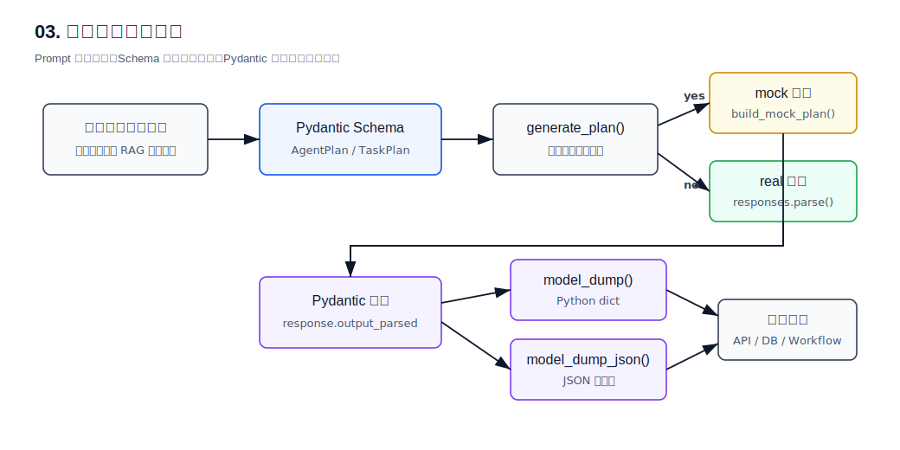

# 03. 结构化输出

这一章解决的问题是：

> 不要只拿一段自由文本，而是让模型返回程序可以直接使用的数据结构。

在实际项目里，很多生成 AI 应用最终都要接后端、数据库、前端或工作流。系统更需要稳定字段，而不是一大段不好解析的自然语言。

```text
自然语言需求 -> Schema -> 模型解析输出 -> Pydantic 对象 -> JSON / API / 后续流程
```

## 1. 为什么重要

结构化输出适合这些场景：

- 邮件分类
- FAQ 路由
- 需求摘要
- 任务拆解
- 风险点提取
- 表单内容整理
- 后端 API 返回固定 JSON

核心价值：

- 字段稳定
- 类型可校验
- 结果能被程序继续处理

## 2. 学完要会什么

完成本章后，应该能做到：

- 知道为什么要定义 schema
- 能看懂 `Pydantic BaseModel`
- 能使用 `responses.parse(...)`
- 能读取 `response.output_parsed`
- 能把对象转成 dict 或 JSON
- 能修改 [structured_output_demo](../agent-lab/projects/structured_output_demo/README.md)

## 3. 核心概念

| 名词 | 可以理解成什么 | 代码里对应什么 |
| --- | --- | --- |
| Schema | 数据合同 | `class AgentPlan(BaseModel)` |
| Field | 字段说明和约束 | `Field(description=...)` |
| Literal | 固定可选值 | `Literal["beginner", ...]` |
| Parser | 结构化解析 | `client.responses.parse(...)` |
| Parsed object | 已校验对象 | `response.output_parsed` |
| JSON | 系统交换格式 | `model_dump_json(...)` |

一句话理解：

```text
Prompt 告诉模型做什么，Schema 告诉系统结果必须长什么样。
```

## 4. 数据流

优先看这张 SVG 图。相比 Mermaid，它在普通 Markdown 预览器里更容易显示：



文本版流程如下：

```text
用户自然语言需求
  -> AgentPlan / Pydantic schema 定义数据合同
  -> generate_plan()
  -> mock 模式: build_mock_plan()
  -> real 模式: responses.parse()
  -> AgentPlan 对象
  -> model_dump() / model_dump_json()
  -> pretty JSON / raw JSON
```

对应 demo：

- [../agent-lab/projects/structured_output_demo/README.md](../agent-lab/projects/structured_output_demo/README.md)
- [../agent-lab/projects/structured_output_demo/main.py](../agent-lab/projects/structured_output_demo/main.py)

## 5. 最小代码

```python
import os
import sys

from openai import OpenAI
from pydantic import BaseModel


# 定义结构化输出的 schema（目标 + 步骤）
class TaskPlan(BaseModel):
    goal: str
    steps: list[str]


def main() -> None:
    # 读取 API Key，缺失则退出
    api_key = os.getenv("OPENAI_API_KEY")
    if not api_key:
        print("ERROR: OPENAI_API_KEY is not set.", file=sys.stderr)
        sys.exit(1)

    # 创建客户端并请求结构化输出
    client = OpenAI(api_key=api_key)
    response = client.responses.parse(
        model="gpt-4o",
        instructions="Return a concise structured plan in Chinese.",
        input="帮我制定一个学习 RAG 的三步计划",
        text_format=TaskPlan,
    )

    # 获取已校验的结构化对象并输出 JSON
    plan = response.output_parsed
    print(plan.model_dump_json(ensure_ascii=False, indent=2))


if __name__ == "__main__":
    # 脚本入口
    main()
```

看懂 5 点就够进入下一步：

1. `TaskPlan` 定义结果结构
2. `responses.parse()` 请求结构化结果
3. `text_format=TaskPlan` 指定 schema
4. `output_parsed` 是已校验对象
5. `model_dump_json()` 转成 JSON

## 6. 推荐练习项目

正式可运行 demo 在：

- [../agent-lab/projects/structured_output_demo](../agent-lab/projects/structured_output_demo)

从仓库根目录运行：

```bash
# mock 模式：快速验证结构化输出链路
python3 ai-learn/agent-lab/projects/structured_output_demo/main.py --mock "做一个客服 Agent 的开发计划"
# mock 模式：生成 RAG 学习路线
python3 ai-learn/agent-lab/projects/structured_output_demo/main.py --mock "给我一个 RAG 学习路线"
```

有 API Key 后：

```bash
# 设置 API Key，切换到 real 模式
export OPENAI_API_KEY="your_api_key"
# 真实调用模型返回结构化输出
python3 ai-learn/agent-lab/projects/structured_output_demo/main.py --real "帮我做一个知识库问答 PoC"
```

也可以进入项目目录运行：

```bash
# 进入 demo 目录再运行
cd ai-learn/agent-lab/projects/structured_output_demo
# mock 模式：生成文档摘要工具计划
python3 main.py --mock "做一个文档摘要工具"
```

## 7. 读 `structured_output_demo/main.py` 时看哪里

| 位置 | 层次 | 重点 |
| --- | --- | --- |
| `AgentPlan` | 数据合同层 | 输出字段、类型、枚举值 |
| `parse_args()` | 输入层 | 用户需求和模式参数 |
| `resolve_mode()` | 配置层 | mock / real 切换 |
| `build_client()` | 基础设施层 | API Key 与客户端 |
| `generate_plan()` | 调用层 | mock 结构或 `responses.parse()` |
| `main()` | 输出层 | pretty JSON 和 raw JSON |

## 8. 不要只靠“请输出 JSON”

只在 prompt 里写“请输出 JSON”有几个风险：

- 字段名可能变化
- 类型可能变化
- 可能多出解释文字
- 可能少字段

更稳的方式是：

1. 用 `BaseModel` 定义结构
2. 用 `responses.parse()` 获取结果
3. 用 Pydantic 校验字段和类型

## 9. Schema 怎么设计

初学阶段不要把 schema 设计得太大。建议先控制在 3 到 6 个字段。

推荐字段类型：

- `str`：标题、摘要、理由
- `list[str]`：步骤、风险、建议
- `Literal[...]`：优先级、分类、状态
- `int`：评分、数量
- `bool`：是否需要人工确认

一个好 schema 应该满足：

- 字段名清楚
- 类型明确
- 枚举值可控
- 后续代码能直接使用

## 10. 常见错误

| 问题 | 表现 | 处理 |
| --- | --- | --- |
| schema 太松 | 字段值不好用于分支判断 | 用 `Literal` 或更明确字段 |
| schema 太复杂 | 初学阶段调试困难 | 先从 3 到 6 个字段开始 |
| 只打印 JSON | 后续没有使用价值 | 尝试写文件或接 API 返回 |
| mock 和 real 混淆 | 以为 mock 是模型真实能力 | mock 只用于练代码结构 |
| 没有处理解析失败 | 程序直接报错 | 增加异常处理和错误提示 |

## 11. 练习任务

按难度推进：

1. 给 `AgentPlan` 增加 `timeline` 字段。
2. 给 `priority` 使用 `Literal["low", "medium", "high"]`。
3. 增加 `--save plan.json`，把结构化结果写入文件。
4. 把输出接到一个简单 FastAPI endpoint。

## 12. 验收标准

学完本章，至少要能回答：

- 为什么 schema 比“请输出 JSON”更稳定？
- `BaseModel` 定义了什么？
- `responses.parse()` 和 `responses.create()` 的区别是什么？
- `output_parsed` 和 `output_text` 的区别是什么？
- `model_dump()` 和 `model_dump_json()` 分别适合什么场景？

## 13. 下一章

完成本章后进入：

- [04-RAG.md](./04-RAG.md)
