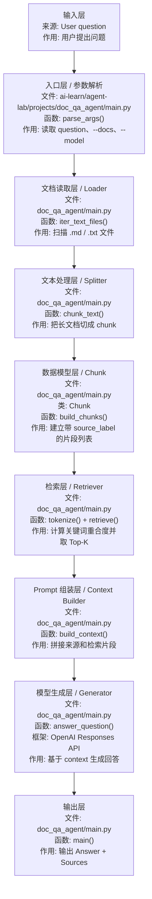

# RAG

## 1. RAG 是什么

`RAG` 是 `Retrieval-Augmented Generation`，中文常叫“检索增强生成”，日语现场常说 `検索拡張生成`。

它不是一个单独的模型，也不是一个固定框架，而是一种 `LLM 应用架构 / 知识库问答框架思路`：

```text
先从外部资料中检索相关内容，再把检索结果交给大模型，让模型基于资料生成回答。
```

在项目里，`RAG` 通常属于：

| 分类 | 说明 |
| --- | --- |
| 技术类型 | LLM 应用架构、知识库问答、社内搜索 |
| 系统层次 | 文档处理层 + 检索层 + Prompt 组装层 + 模型生成层 |
| 常见框架 | LangChain、LlamaIndex、向量数据库、FastAPI |
| 日本现场说法 | `RAG`, `検索拡張生成`, `社内検索`, `ナレッジ検索` |

一句话先记住：

- `RAG` 是让模型“先查资料，再基于资料回答”的 LLM 应用架构。

## 2. 为什么 `RAG` 是主线能力

如果按日本企业现场和派遣案件来看，`RAG` 往往比复杂 Agent 更优先。

因为企业最常见的落地方向是：

- 社内検索
- ナレッジ検索
- 规程问答
- 设计资料检索
- FAQ 问答

这些场景的共同点是：

- 企业已经有资料
- 模型不能只靠“自己知道”
- 回答最好带出处

所以 `RAG` 在现场里的价值，通常比“自由聊天”更高，也往往比“复杂 Agent”更早落地。

## 3. 这一阶段要掌握什么

这一阶段学的是 `RAG 应用开发的核心功能`，不是单纯学某一个 Python 函数。

它对应真实项目中的这些能力：

| 核心功能 | 这是什么知识 | 在系统里的位置 |
| --- | --- | --- |
| 文档读取 | 文件处理 / Document Loader | 文档读取层 |
| 文本切分 | RAG 前处理 / Text Splitter | 文本处理层 |
| 检索 | Search / Retriever | 检索层 |
| 引用来源 | Citation / Source Tracking | 输出可信度层 |
| 问答生成 | LLM Generation | 模型生成层 |
| 检索质量意识 | Evaluation / Retrieval Quality | 评估层 |

这一章至少要掌握这些：

- 文档读取
- 文本切分
- 检索
- 引用来源
- 问答生成
- 检索质量意识

学完以后，你应该能做到：

- 让模型基于你自己的资料回答问题
- 而不是只根据模型预训练知识自由发挥

## 4. 这一章学完后，应该会什么

学完这一章，至少要能做到：

- 知道 `RAG` 的最小流程是什么
- 能读取本地 `md` / `txt` 文档
- 能把文档切成可检索片段
- 能根据问题挑出最相关片段
- 能让模型基于片段回答
- 能在结果里带上来源

## 5. RAG 系统角色先看懂

`RAG` 这章容易卡住，是因为它不再是一次简单模型调用，而是多个模块协作。

先看“是什么”，再看“主要作用”：

| 角色 / 名词 | 日本語 / 现场说法 | 是什么 | 主要作用 | 在示例中的位置 |
| --- | --- | --- | --- | --- |
| Knowledge base | ナレッジベース / 知識ベース | 被查询的外部资料集合 | 保存社内文档、FAQ、规程、设计资料 | `--docs` 指定目录 |
| Loader | ローダー / 読み込み処理 | 读取文件的程序模块 | 把文件内容读进程序 | `iter_text_files()` |
| Chunk | チャンク | 文档切分后的最小检索单位 | 让长文档变成可搜索的小片段 | `Chunk` |
| Retriever | リトリーバー / 検索器 | 从 chunk 里找相关内容的模块 | 根据问题找出相关资料 | `retrieve()` |
| Top-K | 上位 K 件 | 检索结果数量控制 | 控制最多拿几个片段给模型 | `TOP_K` |
| Context builder | コンテキスト生成処理 | 上下文构造器 | 把命中片段拼成模型输入 | `build_context()` |
| Generator | 回答生成 / 生成器 | 调用模型生成回答的模块 | 基于上下文回答问题 | `answer_question()` |
| Citation / Source | 引用元 / 出典 | 答案依据的来源信息 | 说明答案依据来自哪里 | `source_label` |

先记住一句话：

- `RAG` = 检索资料 + 组织上下文 + 基于上下文生成回答。

## 6. RAG 数据流和代码对应



对应到 `ai-learn/agent-lab/projects/doc_qa_agent/main.py`：

| 顺序 | 框架层 | 文件 / 类 / 函数 | 输入是什么 | 输出是什么 | 作用 |
| --- | --- | --- | --- | --- | --- |
| 1 | 输入层 | `parse_args()` | 用户问题、文档目录、模型名 | `args.question`、`args.docs`、`args.model` | 接收用户请求 |
| 2 | 文档读取层 / Loader | `iter_text_files()` | `--docs` 目录 | 文件路径列表 | 找到可读取的 `.md` / `.txt` |
| 3 | 文本处理层 / Splitter | `chunk_text()` | 单个文档文本 | 文本片段列表 | 把长文档切成适合检索的小块 |
| 4 | 数据模型层 | `Chunk` 类 + `build_chunks()` | 文件路径和文本片段 | `list[Chunk]` | 给每个片段加 `source_label` 和 `content` |
| 5 | 检索准备层 | `tokenize()` | 用户问题和 chunk 内容 | 词集合 | 为关键词匹配做准备 |
| 6 | 检索层 / Retriever | `retrieve()` | `question` + `list[Chunk]` | Top-K `Chunk` | 选出最相关的资料片段 |
| 7 | Prompt 组装层 | `build_context()` | Top-K `Chunk` | `Retrieved context` 字符串 | 把来源和片段内容整理成模型输入 |
| 8 | 模型生成层 | `answer_question()` + OpenAI Responses API | `question` + `context` | 模型回答文本 | 要求模型只基于检索上下文回答 |
| 9 | 输出层 | `main()` | 回答文本 + Top-K `Chunk` | `Answer` + `Sources` | 输出最终回答和引用来源 |

## 7. 教程：把 `RAG` 拆成 3 步理解

可以先把 `RAG` 理解成一个 3 步流程：

1. 先找资料
2. 再把相关资料交给模型
3. 让模型基于资料回答

它和普通聊天的主要区别是：

- 普通聊天：模型主要靠已有知识回答
- `RAG`：模型主要靠你提供的资料回答

所以 `RAG` 的核心不是“模型更强”，而是：

- 资料要找对
- 资料要送对
- 回答要能说明依据

## 8. 教程：最小 `RAG` 流程长什么样

最小 `RAG` 一般可以拆成 5 步：

1. 读取文档
2. 切分文档
3. 检索 Top-K 片段
4. 拼接上下文
5. 让模型基于上下文回答

### 步骤 1：读取文档

先把本地资料读进来，例如：

- `md`
- `txt`

这一步的重点不是文档类型多，而是：

- 先把最基本的读取链路跑通

### 步骤 2：切分文档

因为原始文档可能很长，不能整份都直接塞给模型。

所以要先切成小片段。

切分的作用主要是：

- 降低一次送入模型的内容量
- 提高检索的粒度
- 让回答更容易对应到具体来源

### 步骤 3：检索相关片段

最小版本不一定要上向量库。

初学阶段可以先做：

- 关键词匹配
- 关键词重叠计分

重点是先理解“先检索、后回答”这个流程。

### 步骤 4：拼接上下文

把命中的几个片段整理成一段上下文，例如：

- 标明来源标签
- 把内容拼接在一起

这样后面模型在回答时就知道：

- 哪些内容是资料依据

### 步骤 5：基于上下文回答

最后再调用模型，并明确告诉它：

- 只根据提供的上下文回答
- 如果资料不够，就明确说明

这一步很重要，因为企业现场更怕的是：

- 看起来回答得很像对
- 但其实没有依据

## 9. 最小示例

下面给一个适合初学阶段理解的最小示例。

这个示例只做一件事：

- 从本地几段文本里检索最相关内容
- 再让模型基于这些内容回答

```python
import os
import sys

from openai import OpenAI


# 演示用的本地资料（label, content）
DOCS = [
    ("doc1", "RAG 是先检索资料，再基于资料生成回答的方式。"),
    ("doc2", "FastAPI 很适合把文档问答能力包装成后端接口。"),
    ("doc3", "结构化输出适合做分类、提取和任务清单。"),
]


def main() -> None:
    # 读取 API Key，缺失则退出
    api_key = os.getenv("OPENAI_API_KEY")
    if not api_key:
        print("ERROR: OPENAI_API_KEY is not set.", file=sys.stderr)
        sys.exit(1)

    # 用户问题
    question = "RAG 和 FastAPI 有什么关系？"

    # 入门版检索：关键词匹配挑选相关资料
    matched = [item for item in DOCS if "RAG" in item[1] or "FastAPI" in item[1]]
    # 拼接上下文并保留来源标签
    context = "\n\n".join([f"[SOURCE: {label}] {text}" for label, text in matched])

    # 调用模型，约束只基于上下文回答
    client = OpenAI(api_key=api_key)
    response = client.responses.create(
        model="gpt-5",
        instructions=(
            "Answer only from the provided context. "
            "If the context is insufficient, say that clearly."
        ),
        input=(
            f"Question:\n{question}\n\n"
            f"Retrieved context:\n{context}\n\n"
            "Answer based only on the retrieved context."
        ),
    )

    # 输出模型回答
    print(response.output_text)


if __name__ == "__main__":
    # 脚本入口
    main()
```

### 这个最小示例学的是什么

你要从这段代码里看懂 5 个点：

1. `RAG` 不是直接问模型，而是先找资料
2. 上下文是你自己组织进去的
3. 来源标签很重要
4. 模型应该被约束在资料范围内回答
5. `RAG` 的价值在于“资料依据”，不是“回答更花哨”

## 10. 代码拆解

### 1. 为什么先不用向量库

因为初学阶段最重要的是理解流程。

如果一开始就上：

- embeddings
- 向量数据库
- 混合检索

很容易只记住工具名，却没理解 `RAG` 的主线。

更合理的顺序是：

1. 先做关键词检索版
2. 再做带引用版
3. 再做 API 化
4. 再升级向量检索

### 2. 为什么切分很重要

因为如果文档太长：

- 检索粒度太粗
- 上下文太大
- 回答不容易对应到具体出处

所以切分不是可有可无的小细节，而是 `RAG` 的基础环节。

### 3. 为什么一定要有来源

因为企业现场很在意：

- 这句话是从哪里来的
- 能不能回到原始资料
- 回答有没有依据

如果没有来源，问答结果的说服力会明显下降。

### 4. 为什么“检索质量”比“页面效果”更重要

因为 `RAG` 真正的核心问题通常不是：

- 页面够不够好看

而是：

- 有没有找对资料
- 有没有漏掉关键片段
- 回答是否被错误资料带偏

所以在这条学习线上，先把检索逻辑说明白，比先做复杂前端更重要。

## 11. 进一小步：从固定文本进步到本地文档目录

上面的最小示例还是写死的文本列表。

再进一步，你应该学会：

- 遍历本地目录
- 读取 `md` / `txt`
- 按固定大小切分
- 给每个片段打来源标签

这一步就是从“概念示例”进步到“最小文档问答系统”。

## 12. 和当前工作区示例的对应关系

当前工作区里最适合这一章配套练的项目是：

- [ai-learn/agent-lab/projects/doc_qa_agent/README.md](../agent-lab/projects/doc_qa_agent/README.md)

这个示例已经帮你做好了这些基础能力：

- 扫描本地文档目录
- 读取 `md` / `txt`
- 固定大小切分文本
- 用关键词重叠做最小检索
- 生成带来源的回答

如果你已经能读懂并改这个项目，就说明这一章已经基本过关。

下一步再自然过渡到：

- [ai-learn/agent-lab/projects/rag_api_demo/README.md](../agent-lab/projects/rag_api_demo/README.md)

也就是把 `RAG` 从命令行样例升级成 API。

## 13. 最小运行方式

先安装依赖：

```bash
# 安装示例依赖
pip install -r ai-learn/agent-lab/projects/doc_qa_agent/requirements.txt
```

Windows PowerShell 设置环境变量：

```powershell
# Windows PowerShell 设置环境变量
$env:OPENAI_API_KEY="your_api_key"
```

默认读取当前目录下的 `md` / `txt` 文件：

```bash
# 默认读取当前目录下的 md/txt 文档
python ai-learn/agent-lab/projects/doc_qa_agent/main.py "这个目录里数据库相关内容主要讲了什么？"
```

指定文档目录：

```bash
# 指定文档目录
python ai-learn/agent-lab/projects/doc_qa_agent/main.py --docs d:/dev/source_code/vscode_study/java-lab "对日项目里的 RDS 和 Aurora 有什么区别？"
```

指定模型：

```bash
# 指定模型并设置文档目录
python ai-learn/agent-lab/projects/doc_qa_agent/main.py --model gpt-5 --docs d:/dev/source_code/vscode_study/java-lab "总结数据库移行的重点"
```

## 14. 常见错误与排查

### 1. 只调用模型，没有检索

表现通常是：

- 回答看起来流畅
- 但和本地资料关系不强

这不是真正的 `RAG`。

`RAG` 的关键是：

- 检索先发生
- 回答基于检索结果

### 2. 检索到了，但没给来源

表现通常是：

- 回答有内容
- 但无法追溯出处

企业场景里，这会影响可信度。

所以至少要能做到：

- 结果里带来源标签

### 3. 文档切分太粗或太细

表现通常是：

- 太粗：命中片段太长，噪音很多
- 太细：上下文不完整，信息断裂

这时候要调整：

- `chunk size`
- `chunk overlap`

### 4. 检索逻辑说不清楚

这也是常见问题。

如果别人问你：

- 为什么命中这几段
- 为什么不是别的段

你完全解释不出来，那说明还没真正掌握。

这一章不只是要把程序跑通，还要能讲清楚：

- 资料怎么读
- 怎么切
- 怎么排
- 为什么这样回答

## 15. 练习题

下面这些练习题，建议按顺序做。

### 练习 1：替换本地资料

把 `doc_qa_agent` 的文档目录换成你自己的资料，例如：

- Java 笔记
- 对日项目文档
- 公司制度整理

目标：

- 理解 `RAG` 的价值来自“接自己的资料”

### 练习 2：观察引用来源

提 3 到 5 个问题，观察每次命中的来源片段。

目标：

- 训练“看检索结果”而不是只看最终回答

### 练习 3：调整切分参数

尝试修改：

- `CHUNK_SIZE`
- `CHUNK_OVERLAP`

目标：

- 理解切分会直接影响命中质量

### 练习 4：调整 Top-K

尝试修改：

- `TOP_K`

目标：

- 理解“送给模型多少片段”会影响回答质量和噪音

### 练习 5：增加一种文档类型

在现有基础上，尝试支持：

- `csv`
- `json`

目标：

- 理解 `RAG` 的入口不只是一种文件格式

### 练习 6：加一个“资料不足”提示

如果检索不到足够相关的片段，就明确提示：

- 当前资料不足，无法可靠回答

目标：

- 训练“宁可明确不足，也不要假装知道”的意识

## 16. 补充教程怎么选

你发的图片里列了不少 `AI Agent` 学习资源。

这些资源本身有参考价值，但对你当前阶段来说，要有选择地看。

更建议按下面这个顺序吸收：

### 第一类：先看概念型教程

这类资源的价值是：

- 帮你理解 `Agent`、`RAG`、工具调用、大致技术图谱

这一步可以看，但不要停太久。

目标只是：

- 建立全局概念

### 第二类：优先看可运行的 notebook / demo

对当前阶段更有帮助的是：

- 文档问答
- 检索问答
- API 调用
- 最小工具调用

因为这些内容和你现在的学习主线更接近。

### 第三类：再看框架型教程

例如围绕这些方向的教程：

- `LangChain`
- `LlamaIndex`
- `AutoGPT`
- `ReAct`

这些适合放在你已经跑通最小 `RAG` 之后。

否则很容易变成：

- 看懂名词
- 但不会自己搭基础链路

## 17. 从图片里能吸收的有用点

参考你发的这张图，真正值得吸收进当前学习路线的，不是“谁最火”，而是这些判断：

- 先建立 `Agent / RAG` 全局概念是有帮助的
- 但当前主线仍然应该先做可运行 demo
- YouTube / Notebook 类教程适合做补充，不适合替代自己写代码
- `Agent` 资源很多，但你当前更该优先吸收其中和检索、工具调用、工作流有关的部分

如果压缩成一句话，就是：

- 先跑通 `RAG`，再系统补 `Agent`

## 18. 这一章学到什么程度算过关

满足下面这些条件，就可以进入下一章：

- 能解释 `RAG` 的最小流程
- 能读取本地文档并切分
- 能做最小检索
- 能生成带来源的回答
- 能解释切分、检索、Top-K 的作用
- 能读懂并修改 `doc_qa_agent`

## 19. 下一步学什么

这一步完成后，最适合继续学的是：

- [05-FastAPI与企业集成.md](05-FastAPI与企业集成.md)

因为接下来要解决的问题会从：

- 怎么做本地资料问答

变成：

- 怎么把问答能力包装成后端接口，给系统或前端调用

## 20. 日本现场高频关键词

- `RAG`
- `社内検索`
- `ナレッジ検索`
- `手順書検索`
- `規程検索`

## 21. 注意点

- 没有引用来源的问答，在企业现场说服力不够。
- PDF 和 Office 文档支持很重要，但不必一开始就全部做完。
- 只会做页面，不会解释检索逻辑，也不够。
- 先把最小 `RAG` 跑通，再逐步升级向量检索和 API 化。
