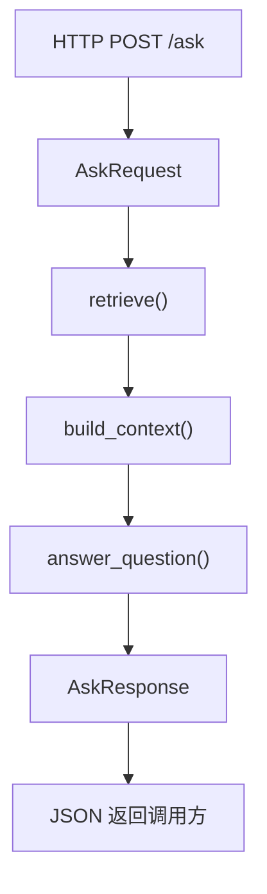

# FastAPI 与企业集成

这一章解决的问题是：把本地 `LLM / RAG` 能力包装成可以被前端、测试工具或企业内部系统调用的 API。

```text
本地脚本 -> FastAPI 服务 -> HTTP 请求/响应 -> 企业系统集成
```

## 1. 学完要会什么

- 知道为什么 CLI demo 不等于后端服务
- 能定义请求模型和响应模型
- 能写 `GET /health`
- 能写 `POST /ask`
- 能理解文档重载、错误处理和服务状态
- 能读懂 [rag_api_demo](../agent-lab/projects/rag_api_demo/README.md)

## 2. 核心概念

| 名词 | 作用 |
| --- | --- |
| `FastAPI()` | 创建服务入口 |
| Request Model | 规定调用方要传什么 |
| Response Model | 规定接口返回什么 |
| `/health` | 给联调、部署、监控确认服务状态 |
| `/ask` | 接收问题并返回模型或 RAG 答案 |
| `/reload` | 重新加载文档或索引 |
| `app.state` | 保存运行时共享状态，如 chunks、client |

## 3. 最小 API 数据流



对应 demo：

- [../agent-lab/projects/rag_api_demo/README.md](../agent-lab/projects/rag_api_demo/README.md)
- [../agent-lab/projects/rag_api_demo/main.py](../agent-lab/projects/rag_api_demo/main.py)

## 4. 最小 FastAPI 示例

```python
from fastapi import FastAPI
from pydantic import BaseModel


# 创建服务入口
app = FastAPI()


# 请求体 schema
class AskRequest(BaseModel):
    question: str


# 响应体 schema
class AskResponse(BaseModel):
    answer: str


# 健康检查端点
@app.get("/health")
def health() -> dict[str, str]:
    return {"status": "ok"}


# 核心问答端点
@app.post("/ask", response_model=AskResponse)
def ask(request: AskRequest) -> AskResponse:
    return AskResponse(answer=f"收到问题: {request.question}")
```

先看懂这 4 点：

1. `app = FastAPI()` 是服务入口
2. `AskRequest` 约束请求字段
3. `AskResponse` 约束返回字段
4. endpoint 函数把业务逻辑接到 HTTP

## 5. 推荐练习项目

从仓库根目录进入 demo：

```bash
# 进入 demo 目录
cd ai-learn/agent-lab/projects/rag_api_demo
```

mock 模式启动：

```bash
# mock 模式启动服务
RAG_API_MOCK=1 uvicorn main:app --reload --port 8000
```

测试健康检查：

```bash
# 调用健康检查接口
curl http://127.0.0.1:8000/health
```

测试问答接口：

```bash
# 调用问答接口
curl -X POST http://127.0.0.1:8000/ask \
  -H "Content-Type: application/json" \
  -d '{"question":"请总结文档重点"}'
```

## 6. 读 `rag_api_demo/main.py` 时看哪里

| 位置 | 层次 | 重点 |
| --- | --- | --- |
| `AskRequest` / `AskResponse` | API 合同层 | 请求和返回结构 |
| `startup_event()` | 启动层 | 服务启动时加载状态 |
| `load_state()` | 状态层 | 加载 docs、chunks、client |
| `health()` | 运维层 | 暴露服务状态 |
| `reload_docs()` | 管理层 | 手动重载索引 |
| `ask()` | 业务接口层 | 检索、组上下文、回答并返回 JSON |

## 7. 企业集成时要补什么

学习版 demo 只证明链路能跑。进入企业环境时，通常还要补：

- 认证和权限控制
- 配置按环境区分
- 日志和错误追踪
- 成本和限流
- 文档来源从本地目录变成共享目录、对象存储或企业知识库
- 部署脚本、健康检查和监控

这部分会在 [08-云平台与企业环境.md](./08-云平台与企业环境.md) 继续展开。

## 8. 练习任务

1. 给 `/ask` 增加 `top_k` 参数。
2. 给 `/health` 返回当前 `chunk_count` 和 `docs_dir`。
3. 增加 `/config` 接口，返回 chunk 参数。
4. 把错误返回格式统一成固定 JSON。

## 9. 下一章

完成本章后进入：

- [06-评估与运维.md](./06-评估与运维.md)
