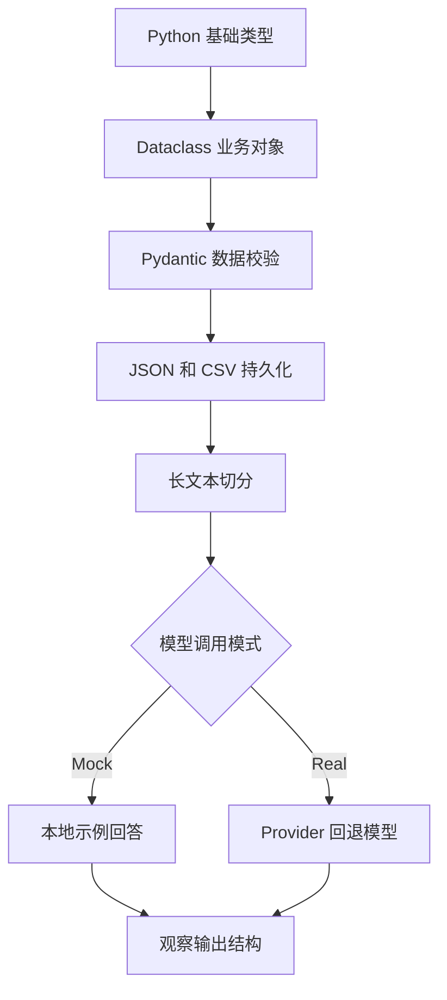

# llm-lab Python 示例集合

本目录包含面向 `llm-lab` 主线的最小 Python 示例，每个示例都带有丰富注释，便于快速上手与改造。

示例清单：

- `basics.py`：Python 基础语法与函数示例
- `dataclass_example.py`：`dataclasses` 使用示例
- `pydantic_example.py`：`pydantic` 数据验证示例
- `file_io_example.py`：JSON / CSV 读写示例
- `text_split_example.py`：文本分割（RAG 前处理）示例
- `model_call_example.py`：最小模型调用示例（无 API Key 时自动 mock，有 Key 时可真实调用）

## 🚀 快速运行

### 自动脚本（推荐）

**Windows (PowerShell):**
```powershell
# 运行 Python 基础示例
.\run_example.ps1 basics
# 运行 Pydantic 示例
.\run_example.ps1 pydantic_example
# 运行最小模型调用示例
.\run_example.ps1 model_call_example
```

**Linux / macOS (Bash):**
```bash
# 运行 Python 基础示例
bash run_example.sh basics
# 运行 Pydantic 示例
bash run_example.sh pydantic_example
# 运行最小模型调用示例
bash run_example.sh model_call_example
```

### 或手动运行

1. 进入示例目录：

```bash
# 进入示例目录
cd ai-learn/llm-lab/examples
```

2. 安装依赖（可选）：

```bash
# 安装依赖（可选）
pip3 install -r requirements.txt
```

3. 运行示例：

```bash
# 依次运行各示例
python3 basics.py
python3 dataclass_example.py
python3 pydantic_example.py
python3 file_io_example.py
python3 text_split_example.py
python3 model_call_example.py "一句话解释什么是 agent"
python3 model_call_example.py --mock "一句话解释什么是 agent"
# 真实调用需要 OPENAI_API_KEY
python3 model_call_example.py --real "一句话解释什么是 agent"  # 需要 OPENAI_API_KEY
```

## 前置要求

- Python 3.10+
- 对 `model_call_example`：无 API Key 会自动进入 mock；真实调用才需要 `OPENAI_API_KEY`

注意：所有示例都包含注释，便于理解每一行代码的意图。

## Runnable 组合模式

[runnable_composition_demo](./runnable_composition_demo/README.md) 覆盖 LCEL Parallel、Branch、Passthrough、batch 和 stream。

## 业务场景（完整说明）

这一组示例对应 LLM 应用开发前最常见的数据准备工作：用 Python 数据结构表达业务对象、用 Pydantic 校验模型输出、读写 JSON/CSV、切分长文本，并完成第一次 Real/Mock 模型调用。使用者是刚进入 AI 应用开发的 Python 初学者；生产项目还需要测试、日志、异常分类和数据隐私控制。

## 整体学习流程图


