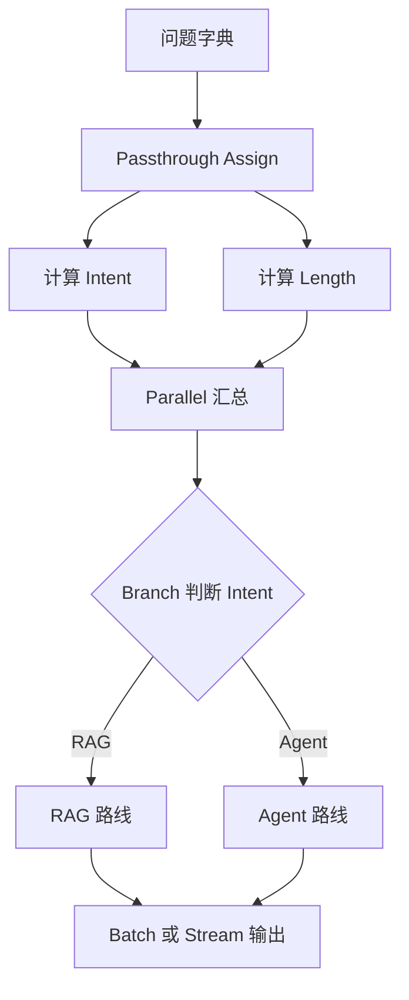

# Runnable 组合模式

用真实 LCEL 演示 `RunnablePassthrough.assign`、`RunnableParallel`、`RunnableBranch`、`batch` 和 `stream`。示例无模型调用，不需要 API Key。

```bash
python3 main.py
python3 main.py "RAG 如何重排" --stream
```

验收：默认一次批处理两个问题并进入不同分支；`--stream` 能逐块输出。依赖：`langchain-core>=1.2,<2`。

## 图片式模板解释

最小输入：`python3 main.py "RAG 如何重排" --stream`

处理前的数据：问题先包装成字典，再由 Runnable 并行补充 `intent` 和 `length`。

```text
问题字典
│
▼
RunnablePassthrough.assign：保留问题并计算派生字段
├── intent Runnable
└── length Runnable
    │
    ▼
RunnableParallel：汇总并行结果
│
▼
RunnableBranch：根据 intent 选择路线
├── RAG -> RAG 学习路线
└── Agent -> Agent 学习路线
    │
    ▼
invoke / batch / stream 返回结果
```

| 节点 | 框架组件 | 输入 -> 输出 | 作用 |
| --- | --- | --- | --- |
| 字段补充 | `RunnablePassthrough.assign` | 问题 -> 扩展字典 | 保留并增加信息 |
| 并行处理 | `RunnableParallel` | 同一输入 -> 多个结果 | 表达独立计算 |
| 条件路由 | `RunnableBranch` | intent -> 链路 | 选择处理路线 |
| 执行方式 | `batch` / `stream` | 链路 -> 结果 | 对比调用模式 |

最小输出：问题被识别为 RAG，并以普通文本或流式块返回对应学习路线。

## 业务场景（完整说明）

- **使用者**：需要组合多个预处理、并行计算和条件路由步骤的 LangChain 开发者。
- **要解决的问题**：避免把所有逻辑写进一个函数，改用 Runnable 组成可观察、可替换的处理链。
- **输入与输出**：输入一个或多个问题；输出 RAG 或 Agent 学习路线文本。
- **生产环境差距**：当前节点是本地规则；生产中可替换为真实 retriever、模型、缓存和 tracing。

## 整体流程图


