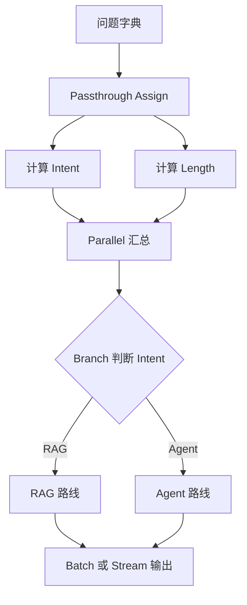

# Runnable 组合模式

用真实 LCEL 演示 `RunnablePassthrough.assign`、`RunnableParallel`、`RunnableBranch`、`batch` 和 `stream`。示例无模型调用，不需要 API Key。

```bash
python3 main.py
python3 main.py "RAG 如何重排" --stream
```

验收：默认一次批处理两个问题并进入不同分支；`--stream` 能逐块输出。依赖：`langchain-core>=1.2,<2`。

## 业务场景（完整说明）

- **使用者**：需要组合多个预处理、并行计算和条件路由步骤的 LangChain 开发者。
- **要解决的问题**：避免把所有逻辑写进一个函数，改用 Runnable 组成可观察、可替换的处理链。
- **输入与输出**：输入一个或多个问题；输出 RAG 或 Agent 学习路线文本。
- **生产环境差距**：当前节点是本地规则；生产中可替换为真实 retriever、模型、缓存和 tracing。

## 整体流程图


