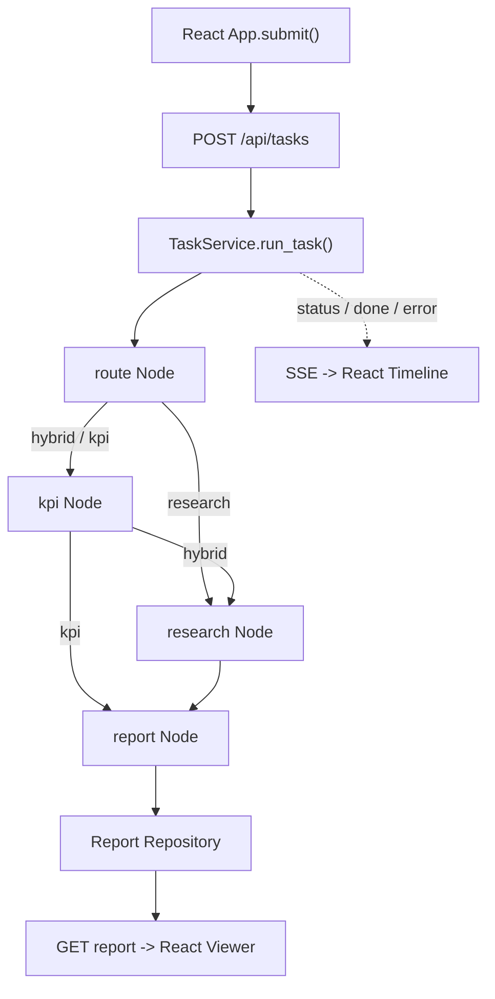

# Retail Insight AI

Retail Insight AI 是一个可运行的 Level 1 首个纵向切片：用户从 React 页面提交零售经营问题，FastAPI 创建任务，LangGraph 按模式执行固定 KPI 与 Mock Research，SSE 实时返回进度，最终展示 Markdown 报告。它尚未满足 Roadmap 中 Level 1 的全部完成门禁。

当前版本只使用固定样例数据、Memory Repository 和 Mock Research Provider，不调用真实 LLM，也不需要 API Key。它用于验证系统边界与端到端契约，不能用于真实经营决策。

## 1. 示例目标

本示例解决“经营分析过程分散、执行进度不可见、结果无法通过统一任务 ID 追踪”的问题。

现实场景是零售公司的经营企划人员在月度会议前检查销售、库存、会员、促销和市场变化。没有该流程时，KPI 通常由多个 Excel 人工汇总，市场调查单独进行，报告状态和失败位置难以追踪。

当前角色边界：

- `FixedKPIWorkflow` 负责确定性 KPI，不允许模型改写公式。
- `ResearchAgent` 负责调查型结论，当前只调用 `MockResearchProvider`。
- `AnalysisWorkflow` 负责 State、Node、Edge 和条件路由。
- `TaskService` 负责任务生命周期、事件发布、报告保存和失败收敛。
- React 前端只持有页面状态，Backend 是任务和报告的事实来源。

## 2. 当前能力与边界

- `POST /api/tasks` 创建 `hybrid / kpi / research` 任务。
- `GET /api/tasks/{task_id}` 查询任务状态。
- `GET /api/tasks/{task_id}/events` 通过 SSE 返回 `status / done / error`。
- `GET /api/tasks/{task_id}/report` 返回最终报告。
- LangGraph 1.x 编排 `route / kpi / research / report` Node。
- React 展示任务表单、Workflow 时间线、失败信息和报告。
- JSON 结构化日志记录 request_id、task_id、关键事件、错误码与耗时。
- Memory Repository 保存 Task、Event、Report；进程重启后数据丢失。
- FastAPI `BackgroundTasks` 在 API 进程内执行任务；尚无队列、幂等消费或跨实例恢复。
- 无登录、RBAC、租户隔离、真实数据、真实 LLM、Checkpoint 或人工审批。

## 3. 项目结构

```text
retail-insight-ai/
├── backend/
│   ├── app/
│   │   ├── api/                 # FastAPI 路由与依赖
│   │   ├── services/            # TaskService 用例协调
│   │   ├── workflow/            # LangGraph State、Node、Edge
│   │   ├── kpi/                 # 确定性 KPI 计算
│   │   ├── agents/              # Research Agent 与 Provider 接口
│   │   ├── reports/             # Markdown 报告生成
│   │   ├── repositories/        # Repository Protocol 与 Memory 实现
│   │   ├── events/              # 事件发布与 SSE 编码
│   │   ├── observability/       # JSON 日志、request_id 上下文与安全字段
│   │   ├── models/              # 领域模型
│   │   ├── schemas/             # HTTP Schema
│   │   └── config/              # Settings 与依赖容器
│   ├── tests/
│   ├── Dockerfile
│   └── requirements.txt
├── frontend/
│   ├── src/
│   │   ├── App.tsx              # 页面状态与用户流程
│   │   ├── api.ts               # Task、SSE、Report Client
│   │   ├── types.ts             # 前端契约
│   │   └── App.test.tsx         # UI 流程测试
│   ├── Dockerfile
│   ├── nginx.conf               # 静态页面与 Backend 反向代理
│   └── package.json
└── docker-compose.yml
```

## 4. 最小输入示例

页面输入：

```text
问题：売上と在庫の状況を分析し、市場トレンドと競合も確認してください
模式：hybrid
```

等价 HTTP 请求：

```bash
curl -s -X POST http://127.0.0.1:8000/api/tasks \
  -H 'Content-Type: application/json' \
  -d '{"question":"売上と在庫の状況を分析し、市場トレンドと競合も確認してください","mode":"hybrid"}'
```

失败路径可用以下环境变量验证：

```bash
MOCK_FAIL_RESEARCH=true uvicorn app.main:app --host 127.0.0.1 --port 8000
```

此时 `hybrid` 和 `research` 任务会进入 `failed`，SSE 返回 `error`；`kpi` 模式不经过 Research，仍可完成。

## 5. 处理前的数据

进入 API 的请求：

```json
{
  "question": "売上と在庫の状況を分析し、市場トレンドと競合も確認してください",
  "mode": "hybrid"
}
```

传给 LangGraph 的最小 `AnalysisState`：

```python
{
    "task_id": "生成的 UUID",
    "question": "売上と在庫の状況を分析し、市場トレンドと競合も確認してください",
    "mode": "hybrid",
}
```

`State` 是 Node 之间共享的类型化数据；每个 `Node` 读取 State 并只返回自己的增量更新；`Edge` 决定下一步执行位置。

## 6. 整体流程图（纯文本展开版）

```text
经营企划人员在 React 页面输入问题并选择 mode
│
▼
App.submit()
调用 createTask() -> POST /api/tasks
│
▼
FastAPI create_task()
Pydantic 校验 question 长度与 mode
├── 失败 -> HTTP 422 -> 前端 Error Panel
└── 成功
    │
    ▼
TaskService.create_task()
创建 Task(status=queued) -> MemoryTaskRepository
发布 status: queued -> MemoryEventRepository
│
▼
FastAPI BackgroundTasks -> TaskService.run_task()
Task 状态更新为 running
│
▼
AnalysisWorkflow.stream(initial_state)
LangGraph StateGraph 开始执行
│
▼
route Node: _route_node()
写入 route = mode
├── mode = research -> research Node
└── mode = hybrid / kpi -> kpi Node
    │
    ▼
kpi Node: _kpi_node()
FixedKPIWorkflow.run() -> 写入 kpi_result
├── mode = hybrid -> research Node
└── mode = kpi -> report Node
    │
    ▼
research Node: _research_node()
ResearchAgent.run() -> MockResearchProvider.research()
├── 失败 -> TaskService 捕获异常 -> failed + SSE error
└── 成功 -> 写入 research_result
    │
    ▼
report Node: _report_node()
ReportGenerator.generate() -> 写入 report_markdown
│
▼
TaskService 保存 Report，Task 更新为 completed
发布 SSE done，包含 report_path
│
▼
前端 EventSource 接收 status / done / error
├── done -> GET /api/tasks/{task_id}/report
├── error -> 显示失败原因
└── 传输中断 -> 显示断线信息
    │
    ▼
最终输出：Workflow 时间线 + Markdown 报告
```

辅助 Mermaid 图：



## 7. 输出与逐节点解释

创建任务的确定字段：

```json
{
  "task_id": "每次生成的 UUID",
  "status": "queued"
}
```

最终报告示意：

```text
# Retail Insight AI 経営分析レポート

## KPI サマリー
- 売上高: 12,5xx,000 円
- 粗利率: 31.8%
...

## Research サマリー
市場では価格だけでなく、在庫回転と会員向け施策を組み合わせた運用が重要です。

## 出典
- mock://market-trend/2026-06
```

`task_id` 和时间戳每次变化；销售额会随问题字符数小幅变化。其它 KPI、Research 文本、来源、数据版本和规则版本在当前 Mock 实现中是确定值。

| 流程节点 | 文件 / 函数 / 类 | 输入 | State / 输出更新 | 为什么需要 |
| --- | --- | --- | --- | --- |
| 请求校验 | `schemas/task_api.py` / `TaskCreateRequest` | JSON | 合法 question、mode | 在进入业务流程前拒绝空问题和未知模式 |
| 任务创建 | `services/task_service.py` / `create_task()` | question、mode | `Task(status=queued)` | 建立可追踪任务 ID 和生命周期 |
| Route Node | `workflow/graph.py` / `_route_node()` | mode | `route` | 将业务模式转成显式条件路由 |
| KPI Node | `workflow/graph.py` / `_kpi_node()` | question | `kpi_result` | 保持 KPI 计算确定、可测试、独立于模型 |
| Research Node | `workflow/graph.py` / `_research_node()` | question | `research_result` | 隔离非确定性调查能力和 Provider |
| Report Node | `workflow/graph.py` / `_report_node()` | KPI、Research | `report_markdown` | 将不同模式结果统一成报告合同 |
| 事件发布 | `events/publisher.py` / `publish()` | Node 进度或终态 | `TaskEvent` | 让前端看到真实执行阶段和失败位置 |
| SSE 编码 | `events/sse.py` / `stream_task_events()` | sequence 后的事件 | `id/event/data` | 支持按事件序号消费执行进度 |
| 报告展示 | `frontend/src/App.tsx` / `loadReport()` | report_path 对应任务 | 页面报告 | 将终态报告与执行时间线交付给用户 |

## 8. 安装与运行

### 8.1 本地开发

Backend：

```bash
cd retail-insight-ai
python3 -m venv .venv
source .venv/bin/activate
python -m pip install -r backend/requirements.txt
cd backend
uvicorn app.main:app --reload --host 127.0.0.1 --port 8000
```

Frontend 使用另一个终端：

```bash
cd retail-insight-ai/frontend
npm install
npm run dev
```

访问 `http://127.0.0.1:5173`。Vite 会把 `/api` 和 `/health` 代理到 Backend。

### 8.2 Docker Compose

```bash
cd retail-insight-ai
docker compose up --build
```

- 页面：`http://127.0.0.1:5173`
- Backend OpenAPI：`http://127.0.0.1:8000/docs`
- Health：`http://127.0.0.1:8000/health`

Frontend 镜像由 Node 构建静态文件，再由 Nginx 提供页面并代理 API。SSE 路径关闭 Nginx buffering。

## 9. 测试清单

当前原型刻意不接真实模型或真实外部服务，因此左列全部标记为不适用；右列验证同一条业务意图的本地闭环。

| 真实模型 / 真实服务命令 | 纯 Mock / 本地命令 |
| --- | --- |
| 不适用（Backend 不调用真实 LLM 或真实服务） | `cd retail-insight-ai/backend && python -m unittest discover -s tests -v` |
| 不适用（Frontend 使用 Mock HTTP 与 EventSource） | `cd retail-insight-ai/frontend && npm test` |
| 不适用（生产 Provider 尚未实现） | `cd retail-insight-ai/frontend && npm run build` |
| 不适用（当前只启动本地 Mock 全栈） | `cd retail-insight-ai && docker compose up --build` |

Backend 测试覆盖 Health、任务创建、状态查询、报告生成、结构化日志字段，以及 SSE 的 `status / done / error`。Frontend 测试覆盖任务提交、SSE 消费、报告加载和请求失败展示。

## 10. 下一步理解与企业级演进

当前实现的本质映射：

```text
MemoryTaskRepository / MemoryEventRepository / MemoryReportRepository
=
任务、事件、报告的数据访问契约，不是持久化能力

FixedKPIWorkflow.run()
=
受版本控制、可审计的确定性业务规则边界

MockResearchProvider.research()
=
真实模型网关与受控调查工具的 Provider 接口

AnalysisState + StateGraph
=
最小工作流状态、Node、Edge 和条件路由

FastAPI BackgroundTasks
=
单进程异步执行的教学替身，不是可靠任务队列

EventSource + MemoryEventRepository
=
实时进度协议的最小实现，不具备跨进程断线恢复
```

下一步不是在业务层直接连接更多基础设施，而是保持现有 Protocol 和 API 契约，逐层替换：

- `Memory*Repository` -> PostgreSQL Repository；Task 与 Report 是事实来源，Event 需要保留策略。
- `BackgroundTasks` -> RabbitMQ + Worker；以 `task_id` 作为幂等键，有限重试后进入 DLQ。
- `MemoryEventRepository` 高频读取 -> PostgreSQL 事实记录 + Redis 短期事件缓存。
- `MockResearchProvider` -> 模型网关 + Tool Service；增加超时、重试、来源校验和预算。
- 未持久化的 `StateGraph` -> Checkpointer；高影响报告在 `Interrupt` 后等待人工审批。
- 页面内断线提示 -> 保存最后 `event_id`，重连后使用 `after` 继续消费。
- 固定样例数据 -> 经过 Schema、质量校验和版本控制的 POS、库存、会员、促销数据。

企业级流程：

```text
POS / 库存 / 商品 / 会员 / 促销系统 + 外部市场资料
│
▼
数据接入与校验
Schema 版本、去重、缺失值、数据日期、权限标签
├── 失败 -> 隔离错误批次 + 通知数据 Owner
└── 成功 -> PostgreSQL / 分析存储
    │
    ▼
内部用户经 SSO 登录 React 页面
│
▼
API Gateway / FastAPI
身份认证 -> RBAC -> 部门 / 门店 Scope -> 请求校验 -> Audit Log
├── 拒绝 -> 统一错误合同 + 审计
└── 允许
    │
    ▼
TaskService 创建幂等任务并写 PostgreSQL
│
▼
RabbitMQ -> Worker Pool
有限重试、超时、背压、DLQ、Graceful Shutdown
│
▼
LangGraph Workflow + Checkpoint
State -> Node -> 条件路由 -> 循环终止 -> 持久化 / 恢复
├── KPI Node -> 版本化确定性规则
├── Research Node -> 模型网关 -> 受控 Tool / 内部检索
└── Report Node -> Schema / 引用 / 业务规则校验
    │
    ▼
Interrupt 人工审批
├── 批准 -> 发布报告
├── 退回 -> 从对应 Checkpoint 修订
└── 超时 -> 升级给业务负责人
    │
    ▼
SSE / 通知 -> React、经营会议资料、管理后台
│
▼
OpenTelemetry Trace + 结构化日志 + Metrics + Audit
任务成功率、Node 延迟、模型成本、KPI 版本、审批记录
│
▼
离线评价 + 在线反馈 + Incident / Runbook + 持续改进
```

### 现实业务案例：日本零售月次经营分析

数据来自 POS、仓库库存、商品主数据、会员系统、促销计划和经过许可的市场资料。经营企划人员在月次会议前从 Web 页面发起分析。

请求经过 SSO、RBAC 和门店范围校验后，由 TaskService 建立任务；Worker 读取指定月份的数据，KPI Node 计算销售额、粗利率和库存周转，Research Node 通过受控工具收集市场与竞合证据，Report Node 合成带版本和来源的报告。管理层使用的报告在发布前进入人工审批。

数据缺失时隔离批次并通知数据 Owner；权限不足时拒绝并审计；Research 超时后有限重试并降级为仅 KPI 报告；模型或工具持续失败时进入 DLQ 和人工处理；SSE 断线后从最后事件序号恢复。最终报告交付给 React 管理页面和经营会议资料，Trace、成本、审批和反馈交给开发、运维与治理负责人。

## 11. 生产化关注点

| 维度 | 当前原型 | 企业化门禁 |
| --- | --- | --- |
| 角色 | KPI、Research、Report 边界已分离 | Owner、审批责任和职责冲突规则明确 |
| 状态 | TypedDict State，进程内执行 | Checkpoint、State 版本迁移、失败恢复 |
| 工具 | Mock Provider，无外部副作用 | Tool Schema、认证、授权、超时、重试、审计 |
| 记忆 | 仅任务执行 State | 业务事实与会话上下文分离，保留和删除策略明确 |
| 权限 | 无登录 | SSO、RBAC、部门 / 门店 Scope、默认拒绝 |
| 失败处理 | 异常收敛为 failed + SSE error | 幂等、有限重试、DLQ、Fallback、人工升级 |
| 评价 | API / UI 自动测试 | KPI 回归、Research 来源质量、报告验收、红队测试 |
| 监控 | 无集中 Observability | task_id / trace_id 关联，SLO、告警、Runbook |
| 成本 | Mock，调用成本为零 | Token、Provider、任务、租户或部门成本归属 |

具体升级等级、部署边界和架构决策见：

- [`../ai-agent-retail-handbook-v3/10_Production_Roadmap.md`](../ai-agent-retail-handbook-v3/10_Production_Roadmap.md)
- [`../ai-agent-retail-handbook-v3/11_Project_Structure.md`](../ai-agent-retail-handbook-v3/11_Project_Structure.md)
- [`../ai-agent-retail-handbook-v3/12_ADR.md`](../ai-agent-retail-handbook-v3/12_ADR.md)

## 代码阅读指南

### Backend 阅读顺序

初学者先沿着一次 HTTP 请求阅读，不要一开始逐目录浏览：

1. `backend/app/main.py`：查看 `create_app()` 如何创建依赖容器、注册路由、建立 `request_id` 和记录应用启动日志。
2. `backend/app/api/tasks.py`：查看 HTTP Schema 如何进入 `TaskService`，以及为什么创建接口返回 `202` 后才执行后台任务。
3. `backend/app/services/task_service.py`：这是业务用例的主线。先读 `create_task()` 的 queued 流程，再读 `run_task()` 的 running、Workflow、completed/failed 流程。
4. `backend/app/workflow/state.py`：先确认所有 Node 共享哪些 State 字段。
5. `backend/app/workflow/graph.py`：按 `_build_graph()`、各 Node、条件路由、`stream()` 的顺序阅读。
6. `backend/app/kpi/workflow.py` 与 `backend/app/agents/research_agent.py`：比较确定性 KPI 和可替换 Research Provider 的职责差异。
7. `backend/app/reports/generator.py`：查看三种 mode 如何通过可选结果生成同一份报告合同。
8. `backend/app/events/publisher.py`、`events/sse.py`：最后阅读进度事件如何保存、编号、编码和发送。
9. `backend/app/repositories/interfaces/` 与 `repositories/memory/`：比较 Protocol 合同和当前内存实现。

阅读 `TaskService` 时重点追踪两个不同状态边界：`Task` 的 queued/running/completed/failed 由 Service 管理；`AnalysisState` 的 route/kpi_result/research_result/report_markdown 由 LangGraph Node 管理。二者分开可以避免 Workflow 同时承担任务持久化和业务计算。

阅读 Workflow 时把它理解成：

```text
AnalysisState
│
▼
Node 读取 State 并返回增量
│
▼
Edge / 条件路由选择下一个 Node
│
▼
stream() 把每次 Node 更新交给 TaskService
```

阅读 SSE 时先看 `EventPublisher.publish()` 如何追加带 sequence 的事件，再看 `stream_task_events()` 如何用 `id / event / data` 编码。`done` 或 `error` 是终态，发送后连接结束；`after` 参数预留了按 sequence 续传的边界。

阅读 Report Generator 时分别代入 `kpi`、`research`、`hybrid` 三种模式。`kpi_result` 和 `research_result` 都允许为空，因此报告生成器不需要知道 Workflow 走过哪条路径。

### Frontend 阅读顺序

当前教学版刻意把四个页面区域保留在一个 `App.tsx` 中，方便先看清 React 状态流，尚未为每个区域建立独立文件。建议按以下顺序阅读：

1. `frontend/src/App.tsx`：先看 state、`loadReport()`、`submit()`，再看 state 如何驱动 JSX。
2. `frontend/src/api.ts`（API Client）：理解 HTTP 请求、错误合同、EventSource 订阅和关闭函数。
3. `TaskForm`：对应 `App.tsx` 中 `<form className="task-form">` 区域，负责问题、mode 和提交状态。
4. `TaskTimeline`：对应 `<section className="timeline">`，把 SSE event 数组渲染成执行时间线。
5. `ReportViewer`：对应 `<section className="report">`，只在 done 后展示单独获取的 Markdown。
6. `ErrorPanel`：对应 `role="alert"` 区域，统一显示创建任务、SSE 和报告读取错误。

然后阅读 `frontend/src/types.ts` 对照 Backend Schema，最后阅读 `App.test.tsx`，观察测试如何用 FakeEventSource 重现 status 和 done 事件。组件卸载或任务结束时必须关闭 EventSource，否则旧连接会继续更新已经离开的页面。

## 日志查看方法

Backend 默认把每条日志作为单行 JSON 输出到标准输出。启动后直接在终端观察：

```bash
cd retail-insight-ai/backend
LOG_LEVEL=INFO uvicorn app.main:app --host 127.0.0.1 --port 8000
```

如需保存并同时查看：

```bash
LOG_LEVEL=INFO uvicorn app.main:app --host 127.0.0.1 --port 8000 \
  2>&1 | tee /tmp/retail-insight-ai.log
```

每条结构化日志固定包含：

| 字段 | 含义 |
| --- | --- |
| `timestamp` | UTC ISO 8601 事件时间 |
| `level` | `DEBUG / INFO / WARNING / ERROR` |
| `service` | 服务名称，用于集中日志按服务筛选 |
| `request_id` | 一次 HTTP 请求的关联 ID；响应头 `X-Request-ID` 返回同一值 |
| `task_id` | 一次分析任务的关联 ID；没有任务上下文时为 `-` |
| `event` | 稳定的机器可检索事件名，例如 `kpi_completed` |
| `message` | 简短的人类可读说明，不包含问题或 Prompt 正文 |
| `error_code` | 稳定错误分类；成功日志为 `null` |
| `duration_ms` | 当前步骤耗时；无计时意义时为 `null` |
| `status` | 可选任务或连接状态 |
| `node` | 可选 LangGraph Node 名称 |
| `sequence` | 可选 SSE 事件序号 |

根据 API 返回的 `task_id` 排查完整任务：

```bash
rg '"task_id":"<实际 task_id>"' /tmp/retail-insight-ai.log
```

如果安装了 `jq`，可只查看事件、状态、耗时和错误码：

```bash
jq -c 'select(.task_id == "<实际 task_id>") | {timestamp,event,status,node,duration_ms,error_code}' \
  /tmp/retail-insight-ai.log
```

典型成功顺序是 `task_created -> task_queued -> task_running -> kpi_started/completed -> research_started/completed -> report_generation_started/completed -> task_completed -> sse_event_sent`。失败时先查 `task_failed` 的 `error_code`，再按相同 `task_id` 查看最后一个成功 Node。

日志代码只接受白名单元数据字段。禁止记录 API Key、Secret、完整 Prompt、会员数据和内部资料正文；需要诊断内容质量时应使用受权限与保留策略控制的独立评估数据，不应扩大普通运行日志范围。
