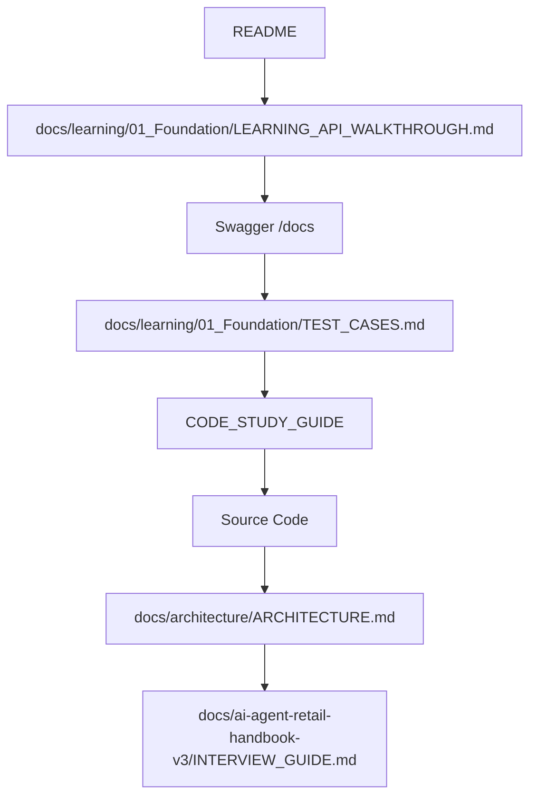

# Enterprise Retail Intelligence Platform (ERIP)

README 是本项目唯一总入口。它不是普通目录页，而是项目知识中心：从这里进入学习路线、测试路线、源码阅读、架构设计、项目管理和 handbook 长期知识库。

Enterprise Retail Intelligence Platform（ERIP）V1.0 已正式交付，并投入企业使用。
本项目统一采用：大手流通グループ向け Enterprise Retail Intelligence Platform（ERIP） AI経営分析基盤構築プロジェクト。

## 一、项目简介

Enterprise Retail Intelligence Platform（ERIP）是面向日本大手流通集团的 AI 经营分析基盘构築项目，已经正式交付，并用于企业运行、学习讲解和面试说明。

当前基线（任务分析主链，仍有效）：

```text
React
→ FastAPI
→ Task API
→ TaskService
→ LangGraph Workflow
→ Fixed KPI Workflow
→ Research Agent
→ Report Generator
→ SSE
→ React
```

V1.0 **企业业务交付主链**（与正式 UI 导航一致）：

```text
文書管理
→ RAG検索
→ AI分析（low_cost / LLM Gateway）
→ 董事会报告（high_quality / LLM Gateway）
→ 承認管理
→ Persistent Audit / Usage Ledger
```

**Repository 定位**：PostgreSQL 是 V1.0 **正式运行与业务验收**的权威存储；Docker Compose **默认且必须**使用 PostgreSQL。InMemory **仅**自动化单元测试适配器/故障隔离，**不是**正式页面、企业验收或生产 Repository（代码保留，未删除）。

**文档原文：** PostgreSQL `documents.content`（未接入 S3/MinIO）。

**验收基线**：PG **297 tests / 6 skipped** · InMemory **286 / 62 skipped** · Frontend **116/116** · Alembic **`20260717_08_ai_runtime`** · 默认 LLM **stub** · 本地完整开发 **5173** · Compose **8080**。

权威启动与数字：`docs/learning/01_Foundation/RUNBOOK_LOCAL.md`（顶部入口 + Appendix M/N）；`docs/development/DEPLOYMENT_GUIDE.md`；`VERIFY_CHECKLIST.md`。  
权威面试材料：`docs/ai-agent-retail-handbook-v3/README.md` 的「面试材料权威合并索引」。
**部署分层（本地 / Compose / 生产差距）权威入口：** [`docs/development/DEPLOYMENT_GUIDE.md`](docs/development/DEPLOYMENT_GUIDE.md)。
自动化基线：以 `TASK.md` / `docs/governance/CHANGELOG.md` 最近验收数字为准（Alembic head **`20260717_08_ai_runtime`**）。

### 运行与部署方式入口（三种）

| 方式 | 完整组成 | 日常启动命令 | 页面 | 用途 |
|---|---|---|---|---|
| **本地完整开发** | 宿主 PG + Backend + Vite | **`./scripts/start_local.sh`** | **5173** | 页面开发与调试 |
| **Docker Compose** | 容器 PG + Backend + Nginx | **`./scripts/compose_up.sh`** | **8080** | 部署、验收、演示 |
| **正式生产** | HTTPS + 内网 Backend + 独立 PG | 生产部署流程 | 正式域名 | 企业运行（非本地一条命令） |

| 操作 | 命令 |
|---|---|
| 本地停止 | `./scripts/stop_local.sh` |
| Compose 验证 | `./scripts/compose_verify.sh` |
| Compose 停止 | `./scripts/compose_down.sh`（**禁止** `-v`） |

- 本机日常：`./scripts/start_local.sh`（零 export，**无 Docker**）；停止：`./scripts/stop_local.sh`（只停 Backend/Frontend，不停宿主 PG）。
- 本地页面库：**WSL 宿主 PostgreSQL `erip_local`**（首次：`./scripts/setup_host_postgres_local.sh`）。
- 数据库权威说明：[`docs/database/DATABASE.md`](docs/database/DATABASE.md)（Alembic head `20260717_08_ai_runtime`）。
- Docker Compose = 多容器编排，**不是**“只打包项目”；日常改页面用 `start_local`，**不必开 Docker Desktop**。
- **5173 与 8080 不是同一套数据**；宿主 `erip_local` 与 Compose Volume `erip_postgres_data` 是两套库。
- Vite 只是 Frontend 开发服务器；只起 Vite 无法完成业务测试。

项目目标不是展示一个简单 Demo，而是提供一套可运行、可学习、可面试讲解、可逐步企业级升级的参考项目。

## 二、当前完成情况矩阵

| 模块 | 当前状态 | 完成度说明 |
|---|---|---|
| Backend | Production Architecture | FastAPI、Task API、TaskService、LangGraph Workflow、SSE、Report Generator、Document、RAG、Approval、Security、Audit 已正式投入使用 |
| Frontend | V1.0 已交付 | Login/JWT、ProtectedRoute、RBAC UI、正式导航、Lifecycle Live Status、Learning Dashboard；见 `docs/learning/02_Frontend/` |
| Swagger | Runtime Architecture | `/docs` 仍是 API 调试入口，与 React 共用同一套 FastAPI API |
| Workflow | Runtime Architecture | LangGraph Workflow、Fixed KPI Workflow、Research Agent、Report 主链路可用 |
| Repository Pattern | Runtime Architecture | **PostgreSQL = 正式权威**；InMemory = 快速测试/教学适配器（不补企业能力、不作业务验收） |
| LLM | V1.0 成本治理 | 默认 `LLM_PROVIDER_MODE=stub`；LLM Gateway、Evidence Gate、low_cost/high_quality、Fallback Chain、Ledger 已落地；真实付费 smoke 仅 opt-in |
| PostgreSQL / pgvector | **正式运行与验收** | Compose 默认且必须；持久化 Audit/Approval/Ledger/ReportVersion；Alembic head `20260717_08_ai_runtime` |
| RBAC / JWT | Production Architecture | JWT 登录、`/users/me`、冻结 Permission、401/403 fail-closed |
| Audit Log | Production Architecture | Persistent Audit（PostgreSQL）+ request_id；禁止落 Token/Key/全文 Prompt |
| Redis / RabbitMQ / OpenTelemetry / Kubernetes | 规划 / 非 V1.0 默认交付 | **未**作为本仓库默认可运行完成项；勿写成已交付 |
| MCP | 规划 / 非 V1.0 默认交付 | **未**作为当前完成项 |

当前已经能跑的能力：

- `GET /health` 健康检查。
- `POST /api/tasks` 到报告读取的主任务链路，创建时会额外打印 `request.question`、`request.mode` 和 `task_id` 的学习日志。
- `GET /api/tasks/{task_id}/events` 的 SSE 进度流。
- Document Upload / Read / Archive / Import / Chunk / Retrieval。
- `POST /api/v1/internal-rag/answer` 的本地 deterministic Internal RAG。
- 审批提交、审批列表/详情、批准、拒绝、修订。
- `GET /api/v1/users/me`、`roles`、`permissions`、`audit-logs` 的安全读模型。

企业交付说明（V1.0 诚实口径）：

- 默认验收使用 stub LLM（零真实费用）；OpenRouter 等真实调用仅 opt-in，**真实付费 smoke 非默认**。
- **PostgreSQL/pgvector 为正式运行与业务验收权威**；Docker Compose 默认且必须走 PostgreSQL。
- InMemory 仅自动化单元测试适配器；本地脚本若默认 InMemory，只为兼容快速学习——正式请 `REPOSITORY_BACKEND=postgres` 或 Compose。
- JWT + RBAC + ProtectedRoute + Persistent Audit + LLM Gateway/Ledger/Fallback 已交付。
- Docker Compose + Alembic + Stub API E2E 已落地；`compose_down` 禁止 `-v` 作为日常验收。
- **未**把 Redis / RabbitMQ / OpenTelemetry / Kubernetes / MCP / Billing UI / 多租户预算台 / SIEM·WORM·Streaming / DeepSeek 默认启用写成已完成。
- 详细验收步骤见 `VERIFY_CHECKLIST.md` 与 RUNBOOK Appendix M/N（本 README 不重复命令大段）。

## 三、项目目录

```text
retail-insight-ai/
├── backend/              # FastAPI 后端，包含 API、Service、Repository、Model 和测试
│   ├── app/              # 后端应用源码
│   ├── tests/            # 后端自动化测试
│   └── data/             # 本地学习样例数据
├── frontend/             # React 前端：Login/JWT/RBAC、正式导航、Lifecycle Live Status、Learning Dashboard
├── docs/                 # 技术文档、学习文档、测试文档、handbook 和归档候选区
│   ├── learning/                    # API 学习与测试学习文档
│   ├── architecture/                # 架构设计、AI Agent 设计和数据契约
│   ├── contracts/                   # API、事件、错误码和上传策略合同
│   ├── development/                 # 开发规范、Prompt 规则和 AI 执行规则
│   ├── database/                    # 数据库设计文档
│   ├── governance/                  # ADR、Backlog、Changelog 治理记录
│   ├── _archive_candidate/          # 已完成迁移、等待人工确认删除的文档
│   └── ai-agent-retail-handbook-v3/ # 长期知识库、学习、面试和总结
├── scripts/              # 启动、检查、测试、同步脚本
├── README.md             # 项目唯一总入口和知识导航中心
├── TASK.md               # 当前任务状态
├── ROADMAP.md            # 项目路线图
├── CODE_STUDY_GUIDE.md   # 源码阅读路线
└── VERIFY_CHECKLIST.md   # 启动与验证检查清单
```

## 四、知识地图

```text
README
├── 学习路线
│   ├── LEARNING_API_WALKTHROUGH
│   ├── Swagger
│   ├── TEST_CASES
│   └── CODE_STUDY_GUIDE
├── 测试路线
│   ├── VERIFY_CHECKLIST
│   └── TEST_CASES
├── 源码阅读
│   ├── CODE_STUDY_GUIDE
│   └── backend/app
├── 架构设计
│   ├── ARCHITECTURE
│   ├── API_CONTRACT
│   ├── EVENT_CONTRACT
│   ├── DATABASE
│   └── ERROR_CATALOG
├── 项目管理
│   ├── TASK
│   ├── ROADMAP
│   ├── PROJECT_BACKLOG
│   └── CHANGELOG
└── handbook
    ├── 长期知识库
    ├── 长期学习
    ├── 长期面试
    └── 长期总结
```

## 五、学习路线图

推荐学习顺序：

```text
README
↓
docs/learning/01_Foundation/LEARNING_API_WALKTHROUGH.md
↓
Swagger + 正式 UI（优先 Compose Appendix M；本地脚本见 L）
↓
docs/learning/01_Foundation/TEST_CASES.md
↓
CODE_STUDY_GUIDE
↓
Source Code
↓
docs/architecture/ARCHITECTURE.md
↓
docs/ai-agent-retail-handbook-v3/INTERVIEW_GUIDE.md
```

Mermaid 版本：


```mermaid
flowchart TD
    A[README] --> B[docs/learning/01_Foundation/LEARNING_API_WALKTHROUGH.md]
    B --> C[Swagger /docs]
    C --> D[docs/learning/01_Foundation/TEST_CASES.md]
    D --> E[CODE_STUDY_GUIDE]
    E --> F[Source Code]
    F --> G[docs/architecture/ARCHITECTURE.md]
    G --> H[docs/ai-agent-retail-handbook-v3/INTERVIEW_GUIDE.md]
```

## 六、企业项目验证体系

Swagger（FastAPI 自动生成的 Task API / HTTP API 调试与验证工具）

项目验证体系分四层：

| 层级 | 工具 | 目的 |
|---|---|---|
| Unit Test | `python -m unittest` | 验证单个模块或类的逻辑是否正确 |
| Swagger API Verification | Swagger UI `/docs` | 手工验证 API 请求、响应和业务流程 |
| Integration Test | React + FastAPI | 验证完整用户操作流程 |
| E2E Test | Playwright / Cypress | 模拟真实用户完成整个业务流程 |

为什么企业项目这样划分：

- Unit Test 保护局部逻辑，定位最快。
- Swagger API Verification 保护接口合同、请求响应和后端业务流程。
- Integration Test 保护 React 和 FastAPI 的真实协作。
- E2E Test 保护接近真实用户的完整路径。

必须明确：

- Swagger 不是测试环境。
- Swagger 不是正式 UI。
- Swagger 是 API 调试与验证工具。
- Swagger 长期保留，即使 React UI 完成以后仍用于后端验证。
- React 以后也调用同一套 FastAPI API。
- V1.0：Swagger 仍用于 API 调试；正式 UI 已交付；Integration / Stub E2E / unittest / vitest 已是默认验收手段。
- 历史写法「只验后端骨架」不再作为当前操作结论。

## 七、所有 Markdown 文档导航

### 学习文档

- [README.md](README.md)
- [docs/learning/01_Foundation/CODE_STUDY_GUIDE.md](docs/learning/01_Foundation/CODE_STUDY_GUIDE.md)
- [docs/learning/01_Foundation/LEARNING_API_WALKTHROUGH.md](docs/learning/01_Foundation/LEARNING_API_WALKTHROUGH.md)
- [docs/learning/01_Foundation/RUNBOOK_LOCAL.md](docs/learning/01_Foundation/RUNBOOK_LOCAL.md)
- [docs/learning/01_Foundation/TEST_CASES.md](docs/learning/01_Foundation/TEST_CASES.md)
- [VERIFY_CHECKLIST.md](VERIFY_CHECKLIST.md)

### API 文档

- [docs/contracts/API_CONTRACT.md](docs/contracts/API_CONTRACT.md)
- [docs/contracts/EVENT_CONTRACT.md](docs/contracts/EVENT_CONTRACT.md)
- [docs/contracts/ERROR_CATALOG.md](docs/contracts/ERROR_CATALOG.md)
- [docs/contracts/UPLOAD_POLICY.md](docs/contracts/UPLOAD_POLICY.md)
- [docs/architecture/DATA_CONTRACTS.md](docs/architecture/DATA_CONTRACTS.md)

### 测试文档

- [docs/learning/01_Foundation/TEST_CASES.md](docs/learning/01_Foundation/TEST_CASES.md)
- [VERIFY_CHECKLIST.md](VERIFY_CHECKLIST.md)

### 架构文档

- [docs/architecture/ARCHITECTURE.md](docs/architecture/ARCHITECTURE.md)
- [docs/architecture/AI_AGENT_DESIGN_GUIDE.md](docs/architecture/AI_AGENT_DESIGN_GUIDE.md)
- [docs/architecture/APPROVAL_WORKFLOW.md](docs/architecture/APPROVAL_WORKFLOW.md)
- [docs/architecture/DATA_CONTRACTS.md](docs/architecture/DATA_CONTRACTS.md)
- [docs/governance/DECISIONS.md](docs/governance/DECISIONS.md)
- [docs/ai-agent-retail-handbook-v3/09_系统设计书.md](docs/ai-agent-retail-handbook-v3/09_系统设计书.md) `7.0 Technical Architecture / Technology Stack Overview`
- [docs/ai-agent-retail-handbook-v3/08_架构图册.md](docs/ai-agent-retail-handbook-v3/08_架构图册.md) `Technology Stack Architecture / Retrieval Pipeline / Technology Evolution`

### 数据库

- [docs/database/DATABASE.md](docs/database/DATABASE.md)
- [backend/data/documents/company_policy_sample.md](backend/data/documents/company_policy_sample.md)

### 开发规范

- [AGENTS.md](AGENTS.md)
- [docs/development/DEPLOYMENT_GUIDE.md](docs/development/DEPLOYMENT_GUIDE.md)（**V1.0 部署权威：本地 / Compose / 生产差距**）
- [docs/development/CODING_STANDARD.md](docs/development/CODING_STANDARD.md)
- [docs/development/DEVELOPMENT_GUIDE.md](docs/development/DEVELOPMENT_GUIDE.md)
- [docs/development/MASTER_PROMPT.md](docs/development/MASTER_PROMPT.md)
- [docs/development/PROMPT_STANDARD.md](docs/development/PROMPT_STANDARD.md)

### 项目管理

- [TASK.md](TASK.md)
- [ROADMAP.md](ROADMAP.md)
- [docs/governance/PROJECT_BACKLOG.md](docs/governance/PROJECT_BACKLOG.md)
- [docs/governance/CHANGELOG.md](docs/governance/CHANGELOG.md)

### handbook

- [docs/ai-agent-retail-handbook-v3/README.md](docs/ai-agent-retail-handbook-v3/README.md)
- [docs/ai-agent-retail-handbook-v3/AGENTS.md](docs/ai-agent-retail-handbook-v3/AGENTS.md)
- [docs/ai-agent-retail-handbook-v3/PROJECT_BIBLE.md](docs/ai-agent-retail-handbook-v3/PROJECT_BIBLE.md)
- [docs/ai-agent-retail-handbook-v3/01_日本AI项目实战.md](docs/ai-agent-retail-handbook-v3/01_日本AI项目实战.md)
- [docs/ai-agent-retail-handbook-v3/02_日本AI现场面试.md](docs/ai-agent-retail-handbook-v3/02_日本AI现场面试.md)
- [docs/ai-agent-retail-handbook-v3/03_AI核心知识.md](docs/ai-agent-retail-handbook-v3/03_AI核心知识.md)
- [docs/ai-agent-retail-handbook-v3/04_日本现场开发.md](docs/ai-agent-retail-handbook-v3/04_日本现场开发.md)
- [docs/ai-agent-retail-handbook-v3/05_TL代码审查.md](docs/ai-agent-retail-handbook-v3/05_TL代码审查.md)
- [docs/ai-agent-retail-handbook-v3/06_学习路线.md](docs/ai-agent-retail-handbook-v3/06_学习路线.md)
- [docs/ai-agent-retail-handbook-v3/07_面试口头训练.md](docs/ai-agent-retail-handbook-v3/07_面试口头训练.md)
- [docs/ai-agent-retail-handbook-v3/08_架构图册.md](docs/ai-agent-retail-handbook-v3/08_架构图册.md)
- [docs/ai-agent-retail-handbook-v3/09_系统设计书.md](docs/ai-agent-retail-handbook-v3/09_系统设计书.md)
- [docs/ai-agent-retail-handbook-v3/10_Production_Roadmap.md](docs/ai-agent-retail-handbook-v3/10_Production_Roadmap.md)
- [docs/ai-agent-retail-handbook-v3/11_Project_Structure.md](docs/ai-agent-retail-handbook-v3/11_Project_Structure.md)
- [docs/ai-agent-retail-handbook-v3/12_ADR.md](docs/ai-agent-retail-handbook-v3/12_ADR.md)
- [docs/ai-agent-retail-handbook-v3/INTERVIEW_GUIDE.md](docs/ai-agent-retail-handbook-v3/INTERVIEW_GUIDE.md)

### Archive

- [docs/_archive_candidate/README.md](docs/_archive_candidate/README.md)
- [docs/_archive_candidate/RUNBOOK_LOCAL.md](docs/_archive_candidate/RUNBOOK_LOCAL.md)
- [docs/_archive_candidate/root/STUDY_PLAN_DAY1_DAY3.md](docs/_archive_candidate/root/STUDY_PLAN_DAY1_DAY3.md)
- [docs/_archive_candidate/handbook-root/TASK.md](docs/_archive_candidate/handbook-root/TASK.md)
- [docs/_archive_candidate/handbook-root/ROADMAP.md](docs/_archive_candidate/handbook-root/ROADMAP.md)
- [docs/_archive_candidate/handbook-docs/AI_AGENT_DESIGN_GUIDE.md](docs/_archive_candidate/handbook-docs/AI_AGENT_DESIGN_GUIDE.md)
- [docs/_archive_candidate/handbook-docs/API_CONTRACT.md](docs/_archive_candidate/handbook-docs/API_CONTRACT.md)
- [docs/_archive_candidate/handbook-docs/ARCHITECTURE.md](docs/_archive_candidate/handbook-docs/ARCHITECTURE.md)
- [docs/_archive_candidate/handbook-docs/CHANGELOG.md](docs/_archive_candidate/handbook-docs/CHANGELOG.md)
- [docs/_archive_candidate/handbook-docs/CODING_STANDARD.md](docs/_archive_candidate/handbook-docs/CODING_STANDARD.md)
- [docs/_archive_candidate/handbook-docs/DECISIONS.md](docs/_archive_candidate/handbook-docs/DECISIONS.md)
- [docs/_archive_candidate/handbook-docs/DEVELOPMENT_GUIDE.md](docs/_archive_candidate/handbook-docs/DEVELOPMENT_GUIDE.md)
- [docs/_archive_candidate/handbook-docs/ERROR_CATALOG.md](docs/_archive_candidate/handbook-docs/ERROR_CATALOG.md)
- [docs/_archive_candidate/handbook-docs/EVENT_CONTRACT.md](docs/_archive_candidate/handbook-docs/EVENT_CONTRACT.md)
- [docs/_archive_candidate/handbook-docs/MASTER_PROMPT.md](docs/_archive_candidate/handbook-docs/MASTER_PROMPT.md)
- [docs/_archive_candidate/handbook-docs/PROJECT_BACKLOG.md](docs/_archive_candidate/handbook-docs/PROJECT_BACKLOG.md)
- [docs/_archive_candidate/handbook-docs/PROMPT_STANDARD.md](docs/_archive_candidate/handbook-docs/PROMPT_STANDARD.md)
- [docs/_archive_candidate/handbook-docs/UPLOAD_POLICY.md](docs/_archive_candidate/handbook-docs/UPLOAD_POLICY.md)

当前 README 链接全部 Markdown 文档：59 个。

## 八、文档责任表

| 文档 | 唯一职责 | 是否唯一 | 是否允许新增同类文档 |
|---|---|---|---|
| [README.md](README.md) | 项目唯一入口和知识导航中心 | 是 | 否 |
| [docs/learning/01_Foundation/LEARNING_API_WALKTHROUGH.md](docs/learning/01_Foundation/LEARNING_API_WALKTHROUGH.md) | API 学习和 Swagger 操作说明 | 是 | 否 |
| [docs/learning/01_Foundation/TEST_CASES.md](docs/learning/01_Foundation/TEST_CASES.md) | 测试学习和测试 Case 导航 | 是 | 否 |
| [docs/learning/01_Foundation/CODE_STUDY_GUIDE.md](docs/learning/01_Foundation/CODE_STUDY_GUIDE.md) | 源码阅读路线 | 是 | 否 |
| [VERIFY_CHECKLIST.md](VERIFY_CHECKLIST.md) | 本地验证清单 | 是 | 否 |
| [docs/architecture/ARCHITECTURE.md](docs/architecture/ARCHITECTURE.md) | 架构设计主文档 | 是 | 否 |
| [docs/contracts/API_CONTRACT.md](docs/contracts/API_CONTRACT.md) | API 合同主文档 | 是 | 否 |
| [docs/contracts/EVENT_CONTRACT.md](docs/contracts/EVENT_CONTRACT.md) | SSE / 事件合同主文档 | 是 | 否 |
| [docs/contracts/ERROR_CATALOG.md](docs/contracts/ERROR_CATALOG.md) | 错误码主文档 | 是 | 否 |
| [docs/database/DATABASE.md](docs/database/DATABASE.md) | 数据库设计主文档 | 是 | 否 |
| [docs/ai-agent-retail-handbook-v3/README.md](docs/ai-agent-retail-handbook-v3/README.md) | handbook 长期知识库入口 | 是 | 否 |
| [docs/ai-agent-retail-handbook-v3/INTERVIEW_GUIDE.md](docs/ai-agent-retail-handbook-v3/INTERVIEW_GUIDE.md) | 面试准备主文档 | 是 | 否 |

禁止新增：

- `README_NEW.md`
- `INTERVIEW2.md`
- `TEST_NEW.md`
- `LEARNING_API_WALKTHROUGH_NEW.md`
- `RUNBOOK_NEW.md`

## 九、文档治理规则

文档治理遵循：

```text
补充 Append
↓
合并 Merge
↓
移动 Move
↓
归档 Archive
↓
未来人工确认 Delete
```

治理规则：

- 不能为了精简删除已有有价值内容。
- 如果两个文档重复，先把有价值内容合并到唯一主文档。
- 原文档只移动到 `docs/_archive_candidate/`，等待以后人工确认。
- 程序流程、Swagger 操作、后台 Log 观察、输入、输出、源码位置、测试命令、为什么这样设计，全部必须保留。
- 目录结构必须保留树形图。
- 章节不能压缩成摘要或单表。
- `docs/_archive_candidate/` 里的文档不能继续作为主维护入口。
