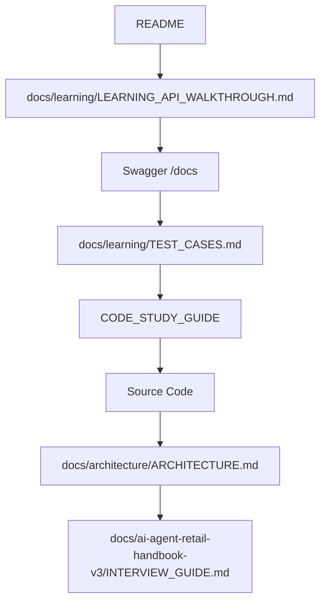

# Retail Insight AI

README 是本项目唯一总入口。它不是普通目录页，而是项目知识中心：从这里进入学习路线、测试路线、源码阅读、架构设计、项目管理和 handbook 长期知识库。

## 一、项目简介

Retail Insight AI 是一个面向日本现场 AI Agent 项目开发、经营分析场景学习和面试讲解的后端主导项目。

当前基线：

```text
React
→ FastAPI
→ Task API
→ TaskService
→ Workflow
→ KPI Engine
→ Research Provider
→ Report Generator
→ SSE
→ React
```

项目目标不是展示一个简单 Demo，而是提供一套可运行、可学习、可面试讲解、可逐步企业级升级的参考项目。

## 二、当前完成情况矩阵

| 模块 | 当前状态 | 完成度说明 |
|---|---|---|
| Backend | 已实现主链路 | FastAPI、Task API、TaskService、Workflow、SSE、Report、Document、RAG、Approval、Security、Audit 已有本地实现 |
| Frontend | 部分完成 | React 可用于联调和展示，但当前不是主学习入口 |
| Swagger | 已完成 | `/docs` 可作为 API Verification 入口，长期保留 |
| Workflow | 已实现确定性流程 | 当前以本地 Workflow 和可解释流程为主，不做开放式真实 Agent 调用 |
| Repository | 本地优先 | 默认 InMemory / Local Repository，PostgreSQL 仍是可选演进方向 |
| LLM | 未接真实模型 | 已保留 provider 位置，但默认不接 OpenAI 或真实 LLM |
| Postgres | 部分预留 | 有合同和部分可选路径，默认不作为运行依赖 |
| JWT | 未接入 | 当前 current user 仍是本地 placeholder |
| MCP | 未接入 | 当前不接 MCP、外部工具系统或真实外部业务系统 |

当前已经能跑的能力：

- `GET /health` 健康检查。
- `POST /api/tasks` 到报告读取的主任务链路。
- `GET /api/tasks/{task_id}/events` 的 SSE 进度流。
- Document Upload / Read / Archive / Import / Chunk / Retrieval。
- `POST /api/v1/internal-rag/answer` 的本地 deterministic Internal RAG。
- 审批提交、审批列表/详情、批准、拒绝、修订。
- `GET /api/v1/users/me`、`roles`、`permissions`、`audit-logs` 的安全读模型。

当前明确不宣称完成：

- 真实 OpenAI / 真实 LLM 接入。
- PostgreSQL 默认化。
- Redis / RabbitMQ。
- 企业级正式认证。
- 生产级前端体验。
- 正式 E2E 自动化。

## 三、项目目录

```text
retail-insight-ai/
├── backend/              # FastAPI 后端，包含 API、Service、Repository、Model 和测试
│   ├── app/              # 后端应用源码
│   ├── tests/            # 后端自动化测试
│   └── data/             # 本地学习样例数据
├── frontend/             # React 前端，目前用于联调和展示，不是主学习入口
├── docs/                 # 技术文档、学习文档、测试文档、handbook 和归档候选区
│   ├── learning/                    # API 学习与测试学习文档
│   ├── architecture/                # 架构设计、AI Agent 设计和数据契约
│   ├── contracts/                   # API、事件、错误码和上传策略合同
│   ├── development/                 # 开发规范、Prompt 规则和 AI 执行规则
│   ├── database/                    # 数据库设计文档
│   ├── governance/                  # ADR、Backlog、Changelog 治理记录
│   ├── _archive_candidate/          # 已完成迁移、等待人工确认删除的文档
│   └── ai-agent-retail-handbook-v3/ # 长期知识库、学习、面试和总结
├── scripts/              # 启动、检查、测试、同步脚本
├── README.md             # 项目唯一总入口和知识导航中心
├── TASK.md               # 当前任务状态
├── ROADMAP.md            # 项目路线图
├── CODE_STUDY_GUIDE.md   # 源码阅读路线
└── VERIFY_CHECKLIST.md   # 启动与验证检查清单
```

## 四、知识地图

```text
README
├── 学习路线
│   ├── LEARNING_API_WALKTHROUGH
│   ├── Swagger
│   ├── TEST_CASES
│   └── CODE_STUDY_GUIDE
├── 测试路线
│   ├── VERIFY_CHECKLIST
│   └── TEST_CASES
├── 源码阅读
│   ├── CODE_STUDY_GUIDE
│   └── backend/app
├── 架构设计
│   ├── ARCHITECTURE
│   ├── API_CONTRACT
│   ├── EVENT_CONTRACT
│   ├── DATABASE
│   └── ERROR_CATALOG
├── 项目管理
│   ├── TASK
│   ├── ROADMAP
│   ├── PROJECT_BACKLOG
│   └── CHANGELOG
└── handbook
    ├── 长期知识库
    ├── 长期学习
    ├── 长期面试
    └── 长期总结
```

## 五、学习路线图

推荐学习顺序：

```text
README
↓
docs/learning/LEARNING_API_WALKTHROUGH.md
↓
Swagger
↓
docs/learning/TEST_CASES.md
↓
CODE_STUDY_GUIDE
↓
Source Code
↓
docs/architecture/ARCHITECTURE.md
↓
docs/ai-agent-retail-handbook-v3/INTERVIEW_GUIDE.md
```

Mermaid 版本：


```mermaid
flowchart TD
    A[README] --> B[docs/learning/LEARNING_API_WALKTHROUGH.md]
    B --> C[Swagger /docs]
    C --> D[docs/learning/TEST_CASES.md]
    D --> E[CODE_STUDY_GUIDE]
    E --> F[Source Code]
    F --> G[docs/architecture/ARCHITECTURE.md]
    G --> H[docs/ai-agent-retail-handbook-v3/INTERVIEW_GUIDE.md]
```

## 六、企业项目验证体系

Swagger（FastAPI 自动生成的 API 调试与验证工具）

项目验证体系分四层：

| 层级 | 工具 | 目的 |
|---|---|---|
| Unit Test | `python -m unittest` | 验证单个模块或类的逻辑是否正确 |
| Swagger API Verification | Swagger UI `/docs` | 手工验证 API 请求、响应和业务流程 |
| Integration Test | React + FastAPI | 验证完整用户操作流程 |
| E2E Test | Playwright / Cypress | 模拟真实用户完成整个业务流程 |

为什么企业项目这样划分：

- Unit Test 保护局部逻辑，定位最快。
- Swagger API Verification 保护接口合同、请求响应和后端业务流程。
- Integration Test 保护 React 和 FastAPI 的真实协作。
- E2E Test 保护接近真实用户的完整路径。

必须明确：

- Swagger 不是测试环境。
- Swagger 不是正式 UI。
- Swagger 是 API 调试与验证工具。
- Swagger 长期保留，即使 React UI 完成以后仍用于后端验证。
- React 以后也调用同一套 FastAPI API。
- 当前阶段主要用 Swagger 验证后端骨架。
- UI 完成后再做前后端 Integration Test。
- 发布前再考虑 E2E Test。

## 七、所有 Markdown 文档导航

### 学习文档

- [README.md](README.md)
- [CODE_STUDY_GUIDE.md](CODE_STUDY_GUIDE.md)
- [docs/learning/LEARNING_API_WALKTHROUGH.md](docs/learning/LEARNING_API_WALKTHROUGH.md)
- [docs/learning/TEST_CASES.md](docs/learning/TEST_CASES.md)
- [VERIFY_CHECKLIST.md](VERIFY_CHECKLIST.md)

### API 文档

- [docs/contracts/API_CONTRACT.md](docs/contracts/API_CONTRACT.md)
- [docs/contracts/EVENT_CONTRACT.md](docs/contracts/EVENT_CONTRACT.md)
- [docs/contracts/ERROR_CATALOG.md](docs/contracts/ERROR_CATALOG.md)
- [docs/contracts/UPLOAD_POLICY.md](docs/contracts/UPLOAD_POLICY.md)
- [docs/architecture/DATA_CONTRACTS.md](docs/architecture/DATA_CONTRACTS.md)

### 测试文档

- [docs/learning/TEST_CASES.md](docs/learning/TEST_CASES.md)
- [VERIFY_CHECKLIST.md](VERIFY_CHECKLIST.md)

### 架构文档

- [docs/architecture/ARCHITECTURE.md](docs/architecture/ARCHITECTURE.md)
- [docs/architecture/AI_AGENT_DESIGN_GUIDE.md](docs/architecture/AI_AGENT_DESIGN_GUIDE.md)
- [docs/architecture/APPROVAL_WORKFLOW.md](docs/architecture/APPROVAL_WORKFLOW.md)
- [docs/architecture/DATA_CONTRACTS.md](docs/architecture/DATA_CONTRACTS.md)
- [docs/governance/DECISIONS.md](docs/governance/DECISIONS.md)

### 数据库

- [docs/database/DATABASE.md](docs/database/DATABASE.md)
- [backend/data/documents/company_policy_sample.md](backend/data/documents/company_policy_sample.md)

### 开发规范

- [AGENTS.md](AGENTS.md)
- [docs/development/CODING_STANDARD.md](docs/development/CODING_STANDARD.md)
- [docs/development/DEVELOPMENT_GUIDE.md](docs/development/DEVELOPMENT_GUIDE.md)
- [docs/development/MASTER_PROMPT.md](docs/development/MASTER_PROMPT.md)
- [docs/development/PROMPT_STANDARD.md](docs/development/PROMPT_STANDARD.md)

### 项目管理

- [TASK.md](TASK.md)
- [ROADMAP.md](ROADMAP.md)
- [docs/governance/PROJECT_BACKLOG.md](docs/governance/PROJECT_BACKLOG.md)
- [docs/governance/CHANGELOG.md](docs/governance/CHANGELOG.md)

### handbook

- [docs/ai-agent-retail-handbook-v3/README.md](docs/ai-agent-retail-handbook-v3/README.md)
- [docs/ai-agent-retail-handbook-v3/AGENTS.md](docs/ai-agent-retail-handbook-v3/AGENTS.md)
- [docs/ai-agent-retail-handbook-v3/PROJECT_BIBLE.md](docs/ai-agent-retail-handbook-v3/PROJECT_BIBLE.md)
- [docs/ai-agent-retail-handbook-v3/01_日本AI项目实战.md](docs/ai-agent-retail-handbook-v3/01_日本AI项目实战.md)
- [docs/ai-agent-retail-handbook-v3/02_日本AI现场面试.md](docs/ai-agent-retail-handbook-v3/02_日本AI现场面试.md)
- [docs/ai-agent-retail-handbook-v3/03_AI核心知识.md](docs/ai-agent-retail-handbook-v3/03_AI核心知识.md)
- [docs/ai-agent-retail-handbook-v3/04_日本现场开发.md](docs/ai-agent-retail-handbook-v3/04_日本现场开发.md)
- [docs/ai-agent-retail-handbook-v3/05_TL代码审查.md](docs/ai-agent-retail-handbook-v3/05_TL代码审查.md)
- [docs/ai-agent-retail-handbook-v3/06_学习路线.md](docs/ai-agent-retail-handbook-v3/06_学习路线.md)
- [docs/ai-agent-retail-handbook-v3/07_面试口头训练.md](docs/ai-agent-retail-handbook-v3/07_面试口头训练.md)
- [docs/ai-agent-retail-handbook-v3/08_架构图册.md](docs/ai-agent-retail-handbook-v3/08_架构图册.md)
- [docs/ai-agent-retail-handbook-v3/09_系统设计书.md](docs/ai-agent-retail-handbook-v3/09_系统设计书.md)
- [docs/ai-agent-retail-handbook-v3/10_Production_Roadmap.md](docs/ai-agent-retail-handbook-v3/10_Production_Roadmap.md)
- [docs/ai-agent-retail-handbook-v3/11_Project_Structure.md](docs/ai-agent-retail-handbook-v3/11_Project_Structure.md)
- [docs/ai-agent-retail-handbook-v3/12_ADR.md](docs/ai-agent-retail-handbook-v3/12_ADR.md)
- [docs/ai-agent-retail-handbook-v3/INTERVIEW_GUIDE.md](docs/ai-agent-retail-handbook-v3/INTERVIEW_GUIDE.md)

### Archive

- [docs/_archive_candidate/README.md](docs/_archive_candidate/README.md)
- [docs/_archive_candidate/RUNBOOK_LOCAL.md](docs/_archive_candidate/RUNBOOK_LOCAL.md)
- [docs/_archive_candidate/root/STUDY_PLAN_DAY1_DAY3.md](docs/_archive_candidate/root/STUDY_PLAN_DAY1_DAY3.md)
- [docs/_archive_candidate/handbook-root/TASK.md](docs/_archive_candidate/handbook-root/TASK.md)
- [docs/_archive_candidate/handbook-root/ROADMAP.md](docs/_archive_candidate/handbook-root/ROADMAP.md)
- [docs/_archive_candidate/handbook-docs/AI_AGENT_DESIGN_GUIDE.md](docs/_archive_candidate/handbook-docs/AI_AGENT_DESIGN_GUIDE.md)
- [docs/_archive_candidate/handbook-docs/API_CONTRACT.md](docs/_archive_candidate/handbook-docs/API_CONTRACT.md)
- [docs/_archive_candidate/handbook-docs/ARCHITECTURE.md](docs/_archive_candidate/handbook-docs/ARCHITECTURE.md)
- [docs/_archive_candidate/handbook-docs/CHANGELOG.md](docs/_archive_candidate/handbook-docs/CHANGELOG.md)
- [docs/_archive_candidate/handbook-docs/CODING_STANDARD.md](docs/_archive_candidate/handbook-docs/CODING_STANDARD.md)
- [docs/_archive_candidate/handbook-docs/DECISIONS.md](docs/_archive_candidate/handbook-docs/DECISIONS.md)
- [docs/_archive_candidate/handbook-docs/DEVELOPMENT_GUIDE.md](docs/_archive_candidate/handbook-docs/DEVELOPMENT_GUIDE.md)
- [docs/_archive_candidate/handbook-docs/ERROR_CATALOG.md](docs/_archive_candidate/handbook-docs/ERROR_CATALOG.md)
- [docs/_archive_candidate/handbook-docs/EVENT_CONTRACT.md](docs/_archive_candidate/handbook-docs/EVENT_CONTRACT.md)
- [docs/_archive_candidate/handbook-docs/MASTER_PROMPT.md](docs/_archive_candidate/handbook-docs/MASTER_PROMPT.md)
- [docs/_archive_candidate/handbook-docs/PROJECT_BACKLOG.md](docs/_archive_candidate/handbook-docs/PROJECT_BACKLOG.md)
- [docs/_archive_candidate/handbook-docs/PROMPT_STANDARD.md](docs/_archive_candidate/handbook-docs/PROMPT_STANDARD.md)
- [docs/_archive_candidate/handbook-docs/UPLOAD_POLICY.md](docs/_archive_candidate/handbook-docs/UPLOAD_POLICY.md)

当前 README 链接全部 Markdown 文档：59 个。

## 八、文档责任表

| 文档 | 唯一职责 | 是否唯一 | 是否允许新增同类文档 |
|---|---|---|---|
| [README.md](README.md) | 项目唯一入口和知识导航中心 | 是 | 否 |
| [docs/learning/LEARNING_API_WALKTHROUGH.md](docs/learning/LEARNING_API_WALKTHROUGH.md) | API 学习和 Swagger 操作说明 | 是 | 否 |
| [docs/learning/TEST_CASES.md](docs/learning/TEST_CASES.md) | 测试学习和测试 Case 导航 | 是 | 否 |
| [CODE_STUDY_GUIDE.md](CODE_STUDY_GUIDE.md) | 源码阅读路线 | 是 | 否 |
| [VERIFY_CHECKLIST.md](VERIFY_CHECKLIST.md) | 本地验证清单 | 是 | 否 |
| [docs/architecture/ARCHITECTURE.md](docs/architecture/ARCHITECTURE.md) | 架构设计主文档 | 是 | 否 |
| [docs/contracts/API_CONTRACT.md](docs/contracts/API_CONTRACT.md) | API 合同主文档 | 是 | 否 |
| [docs/contracts/EVENT_CONTRACT.md](docs/contracts/EVENT_CONTRACT.md) | SSE / 事件合同主文档 | 是 | 否 |
| [docs/contracts/ERROR_CATALOG.md](docs/contracts/ERROR_CATALOG.md) | 错误码主文档 | 是 | 否 |
| [docs/database/DATABASE.md](docs/database/DATABASE.md) | 数据库设计主文档 | 是 | 否 |
| [docs/ai-agent-retail-handbook-v3/README.md](docs/ai-agent-retail-handbook-v3/README.md) | handbook 长期知识库入口 | 是 | 否 |
| [docs/ai-agent-retail-handbook-v3/INTERVIEW_GUIDE.md](docs/ai-agent-retail-handbook-v3/INTERVIEW_GUIDE.md) | 面试准备主文档 | 是 | 否 |

禁止新增：

- `README_NEW.md`
- `INTERVIEW2.md`
- `TEST_NEW.md`
- `LEARNING_API_WALKTHROUGH_NEW.md`
- `RUNBOOK_NEW.md`

## 九、文档治理规则

文档治理遵循：

```text
补充 Append
↓
合并 Merge
↓
移动 Move
↓
归档 Archive
↓
未来人工确认 Delete
```

治理规则：

- 不能为了精简删除已有有价值内容。
- 如果两个文档重复，先把有价值内容合并到唯一主文档。
- 原文档只移动到 `docs/_archive_candidate/`，等待以后人工确认。
- 程序流程、Swagger 操作、后台 Log 观察、输入、输出、源码位置、测试命令、为什么这样设计，全部必须保留。
- 目录结构必须保留树形图。
- 章节不能压缩成摘要或单表。
- `docs/_archive_candidate/` 里的文档不能继续作为主维护入口。
