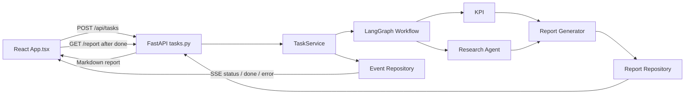
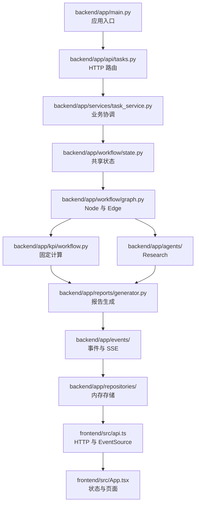

# Retail Insight AI 学习计划（Day1～Day3）

这是一份面向初学者的“边运行、边阅读、边验证”学习计划。所有路径都相对于 `retail-insight-ai/` 项目根目录；命令均可直接复制到 WSL Ubuntu 的 Bash 终端执行。

## 三天学习目标

通过三天时间，完成以下目标：

- 学会启动 Backend 和 Frontend。
- 学会使用 health、Task、SSE 和 Report API。
- 学会阅读项目结构和一次请求的完整链路。
- 学会理解 LangGraph 中的 State、Node、Edge 和条件路由。
- 学会做一次范围明确的业务文案修改。
- 学会新增一个简单测试并运行完整验证。
- 学会通过浏览器、日志、错误信息和断点定位问题。

三天内继续使用 `StaticResearchProvider` 和 InMemory Repository，不接真实 LLM，不增加 PostgreSQL、Redis 或 RabbitMQ。

## 项目调用链



记忆口诀：**HTTP 创建任务，Workflow 做分析，SSE 报进度，HTTP 再取报告。**

---

# Day1：项目运行

## 今日目标

成功启动并验证：

- Backend
- Frontend
- health API
- Task API
- SSE
- Report API

## Step 1：环境检查

在终端 A 执行：

```bash
cd ~/workspace/vscode_study/ai-lab/ai-learn/retail-insight-ai
./scripts/check_env.sh
```

### 学习目的

确认 Python、pip、Node.js 和 npm 可用。Docker 在当前本地运行方式中是可选项。虚拟环境由 Backend 启动脚本在缺失时自动创建，不是 `check_env.sh` 的检查项。

### 完成标准

终端最后显示：

```text
必需工具检查通过
```

如果失败，先根据脚本输出补齐缺少的工具，不要继续启动项目。

## Step 2：启动 Backend

继续在终端 A 执行：

```bash
cd ~/workspace/vscode_study/ai-lab/ai-learn/retail-insight-ai
./scripts/start_backend.sh
```

### 学习目的

理解启动脚本会创建 `backend/.venv`、安装 Python 依赖、创建本地 `.env`，最后用 Uvicorn 加载 `app.main:app`。

### 完成标准

终端 A 显示以下关键信息并保持运行：

```text
Uvicorn running on http://127.0.0.1:8000
Application startup complete
```

在新终端 C 执行：

```bash
curl -sS http://127.0.0.1:8000/health
```

返回内容包含：

```json
{"status":"ok","service":"retail-insight-ai","provider":"static"}
```

实际响应还会包含每次变化的 `request_id`。

## Step 3：启动 Frontend

保持终端 A 的 Backend 运行，在终端 B 执行：

```bash
cd ~/workspace/vscode_study/ai-lab/ai-learn/retail-insight-ai
./scripts/start_frontend.sh
```

### 学习目的

理解 Vite 开发服务器负责运行 React 页面，并通过开发代理把 `/api` 请求转发到 Backend 的 8000 端口。

### 完成标准

终端 B 显示：

```text
Local: http://127.0.0.1:5173/
```

浏览器访问 `http://127.0.0.1:5173`，能看到 Retail Insight AI 页面。也可在终端 C 验证 HTTP：

```bash
curl -sS -I http://127.0.0.1:5173
```

输出第一行应为 `HTTP/1.1 200 OK`。

## Step 4：创建任务并保存 task_id

在终端 C 一次性复制执行：

```bash
cd ~/workspace/vscode_study/ai-lab/ai-learn/retail-insight-ai
CREATE_RESPONSE=$(curl -sS -X POST http://127.0.0.1:8000/api/tasks -H 'Content-Type: application/json' -H 'X-Request-ID: day1-create-001' -d '{"question":"売上と在庫の状況を分析してください","mode":"hybrid"}')
printf '%s\n' "$CREATE_RESPONSE"
TASK_ID=$(printf '%s' "$CREATE_RESPONSE" | python3 -c 'import json,sys; print(json.load(sys.stdin)["data"]["task_id"])')
printf 'TASK_ID=%s\n' "$TASK_ID"
```

### 学习目的

理解 Task API 接收 `question` 和 `mode`，创建一个异步任务，并先返回可追踪的 `task_id`。同时学习用 `X-Request-ID` 关联一次 HTTP 请求的日志。

### 完成标准

响应包含 `"success":true` 和 `"status":"queued"`，最后一行输出非空的 UUID：

```text
TASK_ID=xxxxxxxx-xxxx-xxxx-xxxx-xxxxxxxxxxxx
```

## Step 5：观察 SSE 事件

在保存了 `TASK_ID` 的同一个终端 C 执行：

```bash
curl -sS -N "http://127.0.0.1:8000/api/tasks/$TASK_ID/events"
```

### 学习目的

理解 SSE 连接如何按 sequence 返回 `status` 事件，并以 `done` 或 `error` 终止。观察 route、kpi、research、report 节点对应的进度消息。

### 完成标准

输出中至少出现：

```text
event: status
event: done
```

每个事件都包含 `id:` 和 `data:`。hybrid 模式的节点顺序应包含 route、kpi、research、report。

## Step 6：获取最终报告

继续在终端 C 执行：

```bash
curl -sS "http://127.0.0.1:8000/api/tasks/$TASK_ID/report"
```

### 学习目的

理解 SSE 只传进度，不传大段报告正文；React 收到 `done` 后会单独调用 Report API。报告由 `ReportGenerator` 生成并由 ReportRepository 保存。

### 完成标准

响应包含 `"success":true`、`"provider":"static"`，并且 `markdown` 中包含：

```text
# Retail Insight AI 経営分析レポート
## KPI サマリー
## Research サマリー
```

## Step 7：从页面完成同一流程

在浏览器打开 `http://127.0.0.1:5173`，保留默认问题和 hybrid 模式，点击“分析を開始”。

### 学习目的

把前五个 API 操作与 React 页面对应起来：表单负责创建任务，时间线显示 SSE，报告区域显示最终 Markdown。

### 完成标准

页面状态最终变为 `COMPLETED`；时间线出现多个节点；“分析レポート”区域显示报告；终端 A 中能用同一个 `task_id` 串起任务日志。

## Day1 学习笔记

```text
今天第一次成功运行的时间：

Backend 启动命令：

Frontend 启动命令：

我观察到的 SSE 节点顺序：

我看到的 request_id / task_id：

遇到的错误及解决方法：

仍然不理解的问题：
```

## Day1 总结

- 今天学到了什么：
- 哪一步最容易出错：
- 我能否独立重新启动两个服务：
- 我能否解释 HTTP 和 SSE 的分工：
- 明天阅读代码前想问的问题：

---

# Day2：阅读代码

## 今日目标

搞懂一次 hybrid 请求从点击按钮到显示报告的完整源码链路。今天以阅读和断点观察为主，不修改业务代码。

## 代码阅读路线图



> 项目实际路由路径是 `backend/app/api/tasks.py`，不是 `backend/app/api/routes/tasks.py`。

阅读每个文件时都回答四个问题：

1. 谁调用它？
2. 它调用谁？
3. 输入是什么？
4. 输出是什么？

## Step 1：阅读应用入口

```bash
cd ~/workspace/vscode_study/ai-lab/ai-learn/retail-insight-ai
sed -n '1,260p' backend/app/main.py
```

### 学习目的

理解 FastAPI 应用如何构造、容器和路由如何注册、每个请求如何获得 `request_id`。

### 完成标准

能够指出 `create_app()`、HTTP middleware、`include_router()` 和模块级 `app` 各自的作用。

## Step 2：阅读 Task API

```bash
cd ~/workspace/vscode_study/ai-lab/ai-learn/retail-insight-ai
sed -n '1,320p' backend/app/api/tasks.py
```

### 学习目的

理解创建任务、查询状态、订阅 SSE 和获取报告四个 HTTP 入口，以及 `BackgroundTasks` 为什么让创建接口先返回 202。

### 完成标准

能够说出四个 URL、HTTP 方法、调用的 Service 方法和返回类型。

## Step 3：阅读 TaskService

```bash
cd ~/workspace/vscode_study/ai-lab/ai-learn/retail-insight-ai
sed -n '1,360p' backend/app/services/task_service.py
```

### 学习目的

理解 queued、running、completed、failed 生命周期，以及 Workflow、Repository 和 EventPublisher 如何被协调。

### 完成标准

能够分别复述 `create_task()` 和 `run_task()`，并解释异常为什么必须收敛为 failed 和 error 事件。

## Step 4：阅读 Workflow State 和 Graph

```bash
cd ~/workspace/vscode_study/ai-lab/ai-learn/retail-insight-ai
sed -n '1,220p' backend/app/workflow/state.py
sed -n '1,380p' backend/app/workflow/graph.py
```

### 学习目的

理解 LangGraph 的 State、Node、Edge、条件路由和增量更新，区分 Workflow 编排与 Task 生命周期。

### 完成标准

能不看源码画出三条路径：

```text
hybrid:   route → kpi → research → report
kpi:      route → kpi → report
research: route → research → report
```

## Step 5：阅读 KPI

```bash
cd ~/workspace/vscode_study/ai-lab/ai-learn/retail-insight-ai
sed -n '1,240p' backend/app/kpi/workflow.py
sed -n '1,260p' backend/app/models/analysis.py
```

### 学习目的

理解确定性 KPI 为什么与 Research Agent 分开，并观察输入长度如何影响销售额。

### 完成标准

能够解释 `question_factor` 的上限、五个 KPI 字段及 `KPIResult` 的作用。

## Step 6：阅读 Research Agent

```bash
cd ~/workspace/vscode_study/ai-lab/ai-learn/retail-insight-ai
sed -n '1,260p' backend/app/agents/research_agent.py
sed -n '1,280p' backend/app/agents/providers/static_research.py
```

### 学习目的

理解 Agent 与 Provider 的边界，确认当前 Research 来自本地固定实现而不是真实 LLM。

### 完成标准

能够指出 `ResearchAgent` 调用谁、正常输出是什么，以及故障注入时抛出什么异常。

## Step 7：阅读报告、事件和存储

```bash
cd ~/workspace/vscode_study/ai-lab/ai-learn/retail-insight-ai
sed -n '1,300p' backend/app/reports/generator.py
sed -n '1,240p' backend/app/events/publisher.py
sed -n '1,280p' backend/app/events/sse.py
find backend/app/repositories -type f -name '*.py' -not -path '*/__pycache__/*' -print
```

### 学习目的

理解 Markdown 如何生成、业务事件如何写入仓库、SSE 如何编码，以及为什么 InMemory Repository 重启后会丢数据。

### 完成标准

能够解释 `ReportGenerator.generate()` 的两个可选结果、SSE 的 `id/event/data` 格式，以及 Task/Event/Report 三类 Repository 的职责。

## Step 8：阅读 Frontend API Client

```bash
cd ~/workspace/vscode_study/ai-lab/ai-learn/retail-insight-ai
sed -n '1,320p' frontend/src/api.ts
sed -n '1,280p' frontend/src/types.ts
```

### 学习目的

理解 React 如何创建任务、订阅 EventSource、获取报告，以及统一错误响应如何转换成 `ApiClientError`。

### 完成标准

能够解释 `createTask()`、`subscribeToTask()`、`getReport()` 和 `unwrapResponse()` 的输入输出。

## Step 9：阅读 React 页面

```bash
cd ~/workspace/vscode_study/ai-lab/ai-learn/retail-insight-ai
sed -n '1,380p' frontend/src/App.tsx
sed -n '1,320p' frontend/src/App.test.tsx
```

### 学习目的

理解 `useState` 如何驱动页面，`submit()` 如何启动完整流程，收到 done 后为何再调用 `loadReport()`，错误如何进入 `role="alert"`。

### 完成标准

能够从 `onSubmit` 开始，沿 `createTask → subscribeToTask → onEvent → loadReport → setReport` 指出每一步源码位置。

## Step 10：用日志复习调用链

保持服务运行，在新终端执行：

```bash
curl -sS -X POST http://127.0.0.1:8000/api/tasks -H 'Content-Type: application/json' -H 'X-Request-ID: day2-trace-001' -d '{"question":"コードの呼び出し順序を確認してください","mode":"hybrid"}'
```

### 学习目的

把静态源码阅读与真实运行日志连接起来，练习使用 `request_id` 和 `task_id` 定位一次任务。

### 完成标准

在 Backend 终端中找到 `day2-trace-001`，再沿 task_id 找到 task_created、KPI、Research、Report 和 task_completed 相关日志。

## Day2 学习笔记

| 文件或模块 | 谁调用它 | 它调用谁 | 输入 | 输出 | 我的疑问 |
| --- | --- | --- | --- | --- | --- |
| `main.py` |  |  |  |  |  |
| `api/tasks.py` |  |  |  |  |  |
| `task_service.py` |  |  |  |  |  |
| `workflow/graph.py` |  |  |  |  |  |
| `kpi/` |  |  |  |  |  |
| `agents/` |  |  |  |  |  |
| `reports/` |  |  |  |  |  |
| `events/` |  |  |  |  |  |
| `api.ts` |  |  |  |  |  |
| `App.tsx` |  |  |  |  |  |

## Day2 总结

- 已经看懂的模块：
- 仍然没看懂的模块：
- 我画出的完整调用链：
- HTTP 与 SSE 的职责区别：
- Workflow 与 TaskService 的职责区别：
- 想继续研究的内容：

---

# Day3：第一次改代码

## 今日目标

完成两个小型文案修改、补充一个不重复的测试，并通过全部本地验证。修改前先确认 Git 工作区，避免覆盖已有改动。

## Step 1：建立修改前基线

```bash
cd ~/workspace/vscode_study/ai-lab/ai-learn/retail-insight-ai
git status --short
./scripts/run_tests.sh
```

### 学习目的

理解“先确认现状，再修改代码”的基本工程习惯。测试基线能区分原有问题和自己引入的问题。

### 完成标准

记下 `git status` 中已有改动；Backend tests、Frontend tests、Frontend build 和 Python compileall 全部通过。

## Step 2：修改报告标题

目标文件：`backend/app/reports/generator.py`

把：

```text
# Retail Insight AI 経営分析レポート
```

修改为：

```text
# Retail Insight AI 月次経営分析レポート
```

同时搜索并更新依赖旧标题的测试断言：

```bash
cd ~/workspace/vscode_study/ai-lab/ai-learn/retail-insight-ai
rg -n 'Retail Insight AI 経営分析レポート' backend
```

### 学习目的

理解显示文案属于 Report Generator，并学习代码修改后同步维护测试预期。

### 完成标准

搜索结果中的生成器和相关测试都使用新标题；运行任务后报告第一行显示新标题。

## Step 3：增加 KPI 说明文案

先阅读 KPI 的来源：`backend/app/kpi/workflow.py`。显示文案不属于计算公式，因此应在 `backend/app/reports/generator.py` 的 KPI 章节中增加：

```text
在庫回転率は、販売状況と在庫効率を確認するための重要指標です。
```

修改后检查文案位置：

```bash
cd ~/workspace/vscode_study/ai-lab/ai-learn/retail-insight-ai
rg -n '在庫回転率は、販売状況と在庫効率を確認するための重要指標です。' backend/app
```

### 学习目的

理解“计算逻辑”和“展示文案”的职责边界：KPI 模块负责数值，Report Generator 负责读者看到的文字。

### 完成标准

文案只出现在报告生成边界；kpi 或 hybrid 模式报告包含该说明；research-only 报告不出现该说明。

## Step 4：新增一个简单测试

目标文件：`backend/tests/test_api.py`。

项目已经有 `test_create_task_uses_success_envelope`，不要再复制同一个测试。先定位它：

```bash
cd ~/workspace/vscode_study/ai-lab/ai-learn/retail-insight-ai
rg -n 'test_create_task_uses_success_envelope|test_report_generation_uses_success_envelope' backend/tests/test_api.py
```

新增一个 `kpi` 模式成功测试，验证：

- 创建任务返回 HTTP 202。
- 任务最终为 completed。
- 报告包含新标题和 KPI 说明。
- 报告不包含 `## Research サマリー`。

### 学习目的

学习复用现有测试辅助方法，测试一个新的成功分支，而不是重复已有断言。

### 完成标准

新测试名称清楚表达 kpi-only 场景；单独运行 Backend 测试时通过，并且把说明文案删掉后该测试会失败。

## Step 5：执行完整测试

```bash
cd ~/workspace/vscode_study/ai-lab/ai-learn/retail-insight-ai
./scripts/run_tests.sh
```

### 学习目的

确认 Backend 修改没有破坏 API，Frontend 合同仍一致，TypeScript 编译和 production build 正常。

### 完成标准

以下四个阶段全部通过：

- Backend tests
- Frontend tests
- Frontend production build
- Python compileall

## Step 6：运行验收

启动 Backend 和 Frontend 后，在页面创建一个 kpi 任务和一个 research 任务。也可用以下命令创建 kpi 任务：

```bash
curl -sS -X POST http://127.0.0.1:8000/api/tasks -H 'Content-Type: application/json' -H 'X-Request-ID: day3-acceptance-001' -d '{"question":"在庫回転率を確認してください","mode":"kpi"}'
```

### 学习目的

理解测试通过不等于完成全部验收，还要从用户看到的页面和真实日志确认修改效果。

### 完成标准

kpi 报告显示新标题和 KPI 说明；research-only 报告显示新标题但不显示 KPI 说明；页面无错误，日志包含 request_id 和 task_id。

## Day3 学习笔记

```text
修改前测试结果：

修改的文件：

为什么 KPI 说明放在 Report Generator：

新增测试名称：

测试第一次失败的原因：

最终运行结果：

我学会的定位问题方法：
```

## Day3 总结

- 我修改了什么：
- 哪个测试保护了这次修改：
- 我是否理解“计算”和“展示”的边界：
- 我遇到的错误及定位过程：
- 我现在能否独立修改一个小功能：
- 下一步最需要补充的知识：

---

# 最终验收

完成 Day1～Day3 后，应能独立解释：

```text
React
  ↓ POST task
FastAPI
  ↓
TaskService
  ↓
Workflow
  ├─ KPI
  └─ Research
  ↓
Report
  ↓ SSE progress + GET report
React
```

最终标准：

- 能从零启动 Backend 和 Frontend。
- 能用 curl 验证 health、Task、SSE 和 Report。
- 能按调用链找到相关源码。
- 能解释三种 Workflow 路径。
- 能修改一处小型业务展示逻辑。
- 能新增一个有价值且不重复的测试。
- 测试失败时，能根据第一条错误定位相关文件。

# 下一阶段（Day4～Day7）

建议先继续深入现有代码，再讨论企业级扩展：

1. LangGraph：状态设计、条件路由、错误恢复。
2. Docker Compose：理解服务构建和本地编排。
3. OpenTelemetry：trace、metric、log 的关联。
4. PostgreSQL：持久化 Task 和 Report。
5. Redis 或消息队列：任务分发、重试和跨进程事件。
6. AWS ECS：容器部署、健康检查和滚动发布。

这些属于下一阶段，不在 Day1～Day3 中引入。

# 通用学习笔记区

## 新术语

| 术语 | 我的理解 | 示例文件 |
| --- | --- | --- |
| FastAPI |  |  |
| SSE |  |  |
| Repository |  |  |
| Dependency Injection |  |  |
| LangGraph State |  |  |
| Node / Edge |  |  |

## 待解决问题

| 日期 | 问题 | 我尝试过什么 | 最终答案 |
| --- | --- | --- | --- |
|  |  |  |  |

## 三天总复盘

- 最有价值的三个知识点：
- 仍然模糊的三个知识点：
- 我可以独立完成的操作：
- 我需要别人帮助的操作：
- 下一阶段第一件事：

<!-- DOC-SYNC:START group=study-and-runbook -->
## 文档同步块

- group: `study-and-runbook`
- file: `retail-insight-ai/STUDY_PLAN_DAY1_DAY3.md`
- self_sha256: `23659aa081e315f7a7cf87c0e3266ad81620d0b0577954f4138c7a1280b6f7c5`
- peers:
- `retail-insight-ai/RUNBOOK_LOCAL.md` | sha256=82e649ea6d4a1124aef7bac0e5296b5bbd4077586f02199892583fefaf930f1a | # RUNBOOK_LOCAL / 这份手册用于在 VS Code + WSL Ubuntu 中，从零启动 Retail Insight AI，并亲自验证 Backend、Frontend、SSE 和 Report 全流程。所有命令默认在 WSL Ubuntu 终端执行。 / ## 1. 前提条件 / 需要以下工具：
- `retail-insight-ai/CODE_STUDY_GUIDE.md` | sha256=7835d7b286bdaad961b008b3623bf07ff31edf644e60239270d09e108eded449 | # CODE STUDY GUIDE / 这份指南面向第一次阅读 React、FastAPI 和 LangGraph 项目的学习者。建议先把 Backend 和 Frontend 都运行起来，再按本文顺序阅读；每读到一个步骤，就在页面或日志中观察它的实际效果。 / > 路径说明：下文路径都相对于 `retail-insight-ai/`。需求中提到的 `api/routes/tasks.py` 在本项目中的实际路径是 `backend/
- `retail-insight-ai/VERIFY_CHECKLIST.md` | sha256=a102715dbf95744db73011bb1df9cd7999da3fc9d576d4677eb230a34d77b925 | # VERIFY CHECKLIST / 所有命令默认先进入项目根目录： / ```bash / cd ~/workspace/vscode_study/ai-lab/ai-learn/retail-insight-ai
- `ai-agent-retail-handbook-v3/01_日本AI项目实战.md` | sha256=aa0cf1068c64dbdeedf2f1f5e38d235fab7d19a23aa2ad23ceee7645ac7ebac1 | # 01_日本AI项目实战 / ## 目录 / - [第一章 项目概述](#第一章-项目概述) / - [第二章 行业背景](#第二章-行业背景)
- `ai-agent-retail-handbook-v3/04_日本现场开发.md` | sha256=bca69b09dcf09db6f0869f4af8121a3d7f4e280757c8e377cd761370c68295e5 | # 04_日本现场开发 / ## 第一章 日本现场开发总流程 / Retail Insight AI 按日本现场流程推进：需求整理、基本設計、詳細設計、API 設計、開発、単体試験、結合試験、レビュー、部署、保守改修。 / 【TL Review】
- `ai-agent-retail-handbook-v3/05_TL代码审查.md` | sha256=797c312f4566abe80afb5f87dbbf97b22d983195cb9610de8de81f47af01c9c3 | # 05_TL代码审查 / ## 第一章 Review 总原则 / TL Review 的目标是确认 Retail Insight AI 能支撑日本小売業客户的经营分析、运用监视、障害対応和保守改修。 / 【TL Review】
- `ai-agent-retail-handbook-v3/06_学习路线.md` | sha256=1b39176bff4feb5bcde639affcec4036334622aca73dac53c321b649d8c11e3f | # 06_学习路线 / ## 第一章 成长目标 / 目标是能够在日本 AI Agent 现场说明 Retail Insight AI 的业务背景、系统架构、担当范围、设计决策、Review 观点和运用扩展。 / 【TL Review】
- `ai-agent-retail-handbook-v3/11_Project_Structure.md` | sha256=a40c03fd0eadeb68466c3a44a53ddf58769d104af40d37f6b658135157ef09bb | # 11_Project_Structure / # 目录 / - [1. 设计目标](#1-设计目标) / - [2. 顶层目录](#2-顶层目录)

说明：
- 这个块由 `scripts/sync_retail_handbook_docs.py` 自动维护。
- 只同步这个块，不覆盖各自正文。
- 任一组内文档正文变化时，整组文档的同步块都会一起刷新。
<!-- DOC-SYNC:END group=study-and-runbook -->
