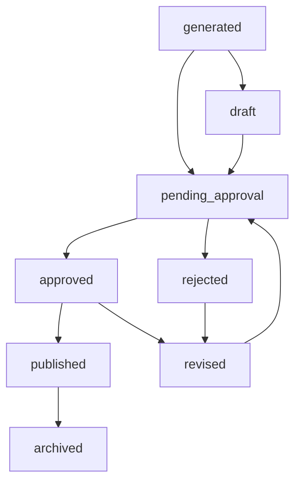
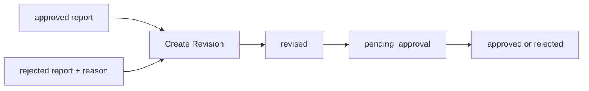
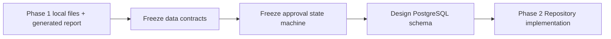

# retail-insight-ai Approval Workflow Design

最后更新：2026-07-04

本文件冻结 Report / Approval 状态机设计。

## Current State

- Phase 1 已落地的唯一报告状态是 `generated`
- 当前没有 Approval API
- 当前没有 Approval Repository
- 当前没有人工审批页面

## Target State

后续承認ワークフロー以稳定状态机驱动：

- `generated`
- `draft`
- `pending_approval`
- `approved`
- `rejected`
- `revised`
- `published`
- `archived`

## Planned

- Phase 2 先为状态字段和审批表结构做 PostgreSQL 准备
- Phase 5 再落地审批 API、审批事件、前端审批流程

## State Definitions

| 状态 | 说明 | Current State / Planned |
| --- | --- | --- |
| `generated` | Workflow 直接生成的报告 | Current State |
| `draft` | 可编辑草稿版本 | Planned |
| `pending_approval` | 已提交等待审批 | Planned |
| `approved` | 已审批通过 | Planned |
| `rejected` | 已审批拒绝，必须带 reason | Planned |
| `revised` | 基于已批准或已拒绝版本生成的新修订 | Planned |
| `published` | 已对外发布或被业务确认的正式版本 | Planned |
| `archived` | 历史归档版本，不再作为当前有效版本 | Planned |

## Transition Rules

### Current State

- 只有 `generated`

### Target State

- `generated -> draft`
- `generated -> pending_approval`
- `draft -> pending_approval`
- `pending_approval -> approved`
- `pending_approval -> rejected`
- `rejected -> revised`
- `approved -> revised`
- `approved -> published`
- `published -> archived`
- `revised -> pending_approval`

### Hard Rules

- `rejected` 必须允许保存 `reason`
- `approved` 后不可直接覆盖原报告，必须生成 revision
- `published` 表示对外发布或业务确认版本
- `archived` 只能由历史版本进入，不能直接回到审批中

## Approval State Machine

## Report Revision Flow

## Approval Workflow Boundary

### Current State

- 当前 API / SSE / Frontend 主链路仍然基于“生成即完成”
- 当前文件输入层与审批流解耦

### Planned

- 后续会把“任务完成”与“报告审批完成”拆成两个状态面
- Task 状态与 Report 审批状态将分别持久化

## Phase 1 to Phase 2 Migration Flow

