# retail-insight-ai Architecture

最后更新：2026-07-04

本文件记录项目实际架构。未实现的能力必须明确标注，不得把规划写成现状。

## Epic 14 Engineering Standards Freeze

### Current State

- Architecture、Workflow、Contract、Prompt、Development Standard 的约束分散在 README、AGENTS、Architecture 文档与历史任务记录中。
- 不同 AI 工具可能对 API version、SSE event、prompt 分类和 workflow 边界产生不一致解释。

### Target State

- `docs/MASTER_PROMPT.md` 成为唯一总入口。
- `docs/API_CONTRACT.md` 冻结 HTTP 边界。
- `docs/EVENT_CONTRACT.md` 冻结 SSE 事件封装。
- `docs/PROMPT_STANDARD.md` 冻结 Prompt 分类与模板要求。
- `docs/CODING_STANDARD.md`、`docs/DEVELOPMENT_GUIDE.md`、`docs/AI_AGENT_DESIGN_GUIDE.md` 冻结工程实现与设计判断入口。

### Planned

- 以后新增 API 必须 version。
- 以后新增 event family 或 breaking event 字段必须 version。
- 以后新增 prompt family 必须声明 category、variables、output、version。
- 以后所有 AI 工具必须先读冻结文档，再执行具体实现。
- Epic 14 has frozen the master prompt, API contract, event contract, prompt standard, coding standard, development guide, and AI agent design guide as the final planning baseline.

## Phase 1.5 Contract Freeze and Approval Design

### Current State

- 当前文件输入已落地
- 当前 Report 只实现 `generated`
- 当前无审批 API、无 PostgreSQL、无导入表

### Target State

- 文件输入字段契约冻结
- 导入错误模型冻结
- Approval State Machine 冻结
- Phase 2 数据库准备项冻结

### Planned

- 由 `docs/DATA_CONTRACTS.md` 作为文件输入单一来源
- 由 `docs/APPROVAL_WORKFLOW.md` 作为审批状态机单一来源
- 由 `docs/DATABASE.md` 作为 Phase 2 表结构准备来源

## Phase 2 PostgreSQL Persistence MVP

### Current State

- 当前默认 Repository backend 仍为 `inmemory`
- 当前已新增可选 `postgres` backend
- 当前 Task、Task Event、Report 已具备 PostgreSQL Repository
- 当前 `data_imports`、`import_errors`、`approval_requests`、`approval_events` 仅完成 schema 与模型预留
- 当前尚未实现 Approval API、Import API、Document Search、RAG、Internet Search
- 当前状态：
  `Code implemented`
  `InMemory path verified`
  `PostgreSQL schema implemented`
  `PostgreSQL repository tests prepared`
  `PostgreSQL real integration test pending`
  `Status: In Progress / Partially Verified`

### Target State

- PostgreSQL 成为事务事实的持久化实现
- InMemory 继续作为本地学习、测试和降级 fallback
- Approval 与 Import 在后续 Phase 基于现有表结构继续扩展，不破坏当前 API / Workflow / SSE

### Planned

- Phase 2 完成真实 PostgreSQL 联调后，继续保持 `REPOSITORY_BACKEND=inmemory` 默认值
- Phase 3 复用 `data_imports` 与 `import_errors`
- Phase 5 复用 `reports.approval_status`、`report_versions`、`approval_requests`、`approval_events`
- 当前未验证原因：
  当前环境缺少 Docker CLI；当前环境未安装 `psycopg` 到实际运行 venv；PostgreSQL 集成测试当前被 skip。
- 下一步验证命令：
  `docker compose up -d postgres`
  `cd backend`
  `source .venv/bin/activate`
  `pip install -r requirements.txt`
  `REPOSITORY_BACKEND=postgres python -m unittest tests.test_postgres_repositories -v`

## Repository Backend Switch

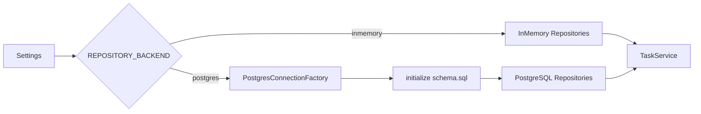

- `inmemory`:
  当前默认值，保持原有本地启动和测试路径不受影响。
- `postgres`:
  仅在显式配置后启用，并通过同一 Repository Interface 暴露给 Service / Workflow。

## PostgreSQL Persistence Scope

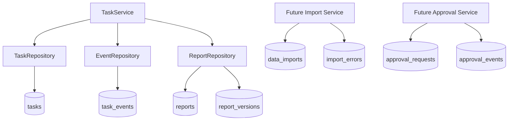

## Approval and Import Boundary

- Approval Current State:
  当前只在 `reports` 中持久化 `approval_status=generated`，尚未开放审批 API。
- Approval Planned:
  后续 Phase 通过 `report_versions`、`approval_requests`、`approval_events` 扩展 `draft / pending_approval / approved / rejected / revised / published / archived`。
- Import Current State:
  当前业务数据仍由本地文件读取，不写入 `data_imports` / `import_errors`。
- Import Planned:
  后续导入流程会把文件元数据、错误明细和 schema version 写入 PostgreSQL。

## Phase 1 File Input Implementation

### Current State

- 当前 KPI 已不再使用代码写死数值。
- 当前 Research 已不再使用代码写死 summary / sources。
- 当前仍使用 InMemory Repository，不接数据库。
- 当前报告仍直接生成，不经过 Approval Workflow。

### Target State

- 文件输入成为本地运行的稳定数据边界。
- KPI 从 CSV 读取并计算。
- Research 从 JSON 读取并组合。
- 文档目录为后续 RAG / Approval / Upload 提前固定输入边界。
- 报告状态模型提前预留审批流扩展。

### Planned

- Phase 2 把 Task / Event / Report 迁移到 PostgreSQL。
- Phase 3 开始利用 `backend/data/documents/` 向上传与文档入库演进。
- Phase 5 基于当前 `generated` 状态扩展 `draft / pending_approval / approved / rejected / revised`。

## File Input Flow

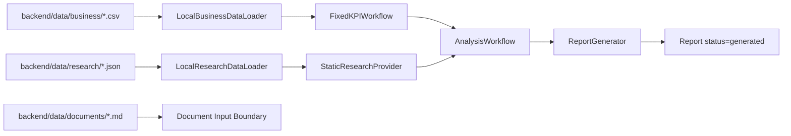

## Approval State Machine

### Current State

- 当前只实现 `generated`

### Target State

- 未来状态机覆盖：
  `generated`
  `draft`
  `pending_approval`
  `approved`
  `rejected`
  `revised`
  `published`
  `archived`

### Planned

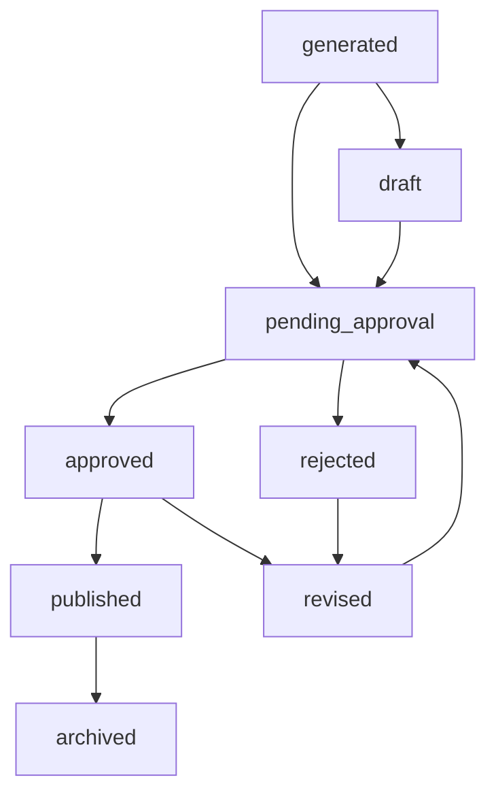

## Approval Workflow Reserve

- Current State:
  Report 当前仍在 Workflow 完成后直接生成，状态为 `generated`。
- Planned:
  后续 Approval Workflow 将在不破坏当前 API / SSE 主链路的前提下，演进到：
  `draft`
  `pending_approval`
  `approved`
  `rejected`
  `revised`
  `published`
  `archived`
- Boundary:
  当前文件输入层只负责提供业务事实和 Research 事实，不与审批状态耦合，因此不会阻碍后续审批流接入。

## Report Revision Flow

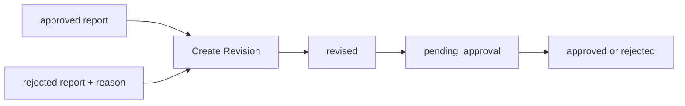

## Phase 1 to Phase 2 Migration Flow

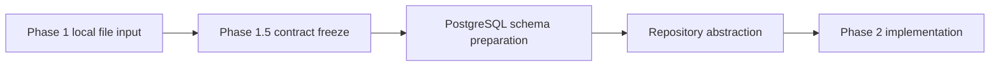

## Project Positioning

### Current State

项目名称保持为 `Retail Insight AI`。

当前项目定位：

`Retail Analysis Domain Reference Implementation`

当前重点是把零售分析 Domain 的任务、Workflow、Provider、Repository 和文档治理边界稳定下来。

### Target State

未来目标平台名称：

`Enterprise Retail Intelligence Platform (ERIP)`

ERIP 是企业平台化目标架构，不代表当前仓库、当前目录或当前部署已经达到平台形态。

### Planned

后续平台化演进必须以 Current State / Target State / Planned 的方式描述，不得把目标能力写成现状。

## Architecture Principles

- Platform First
- Domain Driven
- Provider Pattern
- Repository Pattern
- Workflow Driven
- Configuration First
- Test First
- Documentation First
- Backward Compatibility

## Epic 0: Enterprise Platform Architecture Evolution

### Planned Tasks

- [ ] Architecture Freeze
- [ ] Directory Refactor
- [ ] Repository Abstraction
- [ ] Workflow Abstraction
- [ ] Provider Abstraction
- [ ] Documentation Standard
- [ ] Testing Standard

## Target Architecture

### Current State

当前实现仍是单仓库、单项目、教学型结构，尚未完全形成企业平台目录。

### Target State

未来 ERIP 目标逻辑分层：

```text
Platform
Domain
Provider
Workflow
Repository
Approval
Documents
Search
Import
Audit
Database
Frontend
```

### Planned

该分层用于指导后续目录重构和抽象边界，不表示当前这些模块都已全部实现。

## Definition of Done

任何一个 Phase 标记完成前，必须同时完成：

- Code
- Unit Test
- Integration Test
- Frontend Test
- Handbook
- Changelog
- Decision Record
- Architecture Update
- Mermaid Diagram Update
- Task Update

## Architecture Freeze

### Current Architecture

Current State

- 当前仓库保持 `Retail Insight AI` 名称。
- 当前运行形态是单仓库、单项目、教学型参考实现。
- 当前核心链路为：
  React
  → FastAPI
  → TaskService
  → LangGraph Workflow
  → KPI / Research
  → Report
  → SSE
- 当前主要存储仍是本地静态数据和 InMemory Repository。
- 当前尚未实现 PostgreSQL、审批流、互联网检索、向量检索、平台级目录冻结。

### Target Architecture

Target State

- 未来平台目标名称为 `Enterprise Retail Intelligence Platform (ERIP)`。
- `Retail Insight AI` 作为零售分析 Domain 的参考实现保留。
- 未来目标是形成 Platform / Domain / Infrastructure 分层，以及 Provider、Repository、Workflow、Approval、Documents、Search、Import、Audit 的稳定边界。
- 后续所有功能演进都必须遵守本次冻结定义的接口方向和文档门禁。

### Migration Strategy

Planned

1. 先冻结抽象边界，不改业务代码目录。
2. 先完成文件化输入和 PostgreSQL 设计，再逐步替换具体实现。
3. 在保持 API 合同稳定的前提下，引入 Repository / Provider / Workflow 抽象。
4. 再引入 Document Pipeline、Search、Approval、Internet Search。
5. 最后进入性能、观测、权限和平台化部署。

### Planned State

- 当前实现继续服务本地运行与学习。
- 新架构先作为设计约束存在，不代表当前已经落地。
- 后续 Phase 只能在本冻结文档范围内细化，不得绕开主边界新增临时架构。

### Risks

- 过早抽象导致实现复杂度上升。
- 平台目标与当前代码结构差距较大，迁移周期长。
- 多数据源与多 Provider 接入会增加测试矩阵和回归成本。
- 文档若不同步，会导致冻结失效。

## Directory Refactor Design

### Current State

- 当前真实目录仍以 `backend/`、`frontend/`、`docs/`、`scripts/` 为主。
- 本次不修改任何真实目录。

### Target State

未来目录结构只作为设计输出：

```text
retail-insight-ai/
├── platform/                  # Platform Layer：平台通用装配、配置、鉴权、审计、运行时策略
├── domain/                    # Domain Layer：零售分析核心业务模型、用例、规则
├── infrastructure/            # Infrastructure Layer：数据库、队列、搜索、日志、外部适配
├── frontend/                  # Frontend：React 页面、状态管理、前端 API 适配
├── docs/                      # Documentation：架构、设计、ADR、测试方法、运行手册
├── data/                      # Data：CSV / Excel / JSON / Markdown 输入样例与导入目录
├── templates/                 # Template：报告模板、Prompt 模板、导入模板
└── tests/                     # Test：unit / integration / api / workflow / frontend / db / performance / manual
```

### Planned State

未来逻辑分层映射：

```text
Platform Layer
├── Approval
├── Audit
└── Config

Domain Layer
├── Task
├── Workflow
├── Analysis
└── Report

Infrastructure Layer
├── Repository
├── Provider
├── Database
├── Search
└── Import

Frontend
Documentation
Data
Template
Test
```

## Repository Abstraction Design

### Goal

用统一 Repository Interface 隔离当前 InMemory、未来 PostgreSQL，以及后续向量检索与搜索存储实现。

### Repository Interface

- 职责：
  定义 Task、Event、Report、Document、Import、Approval、Audit 等聚合的读写合同。
- 输入：
  领域对象、查询条件、分页条件、版本条件。
- 输出：
  领域对象、对象列表、可选结果、持久化结果。
- 生命周期：
  长期稳定，先于具体实现冻结。

### InMemory Repository

- 职责：
  作为当前本地运行、测试和教学场景的默认实现。
- 输入：
  与 Interface 一致。
- 输出：
  与 Interface 一致。
- 生命周期：
  继续保留，作为本地模式和测试模式实现。

### PostgreSQL Repository

- 职责：
  承接任务、事件、报告、审批、文档、导入和审计事实的持久化。
- 输入：
  领域对象、事务上下文、查询条件。
- 输出：
  持久化后的领域事实和查询结果。
- 生命周期：
  作为企业运用的主事实存储实现。

### Future Vector Repository

- 职责：
  承接文档块索引、Embedding 元数据、向量查询结果。
- 输入：
  文档块、向量、检索查询、过滤条件。
- 输出：
  Top-K 文档块、相似度、来源信息。
- 生命周期：
  在 Phase 4 以后引入，不与业务事实 Repository 混用。

### Why This Abstraction

- 避免 Service 和 Workflow 直接绑定数据库实现。
- 允许本地运行继续使用 InMemory。
- 允许 PostgreSQL 先落地事务事实，再独立引入向量检索。
- 让搜索存储和事务存储分工清晰。

## Provider Abstraction Design

### LLM Provider

- 职责：
  提供分析、摘要、格式化生成能力。
- 输入：
  Prompt、上下文、模型参数、预算限制。
- 输出：
  结构化文本、模型元数据、失败信息。
- 生命周期：
  按请求初始化调用，上层通过接口引用。

### Research Provider

- 职责：
  统一封装市场、竞品、行业调研结果获取。
- 输入：
  问题、时间范围、业务上下文。
- 输出：
  摘要、来源列表、风险说明。
- 生命周期：
  当前可为静态实现，未来可切换到 Tool / Search 组合实现。

### Internal Search Provider

- 职责：
  从社内文档、知识块和内部资料中检索上下文。
- 输入：
  查询、权限范围、Top-K、过滤条件。
- 输出：
  命中文档块、来源、评分。
- 生命周期：
  在文档入库和切分能力落地后启用。

### Internet Search Provider

- 职责：
  检索互联网公开来源，用于补充市场与竞品信息。
- 输入：
  查询、可信来源白名单、时间窗口。
- 输出：
  外部来源、摘要片段、引用信息。
- 生命周期：
  默认关闭，按环境和配置启用。

### Vector Provider

- 职责：
  负责向量生成、相似度检索、向量元数据处理。
- 输入：
  文本块、查询向量、过滤条件。
- 输出：
  向量、相似结果、分数。
- 生命周期：
  Future Provider，不属于当前实现。

### Prompt Provider

- 职责：
  提供 Prompt 模板版本、变量装配和环境配置。
- 输入：
  模板名、版本、上下文变量。
- 输出：
  最终 Prompt、版本信息。
- 生命周期：
  长期稳定，避免 Prompt 写死在业务流程中。

### Config Provider

- 职责：
  统一管理环境配置、开关、Provider 选择、版本参数。
- 输入：
  环境变量、配置文件、系统设置。
- 输出：
  标准化配置对象。
- 生命周期：
  进程级加载，支持运行时读取配置快照。

## Retrieval Layer Architecture

### Current State

- 当前尚未形成统一 Retrieval Layer。
- 当前 Research 与未来 Internal Search / Internet Search / Structured Retrieval 还未统一抽象。

### Target State

- 未来 Retrieval Layer 统一承接：
  - Business Data Retrieval
  - Internal Document Retrieval
  - Internet Search Retrieval
  - Context Merge
  - Citation and Source Trace
  - Retrieval Evaluation

### Planned

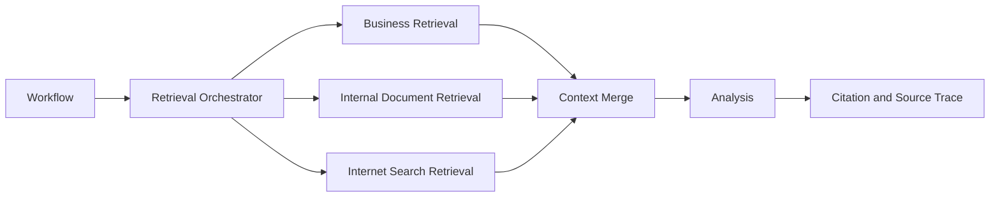

RAG 在本项目中不只指社内文档问答，也包括结构化业务数据检索和互联网检索。

## Business Retrieval Flow

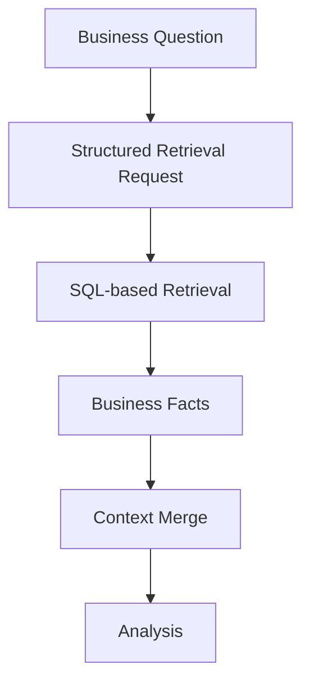

### Planned

- 结构化业务数据检索优先使用 SQL-based structured retrieval。
- 业务事实与文档事实必须分层处理，不能直接混入同一检索实现。

## Internal RAG Flow

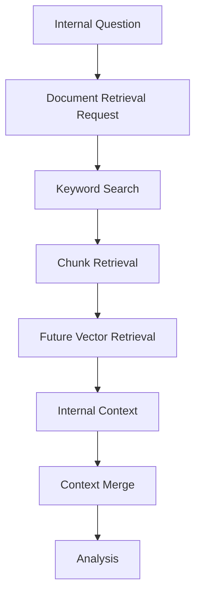

### Planned

- 当前仅为目标设计，不表示已经实现 Internal RAG MVP。

## Internet Search Flow

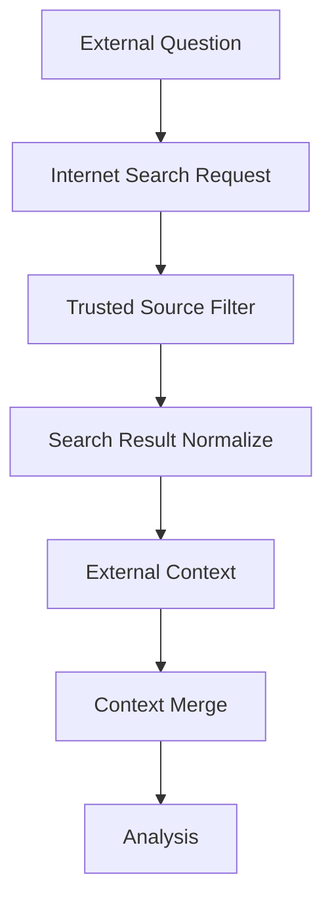

### Planned

- 互联网检索默认受控、可关闭。
- 所有外部结果必须带来源与时间边界。

## Context Merge Flow

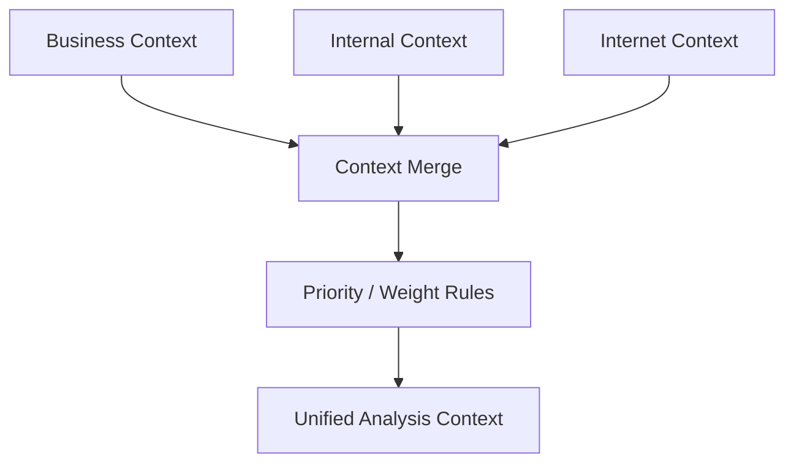

### Planned

- 未来必须定义合并优先级、冲突策略、缺失值策略和来源保留策略。

## Citation and Source Trace Flow

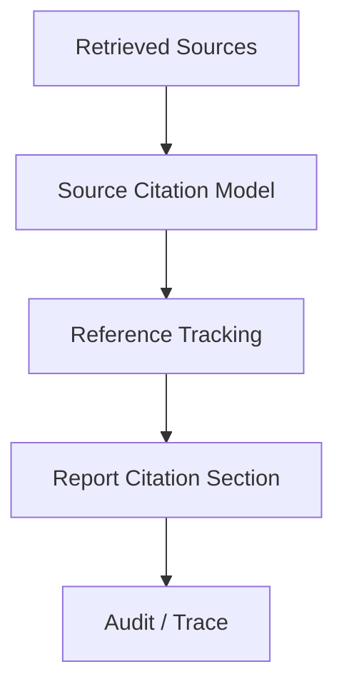

### Planned

- 所有检索结果进入分析前后都必须可追踪来源。
- 引用模型与审计模型必须保持一致。

## Future Hybrid Search Architecture

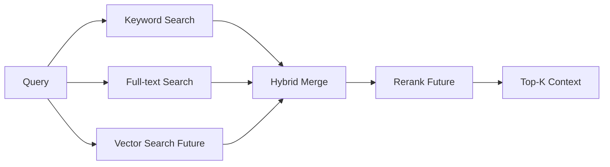

### Planned

- PostgreSQL keyword search 可作为早期能力。
- PostgreSQL full-text search、pgvector、Hybrid Search 均为规划项，不表示当前已实现。

## Workflow Architecture

### Planned Flow

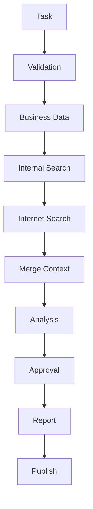

### Current State

- 当前只实现了 Task → KPI / Research → Report 的简化链路。

### Planned State

- 后续 Workflow 统一以该主链路为冻结基线。

## Document Pipeline

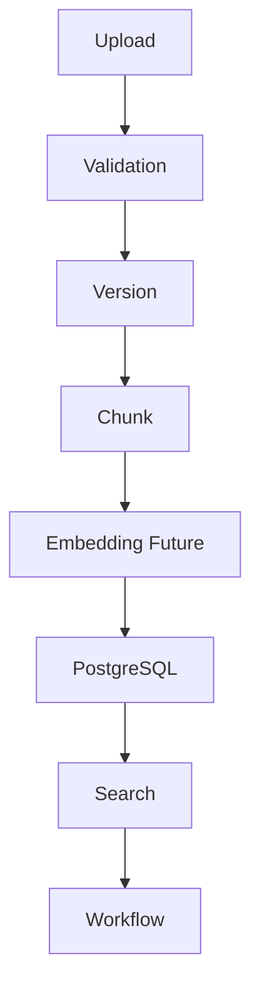

### Current State

- 当前尚未实现完整 Document Pipeline。

### Planned State

- 文档先进入版本化与分块，再进入检索与 Workflow。

## Business Data Pipeline

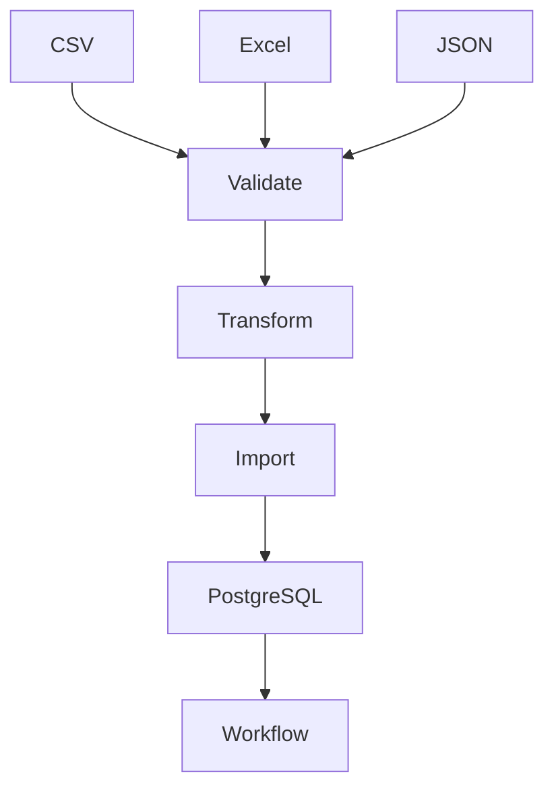

### Current State

- 当前业务数据仍以写死示例和本地静态值为主。

### Planned State

- 所有业务数据通过 Validate → Transform → Import 进入 PostgreSQL，再供 Workflow 使用。

## Approval Workflow

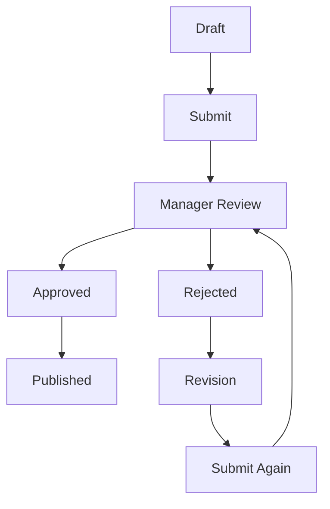

### Current State

- 当前未实现审批流。

### Planned State

- 后续 Approval 将作为 Workflow 正式节点而非附加人工步骤。

## Database Target Design

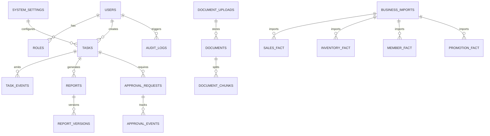

### Current State

- 当前数据库目标尚未实现。

### Planned State

- 上述 ER 图是 PostgreSQL 目标设计基线，不表示当前表已经存在。

## Testing Matrix

| 测试类型 | 覆盖对象 | 目标 |
| --- | --- | --- |
| Unit | Domain、Provider、Repository、Transformer、Validator | 验证单模块规则与纯逻辑 |
| Integration | API、Repository、Import、Search、Approval | 验证模块协作与持久化边界 |
| API | HTTP Contract、Error Contract、SSE Contract | 验证接口稳定性 |
| Workflow | LangGraph Node、Route、Approval、Publish | 验证状态流转与失败路径 |
| Frontend | 表单、Timeline、Report、Approval UI | 验证前端交互和契约一致性 |
| Database | Migration、Schema、Query、Restore | 验证 PostgreSQL 设计与演进安全 |
| Performance | API、Search、Workflow、Import | 验证容量、延迟、退化行为 |
| Manual | 端到端业务场景、异常场景、运维场景 | 验证真实业务可接受性 |

### Retrieval Evaluation Scope

- Business Data Retrieval
- Internal Document Retrieval
- Internet Search Retrieval
- Context Merge Quality
- Citation Completeness
- Hallucination Risk Control

## Documentation Matrix

任何功能完成后必须同步：

| 文档 | 必须同步内容 |
| --- | --- |
| README | 功能定位、启动方式、实现边界 |
| TASK | 当前任务与关闭条件 |
| ROADMAP | 阶段路线与下一阶段目标 |
| BACKLOG | 永久任务与技术债 |
| ARCHITECTURE | 架构边界、流程图、ER 图 |
| CHANGELOG | 变更历史 |
| DECISIONS | 架构与治理决策 |
| HANDBOOK | handbook 镜像与讲解文档 |
| FLOW | 前后端、Workflow、Pipeline 图 |
| TESTING | 测试矩阵、测试方法、验收路径 |

未同步以上文档，不得标记完成。

## Epic 0 Deliverables

- [ ] Architecture Freeze
- [ ] Directory Freeze
- [ ] Repository Freeze
- [ ] Provider Freeze
- [ ] Workflow Freeze
- [ ] Database Freeze
- [ ] Testing Freeze
- [ ] Documentation Freeze

## 技术架构图


> 当前为治理初始化视图。后续必须依据真实代码、文档或运行结果细化。

## 系统架构

- 当前实现：待根据项目结构确认。
- 外部依赖：待确认。
- 数据边界：待确认。
- 部署方式：待确认。

## Agent 架构

- 是否包含 Agent：待确认。
- Agent 角色、状态、工具、权限和失败处理：待确认。

## RAG 流程图


> 如果项目不包含 RAG，应明确标记“不适用”；如果包含，应替换为实际流程。

## MCP 流程图

```mermaid
flowchart LR
    H[MCP Client] --> I[MCP Server]
    I --> J[Tools / Resources / Prompts]
```

> 如果项目不包含 MCP，应明确标记“不适用”；如果包含，应补充权限、参数校验和审计边界。

## 更新规则

- 架构变化必须同步更新本文件。
- 重要决策必须登记到 `DECISIONS.md`。
- 复杂流程优先使用 Mermaid，并与真实实现保持一致。

<!-- DOC-SYNC:START group=architecture -->
## 文档同步块

- group: `architecture`
- file: `retail-insight-ai/docs/ARCHITECTURE.md`
- self_sha256: `99ec6a7ef9caa11ad9233e4d6e8d40c2a55ba621584fde27685bce1a52da50b0`
- peers:
- `retail-insight-ai/docs/DECISIONS.md` | sha256=fde8a8d32a6812c38add97db9042a1932dda711f32999bde03e862b86bef35d5 | # retail-insight-ai Architecture Decisions / 本文件保存 Architecture Decision Record（ADR）。不得删除已生效或已废弃的历史决策。 / ## ADR-001 / 日期：2026-06-29
- `ai-agent-retail-handbook-v3/03_AI核心知识.md` | sha256=b29ec1e0b01d85b5a69735c85dcc9e8cfac763e70e38b844dcca04cce5bb64e5 | # 03_AI核心知识 / ## 第一章 知识服务于项目 / 本书中的知识点只围绕 Retail Insight AI 展开。FastAPI、LangGraph、RAG、Streaming、Docker 都不是孤立知识，而是服务于日本小売業客户的经营分析任务。 / 【TL Review】
- `ai-agent-retail-handbook-v3/08_架构图册.md` | sha256=ab27e2cb38443f53f6aff5c2b5d5a495a1774894d29429f463b926c5993d4611 | # 08_架构图册 / # 目录 / - [1. Overall Architecture](#1-overall-architecture) / - [2. User to API Flow](#2-user-to-api-flow)
- `ai-agent-retail-handbook-v3/09_系统设计书.md` | sha256=506bedbfe7ebcb7f81c127c63a3ace28ee8d3329261015d798bb5b6783032f2e | # 09_系统设计书 / # 目录 / - [1. 项目概要](#1-项目概要) / - [2. 系统目标](#2-系统目标)
- `ai-agent-retail-handbook-v3/12_ADR.md` | sha256=1e6bffd61980a95594dd214ccd7db7261c5f63f13df186a392ead99cc8f47766 | # 12_ADR / # 目录 / - [ADR-001 使用 Task API](#adr-001-使用-task-api) / - [ADR-002 引入 TaskService](#adr-002-引入-taskservice)

说明：
- 这个块由 `scripts/sync_retail_handbook_docs.py` 自动维护。
- 只同步这个块，不覆盖各自正文。
- 任一组内文档正文变化时，整组文档的同步块都会一起刷新。
<!-- DOC-SYNC:END group=architecture -->
