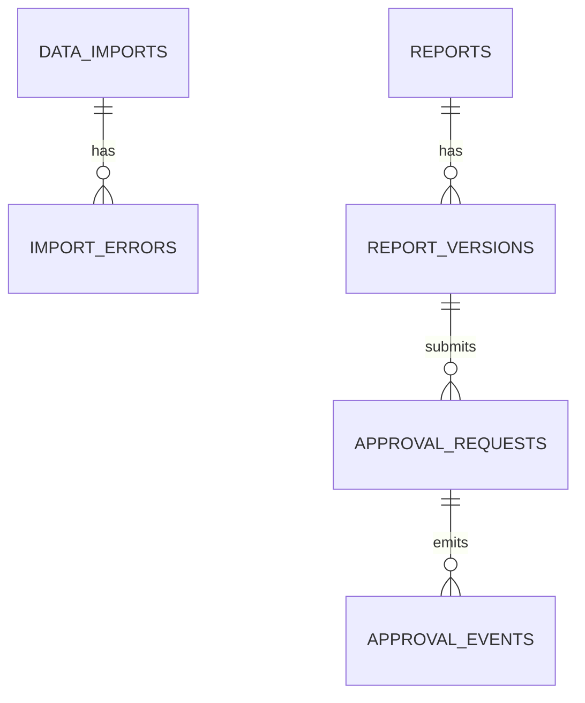

# retail-insight-ai Database Preparation

最后更新：2026-07-04

本文件记录 Phase 2 PostgreSQL Persistence MVP 的目标表结构与当前落地边界。未接入业务 API 的能力必须明确标注为规划，不得写成已实现。

## Current State

- 当前默认仍使用 InMemory Repository
- 当前已新增可选 PostgreSQL Repository
- 当前已提供 `backend/db/schema.sql` 与 `backend/db/init.sql`
- 当前已建 `approval_requests` / `approval_events` 表，但尚未接入审批 API

## Target State

为以下对象建立 PostgreSQL 持久化基础：

- `tasks`
- `task_events`
- `data_imports`
- `import_errors`
- `reports`
- `report_versions`
- `approval_requests`
- `approval_events`

## Planned

- 当前已落地 PostgreSQL 表结构与 Task / Event / Report Repository
- 当前文档继续作为 Import / Approval 扩展的设计输入

## Runtime Rules

- `REPOSITORY_BACKEND`:
  `inmemory` 为默认值，`postgres` 为显式启用值。
- UTC:
  所有数据库时间字段统一使用 `TIMESTAMPTZ`，连接建立后设置 `SET TIME ZONE 'UTC'`。
- Schema:
  `backend/db/schema.sql` 使用 `CREATE TABLE IF NOT EXISTS`，支持重复执行。
- Driver:
  当前实现优先使用 `psycopg[binary]`。

## tasks

### Purpose

保存任务事实。

### Current State

已实现 PostgreSQL Repository。

### Key Fields

| 字段 | 类型建议 | 说明 |
| --- | --- | --- |
| `id` | TEXT | 主键，task_id |
| `question` | TEXT | 用户问题 |
| `mode` | TEXT | `hybrid / kpi / research` |
| `status` | TEXT | `queued / running / completed / failed` |
| `created_at` | TIMESTAMPTZ | 创建时间 |
| `updated_at` | TIMESTAMPTZ | 更新时间 |

## task_events

### Purpose

保存任务事件轨迹，供 SSE 与审计复用。

### Current State

已实现 PostgreSQL Repository。

### Key Fields

| 字段 | 类型建议 | 说明 |
| --- | --- | --- |
| `task_id` | TEXT | 关联 `tasks.id` |
| `sequence` | INTEGER | 事件顺序号 |
| `event_type` | TEXT | `status / done / error` |
| `status` | TEXT | 当前任务状态 |
| `message` | TEXT | 事件说明 |
| `created_at` | TIMESTAMPTZ | 事件时间 |

## data_imports

### Purpose

记录一次文件导入批次。

### Planned Fields

| 字段 | 类型建议 | 说明 |
| --- | --- | --- |
| `id` | UUID | 主键 |
| `import_type` | TEXT | `business_csv` / `research_json` / `document_markdown` |
| `file_name` | TEXT | 原始文件名 |
| `file_path` | TEXT | 本地路径或未来对象存储路径 |
| `schema_version` | TEXT | 数据契约版本 |
| `status` | TEXT | `accepted` / `failed` / `processed` |
| `record_count` | INTEGER | 数据行数 |
| `started_at` | TIMESTAMPTZ | 开始时间 |
| `completed_at` | TIMESTAMPTZ | 完成时间 |
| `created_by` | TEXT NULL | 未来导入操作者 |

## import_errors

### Purpose

记录导入错误明细。

### Planned Fields

| 字段 | 类型建议 | 说明 |
| --- | --- | --- |
| `id` | UUID | 主键 |
| `data_import_id` | UUID | 关联 `data_imports.id` |
| `error_code` | TEXT | `missing_file` / `invalid_header` / `invalid_type` / `empty_dataset` / `invalid_json` / `invalid_source` / `unsupported_encoding` |
| `field_name` | TEXT NULL | 出错字段 |
| `row_number` | INTEGER NULL | 出错行号 |
| `message` | TEXT | 安全错误说明 |
| `created_at` | TIMESTAMPTZ | 记录时间 |

## reports

### Purpose

保存当前有效报告实体。

### Current State

已实现当前报告持久化，`approval_status` 当前仍写入 `generated`。

### Planned Fields

| 字段 | 类型建议 | 说明 |
| --- | --- | --- |
| `task_id` | UUID / TEXT | 与任务关联 |
| `provider` | TEXT | 当前是 `static` |
| `approval_status` | TEXT | `generated` / `draft` / `pending_approval` / `approved` / `rejected` / `revised` / `published` / `archived` |
| `current_version_id` | UUID NULL | 指向当前版本 |
| `created_at` | TIMESTAMPTZ | 创建时间 |
| `updated_at` | TIMESTAMPTZ | 更新时间 |

## report_versions

### Purpose

保存报告内容版本历史。

### Current State

已实现随报告保存而写入版本快照。

### Planned Fields

| 字段 | 类型建议 | 说明 |
| --- | --- | --- |
| `id` | UUID | 主键 |
| `task_id` | UUID / TEXT | 关联任务 |
| `version_no` | INTEGER | 版本号 |
| `markdown` | TEXT | 报告正文 |
| `status` | TEXT | 版本状态 |
| `revision_reason` | TEXT NULL | 修订原因 |
| `created_at` | TIMESTAMPTZ | 创建时间 |
| `created_by` | TEXT NULL | 未来操作者 |

## approval_requests

### Purpose

记录一次审批申请。

### Planned Fields

| 字段 | 类型建议 | 说明 |
| --- | --- | --- |
| `id` | UUID | 主键 |
| `report_version_id` | UUID | 关联 `report_versions.id` |
| `requested_by` | TEXT NULL | 提交者 |
| `requested_at` | TIMESTAMPTZ | 提交时间 |
| `status` | TEXT | `pending_approval` / `approved` / `rejected` |
| `approver_id` | TEXT NULL | 审批者 |
| `decision_at` | TIMESTAMPTZ NULL | 审批时间 |

## approval_events

### Purpose

保存审批过程事件轨迹。

### Planned Fields

| 字段 | 类型建议 | 说明 |
| --- | --- | --- |
| `id` | UUID | 主键 |
| `approval_request_id` | UUID | 关联 `approval_requests.id` |
| `event_type` | TEXT | `submitted` / `approved` / `rejected` / `revised` / `published` / `archived` |
| `actor_id` | TEXT NULL | 操作者 |
| `reason` | TEXT NULL | 拒绝或修订原因 |
| `created_at` | TIMESTAMPTZ | 事件时间 |

## Database ER Preparation

