# 08_架构图册

# 目录

- [1. Overall Architecture / アーキテクチャ全体 / 总体架构](#1-overall-architecture)
- [2. User to API Flow / ユーザーから API へのフロー / 用户到 API 流程](#2-user-to-api-flow)
- [3. HTTP Boundary Architecture / HTTP Boundary アーキテクチャ / HTTP Boundary 架构](#3-http-boundary-architecture)
- [4. TaskService Architecture / TaskService アーキテクチャ / TaskService 架构](#4-taskservice-architecture)
- [5. LangGraph Workflow / LangGraph ワークフロー / LangGraph 工作流](#5-langgraph-workflow)
- [6. Fixed KPI Workflow / 固定 KPI ワークフロー / 固定 KPI 工作流](#6-fixed-kpi-workflow)
- [7. Research Agent Workflow / Research Agent ワークフロー / Research Agent 工作流](#7-research-agent-workflow)
- [8. RAG Architecture / RAG アーキテクチャ / RAG 架构](#8-rag-architecture)
- [9. SSE Architecture / SSE アーキテクチャ / SSE 架构](#9-sse-architecture)
- [10. Report Generator Flow / レポート生成フロー / 报告生成流程](#10-report-generator-flow)
- [11. PostgreSQL Architecture / PostgreSQL アーキテクチャ / PostgreSQL 架构](#11-postgresql-architecture)
- [12. Redis Architecture / Redis アーキテクチャ / Redis 架构](#12-redis-architecture)
- [13. RabbitMQ Architecture / RabbitMQ アーキテクチャ / RabbitMQ 架构](#13-rabbitmq-architecture)
- [14. RBAC Architecture / RBAC アーキテクチャ / RBAC 架构](#14-rbac-architecture)
- [15. Audit Log Architecture / 監査ログアーキテクチャ / 审计日志架构](#15-audit-log-architecture)
- [16. OpenTelemetry Architecture / OpenTelemetry アーキテクチャ / OpenTelemetry 架构](#16-opentelemetry-architecture)
- [17. Docker Deployment / Docker デプロイ / Docker 部署](#17-docker-deployment)
- [18. Kubernetes Deployment / Kubernetes デプロイ / Kubernetes 部署](#18-kubernetes-deployment)
- [19. Multi Agent Architecture / マルチエージェントアーキテクチャ / 多 Agent 架构](#19-multi-agent-architecture)
- [20. Enterprise Architecture / エンタープライズアーキテクチャ / 企业架构](#20-enterprise-architecture)
- [21. Document Domain Model / ドキュメントドメインモデル / 文档领域模型](#21-document-domain-model)
- [22. Document Upload API MVP / ドキュメントアップロード API MVP / 文档上传 API MVP](#22-document-upload-api-mvp)
- [23. Document Chunk Pipeline / ドキュメントチャンクパイプライン / 文档分块流水线](#23-document-chunk-pipeline)
- [24. Document Retrieval Flow / ドキュメントリトリーバルフロー / 文档检索流程](#24-document-retrieval-flow)
- [25. Document Read API MVP / ドキュメント読取 API MVP / 文档读取 API MVP](#25-document-read-api-mvp)
- [26. Document Archive API MVP / ドキュメントアーカイブ API MVP / 文档归档 API MVP](#26-document-archive-api-mvp)
- [27. Document Import API MVP / ドキュメントインポート API MVP / 文档导入 API MVP](#27-document-import-api-mvp)
- [28. Technology Stack Architecture / テクノロジースタックアーキテクチャ / 技术栈架构](#28-technology-stack-architecture)
- [29. AI Framework Relationship / AI フレームワーク関係 / AI 框架关系](#29-ai-framework-relationship)
- [30. Retrieval Pipeline / リトリーバルパイプライン / 检索流水线](#30-retrieval-pipeline)
- [31. Technology Evolution / テクノロジー進化 / 技术演进](#31-technology-evolution)
- [32. Enterprise Deployment Topology / エンタープライズデプロイトポロジー / 企业部署拓扑](#32-enterprise-deployment-topology)
- [33. Container Architecture / コンテナアーキテクチャ / 容器架构](#33-container-architecture)
- [34. AI Component Architecture / AI コンポーネントアーキテクチャ / AI 组件架构](#34-ai-component-architecture)
- [35. Create Task End-to-End / タスク作成エンドツーエンド / 创建任务端到端时序](#35-create-task-end-to-end)

本文遵守 `PROJECT_BIBLE.md`。Enterprise Retail Intelligence Platform（ERIP）V1.0 已正式交付；图中的 SQLite、单一 Research Agent、SSE、Docker、PostgreSQL、Redis、RabbitMQ、RBAC、Audit Log、OpenTelemetry、Kubernetes 和 Multi Agent 统一按企业运行架构说明。

## Project Positioning

### Current Platform

当前项目名称统一为 `Enterprise Retail Intelligence Platform (ERIP)`；本图册用于说明企业运行架构与系统整体关系。

### System Architecture

平台名称统一为：

`Enterprise Retail Intelligence Platform (ERIP)`

### Enterprise Deployment

本图册中涉及平台化的结构和组件，统一按正式交付与企业运行架构描述。

## 企业化补充规则

- 每个 Phase 完成后，必须检查本文件中是否需要新增或更新对应图示。
- 本文件至少要覆盖：
  前端流程图、后端流程图、数据流图、数据库 ER 图、LangGraph workflow 图、文档检索流程图、审批 workflow 图、互联网检索流程图。
- 当前缺失或未细化的图，必须以“规划占位”明确标记，不得伪装成已落地实现。
- 所有核心架构图必须三语言维护：
  English、中文（简体）、日本語。
- 后续新增图也必须同时补齐三语言标题、节点与说明。

## 用语统一 / Terminology / 用語統一

| English | 中文（简体） | 日本語 |
|---|---|---|
| Approval Workflow | 审批工作流 | 承認ワークフロー |
| Report | 报告 | レポート |
| Task | 任务 | タスク |
| Task API | 任务 API | タスク API |
| TaskService | 任务应用服务 | TaskService |
| LangGraph Workflow | LangGraph 工作流 | LangGraph ワークフロー |
| Fixed KPI Workflow | 固定 KPI 工作流 | 固定 KPI ワークフロー |
| Research Agent | 调研 Agent | Research Agent |
| Report Generator | 报告生成器 | Report Generator |
| Repository Pattern | 仓储模式 | Repository Pattern |
| Internal Document Search | 社内文档检索 | 社内文書検索 |
| Internet Search | 互联网检索 | インターネット検索 |
| Business Data Retrieval | 业务数据检索 | 業務データ検索 |
| Context Merge | 上下文合并 | コンテキスト統合 |
| Citation / Source Trace | 引用 / 来源追踪 | 引用・出典追跡 |
| Audit Log | 审计日志 | 監査ログ |
| SQLite | SQLite | SQLite |
| PostgreSQL | PostgreSQL | PostgreSQL |
| pgvector | pgvector | pgvector |
| Hybrid Retrieval | 混合检索 | Hybrid Retrieval |
| PostgreSQL Persistence | PostgreSQL 持久化 | PostgreSQL 永続化 |
| Approval Status | 审批状态 | 承認ステータス |

## Phase 2 Status Correction

- Phase 2 PostgreSQL Persistence MVP:
  - Code implemented
  - InMemory path verified
  - PostgreSQL schema implemented
  - PostgreSQL repository tests prepared
  - PostgreSQL real integration test pending
  - Status: In Progress / Partially Verified
- 未验证原因：
  - 当前环境缺少 Docker CLI
  - 当前环境未安装 `psycopg` 到实际运行 venv
  - PostgreSQL 集成测试被 skip
- 下一步需要在可用 PostgreSQL 环境执行：

```bash
docker compose up -d postgres
cd backend
source .venv/bin/activate
pip install -r requirements.txt
REPOSITORY_BACKEND=postgres python -m unittest tests.test_postgres_repositories -v
```

## Trilingual Core Diagram Set / 三语言核心架构图 / 三言語コアアーキテクチャ図

> 注意：
>
> 本图册属于 Living Document（持续维护文档）。
>
> 当前图册以 Retail Insight AI 当前实现为基础，同时包含企业级扩展架构设计。
>
> 随着项目新增模块（API、Workflow、Repository、RAG、Database 等），对应架构图需要持续同步更新。

> 注意：
>
> 本図冊は継続的に更新される Living Document です。
> Retail Insight AI の現在実装と企業向け拡張設計を含みます。
> API・Workflow・Repository・RAG・Database の追加に合わせて更新します。

以下核心图必须以 English / 中文（简体） / 日本語 三语言维护：

- End-to-End Workflow / エンドツーエンドワークフロー / 端到端业务流程
- Approval Workflow / 承認ワークフロー / 审批工作流
- Retrieval Layer Architecture / Retrieval レイヤーアーキテクチャ / 检索层架构
- Business Retrieval Flow / ビジネス検索フロー / 业务检索流程
- Internal RAG Flow / Internal RAG パイプライン / Internal RAG 流程
- Internet Search Flow / インターネット検索フロー / 互联网检索流程
- Context Merge Flow / コンテキスト統合フロー / 上下文合并流程
- Citation and Source Trace Flow / 引用・ソース追跡フロー / 引用与来源追踪流程
- PostgreSQL Persistence Flow / PostgreSQL 永続化フロー / PostgreSQL 持久化流程
- Repository Backend Switch Flow / Repository バックエンド切替フロー / Repository 后端切换流程
- Data Import Flow / データインポートフロー / 数据导入流程
- Document Pipeline / ドキュメントパイプライン / 文档处理流水线
- Audit Log Architecture / 監査ログアーキテクチャ / 审计日志架构
- Testing Matrix / Testing Flow / テストマトリクス / テストフロー / 测试矩阵 / 测试流程

以下三语言图为当前 handbook 基线图。后续遗留英文图可以保留为补充图，但不能替代三语言基线图。

## End-to-End Workflow / エンドツーエンドワークフロー / 端到端业务流程

> **Flow Type（流程类型）：Business Workflow（业务流程）**

### English

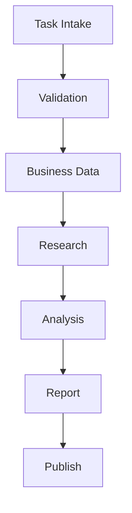

### 中文（简体）

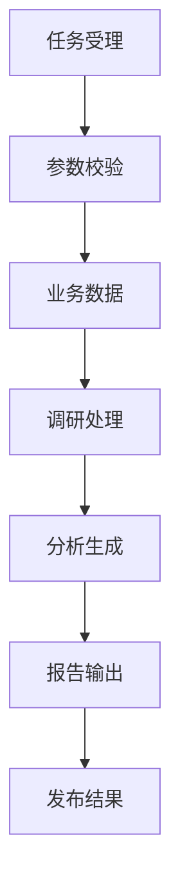

### 日本語

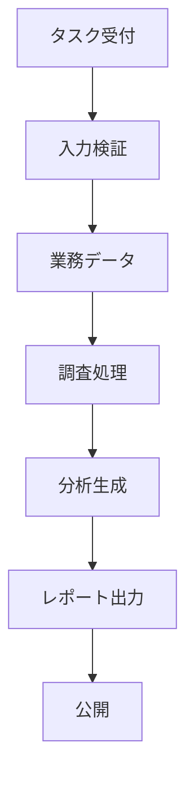

### 中文学习版流程

任务受理
    ↓
参数校验
    ↓
业务数据处理
    ↓
调研
    ↓
分析
    ↓
生成报告
    ↓
发布结果

## Approval Workflow / 承認ワークフロー / 审批工作流

> **Flow Type（流程类型）：Business Workflow（业务流程）**

### English

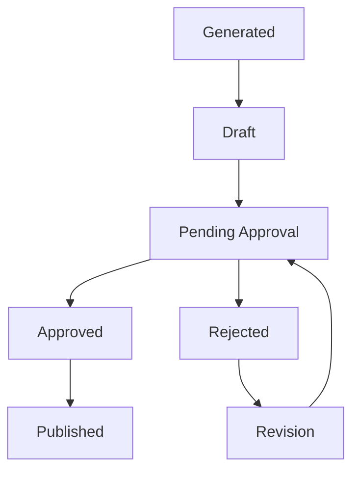

### 中文（简体）

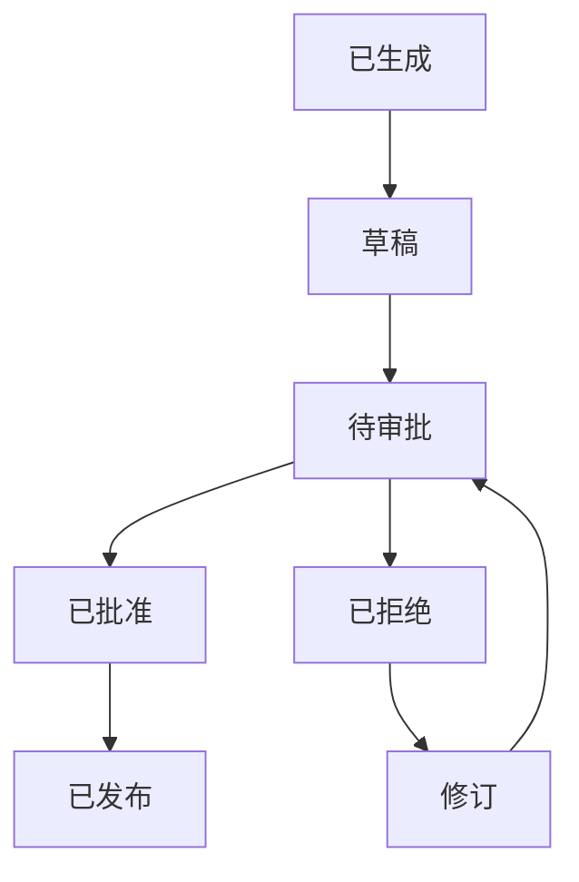

### 日本語

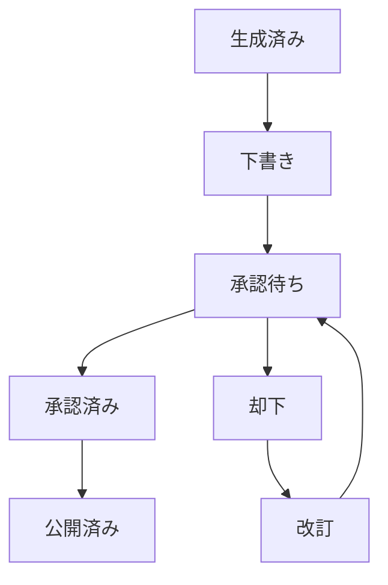

### 中文学习版流程

已生成
    ↓
草稿
    ↓
待审批
    ├── 已批准 → 已发布
    └── 已拒绝 → 修订 → 待审批

## Retrieval Layer Architecture / Retrieval レイヤー構成 / 检索层架构

> **Flow Type（流程类型）：Architecture（系统架构图）**

### English

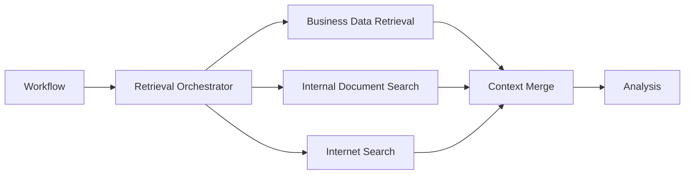

### 中文（简体）

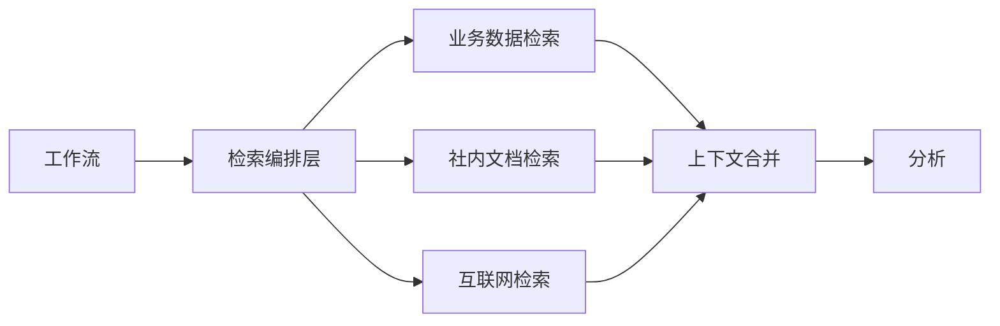

### 日本語

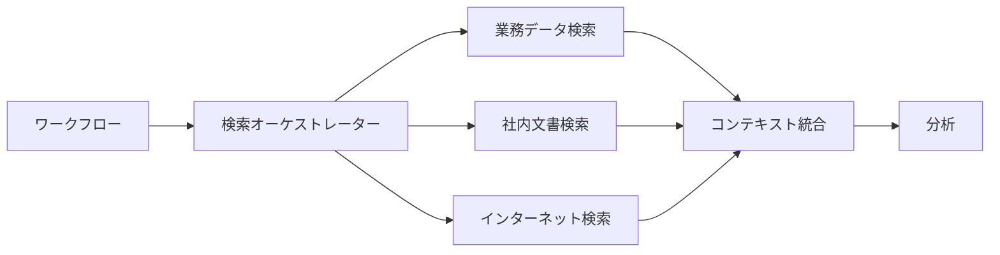

### 中文学习版流程

工作流
    ↓
检索编排层
    ├── 业务数据检索
    ├── 社内文档检索
    └── 互联网检索
    ↓
上下文合并
    ↓
分析

## Business Retrieval Flow / ビジネス検索フロー / 业务检索流程

> **Flow Type（流程类型）：Data Flow（数据流）**

### English

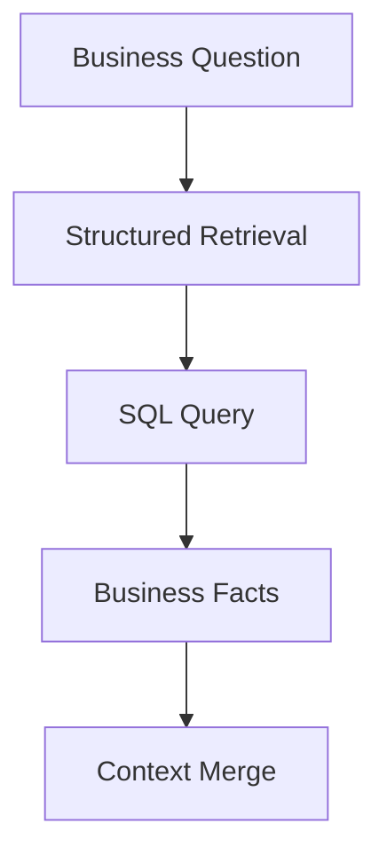

### 中文（简体）

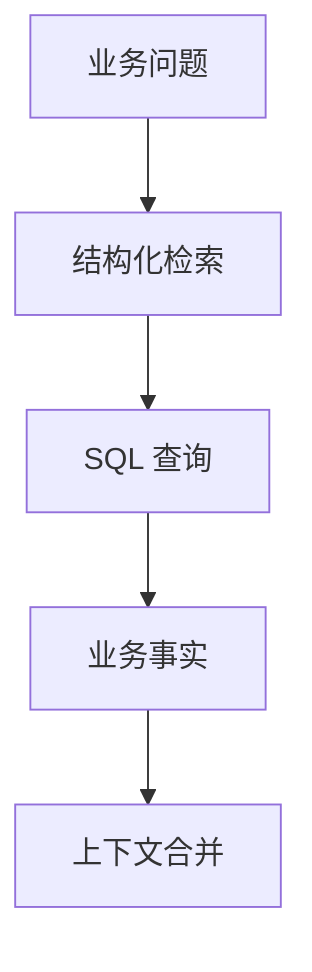

### 日本語

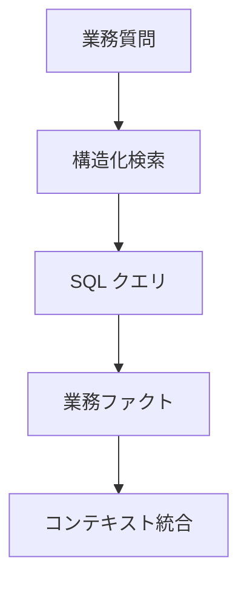

### 中文学习版流程

业务问题
    ↓
结构化检索
    ↓
SQL 查询
    ↓
业务事实
    ↓
上下文合并

## Internal RAG Flow / Internal RAG パイプライン / Internal RAG 流程

> **Flow Type（流程类型）：Data Flow（数据流）**

### English

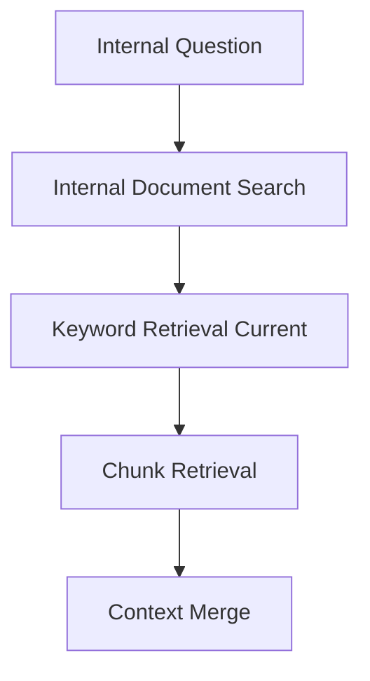

### 中文（简体）

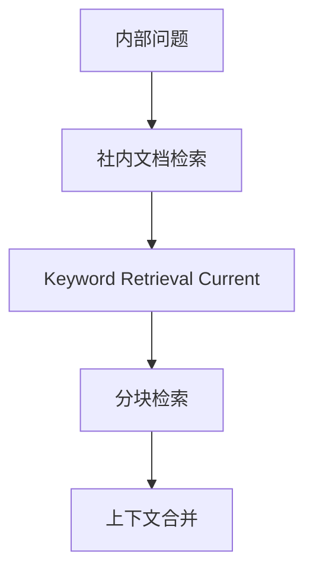

### 日本語

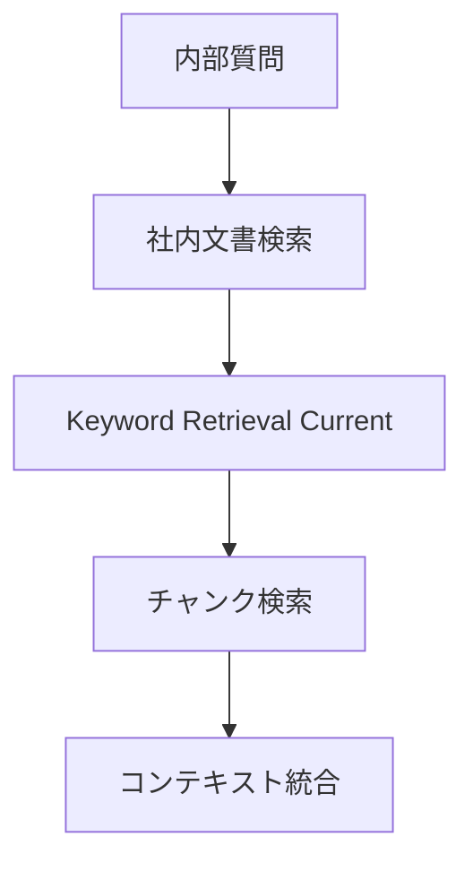

### 中文学习版流程

内部问题
    ↓
社内文档检索
    ↓
关键词搜索
    ↓
分块检索
    ↓
上下文合并

## Internet Search Flow / インターネット検索フロー / 互联网检索流程

> **Flow Type（流程类型）：Data Flow（数据流）**

### English

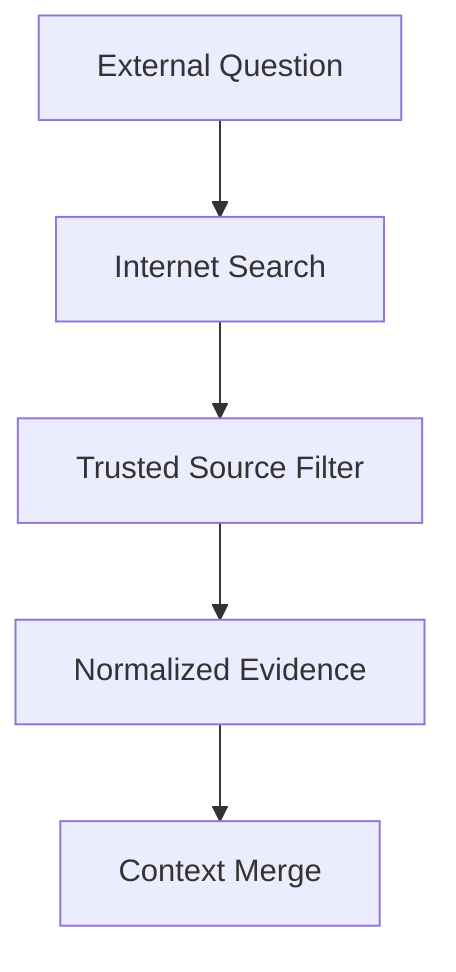

### 中文（简体）

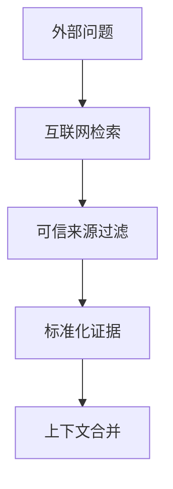

### 日本語

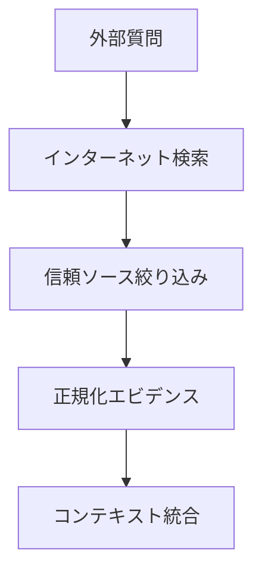

### 中文学习版流程

外部问题
    ↓
互联网检索
    ↓
可信来源过滤
    ↓
标准化证据
    ↓
上下文合并

## Context Merge Flow / コンテキスト統合フロー / 上下文合并流程

> **Flow Type（流程类型）：Data Flow（数据流）**

### English

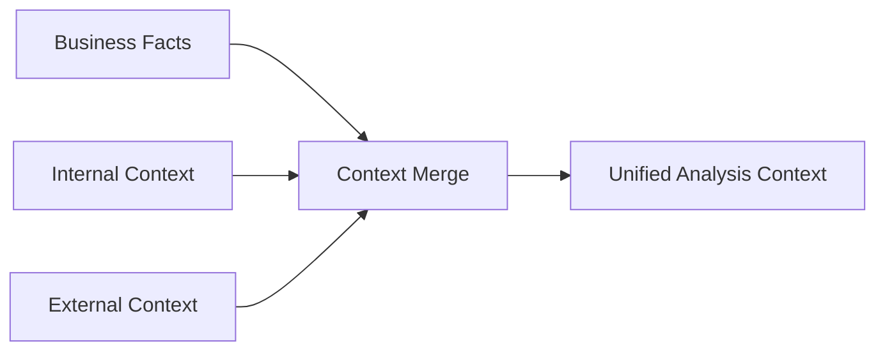

### 中文（简体）

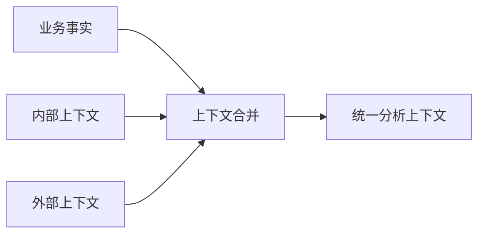

### 日本語

```mermaid
flowchart LR
    A[業務ファクト] --> D[コンテキスト統合]
    B[内部コンテキスト] --> D
    C[外部コンテキスト] --> D
    D --> E[統合分析コンテキスト]
```

### 中文学习版流程

业务事实
内部上下文
外部上下文
    ↓
上下文合并
    ↓
统一分析上下文

## Citation and Source Trace Flow / 引用・ソース追跡フロー / 引用与来源追踪流程

> **Flow Type（流程类型）：Data Flow（数据流）**

### English

```mermaid
flowchart TD
    A[Retrieved Sources] --> B[Citation Model]
    B --> C[Source Trace]
    C --> D[Report References]
    D --> E[Audit Log]
```

### 中文（简体）

```mermaid
flowchart TD
    A[检索来源] --> B[引用模型]
    B --> C[来源追踪]
    C --> D[报告引用]
    D --> E[审计日志]
```

### 日本語

```mermaid
flowchart TD
    A[取得ソース] --> B[引用モデル]
    B --> C[出典追跡]
    C --> D[レポート引用]
    D --> E[監査ログ]
```

### 中文学习版流程

检索来源
    ↓
引用模型
    ↓
来源追踪
    ↓
报告引用
    ↓
审计日志

## PostgreSQL Persistence Flow / PostgreSQL 永続化フロー / PostgreSQL 持久化流程

> **Flow Type（流程类型）：Data Flow（数据流）**

### English

```mermaid
flowchart TD
    A[TaskService] --> B[PostgreSQL Repository]
    B --> C[tasks]
    B --> D[task_events]
    B --> E[reports]
    E --> F[report_versions]
```

### 中文（简体）

```mermaid
flowchart TD
    A[任务服务] --> B[PostgreSQL 仓储层]
    B --> C[tasks 表]
    B --> D[task_events 表]
    B --> E[reports 表]
    E --> F[report_versions 表]
```

### 日本語

```mermaid
flowchart TD
    A[タスクサービス] --> B[PostgreSQL リポジトリ]
    B --> C[tasks テーブル]
    B --> D[task_events テーブル]
    B --> E[reports テーブル]
    E --> F[report_versions テーブル]
```

### 中文学习版流程

任务服务
    ↓
PostgreSQL 仓储层
    ↓
tasks / task_events / reports / report_versions 表

## Repository Backend Switch Flow / Repository バックエンド切替フロー / Repository 后端切换流程

> **Flow Type（流程类型）：Architecture（系统架构图）**

### English

```mermaid
flowchart LR
    A[Settings] --> B{REPOSITORY_BACKEND}
    B -->|inmemory| C[InMemory Repository]
    B -->|postgres| D[PostgreSQL Repository]
    C --> E[TaskService]
    D --> E
```

### 中文（简体）

```mermaid
flowchart LR
    A[配置] --> B{REPOSITORY_BACKEND}
    B -->|inmemory| C[内存仓储]
    B -->|postgres| D[PostgreSQL 仓储]
    C --> E[任务服务]
    D --> E
```

### 日本語

```mermaid
flowchart LR
    A[設定] --> B{REPOSITORY_BACKEND}
    B -->|inmemory| C[インメモリ リポジトリ]
    B -->|postgres| D[PostgreSQL リポジトリ]
    C --> E[タスクサービス]
    D --> E
```

### 中文学习版流程

配置
    ↓
REPOSITORY_BACKEND
    ├── inmemory → 内存仓储 → 任务服务
    └── postgres → PostgreSQL 仓储 → 任务服务

## Data Import Flow / データインポートフロー / 数据导入流程

> **Flow Type（流程类型）：Data Flow（数据流）**

### English

```mermaid
flowchart TD
    A[CSV / JSON / Excel] --> B[Validation]
    B --> C[Transform]
    C --> D[Import Metadata]
    D --> E[PostgreSQL]
```

### 中文（简体）

```mermaid
flowchart TD
    A[CSV / JSON / Excel] --> B[校验]
    B --> C[转换]
    C --> D[导入元数据]
    D --> E[PostgreSQL]
```

### 日本語

```mermaid
flowchart TD
    A[CSV / JSON / Excel] --> B[検証]
    B --> C[変換]
    C --> D[取込メタデータ]
    D --> E[PostgreSQL]
```

### 中文学习版流程

CSV / JSON / Excel
    ↓
校验
    ↓
转换
    ↓
导入元数据
    ↓
PostgreSQL

## Document Pipeline / ドキュメントパイプライン / 文档处理流水线

> **Flow Type（流程类型）：Data Flow（数据流）**

### English

```mermaid
flowchart TD
    A[Upload] --> B[Validation]
    B --> C[Version]
    C --> D[Chunk]
    D --> E[Embedding Planned]
    E --> F[Search]
```

### 中文（简体）

```mermaid
flowchart TD
    A[上传] --> B[校验]
    B --> C[版本管理]
    C --> D[文档切分]
    D --> E[未来 Embedding]
    E --> F[搜索]
```

### 日本語

```mermaid
flowchart TD
    A[アップロード] --> B[検証]
    B --> C[版管理]
    C --> D[チャンク化]
    D --> E[将来 Embedding]
    E --> F[検索]
```

### 中文学习版流程

上传
    ↓
校验
    ↓
版本管理
    ↓
文档切分
    ↓
未来 Embedding
    ↓
搜索

## Audit Log Architecture / 監査ログアーキテクチャ / 审计日志架构

> **Flow Type（流程类型）：Architecture（系统架构图）**

### English

```mermaid
flowchart LR
    A[API] --> B[Workflow]
    B --> C[Repository]
    C --> D[Audit Log]
    B --> D
```

### 中文（简体）

```mermaid
flowchart LR
    A[API] --> B[工作流]
    B --> C[仓储层]
    C --> D[审计日志]
    B --> D
```

### 日本語

```mermaid
flowchart LR
    A[API] --> B[ワークフロー]
    B --> C[リポジトリ]
    C --> D[監査ログ]
    B --> D
```

### 中文学习版流程

API
    ↓
工作流
    ↓
仓储层
    ↓
审计日志

## Testing Matrix / Testing Flow / テストマトリクス / テストフロー / 测试矩阵 / 测试流程

> **Flow Type（流程类型）：Testing Flow（测试流程）**

### English

```mermaid
flowchart TD
    A[Unit Test] --> E[Verification]
    B[Integration Test] --> E
    C[Frontend Test] --> E
    D[Manual Test] --> E
```

### 中文（简体）

```mermaid
flowchart TD
    A[单元测试] --> E[验证]
    B[集成测试] --> E
    C[前端测试] --> E
    D[人工测试] --> E
```

### 日本語

```mermaid
flowchart TD
    A[単体試験] --> E[検証]
    B[結合試験] --> E
    C[フロントエンド試験] --> E
    D[手動試験] --> E
```

### 中文学习版流程

单元测试
集成测试
前端测试
人工测试
    ↓
验证

## Epic 0 Frozen Diagram Set / エピック0固定図セット / Epic 0 冻结图集

Epic 0 需要冻结以下图集，作为后续 Phase 的唯一设计依据：

- Workflow Architecture
- Document Pipeline
- Business Data Pipeline
- Approval Workflow
- Database ER Diagram
- Testing Matrix
- Documentation Matrix

## Epic 12 Retrieval Diagram Set / エピック12検索図セット / Epic 12 检索图集

- Retrieval Layer Architecture
- Business Retrieval Flow
- Internal RAG Flow
- Internet Search Flow
- Context Merge Flow
- Citation and Source Trace Flow
- Hybrid Retrieval Architecture

## Phase 1 File Input Diagram Set / フェーズ1ファイル入力図セット / Phase 1 文件输入图集

- Business CSV -> LocalBusinessDataLoader -> KPI Workflow
- Research JSON -> LocalResearchDataLoader -> StaticResearchProvider
- Document Markdown -> Document Boundary
- Report status=generated -> Approval Workflow

## Phase 1.5 Diagram Set / フェーズ1.5図セット / Phase 1.5 图集

- Data Import Flow
- Data Contract Validation Flow
- Approval State Machine
- Report Revision Flow
- Phase 1 to Phase 2 Migration Flow

## Phase 2 Diagram Set / フェーズ2図セット / Phase 2 图集

- Repository Backend Switch
- PostgreSQL Persistence Scope
- Approval and Import Schema Boundary

## 1. Overall Architecture / アーキテクチャ全体 / 总体架构

**业务目的**

把日本零售企业的 KPI 分析、市场调查和管理层报告纳入同一条可追踪任务链。

```mermaid
flowchart LR
    U["经营企画 / 商品部 / 库存管理"] --> FE["React Frontend"]
    FE --> API["FastAPI"]
    API --> TS["TaskService"]
    TS --> LG["LangGraph Workflow"]
    LG --> KPI["Fixed KPI Workflow"]
    LG --> RA["Research Agent"]
    KPI --> RG["Report Generator"]
    RA --> RG
    RG --> DS["Report Store"]
    TS --> SSE["SSE"]
    SSE --> FE
```

**技术说明**

TaskService 拥有外层任务生命周期，LangGraph Workflow 拥有分析状态与路由；KPI 和 Research 保持独立失败边界。

**面试讲解方式**

先说明经营会议场景，再按 User、FastAPI、TaskService、Workflow、KPI / Research、Report、SSE 的顺序说明。

**TL追问**

- 重点确认任务状态的唯一所有者。
- 重点确认 Research 失败不会覆盖 KPI 结果。

**Production扩展方向**

以 PostgreSQL 作为事实来源，Redis 保存热状态，RabbitMQ 分发任务，OpenTelemetry 贯穿全链路。

## 2. User to API Flow / ユーザーから API へのフロー / 用户到 API 流程

**业务目的**

让业务用户提交分析任务后立即得到受理结果，并持续获知执行状态。

```mermaid
sequenceDiagram
    actor User as 业务用户
    participant FE as React
    participant API as FastAPI
    participant TS as TaskService
    participant WF as Workflow
    User->>FE: 输入分析条件
    FE->>API: POST /api/tasks
    API->>TS: create_task
    TS-->>API: task_id
    API-->>FE: accepted + task_id
    TS->>WF: start task
    FE->>API: GET task status / events
    API-->>FE: status / report reference
```

**技术说明**

HTTP 请求只负责受理，长时间分析不占用同步响应；task_id 是状态、事件、报告和日志的关联键。

**面试讲解方式**

强调“accepted 不等于 completed”，用户拿到 task_id 后通过 SSE 或状态 API 继续确认。

**TL追问**

- 重点确认重复提交与幂等范围。
- 重点确认输入校验失败时不创建任务。

**Production扩展方向**

增加 SSO、Rate Limit、API Gateway、请求幂等键和统一错误合同。

## 3. HTTP Boundary Architecture / HTTP Boundary アーキテクチャ / HTTP Boundary 架构

**业务目的**

为创建任务、查询状态、订阅事件和读取报告提供稳定边界。

```mermaid
flowchart TD
    C["Client"] --> V["Request Validation"]
    V -->|"invalid"| E["Unified Error"]
    V -->|"valid"| I["Idempotency Check"]
    I --> T["Task Command"]
    T --> S["TaskService"]
    S --> R["Task Response"]
    R --> C
```

**技术说明**

API 层只处理认证上下文、Schema 校验、幂等检查、Service 调用和响应转换，不直接执行 Workflow 或访问 SQL。

**面试讲解方式**

用“HTTP 边界”和“业务用例边界”说明 API 与 TaskService 的分工。

**TL追问**

- 重点确认错误码、request_id 和 task_id 的一致性。
- 重点确认状态查询和报告读取的权限校验。

**Production扩展方向**

引入 SSO、API Gateway、请求限流、版本管理和契约测试。

## 4. TaskService Architecture / TaskService アーキテクチャ / TaskService 架构

**业务目的**

统一管理任务从创建到完成或失败的生命周期。

```mermaid
flowchart TD
    API["FastAPI"] --> TS["TaskService"]
    TS --> TR["Task Repository"]
    TS --> WF["Workflow Port"]
    TS --> EB["Event Publisher"]
    TS --> RR["Report Repository"]
    WF --> TS
    TS --> ST{"State Transition"}
    ST --> Q["queued"]
    ST --> R["running"]
    ST --> C["completed"]
    ST --> F["failed"]
```

**技术说明**

TaskService 只协调状态、Workflow、事件和结果，不包含 KPI 算法、Research Prompt 或报告模板。

**面试讲解方式**

说明它是 use case 层，不是通用“大 Service”；状态迁移由单一入口控制。

**TL追问**

- 重点确认终态不可被普通流程覆盖。
- 重点确认重试不会重复保存报告或发送完成事件。

**Production扩展方向**

将 Workflow 启动改为 RabbitMQ 投递，任务事实迁移 PostgreSQL，热状态同步 Redis。

## 5. LangGraph Workflow / LangGraph ワークフロー / LangGraph 工作流

**业务目的**

显式表达经营分析的状态、节点、条件路由、失败位置和终止路径。

```mermaid
stateDiagram-v2
    [*] --> Route
    Route --> KPI: KPI required
    Route --> Research: research only
    KPI --> Research: research required
    KPI --> Report: KPI only
    Research --> Report: research finished or degraded
    Report --> Completed: report saved
    Route --> Failed: invalid route
    KPI --> Failed: core KPI failed
    Report --> Failed: report save failed
    Completed --> [*]
    Failed --> [*]
```

**技术说明**

State 只保存路由和后续 Node 所需的结构化结果；Node 返回局部更新，Edge 明确所有分支与终止条件。

**面试讲解方式**

按 State、Node、Edge、Checkpoint 四个词说明为什么普通串行函数不足。

**TL追问**

- 重点确认未知路由不会停留在 running。
- 重点确认副作用 Node 的幂等性和 checkpoint 版本。

**Production扩展方向**

增加持久化 checkpoint、interrupt / resume、Node 级 retry、人工审批和 State Schema 版本治理。

## 6. Fixed KPI Workflow / 固定 KPI ワークフロー / 固定 KPI 工作流

**业务目的**

保证销售、库存、商品、会员和促销 KPI 的口径稳定、可复算、可审计。

```mermaid
flowchart LR
    D["Validated Business Data"] --> P["Preprocessing"]
    P --> S["Sales KPI"]
    P --> I["Inventory KPI"]
    P --> PR["Product KPI"]
    P --> M["Member KPI"]
    P --> PM["Promotion KPI"]
    S --> V["KPI Validation"]
    I --> V
    PR --> V
    M --> V
    PM --> V
    V --> O["Versioned KPI Result"]
```

**技术说明**

KPI 结果携带计算规则版本、数据期间和来源版本；LLM 只解释结果，不参与数值计算。

**面试讲解方式**

突出“同一输入、同一版本、同一结果”，说明为什么 KPI 不交给 Agent。

**TL追问**

- 重点确认缺失值、舍入、期间和过滤条件。
- 重点确认口径变更的影响调查与历史兼容。

**Production扩展方向**

建立 KPI Registry、审批流程、回归基线和历史报告重算策略。

## 7. Research Agent Workflow / Research Agent ワークフロー / Research Agent 工作流

**业务目的**

为管理层报告补充市场趋势、竞品信息和内部资料证据。

```mermaid
flowchart TD
    Q["Research Request"] --> P["Policy and Scope Check"]
    P --> A["Research Agent"]
    A --> T{"Tool Selection"}
    T --> M["Market Tool"]
    T --> C["Competitor Tool"]
    T --> I["Internal Search"]
    M --> N["Normalize Result"]
    C --> N
    I --> N
    N --> V["Source Validation"]
    V --> O["Summary + Sources + Risk"]
```

**技术说明**

Agent 受到 Tool allowlist、权限范围、调用次数和总 timeout 约束，输出必须包含来源、更新时间、摘要和风险。

**面试讲解方式**

说明 Research 的灵活性来自信息源变化，而不是让 Agent 接管核心业务规则。

**TL追问**

- 重点确认 timeout 后的降级报告。
- 重点确认内部资料的 ACL 和 Prompt Injection 防护。

**Production扩展方向**

增加检索质量评价、Research 缓存、Model Router、工具健康状态和人工确认门槛。

## 8. RAG Architecture / RAG アーキテクチャ / RAG 架构

**业务目的**

让 Research Agent 基于可授权、可更新、可引用的内部资料回答。

```mermaid
flowchart LR
    SRC["Wiki / 月报 / 会议资料"] --> ING["Ingestion and Cleaning"]
    ING --> CH["Chunking"]
    CH --> KR["Keyword Retrieval Current"]
    CH --> EM["Embedding Planned"]
    EM --> VS["Vector Database Target<br/>pgvector first"]
    VS --> HR["Hybrid Retrieval Target"]
    KR --> HR
    Q["User Query + ACL"] --> HR
    HR --> RR["Rerank Target"]
    RR --> TK["Top-K Evidence"]
    TK --> CTX["Context Assembly"]
    CTX --> LLM["LLM"]
    LLM --> ANS["Answer + Citation Target"]
```

**技术说明**

查询携带用户权限；`Keyword Retrieval` 保证词面命中，通过 `Embedding` 与 `Vector Database` 组成 `Hybrid Retrieval`，再在 `Rerank` 后组装带引用的 Context。

**面试讲解方式**

按资料接入、Chunk、Keyword Retrieval、Embedding、Vector Database、Hybrid Retrieval、Rerank、Context、答案引用说明完整链路。

**TL追问**

- 重点确认文档更新、删除和权限变更如何反映到索引。
- 重点确认检索命中率与答案 groundedness 的评价基线。

**Production扩展方向**

增加增量索引、去重、Query Rewrite、Context 压缩、检索评价和反馈回流。

## 9. SSE Architecture / SSE アーキテクチャ / SSE 架构

**业务目的**

让用户实时看到任务进度，同时保证连接中断不影响后台任务。

```mermaid
sequenceDiagram
    participant TS as TaskService
    participant EB as Event Store
    participant SSE as SSE Endpoint
    participant FE as React
    TS->>EB: append event with event_id
    FE->>SSE: connect task_id
    SSE->>EB: read events
    SSE-->>FE: started / status / error / done
    FE--xSSE: connection lost
    FE->>SSE: reconnect with last event_id
    SSE->>EB: read missing events
    SSE-->>FE: resume stream
```

**技术说明**

SSE 是通知通道，最终状态保存在任务库；done 只代表成功，error 代表失败终止。

**面试讲解方式**

强调单向通信、连接与任务解耦、event_id 重连和状态 API 兜底。

**TL追问**

- 重点确认多实例下事件顺序和重复消费。
- 重点确认代理缓冲、heartbeat 和连接上限。

**Production扩展方向**

Redis 保存短期事件，SSE 服务独立扩展，增加 heartbeat、backpressure 和重连上限。

## 10. Report Generator Flow / レポート生成フロー / 报告生成流程

**业务目的**

把结构化 KPI 和有来源的 Research 结果合成为可审查的日文经营报告。

```mermaid
flowchart TD
    KPI["Versioned KPI Result"] --> CB["Context Builder"]
    R["Research + Sources + Risk"] --> CB
    CB --> TV["Template Version"]
    TV --> GEN["Report Generator"]
    GEN --> VAL["Output Validation"]
    VAL -->|"valid"| SAVE["Report Store"]
    VAL -->|"invalid"| ERR["Report Error"]
    SAVE --> META["Report Metadata"]
```

**技术说明**

生成输入是结构化快照，输出校验必填章节、KPI 引用、来源和版本；Generator 不直接查询业务数据库。

**面试讲解方式**

说明报告不是自由文本，而是带数据版本、Prompt / Template 版本和来源的交付物。

**TL追问**

- 重点确认报告失败能否只重跑生成阶段。
- 重点确认模型输出不会改写 KPI 数值。

**Production扩展方向**

引入 Report Template Engine、Prompt Registry、审批流程和报告质量评价。

## 11. PostgreSQL Architecture / PostgreSQL アーキテクチャ / PostgreSQL 架构

**业务目的**

为多用户、多实例环境提供一致、可恢复、可审计的数据事实来源。

```mermaid
erDiagram
    USERS ||--o{ TASKS : creates
    TASKS ||--o{ TASK_EVENTS : has
    TASKS ||--o| REPORTS : produces
    TASKS ||--o{ AUDIT_LOGS : records
    REPORTS ||--o{ REPORT_SOURCES : cites
    STORES ||--o{ SALES : owns
    STORES ||--o{ INVENTORY : owns
    PRODUCTS ||--o{ SALES : referenced_by
    MEMBERS ||--o{ SALES : makes
```

**技术说明**

业务表与任务、报告、审计表分域；Repository 隐藏存储实现，事务保护状态与结果的一致性。

**面试讲解方式**

说明 SQLite 是当前阶段选择，PostgreSQL 是企业运用的数据事实来源，而不是简单替换连接字符串。

**TL追问**

- 重点确认 tenant、department、store scope 的索引和过滤。
- 重点确认迁移校验、备份、恢复和 rollback。

**Production扩展方向**

增加读写容量评估、连接池、分区策略、备份演练和灾害恢复。

## 12. Redis Architecture / Redis アーキテクチャ / Redis 架构

**业务目的**

承接高频任务状态、SSE 事件和可重建缓存，降低主数据库读取压力。

```mermaid
flowchart LR
    API["API Instances"] --> R["Redis"]
    SSE["SSE Instances"] --> R
    W["Workers"] --> R
    R --> TS["Task Status Cache"]
    R --> EV["Event Stream"]
    R --> LK["Distributed Lock"]
    R --> HC["Hot Cache"]
    PG["PostgreSQL"] -->|"fallback / rebuild"| R
```

**技术说明**

Redis 不保存唯一业务事实；缓存失效时从 PostgreSQL 回退，所有 key 定义 TTL 和数据归属。

**面试讲解方式**

用“热状态与事实来源分离”说明 Redis 和 PostgreSQL 的边界。

**TL追问**

- 重点确认 Redis 故障时任务事实是否仍可恢复。
- 重点确认分布式锁过期和缓存不一致。

**Production扩展方向**

增加高可用、内存容量告警、event_id 保留策略和缓存重建流程。

## 13. RabbitMQ Architecture / RabbitMQ アーキテクチャ / RabbitMQ 架构

**业务目的**

隔离 API 受理与后台执行，为任务突增提供排队、背压和失败隔离。

```mermaid
flowchart LR
    TS["TaskService"] --> EX["RabbitMQ Exchange"]
    EX --> KQ["KPI Queue"]
    EX --> RQ["Research Queue"]
    EX --> PQ["Report Queue"]
    KQ --> KW["KPI Worker Pool"]
    RQ --> RW["Research Worker Pool"]
    PQ --> PW["Report Worker Pool"]
    KW --> PG["PostgreSQL"]
    RW --> PG
    PW --> PG
    KQ --> DLQ["Dead Letter Queue"]
    RQ --> DLQ
    PQ --> DLQ
```

**技术说明**

不同工作负载独立扩展；消费端必须幂等，重试按错误类型限制，超过上限进入 DLQ。

**面试讲解方式**

说明 Queue 解决削峰与解耦，但不替代 Workflow State 和失败治理。

**TL追问**

- 重点确认消息重复、顺序、重放和 poison message。
- 重点确认队列积压时的限流与业务优先级。

**Production扩展方向**

增加 queue latency 告警、消费者自动扩展、DLQ 处置流程和任务取消协议。

## 14. RBAC Architecture / RBAC アーキテクチャ / RBAC 架构

**业务目的**

确保经营层、经营企画、商品部、库存管理和门店人员只能访问授权数据与操作。

```mermaid
flowchart TD
    IDP["SSO / Identity Provider"] --> AUTH["Authentication"]
    AUTH --> SUB["User Context"]
    SUB --> PDP["RBAC Policy"]
    PDP --> ROLE["Role Permission"]
    PDP --> SCOPE["Department / Store Scope"]
    ROLE --> API["API Authorization"]
    SCOPE --> DB["Database Filter"]
    SCOPE --> SEARCH["Search ACL Filter"]
    ROLE --> REPORT["Report Authorization"]
```

**技术说明**

授权同时检查角色与数据范围，并在 API、Service、数据库、检索和报告读取边界执行；默认拒绝。

**面试讲解方式**

说明前端隐藏按钮不是权限控制，服务端全链路校验才是安全边界。

**TL追问**

- 重点确认组织变更与历史任务权限快照。
- 重点确认管理权限与业务数据权限分离。

**Production扩展方向**

增加权限矩阵审批、定期复核、拒绝事件监控和多租户隔离。

## 15. Audit Log Architecture / 監査ログアーキテクチャ / 审计日志架构

**业务目的**

为任务、数据访问、Tool 调用、报告生成和权限变更提供不可抵赖的追踪记录。

```mermaid
flowchart LR
    API["API"] --> AE["Audit Event"]
    TS["TaskService"] --> AE
    RA["Research Agent"] --> AE
    RBAC["RBAC"] --> AE
    RG["Report Generator"] --> AE
    AE --> MASK["Sensitive Data Filter"]
    MASK --> STORE["Audit Store"]
    STORE --> VIEW["Authorized Audit Viewer"]
```

**技术说明**

审计事件记录 user_id、task_id、操作、对象、结果、时间和 trace_id，不复制 Prompt 全文、会员数据或 Secret。

**面试讲解方式**

区分业务审计与调试日志：前者服务追责与合规，后者服务障害调查。

**TL追问**

- 重点确认访问权限、保留期限和完整性保护。
- 重点确认审计写入失败是否阻止高风险操作。

**Production扩展方向**

增加追加写入、归档、完整性校验、审计查询和异常访问告警。

## 16. OpenTelemetry Architecture / OpenTelemetry アーキテクチャ / OpenTelemetry 架构

**业务目的**

跨 API、异步任务、Workflow Node、Tool 和数据库定位延迟与失败。

```mermaid
flowchart LR
    API["FastAPI Span"] --> TS["TaskService Span"]
    TS --> MQ["Queue Context"]
    MQ --> WF["Workflow Span"]
    WF --> KPI["KPI Node Span"]
    WF --> RA["Research Node Span"]
    WF --> RG["Report Node Span"]
    RA --> TOOL["Tool Span"]
    KPI --> DB["Database Span"]
    RG --> DB
    API --> COL["OpenTelemetry Collector"]
    TS --> COL
    WF --> COL
    TOOL --> COL
    DB --> COL
```

**技术说明**

trace context 与 task_id 一起跨异步边界传递；日志、Metrics、Trace 关联，但不采集敏感业务正文。

**面试讲解方式**

从一次 task_id 如何追到 Node、Tool、DB 和报告说明可观测性价值。

**TL追问**

- 重点确认异步 context propagation。
- 重点确认采样、成本、敏感字段和告警责任人。

**Production扩展方向**

建设 Collector 高可用、Dashboard、SLO、告警、成本指标和 Incident Runbook。

## 17. Docker Deployment / Docker デプロイ / Docker 部署

**业务目的**

统一开发、测试、Review 和部署准备环境，保证构建可重复。

```mermaid
flowchart TD
    SRC["Source Code"] --> BUILD["Container Build"]
    BUILD --> API["FastAPI Container"]
    BUILD --> FE["React Container"]
    API --> DATA["SQLite / External Data"]
    FE --> API
    CFG["Environment Configuration"] --> API
    HC["Health Check"] --> API
    API --> LOG["stdout Logs"]
```

**技术说明**

配置与 Secret 不进入镜像；容器以非 root 运行，health check、标准输出日志和镜像扫描纳入发布要求。

**面试讲解方式**

说明 Docker 解决环境一致性，不自动等于高可用或完成 Kubernetes 运用。

**TL追问**

- 重点确认镜像版本、依赖漏洞和 Secret 管理。
- 重点确认 graceful shutdown 与在途任务处理。

**Production扩展方向**

接入 CI/CD、镜像签名、SBOM、集中日志和容器资源限制。

## 18. Kubernetes Deployment / Kubernetes デプロイ / Kubernetes 部署

**业务目的**

按 API、SSE、KPI、Research、Report 的不同负载独立扩展并支持滚动发布。

```mermaid
flowchart TD
    IN["Ingress"] --> API["FastAPI Pods"]
    IN --> SSE["SSE Pods"]
    API --> MQ["RabbitMQ"]
    MQ --> KW["KPI Worker Pods"]
    MQ --> RW["Research Worker Pods"]
    MQ --> PW["Report Worker Pods"]
    API --> REDIS["Redis"]
    SSE --> REDIS
    KW --> PG["PostgreSQL"]
    RW --> PG
    PW --> PG
    OTEL["OpenTelemetry Collector"] --> OBS["Observability Backend"]
    API --> OTEL
    KW --> OTEL
    RW --> OTEL
    PW --> OTEL
```

**技术说明**

部署单元按扩展特性划分，不把每个 Agent 机械拆成服务；readiness、资源限制和 Pod 终止流程保护在途任务。

**面试讲解方式**

说明 Kubernetes 解决部署与伸缩，不能替代幂等、数据库优化或队列治理。

**TL追问**

- 重点确认 rolling update 下的 State / checkpoint 兼容。
- 重点确认 SSE 连接排空和 Worker graceful shutdown。

**Production扩展方向**

增加 HPA、PodDisruptionBudget、Secrets 管理、Canary、灾害恢复和多环境隔离。

## 19. Multi Agent Architecture / マルチエージェントアーキテクチャ / 多 Agent 架构

**业务目的**

当市场、竞品和内部资料调查在权限、上下文和扩展特性上明显分离时，独立治理各类 Research。

```mermaid
flowchart TD
    REQ["Research Request"] --> SUP["Research Supervisor"]
    SUP --> MA["Market Agent"]
    SUP --> CA["Competitor Agent"]
    SUP --> IA["Internal Knowledge Agent"]
    MA --> MR["Market Result"]
    CA --> CR["Competitor Result"]
    IA --> IR["Internal Result"]
    MR --> GATE["Quality Gate"]
    CR --> GATE
    IR --> GATE
    GATE --> OUT["Research Result + Sources"]
```

**技术说明**

Supervisor 只分派与汇总；各 Agent 拥有独立 Tool、权限、预算和终止条件。Fixed KPI Workflow 不进入 Agent 协商。

**面试讲解方式**

先说明当前单一 Research Agent 足够，再说明何时因职责、权限或扩展需求升级 Multi Agent。

**TL追问**

- 重点确认 Agent 数量是否有业务必要性。
- 重点确认消息协议、冲突处理、预算和终止保护。

**Production扩展方向**

增加 Agent 级评价、并行执行、预算控制、结果仲裁和人工质量门禁。

## 20. Enterprise Architecture / エンタープライズアーキテクチャ / 企业架构

**业务目的**

形成支持多部门、多门店、可审计、可恢复、可扩展的企业级经营分析平台。

```mermaid
flowchart LR
    USER["Enterprise Users"] --> IDP["SSO / IdP"]
    IDP --> GW["API Gateway"]
    GW --> API["FastAPI Cluster"]
    API --> RBAC["RBAC Policy"]
    API --> TS["TaskService"]
    TS --> MQ["RabbitMQ"]
    MQ --> WF["LangGraph Workers"]
    WF --> KPI["Fixed KPI Workflow"]
    WF --> RA["Research Agent System"]
    RA --> SEARCH["Hybrid Retrieval Target + Vector Database Target"]
    KPI --> PG["PostgreSQL"]
    WF --> RG["Report Generator"]
    RG --> PG
    TS --> REDIS["Redis"]
    REDIS --> SSE["SSE Service"]
    SSE --> USER
    API --> AUDIT["Audit Log"]
    WF --> AUDIT
    API --> OTEL["OpenTelemetry"]
    WF --> OTEL
```

**技术说明**

身份、授权、任务、Workflow、检索、持久化、事件、审计和可观测性各有明确所有者；所有跨层调用通过稳定契约完成。

**面试讲解方式**

按信任边界和数据流说明企业化：谁访问、谁授权、谁执行、数据存哪里、失败如何追踪和恢复。

**TL追问**

- 重点确认高可用不建立在单一 Redis、Queue 或数据库节点上。
- 重点确认多租户隔离、SLO、成本、备份和灾害恢复责任。

**Production扩展方向**

分阶段完成 SSO / RBAC、PostgreSQL、Redis / RabbitMQ、OpenTelemetry、Kubernetes、多租户和 SaaS 治理。

## 21. Document Domain Model / ドキュメントドメインモデル / 文档领域模型

**业务目的**

先固定文档域的状态、来源、版本、元数据和仓储合同，再接 Upload API、RAG、审批和 PostgreSQL。

### Current State

- 当前已经补齐 Document / DocumentVersion / DocumentChunk placeholder / DocumentMetadata / DocumentSource。
- 当前只实现 InMemory Document Repository，还没有 Upload API、RAG、Chunk、pgvector 或 PostgreSQL Document Repository。
- `ImportBatch` 复用 `DataImport`，`ApprovalStatus` 复用现有审批状态语义。

### Production Architecture

- Document Domain 作为 Upload、Version Management、Internal RAG、Approval Workflow、Retrieval 与 PostgreSQL Persistence 的共同基础。
- 所有文档相关能力都必须沿用本节定义的状态、类型、语言和元数据，不得重新发明另一套文档语义。

### Enterprise Deployment

- 后续 Upload API、Document Pipeline、Chunk Pipeline、Retrieval Provider、Approval API 和 PostgreSQL Repository 都必须基于本节模型扩展。
- 当前阶段只允许 `uploaded` 作为新建文档的初始状态，未来状态仅作为生命周期占位与迁移边界。

### English

```mermaid
flowchart LR
    S[DocumentSource] --> M[DocumentMetadata]
    M --> D[Document]
    D --> V[DocumentVersion]
    D --> C[DocumentChunk placeholder]
    M --> T[DocumentType]
    M --> L[Language]
    M --> ST[DocumentStatus]
    D --> A[ApprovalStatus reuse]
```

```mermaid
flowchart TD
    U[uploaded] --> V[validated]
    V --> I[indexed]
    I --> DR[draft]
    DR --> PA[pending_approval]
    PA --> AP[approved]
    AP --> P[published]
    P --> AR[archived]
```

```mermaid
flowchart TD
    M[DocumentMetadata] --> ID[document_id]
    M --> T[title]
    M --> DS[description]
    M --> O[owner]
    M --> CT[created_at]
    M --> UT[updated_at]
    M --> V[version]
    M --> L[language]
    M --> DT[document_type]
    M --> ST[status]
    M --> TG[tags]
    M --> S[source]
    M --> CS[checksum]
```

```mermaid
flowchart LR
    A[Planned Upload API] --> B[Validation]
    B --> C[Document Domain]
    C --> D[Version Management]
    D --> E[Repository]
    E --> F[Retrieval / RAG Planned]
    E --> G[Approval Workflow Target]
    F --> H[PostgreSQL Persistence Target]
```

```mermaid
flowchart LR
    C[Current: Domain Model + InMemory Repository] --> F[Planned: Upload API + Chunk + Retrieval + Approval + PostgreSQL]
```

### 中文（简体）

```mermaid
flowchart LR
    S[文档来源] --> M[文档元数据]
    M --> D[文档]
    D --> V[文档版本]
    D --> C[文档切分占位]
    M --> T[文档类型]
    M --> L[语言]
    M --> ST[文档状态]
    D --> A[复用审批状态]
```

```mermaid
flowchart TD
    U[已上传] --> V[已校验]
    V --> I[已索引]
    I --> DR[草稿]
    DR --> PA[待审批]
    PA --> AP[已批准]
    AP --> P[已发布]
    P --> AR[已归档]
```

```mermaid
flowchart TD
    M[文档元数据] --> ID[document_id]
    M --> T[title]
    M --> DS[description]
    M --> O[owner]
    M --> CT[created_at]
    M --> UT[updated_at]
    M --> V[version]
    M --> L[language]
    M --> DT[document_type]
    M --> ST[status]
    M --> TG[tags]
    M --> S[source]
    M --> CS[checksum]
```

```mermaid
flowchart LR
    A[未来 Upload API] --> B[校验]
    B --> C[文档域模型]
    C --> D[版本管理]
    D --> E[仓储层]
    E --> F[未来检索 / RAG]
    E --> G[未来审批工作流]
    F --> H[未来 PostgreSQL 持久化]
```

```mermaid
flowchart LR
    C[当前：领域模型 + InMemory 仓储] --> F[未来：Upload API + 切分 + 检索 + 审批 + PostgreSQL]
```

### 日本語

```mermaid
flowchart LR
    S[文書ソース] --> M[文書メタデータ]
    M --> D[文書]
    D --> V[文書バージョン]
    D --> C[チャンク占位]
    M --> T[文書タイプ]
    M --> L[言語]
    M --> ST[文書ステータス]
    D --> A[承認ステータス再利用]
```

```mermaid
flowchart TD
    U[アップロード済み] --> V[検証済み]
    V --> I[索引済み]
    I --> DR[下書き]
    DR --> PA[承認待ち]
    PA --> AP[承認済み]
    AP --> P[公開済み]
    P --> AR[アーカイブ済み]
```

```mermaid
flowchart TD
    M[文書メタデータ] --> ID[document_id]
    M --> T[title]
    M --> DS[description]
    M --> O[owner]
    M --> CT[created_at]
    M --> UT[updated_at]
    M --> V[version]
    M --> L[language]
    M --> DT[document_type]
    M --> ST[status]
    M --> TG[tags]
    M --> S[source]
    M --> CS[checksum]
```

```mermaid
flowchart LR
    A[将来の Upload API] --> B[検証]
    B --> C[文書ドメイン]
    C --> D[バージョン管理]
    D --> E[リポジトリ]
    E --> F[将来の検索 / RAG]
    E --> G[将来の承認ワークフロー]
    F --> H[将来の PostgreSQL 永続化]
```

```mermaid
flowchart LR
    C[現在: ドメインモデル + InMemory リポジトリ] --> F[将来: Upload API + チャンク化 + 検索 + 承認 + PostgreSQL]
```

## 22. Document Upload API MVP / ドキュメントアップロード API MVP / 文档上传 API MVP

### English

```mermaid
flowchart TD
    A[Client] --> B[POST /api/v1/documents]
    B --> C[Validation]
    C --> D[Document Domain]
    D --> E[document.upload.started]
    E --> F[document.version.created]
    F --> G[document.upload.completed]
```

### 中文（简体）

```mermaid
flowchart TD
    A[客户端] --> B[POST /api/v1/documents]
    B --> C[参数校验]
    C --> D[文档领域]
    D --> E[document.upload.started]
    E --> F[document.version.created]
    F --> G[document.upload.completed]
```

### 日本語

```mermaid
flowchart TD
    A[クライアント] --> B[POST /api/v1/documents]
    B --> C[入力検証]
    C --> D[文書ドメイン]
    D --> E[document.upload.started]
    E --> F[document.version.created]
    F --> G[document.upload.completed]
```

### Approval Flow

```mermaid
flowchart TD
    A[document.upload.completed] --> B[pending_approval]
    B --> C[approved]
    B --> D[rejected]
```

## 23. Document Chunk Pipeline / ドキュメントチャンクパイプライン / 文档分块流水线

### English

```mermaid
flowchart TD
    A[Accepted] --> B[Validating]
    B --> C[Storing]
    C --> D[Completed]
    B --> E[Failed]
    C --> E
```

### 中文（简体）

```mermaid
flowchart TD
    A[已受理] --> B[校验中]
    B --> C[存储中]
    C --> D[已完成]
    B --> E[失败]
    C --> E
```

### 日本語

```mermaid
flowchart TD
    A[受付済み] --> B[検証中]
    B --> C[保存中]
    C --> D[完了]
    B --> E[失敗]
    C --> E
```

## 24. Document Retrieval Flow / ドキュメントリトリーバルフロー / 文档检索流程

### English

```mermaid
flowchart TD
    A[POST /api/v1/documents] --> B[Sync validation]
    B --> C[SHA-256 checksum]
    C --> D[Duplicate / idempotency check]
    D --> E[InMemory DocumentRepository]
    E --> F[Upload events]
    F --> G[201 Created]
```

### 中文（简体）

```mermaid
flowchart TD
    A[POST /api/v1/documents] --> B[同步校验]
    B --> C[SHA-256 校验]
    C --> D[重复 / 幂等检查]
    D --> E[InMemory DocumentRepository]
    E --> F[上传事件]
    F --> G[201 Created]
```

### 日本語

```mermaid
flowchart TD
    A[POST /api/v1/documents] --> B[同期検証]
    B --> C[SHA-256 チェックサム]
    C --> D[重複 / 冪等性確認]
    D --> E[InMemory DocumentRepository]
    E --> F[アップロードイベント]
    F --> G[201 Created]
```

## 25. Document Read API MVP / Document Read API MVP / 文档读取 API MVP

### English

```mermaid
flowchart TD
    A[GET /api/v1/documents] --> B[Filter by status/type/language/tag/owner]
    B --> C[InMemory DocumentRepository]
    C --> D[Document list response]
    A2[GET /api/v1/documents/:document_id] --> E[Lookup by document_id]
    E --> F[Found or document_not_found]
```

### 中文（简体）

```mermaid
flowchart TD
    A[GET /api/v1/documents] --> B[按 status/type/language/tag/owner 过滤]
    B --> C[InMemory DocumentRepository]
    C --> D[文档列表响应]
    A2[GET /api/v1/documents/:document_id] --> E[按 document_id 查询]
    E --> F[命中或 document_not_found]
```

### 日本語

```mermaid
flowchart TD
    A[GET /api/v1/documents] --> B[status/type/language/tag/owner で絞り込み]
    B --> C[InMemory DocumentRepository]
    C --> D[文書一覧レスポンス]
    A2[GET /api/v1/documents/:document_id] --> E[document_id で検索]
    E --> F[取得成功または document_not_found]
```

## 26. Document Archive API MVP / Document Archive API MVP / 文档归档 API MVP

### English

```mermaid
flowchart TD
    A[DELETE /api/v1/documents/:document_id] --> B[Soft delete / archive]
    B --> C[Preserve document facts]
    B --> D[Emit document.archive.completed]
    B --> E[Archived document remains readable]
```

### 中文（简体）

```mermaid
flowchart TD
    A[DELETE /api/v1/documents/:document_id] --> B[软删除 / 归档]
    B --> C[保留文档事实数据]
    B --> D[发布 document.archive.completed]
    B --> E[归档文档仍可读取]
```

### 日本語

```mermaid
flowchart TD
    A[DELETE /api/v1/documents/:document_id] --> B[ソフト削除 / アーカイブ]
    B --> C[文書の事実データを保持]
    B --> D[document.archive.completed を発行]
    B --> E[アーカイブ済み文書も読める]
```

## 27. Document Import API MVP / ドキュメントインポート API MVP / 文档导入 API MVP

### English

```mermaid
flowchart TD
    A[POST /api/v1/documents/:document_id/import] --> B[Load uploaded document]
    B --> C[Validate document status]
    C -->|archived| X[document_archived]
    C -->|missing| Y[document_not_found]
    C --> D[Validate document type]
    D -->|unsupported| Z[unsupported_document_type]
    D --> E[Mark running]
    E --> F[Mark document validated]
    F --> G[Persist import record in memory]
    G --> H[document.import.completed]
```

### 中文（简体）

```mermaid
flowchart TD
    A[POST /api/v1/documents/:document_id/import] --> B[读取已上传文档]
    B --> C[校验文档状态]
    C -->|已归档| X[document_archived]
    C -->|缺失| Y[document_not_found]
    C --> D[校验文档类型]
    D -->|不支持| Z[unsupported_document_type]
    D --> E[标记 running]
    E --> F[将文档标记为 validated]
    F --> G[在内存中保存导入记录]
    G --> H[document.import.completed]
```

### 日本語

```mermaid
flowchart TD
    A[POST /api/v1/documents/:document_id/import] --> B[アップロード済み文書を読む]
    B --> C[文書状態を検証]
    C -->|archived| X[document_archived]
    C -->|missing| Y[document_not_found]
    C --> D[文書タイプを検証]
    D -->|unsupported| Z[unsupported_document_type]
    D --> E[running に設定]
    E --> F[文書を validated に更新]
    F --> G[インメモリに導入レコードを保存]
    G --> H[document.import.completed]
```

## 28. Technology Stack Architecture / テクノロジースタックアーキテクチャ / 技术栈架构

### English

```mermaid
flowchart TD
    A[Presentation Layer<br/>Browser / React]
    B[HTTP Boundary<br/>FastAPI]
    C[Application Service<br/>TaskService]
    D[Workflow Orchestration<br/>LangGraph]
    E[Knowledge and Retrieval<br/>Keyword Retrieval Current / Embedding Planned / Hybrid Retrieval Target]
    F[Data and Persistence<br/>Repository Pattern / SQLite Current / PostgreSQL Target / pgvector Target]
    G[Infrastructure<br/>Docker Current / Redis Target / RabbitMQ Target / OpenTelemetry Target]

    A --> B --> C --> D --> E --> F
    C --> G
```

### 中文（简体）

```mermaid
flowchart TD
    A[Presentation Layer<br/>Browser / React]
    B[HTTP Boundary<br/>FastAPI]
    C[Application Service<br/>TaskService]
    D[Workflow Orchestration<br/>LangGraph]
    E[Knowledge and Retrieval<br/>Keyword Retrieval Current / Embedding Planned / Hybrid Retrieval Target]
    F[Data and Persistence<br/>Repository Pattern / SQLite Current / PostgreSQL Target / pgvector Target]
    G[Infrastructure<br/>Docker Current / Redis Target / RabbitMQ Target / OpenTelemetry Target]

    A --> B --> C --> D --> E --> F
    C --> G
```

### 日本語

```mermaid
flowchart TD
    A[Presentation Layer<br/>Browser / React]
    B[HTTP Boundary<br/>FastAPI]
    C[Application Service<br/>TaskService]
    D[Workflow Orchestration<br/>LangGraph]
    E[Knowledge and Retrieval<br/>Keyword Retrieval Current / Embedding Planned / Hybrid Retrieval Target]
    F[Data and Persistence<br/>Repository Pattern / SQLite Current / PostgreSQL Target / pgvector Target]
    G[Infrastructure<br/>Docker Current / Redis Target / RabbitMQ Target / OpenTelemetry Target]

    A --> B --> C --> D --> E --> F
    C --> G
```

## 29. AI Framework Relationship / AI フレームワーク関係 / AI 框架关系

### English

```mermaid
flowchart LR
    A[FastAPI] --> B[TaskService]
    B --> C[LangGraph<br/>Workflow / State / Routing]
    C --> D[Report Generator]
    B -. Retrieval Use Case .-> E[LangChain RAG Orchestration Target]
    E --> F[Retriever]
    E --> G[Prompt Builder]
    E --> H[Context Builder]
    E --> I[Repository Pattern]
```

### 中文（简体）

```mermaid
flowchart LR
    A[FastAPI] --> B[TaskService]
    B --> C[LangGraph<br/>Workflow / State / Routing]
    C --> D[Report Generator]
    B -. Retrieval Use Case .-> E[LangChain RAG Orchestration Target]
    E --> F[Retriever]
    E --> G[Prompt Builder]
    E --> H[Context Builder]
    E --> I[Repository Pattern]
```

### 日本語

```mermaid
flowchart LR
    A[FastAPI] --> B[TaskService]
    B --> C[LangGraph<br/>Workflow / State / Routing]
    C --> D[Report Generator]
    B -. Retrieval Use Case .-> E[LangChain RAG Orchestration Target]
    E --> F[Retriever]
    E --> G[Prompt Builder]
    E --> H[Context Builder]
    E --> I[Repository Pattern]
```

## 30. Retrieval Pipeline / リトリーバルパイプライン / 检索流水线

### English

```mermaid
flowchart TD
    Q[Question] --> KR[Keyword Retrieval Current]
    Q --> VR[Vector Retrieval Planned]
    KR --> MF[Metadata Filter]
    VR --> MF
    MF --> AF[ACL Filter]
    AF --> HR[Hybrid Retrieval Target]
    HR --> RR[Rerank Target]
    RR --> CB[Context Builder]
    CB --> CT[Citation Target]
    CT --> A[Answer]
```

### 中文（简体）

```mermaid
flowchart TD
    Q[问题] --> KR[Keyword Retrieval Current]
    Q --> VR[Vector Retrieval Planned]
    KR --> MF[Metadata Filter]
    VR --> MF
    MF --> AF[ACL Filter]
    AF --> HR[Hybrid Retrieval Target]
    HR --> RR[Rerank Target]
    RR --> CB[Context Builder]
    CB --> CT[Citation Target]
    CT --> A[回答]
```

### 日本語

```mermaid
flowchart TD
    Q[質問] --> KR[Keyword Retrieval Current]
    Q --> VR[Vector Retrieval Planned]
    KR --> MF[Metadata Filter]
    VR --> MF
    MF --> AF[ACL Filter]
    AF --> HR[Hybrid Retrieval Target]
    HR --> RR[Rerank Target]
    RR --> CB[Context Builder]
    CB --> CT[Citation Target]
    CT --> A[回答]
```

## 31. Technology Evolution / テクノロジー進化 / 技术演进

### English

```mermaid
flowchart LR
    A[Keyword Retrieval Current] --> B[Embedding Planned]
    B --> C[Vector Retrieval Planned]
    C --> D[Vector Database Target<br/>pgvector first]
    D --> E[Hybrid Retrieval Target]
    E --> F[LangChain RAG Orchestration Target]
    F --> G[Retrieval Evaluation Target]
    G --> H[Enterprise AI Platform]
```

### 中文（简体）

```mermaid
flowchart LR
    A[Keyword Retrieval Current] --> B[Embedding Planned]
    B --> C[Vector Retrieval Planned]
    C --> D[Vector Database Target<br/>pgvector first]
    D --> E[Hybrid Retrieval Target]
    E --> F[LangChain RAG Orchestration Target]
    F --> G[Retrieval Evaluation Target]
    G --> H[Enterprise AI Platform]
```

### 日本語

```mermaid
flowchart LR
    A[Keyword Retrieval Current] --> B[Embedding Planned]
    B --> C[Vector Retrieval Planned]
    C --> D[Vector Database Target<br/>pgvector first]
    D --> E[Hybrid Retrieval Target]
    E --> F[LangChain RAG Orchestration Target]
    F --> G[Retrieval Evaluation Target]
    G --> H[Enterprise AI Platform]
```

## 32. Enterprise Deployment Topology / エンタープライズデプロイトポロジー / 企业部署拓扑

### English

```mermaid
flowchart TD
    A[Current Baseline<br/>Docker + FastAPI + SQLite + InMemory Repository]
    B[Internet]
    C[Load Balancer Target]
    D[Ingress Planned]
    E[FastAPI Pods Target]
    F[Worker Pods Target]
    G[Redis Target]
    H[RabbitMQ Target]
    I[PostgreSQL Target]
    J[pgvector Target]
    K[OpenTelemetry Collector Planned]
    L[Prometheus Target]
    M[Grafana Target]

    A -. Migration Path .-> E
    B --> C --> D --> E
    E --> G
    E --> H --> F
    E --> I --> J
    E --> K --> L --> M
    F --> I
    F --> K
```

### 中文（简体）

```mermaid
flowchart TD
    A[Current Baseline<br/>Docker + FastAPI + SQLite + InMemory Repository]
    B[Internet]
    C[Load Balancer Target]
    D[Ingress Planned]
    E[FastAPI Pods Target]
    F[Worker Pods Target]
    G[Redis Target]
    H[RabbitMQ Target]
    I[PostgreSQL Target]
    J[pgvector Target]
    K[OpenTelemetry Collector Planned]
    L[Prometheus Target]
    M[Grafana Target]

    A -. Migration Path .-> E
    B --> C --> D --> E
    E --> G
    E --> H --> F
    E --> I --> J
    E --> K --> L --> M
    F --> I
    F --> K
```

### 日本語

```mermaid
flowchart TD
    A[Current Baseline<br/>Docker + FastAPI + SQLite + InMemory Repository]
    B[Internet]
    C[Load Balancer Target]
    D[Ingress Planned]
    E[FastAPI Pods Target]
    F[Worker Pods Target]
    G[Redis Target]
    H[RabbitMQ Target]
    I[PostgreSQL Target]
    J[pgvector Target]
    K[OpenTelemetry Collector Planned]
    L[Prometheus Target]
    M[Grafana Target]

    A -. Migration Path .-> E
    B --> C --> D --> E
    E --> G
    E --> H --> F
    E --> I --> J
    E --> K --> L --> M
    F --> I
    F --> K
```

## 33. Container Architecture / コンテナアーキテクチャ / 容器架构

### English

```mermaid
flowchart LR
    A[Browser] --> B[React SPA]
    B --> C[FastAPI App]
    C --> D[TaskService]
    D --> E[LangGraph]
    D --> F[Repository Pattern]
    F --> G[SQLite Current]
    F --> H[PostgreSQL Target]
    F --> I[Vector Store Interface Planned]
    I --> J[pgvector Target]
    D --> K[Redis Target]
    D --> L[RabbitMQ Target]
```

### 中文（简体）

```mermaid
flowchart LR
    A[Browser] --> B[React SPA]
    B --> C[FastAPI App]
    C --> D[TaskService]
    D --> E[LangGraph]
    D --> F[Repository Pattern]
    F --> G[SQLite Current]
    F --> H[PostgreSQL Target]
    F --> I[Vector Store Interface Planned]
    I --> J[pgvector Target]
    D --> K[Redis Target]
    D --> L[RabbitMQ Target]
```

### 日本語

```mermaid
flowchart LR
    A[Browser] --> B[React SPA]
    B --> C[FastAPI App]
    C --> D[TaskService]
    D --> E[LangGraph]
    D --> F[Repository Pattern]
    F --> G[SQLite Current]
    F --> H[PostgreSQL Target]
    F --> I[Vector Store Interface Planned]
    I --> J[pgvector Target]
    D --> K[Redis Target]
    D --> L[RabbitMQ Target]
```

## 34. AI Component Architecture / AI コンポーネントアーキテクチャ / AI 组件架构

### English

```mermaid
flowchart TD
    A[LangGraph = Workflow Orchestration]
    B[Planner]
    C[Retriever]
    D[Prompt Builder]
    E[Context Builder]
    F[LLM Provider]
    G[Post Processor]
    H[Citation Builder Target]
    I[Report Generator]
    J[Embedding Provider Planned]
    K[Vector Store Target]

    A --> B
    B --> C
    B --> D
    C --> E
    D --> E
    E --> F --> G --> H --> I
    J --> K
    C --> K
```

### 中文（简体）

```mermaid
flowchart TD
    A[LangGraph = Workflow Orchestration]
    B[Planner]
    C[Retriever]
    D[Prompt Builder]
    E[Context Builder]
    F[LLM Provider]
    G[Post Processor]
    H[Citation Builder Target]
    I[Report Generator]
    J[Embedding Provider Planned]
    K[Vector Store Target]

    A --> B
    B --> C
    B --> D
    C --> E
    D --> E
    E --> F --> G --> H --> I
    J --> K
    C --> K
```

### 日本語

```mermaid
flowchart TD
    A[LangGraph = Workflow Orchestration]
    B[Planner]
    C[Retriever]
    D[Prompt Builder]
    E[Context Builder]
    F[LLM Provider]
    G[Post Processor]
    H[Citation Builder Target]
    I[Report Generator]
    J[Embedding Provider Planned]
    K[Vector Store Target]

    A --> B
    B --> C
    B --> D
    C --> E
    D --> E
    E --> F --> G --> H --> I
    J --> K
    C --> K
```

## 35. Create Task End-to-End / タスク作成エンドツーエンド / 创建任务端到端时序

### English

```mermaid
sequenceDiagram
    participant Browser
    participant React
    participant FastAPI
    participant TaskService
    participant LangGraph
    participant ResearchAgent as Research Agent
    participant ReportGenerator as Report Generator
    participant Repository
    participant SSE

    Browser->>React: Submit task
    React->>FastAPI: POST /api/tasks
    FastAPI->>TaskService: create_task()
    TaskService->>Repository: create task
    TaskService-->>FastAPI: task_id
    FastAPI-->>React: HTTP 202 + task_id
    TaskService->>LangGraph: run_task()
    LangGraph->>ResearchAgent: execute research
    ResearchAgent-->>LangGraph: research result
    LangGraph->>ReportGenerator: build report
    ReportGenerator->>Repository: save report and task state
    TaskService->>SSE: publish status events
    SSE-->>Browser: started / status / done
```

### 中文（简体）

```mermaid
sequenceDiagram
    participant Browser
    participant React
    participant FastAPI
    participant TaskService
    participant LangGraph
    participant ResearchAgent as Research Agent
    participant ReportGenerator as Report Generator
    participant Repository
    participant SSE

    Browser->>React: 提交任务
    React->>FastAPI: POST /api/tasks
    FastAPI->>TaskService: create_task()
    TaskService->>Repository: create task
    TaskService-->>FastAPI: task_id
    FastAPI-->>React: HTTP 202 + task_id
    TaskService->>LangGraph: run_task()
    LangGraph->>ResearchAgent: execute research
    ResearchAgent-->>LangGraph: research result
    LangGraph->>ReportGenerator: build report
    ReportGenerator->>Repository: save report and task state
    TaskService->>SSE: publish status events
    SSE-->>Browser: started / status / done
```

### 日本語

```mermaid
sequenceDiagram
    participant Browser
    participant React
    participant FastAPI
    participant TaskService
    participant LangGraph
    participant ResearchAgent as Research Agent
    participant ReportGenerator as Report Generator
    participant Repository
    participant SSE

    Browser->>React: タスク送信
    React->>FastAPI: POST /api/tasks
    FastAPI->>TaskService: create_task()
    TaskService->>Repository: create task
    TaskService-->>FastAPI: task_id
    FastAPI-->>React: HTTP 202 + task_id
    TaskService->>LangGraph: run_task()
    LangGraph->>ResearchAgent: execute research
    ResearchAgent-->>LangGraph: research result
    LangGraph->>ReportGenerator: build report
    ReportGenerator->>Repository: save report and task state
    TaskService->>SSE: publish status events
    SSE-->>Browser: started / status / done
```

<!-- DOC-SYNC:START group=architecture -->
## 文档同步块

- group: `architecture`
- file: `ai-agent-retail-handbook-v3/08_架构图册.md`
- self_sha256: `ab27e2cb38443f53f6aff5c2b5d5a495a1774894d29429f463b926c5993d4611`
- peers:
- `retail-insight-ai/docs/ARCHITECTURE.md` | sha256=99ec6a7ef9caa11ad9233e4d6e8d40c2a55ba621584fde27685bce1a52da50b0 | # retail-insight-ai Architecture / 最后更新：2026-06-29 / 本文件记录项目实际架构。未实现的能力必须明确标注，不得把规划写成现状。 / ## 技术架构图
- `retail-insight-ai/docs/DECISIONS.md` | sha256=fde8a8d32a6812c38add97db9042a1932dda711f32999bde03e862b86bef35d5 | # retail-insight-ai Architecture Decisions / 本文件保存 Architecture Decision Record（ADR）。不得删除已生效或已废弃的历史决策。 / ## ADR-001 / 日期：2026-06-29
- `ai-agent-retail-handbook-v3/03_AI核心知识.md` | sha256=b29ec1e0b01d85b5a69735c85dcc9e8cfac763e70e38b844dcca04cce5bb64e5 | # 03_AI核心知识 / ## 第一章 知识服务于项目 / 本书中的知识点只围绕 Retail Insight AI 展开。FastAPI、LangGraph、RAG、Streaming、Docker 都不是孤立知识，而是服务于日本小売業客户的经营分析任务。 / 【TL Review】
- `ai-agent-retail-handbook-v3/09_系统设计书.md` | sha256=506bedbfe7ebcb7f81c127c63a3ace28ee8d3329261015d798bb5b6783032f2e | # 09_系统设计书 / # 目录 / - [1. 项目概要](#1-项目概要) / - [2. 系统目标](#2-系统目标)
- `ai-agent-retail-handbook-v3/12_ADR.md` | sha256=1e6bffd61980a95594dd214ccd7db7261c5f63f13df186a392ead99cc8f47766 | # 12_ADR / # 目录 / - [ADR-001 使用 Task API](#adr-001-使用-task-api) / - [ADR-002 引入 TaskService](#adr-002-引入-taskservice)

说明：
- 这个块由 `scripts/sync_retail_handbook_docs.py` 自动维护。
- 只同步这个块，不覆盖各自正文。
- 任一组内文档正文变化时，整组文档的同步块都会一起刷新。
<!-- DOC-SYNC:END group=architecture -->

## V1.0 业务链图（增量）

```text
Login/JWT
→ 文書管理 (Upload/Import/Chunk)
→ RAG検索 (Retrieval/Citation，默认可零真实 LLM)
→ AI分析 low_cost (Gateway + Evidence + Idempotency + Ledger)
→ 董事会报告 high_quality (ReportVersion)
→ 承認管理 (pending_approval / 403 / approved)
→ Persistent Audit
```

完整分层图与历史演进图仍见本文既有章节；冲突时以 `docs/architecture/ARCHITECTURE.md` V1.0 摘要为准。
